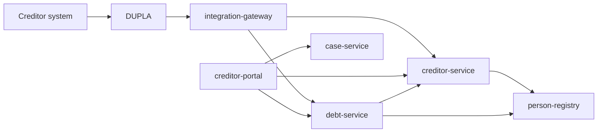

# ADR 0020: Creditor Channel and Master Data Architecture

## Status
Accepted

## Context

OpenDebt has two distinct creditor-facing channels:

- **system-to-system (M2M)** submission, which is the default channel for straight-through processing (STP)
- **portal-based** manual interaction for smaller creditors and exception handling

The current repository contains a `creditor-portal` scaffold, but no dedicated backend owner for operational `fordringshaver` master data. Petition 008 defines a substantial operational data model for `fordringshaver`, including notification preferences, permissions, hierarchy, settlement setup, and lifecycle status. That data does not belong in a UI service.

The architecture must also respect existing decisions:

- **ADR-0007**: no direct cross-service database access
- **ADR-0009**: external APIs are exposed via DUPLA and handled through `integration-gateway`
- **ADR-0014**: organization PII and identity data belong in `person-registry`
- **ADR-0019**: synchronous REST and explicit orchestration remain the communication model

The missing decision is where to place:

1. operational `fordringshaver` master data ownership
2. channel identity binding (OCES3/DUPLA client, MitID Erhverv user, umbrella acting-on-behalf)
3. external creditor M2M ingress
4. portal responsibilities versus backend domain responsibilities

## Decision

We introduce a **dedicated `creditor-service`** as the backend owner of operational `fordringshaver` master data and channel-access resolution.

### Service responsibility split

| Service | Owns | Does not own |
|---------|------|--------------|
| `person-registry` | Organization identity and PII-like data: name, address, CVR/SE/AKR | Operational creditor permissions, settlement rules, channel bindings |
| `creditor-service` | Operational creditor master data, hierarchy, permissions, notification preferences, settlement configuration, channel bindings, access resolution | Debt lifecycle, portal UI, external gateway concerns |
| `integration-gateway` | External M2M ingress via DUPLA, protocol adaptation, certificate/token handling, routing, error mapping, correlation/audit propagation | Creditor master data persistence, debt lifecycle rules |
| `debt-service` | `fordring` / `restance` / transfer-to-collection lifecycle, readiness validation, debt persistence | Channel authentication logic, creditor master data ownership |
| `creditor-portal` | Visualization, manual entry, user interaction, BFF-style aggregation for human users | Master data system-of-record, external M2M ingress |

### Concrete architecture

1. **`creditor-service` is the system of record for non-PII creditor master data.**
   - It implements the operational model described in Petition 008.
   - It stores a reference to `person-registry` using `creditor_org_id`.
   - It exposes internal APIs for lookup, validation, and access resolution.

2. **`person-registry` remains the single source of truth for organization identity data.**
   - Creditor name, address, and CVR/SE/AKR remain outside `creditor-service`.

3. **`integration-gateway` is the only external M2M ingress for creditors.**
   - External creditor systems do not call `debt-service` or `creditor-service` directly.
   - `integration-gateway` validates the external channel context and resolves the acting creditor through `creditor-service`.
   - After resolution, it forwards the business request to the owning internal service.

4. **`creditor-portal` is a manual interaction channel only.**
   - It is not the owner of any creditor master data.
   - It reads creditor profile/configuration from `creditor-service`.
   - It submits manual `fordringer` to `debt-service`.

5. **`debt-service` remains the owner of creditor-submitted `fordringer`.**
   - STP submission is still a debt-service capability.
   - Before creating or changing a debt, `debt-service` may call `creditor-service` to validate active status, permissions, and acting-on-behalf rules.

6. **Channel binding is centralized in `creditor-service`.**
   - M2M identities (for example OCES3/DUPLA client or agreement identifiers) and portal user identities are mapped to an acting creditor there.
   - Umbrella/parent-child reporting rights are also enforced there.

### Communication model

### Reference strategy

To minimize migration scope, the target architecture allows `debt-service` to continue using `creditor_org_id` as its persisted technical reference in the near term, while `creditor-service` uses the same `creditor_org_id` to resolve the operational creditor record. A later migration to a dedicated `creditor_id` reference may be introduced separately if needed.

## Consequences

### Positive

- Keeps STP on the service/gateway path rather than in a portal
- Gives `fordringshaver` master data a real backend owner
- Preserves GDPR isolation by keeping organization identity data in `person-registry`
- Avoids turning `integration-gateway` into a business system of record
- Allows both M2M and portal channels to enforce the same creditor permissions and hierarchy rules

### Negative

- Adds another backend service to operate
- Introduces an extra dependency from `debt-service` and `creditor-portal` to `creditor-service`
- Requires explicit API design for creditor lookup and access resolution

### Mitigations

- Keep `creditor-service` narrowly focused on creditor master data and access resolution
- Reuse `creditor_org_id` initially to avoid broad data migration in one step
- Expose small internal REST APIs rather than broad generic CRUD only

## Alternatives considered

| Option | Reason not chosen |
|--------|-------------------|
| Put creditor master data in `creditor-portal` | Makes a UI service the system of record and mixes presentation with domain ownership |
| Put creditor master data in `debt-service` | Couples debt lifecycle ownership with creditor administration and channel-binding concerns |
| Put creditor master data in `integration-gateway` | Makes an edge adapter own business state, which conflicts with its gateway role |
| Keep direct external calls to `debt-service` | Conflicts with ADR-0009 and weakens external ingress consistency |
