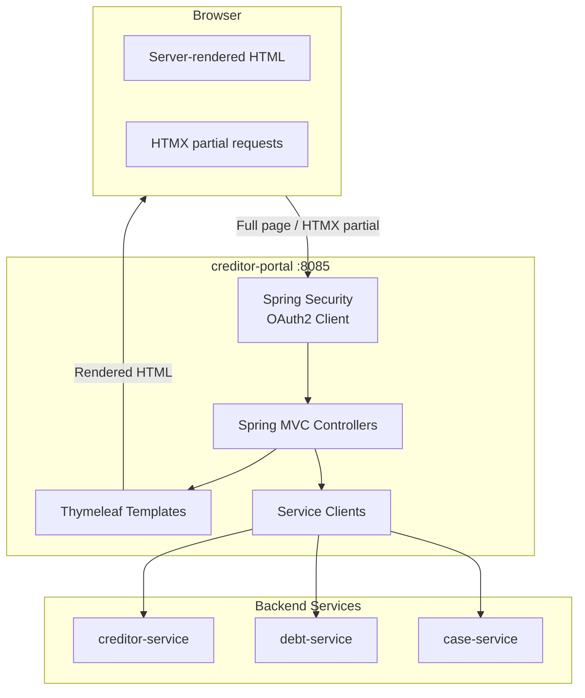

# ADR 0023: Creditor Portal Frontend Technology

## Status
Accepted

## Context

The creditor portal (`opendebt-creditor-portal`, port 8085) is currently an empty Spring Boot skeleton with no frontend code. It is architecturally positioned as a BFF (Backend-for-Frontend) for manual creditor interaction (ADR-0020) and must comply with Danish web accessibility requirements (ADR-0021).

A frontend technology decision is needed before UI implementation can begin. The same decision will apply to `opendebt-citizen-portal` for consistency.

### Constraints from existing ADRs and project context

| Constraint | Source |
|-----------|--------|
| Java 21, Spring Boot 3.3, Maven build | ADR-0003 |
| OAuth2/OIDC via Keycloak (authorization_code flow already configured) | ADR-0005 |
| Portal is not system-of-record; reads from `creditor-service`, submits to `debt-service` | ADR-0020 |
| WCAG 2.1 AA and EN 301 549 v3.2.1 compliance required | ADR-0021 |
| Accessibility statements via WAS-Tool, keyboard navigation, screen-reader support | ADR-0021 |
| Fællesoffentlige Arkitekturprincipper: openness, interoperability, no vendor lock-in | ADR-0010 |
| Target deployment: single Docker container on UFST Horizontale Driftsplatform (Kubernetes) | ADR-0006 |

### Additional requirements

1. The development team has primarily Java and Spring Boot expertise.
2. The portal must support Danish language (i18n with `da` as primary locale).
3. The frontend must be built and packaged within the existing Maven pipeline.
4. The portal handles forms (debt submission, creditor profile), tables (debt lists, case overviews), and status views. There are no real-time collaboration, rich-text editing, or complex client-side state management requirements.

### Danish public-sector frontend precedent

Danish public-sector self-service portals deliver server-rendered HTML to end users. Verifiable evidence:

| Portal | Technology evidence | Source |
|--------|-------------------|--------|
| **skat.dk/borger** (main citizen portal) | **Next.js** (React SSR); uses `_next/image`, `_next/static/css` asset paths; 236 CSS custom properties defining the SKAT DAP design token system; proprietary fonts Academy Sans and Republic; primary color `#14143c` (haiti navy) | Direct inspection of skat.dk/borger source and CSS (March 2026) |
| **skat.dk** (motorregister.skat.dk, tastselv.skat.dk) | Java on Oracle WebLogic Server; server-rendered HTML pages | webtechsurvey.com/website/motorregister.skat.dk (last scanned February 2026) |
| **borger.dk** and **virk.dk** self-service | Built on Det Fælles Designsystem (DKFDS), which provides server-rendered HTML/CSS components | designsystem.dk front page: "Brug Det Fælles Designsystem til at lave simple og effektive selvbetjeningsloesninger til borger.dk og Virk" |
| **DKFDS components** | Pure HTML + CSS + vanilla JS (SCSS 44.6%, JavaScript 32.5%, Nunjucks templates 22.9%); no React/Angular/Vue dependency; v11.2.0 released January 2026 | github.com/detfaellesdesignsystem/dkfds-components |
| **DKFDS official guidance** | Designsystem.dk describes DKFDS as "en samling af komponenter, kode og designretningslinjer" for building "tilgaengelige selvbetjeningsloesninger" | digst.dk/digital-inklusion/brugeroplevelse/det-faelles-designsystem/ |

**Note on skat.dk technology:** The main skat.dk/borger portal uses Next.js (React with server-side rendering), not traditional server-rendered Java pages. However, the end-user experience is still server-rendered HTML with standard navigation patterns. The visual design language, color palette, and CSS token system from skat.dk are reusable regardless of the backend rendering technology. OpenDebt adopts the SKAT visual identity (colors, spacing, typography scale) through extracted CSS design tokens while using Thymeleaf for rendering, which is a better fit for the existing Java/Spring/Maven toolchain.

The DKFDS components are framework-agnostic HTML/CSS patterns. They do not require or assume a client-side JavaScript framework. This supports a Thymeleaf-based approach where patterns are rendered as Thymeleaf template fragments.

## Decision

We adopt **Thymeleaf** as the server-side template engine with **HTMX** for progressive enhancement of interactive elements.

### Architecture

### Technology components

| Component | Technology | Purpose |
|-----------|-----------|---------|
| Template engine | Thymeleaf 3 (via `spring-boot-starter-thymeleaf`) | Server-side HTML rendering |
| Progressive enhancement | HTMX 2.x (single JS file, served from classpath) | Partial page updates without full reloads |
| CSS framework | DKFDS (Det Fælles Designsystem) or plain semantic CSS | Danish public-sector design system, WCAG-compliant components |
| Internationalization | Spring MessageSource + Thymeleaf `#{...}` | Danish (`da`) as default locale, English (`en`) optional |
| Authentication | Spring Security OAuth2 Client (already configured) | Keycloak authorization_code flow with server-side session |
| Form validation | Spring MVC `@Valid` + Thymeleaf error rendering | Server-side validation with accessible error messages |
| Build integration | Maven resource processing (no Node.js toolchain) | Static assets in `src/main/resources/static` and templates in `src/main/resources/templates` |

### Key implementation patterns

1. **Server-side rendering by default.** Every page is fully functional without JavaScript. HTMX enhances UX by replacing full page reloads with partial updates for actions such as table filtering, form submission feedback, and status polling.

2. **Spring Security session-based authentication.** The OAuth2 Client starter handles the Keycloak authorization_code flow with PKCE. Tokens are stored server-side in the HTTP session, never exposed to the browser. This avoids client-side token management entirely.

3. **Thymeleaf layout dialect for consistent page structure.** A shared layout defines the accessible page skeleton: skip links, landmark regions, language selector, navigation, footer with accessibility-statement link (`/was`).

4. **DKFDS alignment.** Where feasible, use Det Fælles Designsystem component patterns for forms, tables, alerts, and navigation. DKFDS is designed for Danish public-sector WCAG compliance and provides accessible HTML/CSS patterns that map directly to Thymeleaf templates.

5. **No client-side routing or state management.** The browser navigates via standard links and form submissions. HTMX augments specific interactions. This keeps the accessibility surface simple and auditable.

## Consequences

### Positive

- **Accessibility by default.** Server-rendered semantic HTML gives full control over document structure, headings, landmarks, labels, and focus management. No shadow DOM, no virtual DOM diffing, no ARIA workarounds for framework-generated markup.
- **Team skill alignment.** Java developers write controllers, services, and Thymeleaf templates. No JavaScript framework expertise required. HTMX requires learning a small set of HTML attributes.
- **Single deployable artifact.** Templates and static assets are packaged inside the Spring Boot JAR. No separate Node.js build, no frontend CDN, no CORS configuration.
- **Maven-native build.** No `frontend-maven-plugin`, no `npm install` in CI. Static assets (HTMX JS file, CSS) are committed or fetched via WebJars.
- **OAuth2 simplicity.** Server-side session holds tokens. No client-side token storage, refresh logic, or silent-renew iframes.
- **Danish public-sector visual alignment.** The portal adopts the SKAT visual design language (color palette, spacing, typography scale) extracted from skat.dk/borger CSS tokens. borger.dk and virk.dk self-service use DKFDS server-rendered patterns. The end-user experience matches the look and navigation patterns users expect from Danish public-sector sites.
- **Minimal frontend attack surface.** No client-side state, no XSS vectors from framework template injection, no exposed API tokens.
- **Progressive enhancement.** HTMX provides modern UX (partial updates, inline validation feedback, loading indicators) without requiring a full SPA framework.

### Negative

- **Limited client-side interactivity.** Complex client-side interactions (drag-and-drop, real-time dashboards, rich-text editing) would be difficult. This is acceptable because the portal's scope (forms, tables, status views) does not require them.
- **Full page reloads for non-enhanced flows.** Without HTMX, navigation triggers full page loads. HTMX mitigates this for key interactions, and the server-rendered pages are small enough that full reloads are fast.
- **Smaller ecosystem than React/Angular.** Fewer third-party UI component libraries. Mitigated by DKFDS providing the needed public-sector patterns and by the limited UI complexity of the portal.
- **HTMX is less widely adopted than mainstream SPA frameworks.** Hiring for HTMX experience is harder, but the learning curve is minimal (HTML attributes, no build tooling) and the primary skill requirement remains Java/Spring.

### Mitigations

- If a future portal feature genuinely requires rich client-side interactivity (e.g., a caseworker dashboard with real-time updates), a bounded SPA component can be introduced for that specific page using Alpine.js or a lightweight framework, without changing the overall architecture.
- HTMX adoption risk is mitigated by the fact that it degrades gracefully: removing HTMX attributes leaves working standard HTML forms and links.
- Automated accessibility testing (axe-core, Pa11y) will be integrated into CI per ADR-0021.

## Alternatives considered

| Option | Reason not chosen |
|--------|-------------------|
| **React or Next.js** | Used by skat.dk/borger, so proven in Danish public-sector context. However, introduces a Node.js toolchain and npm dependency tree into a Java/Maven project. Requires frontend-maven-plugin or a separate build step. Creates a skill gap for the Java-focused team. React hydration requires additional WCAG effort (focus management, route-change announcements). OAuth2 token handling moves to the browser unless a dedicated BFF is added. Deployment becomes two artifacts or a complex multi-stage Docker build. We adopt the SKAT visual design tokens but not their rendering stack. |
| **Vaadin** | Java-only development is attractive, but Vaadin generates client-side markup via its own widget framework, reducing control over HTML semantics for accessibility. Commercial licensing applies for some features (Vaadin Pro/Enterprise components). Tight coupling to the Vaadin framework creates vendor dependency, conflicting with ADR-0010 principle 8 (openness, no vendor lock-in). Runtime is heavier than plain Thymeleaf. |
| **Thymeleaf without HTMX (pure SSR)** | Viable and simpler, but results in full page reloads for every interaction. For forms with validation feedback, table sorting/filtering, and status updates, the UX would feel dated. HTMX adds minimal complexity (one JS file, HTML attributes) for meaningful UX improvement. This remains a valid fallback if HTMX proves problematic. |
| **Angular** | Same drawbacks as React regarding Node.js toolchain, team skill gap, and client-side complexity. Additionally, Angular's opinionated framework structure adds more overhead than React for a portal of this scope. |
| **JSP/JSF** | Legacy technologies. JSP lacks modern template composition. JSF has been effectively superseded by Thymeleaf in the Spring ecosystem. Neither has meaningful community investment. |

## Applicability to citizen-portal

This decision applies equally to `opendebt-citizen-portal`. The citizen portal has the same architectural position (BFF, not system-of-record), the same accessibility requirements (ADR-0021), and the same deployment constraints. Adopting the same frontend technology for both portals enables shared layout templates, shared DKFDS integration, and consistent accessibility patterns.
