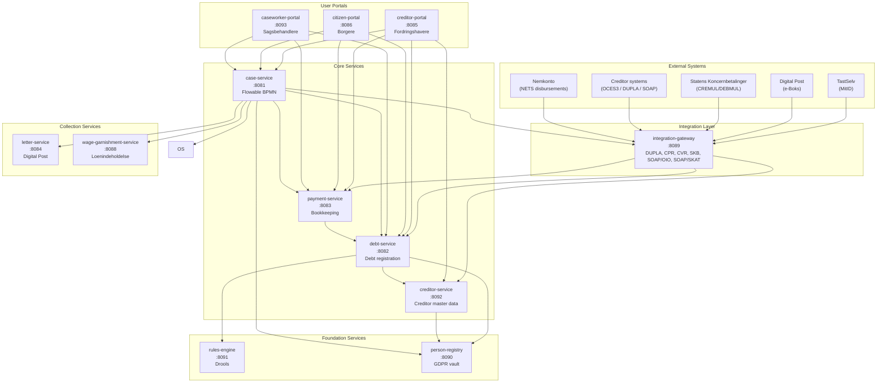
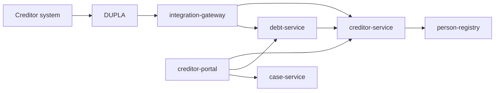
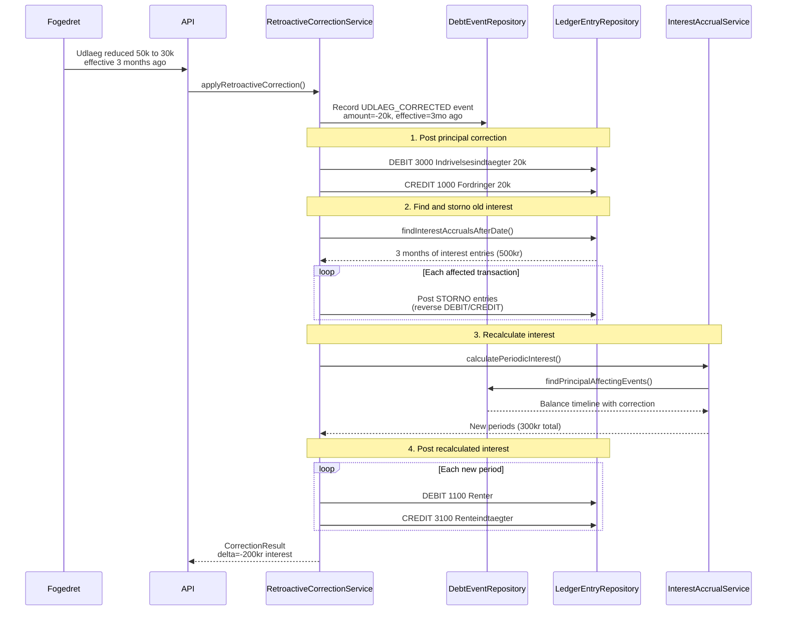
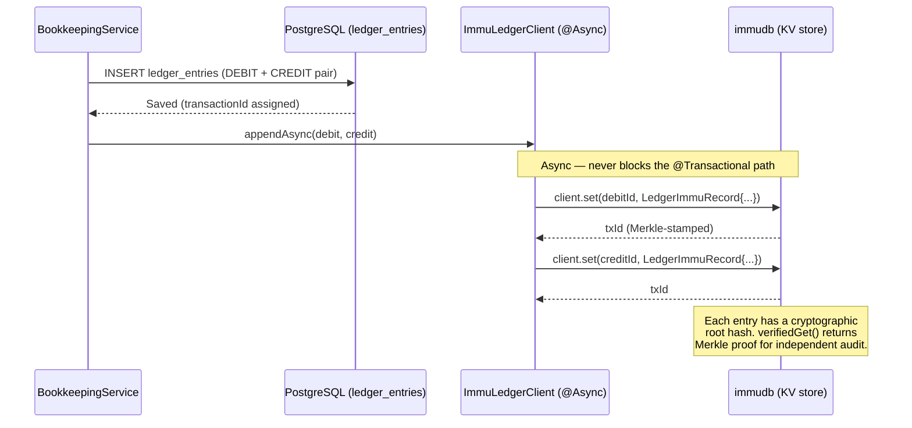
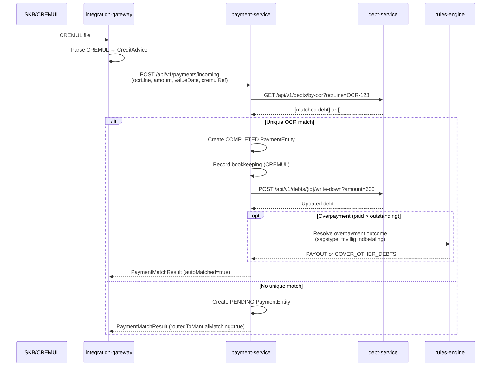
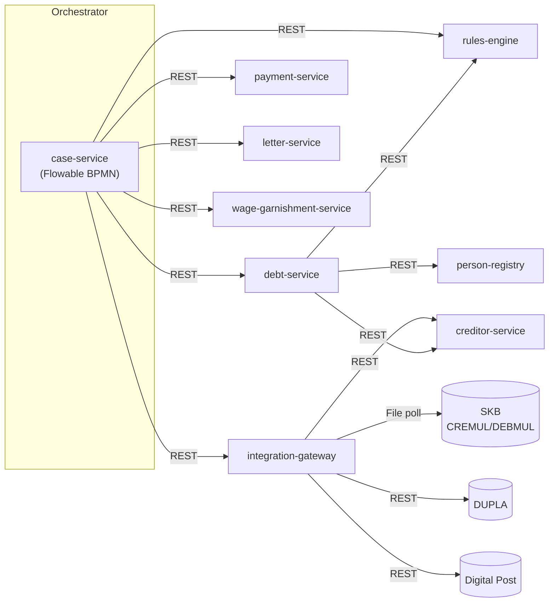

# OpenDebt - Architecture Overview and Implementation Status

## System Overview

OpenDebt is an open-source debt collection system for Danish public institutions (UFST), designed to replace legacy systems (EFI/DMI). It is built as a microservices architecture using Java 21, Spring Boot 3.3, and PostgreSQL 16, deployed on Kubernetes.



### Creditor Interaction Target Architecture (ADR-0020)

OpenDebt treats creditor interaction as two separate channels: **M2M/STP by default** and **portal/manual as a supplementary channel**. The target architecture is therefore:

- `integration-gateway` owns external M2M ingress via DUPLA
- `debt-service` owns `fordring` submission and lifecycle
- `creditor-service` owns non-PII `fordringshaver` master data and channel binding
- `creditor-portal` is a UI/BFF only, not a master-data system of record
- `person-registry` remains the source of organization identity and PII-like data



| Service | Target responsibility |
|---------|-----------------------|
| `creditor-portal` | Visualization, manual entry, and user interaction for creditor users |
| `integration-gateway` | External M2M ingress, protocol/security adaptation, routing, error mapping |
| `creditor-service` | Operational creditor master data, permissions, hierarchy, settlement setup, channel bindings |
| `debt-service` | Submission and lifecycle of `fordringer`, `restancer`, and transfer to collection |
| `person-registry` | Organization identity and PII-like reference data |

### Debt Collection Workflow (BPMN)

```mermaid
flowchart TD
    Start([Case Created]) --> Assess[Assess Case]
    Assess --> Gateway{Collection Strategy?}

    Gateway -->|VOLUNTARY_PAYMENT| SendReminder[Send Payment Reminder]
    Gateway -->|OFFSETTING| InitOffset[Initiate Offsetting<br/>(debt-service)]
    Gateway -->|WAGE_GARNISHMENT| InitGarnish[Initiate Wage Garnishment]

    SendReminder --> Wait30["Wait 30 days<br/>(Timer)"]
    Wait30 --> CheckPay[Check Payment Status]
    CheckPay --> PayGW{Paid?}
    PayGW -->|Yes| Close[Close Case]
    PayGW -->|No| Escalate

    InitOffset --> SendOffNotice[Send Offsetting Notice]
    SendOffNotice --> Wait14["Wait 14 days<br/>(Timer)"]
    Wait14 --> CheckOff[Check Offsetting Result]
    CheckOff --> OffGW{Fully Offset?}
    OffGW -->|Yes| Close
    OffGW -->|No| Escalate

    InitGarnish --> SendGarnNotice[Send Garnishment Notice]
    SendGarnNotice --> Monitor["Monitor Payments<br/>(User Task)"]
    Monitor --> GarnGW{Debt Cleared?}
    GarnGW -->|Yes| Close
    GarnGW -->|No| Monitor

    Monitor -.->|Appeal Signal| Appeal["Handle Appeal<br/>(User Task)"]
    Appeal --> AppealGW{Appeal Upheld?}
    AppealGW -->|Yes| Close
    AppealGW -->|No| Gateway

    Escalate["Review & Escalate<br/>(Supervisor Task)"] --> Gateway

    Close --> SendClosure[Send Closure Notice]
    SendClosure --> End([Case Closed])
```

### Database Architecture

```mermaid
erDiagram
    PERSON_REGISTRY ||--o{ DEBTS : "debtor_person_id"
    PERSON_REGISTRY ||--o{ DEBTS : "creditor_org_id"
    PERSON_REGISTRY ||--o{ CREDITORS : "creditor_org_id"
    PERSON_REGISTRY ||--o{ CASES : "debtor_person_id"
    CREDITORS ||--o{ DEBTS : "creditor_org_id"
    DEBTS ||--o{ CASES : "debt_ids"
    CASES ||--o{ PAYMENTS : "case_id"
    DEBTS ||--o{ PAYMENTS : "debt_id"
    DEBTS ||--o{ LEDGER_ENTRIES : "debt_id"
    LEDGER_ENTRIES ||--o| IMMUDB_KV : "entry_id (async)"
    DEBTS ||--o{ DEBT_EVENTS : "debt_id"
    DEBTS ||--o{ LIFECYCLE_EVENTS : "debt_id"
    DEBTS ||--o{ HOERING : "debt_id"
    DEBTS ||--o{ NOTIFICATIONS : "debt_id"
    DEBTS ||--o{ LIABILITIES : "debt_id"
    DEBTS ||--o{ OBJECTIONS : "debt_id"
    DEBTS ||--o{ COLLECTION_MEASURES : "debt_id"
    DEBTS ||--o{ INTEREST_JOURNAL : "debt_id"
    MODREGNING_EVENTS ||--o{ COLLECTION_MEASURES : "modregning_event_id"
    MODREGNING_EVENTS ||--o{ KORREKTIONSPULJE_ENTRIES : "originating_event_id"
    PERSON_REGISTRY ||--o{ MODREGNING_EVENTS : "debtor_person_id"

    PERSON_REGISTRY {
        uuid id PK
        bytea identifier_encrypted
        varchar identifier_type "CPR/CVR"
        varchar identifier_hash "lookup index"
        varchar role "PERSONAL/BUSINESS"
        bytea name_encrypted
        bytea address_encrypted
        bytea email_encrypted
    }

    DEBTS {
        uuid id PK
        uuid debtor_person_id FK
        uuid creditor_org_id FK
        varchar debt_type_code
        numeric principal_amount
        numeric interest_amount
        numeric outstanding_balance
        varchar ocr_line UK
        date due_date
        varchar status
        varchar readiness_status
        varchar modregning_tier "P058: GIL § 7 tier (1/2/3)"
    }

    CREDITORS {
        uuid id PK
        uuid creditor_org_id FK
        uuid parent_creditor_id FK
        varchar external_creditor_id UK
        varchar activity_status
        varchar connection_type
    }

    CASES {
        uuid id PK
        varchar case_number UK
        uuid debtor_person_id FK
        varchar status
        varchar active_strategy
        varchar assigned_caseworker_id
        numeric total_debt
        numeric total_remaining
    }

    PAYMENTS {
        uuid id PK
        uuid case_id FK
        uuid debt_id FK
        numeric amount
        varchar payment_method
        varchar status
        varchar transaction_reference
        varchar ocr_line
    }

    LEDGER_ENTRIES {
        uuid id PK
        uuid transaction_id
        uuid debt_id FK
        varchar account_code
        varchar entry_type "DEBIT/CREDIT"
        numeric amount
        date effective_date
        date posting_date
        uuid reversal_of_transaction_id
        varchar entry_category
    }

    DEBT_EVENTS {
        uuid id PK
        uuid debt_id FK
        varchar event_type
        date effective_date
        numeric amount
        uuid corrects_event_id FK
        uuid ledger_transaction_id
    }

    CHART_OF_ACCOUNTS {
        varchar code PK
        varchar name
        varchar account_type
    }

    LIFECYCLE_EVENTS {
        uuid id PK
        uuid debt_id FK
        varchar previous_state
        varchar new_state
        uuid recipient_id
        timestamp event_time
    }

    HOERING {
        uuid id PK
        uuid debt_id FK
        varchar hoering_status
        varchar deviation_description
        timestamp sla_deadline
    }

    NOTIFICATIONS {
        uuid id PK
        uuid debt_id FK
        varchar type
        varchar channel
        varchar delivery_state
        varchar ocr_line
    }

    LIABILITIES {
        uuid id PK
        uuid debt_id FK
        uuid debtor_person_id
        varchar liability_type
        numeric share_percentage
        boolean active
    }

    OBJECTIONS {
        uuid id PK
        uuid debt_id FK
        uuid debtor_person_id
        varchar status
        varchar reason
        varchar resolution_note
    }

    COLLECTION_MEASURES {
        uuid id PK
        uuid debt_id FK
        varchar measure_type
        varchar status
        numeric amount
        timestamp completed_at
        uuid modregning_event_id FK "P058"
        boolean waiver_applied "P058"
        varchar caseworker_id "P058"
    }

    MODREGNING_EVENTS {
        uuid id PK
        varchar nemkonto_reference_id UK
        uuid debtor_person_id FK
        date receipt_date
        date decision_date
        varchar payment_type
        integer indkomst_aar
        numeric disbursement_amount
        numeric tier1_amount
        numeric tier2_amount
        numeric tier3_amount
        numeric residual_payout_amount
        boolean tier2_waiver_applied
        boolean notice_delivered
        date klage_frist_dato
        date rente_godtgoerelse_start_date
        boolean rente_godtgoerelse_non_taxable
    }

    KORREKTIONSPULJE_ENTRIES {
        uuid id PK
        uuid originating_event_id FK
        uuid debtor_person_id FK
        numeric pool_amount
        varchar status
        varchar settlement_strategy
        timestamp created_at
        timestamp settled_at
    }

    RENTEGODT_RATE_ENTRIES {
        uuid id PK
        date effective_from
        date effective_to
        numeric annual_rate
        varchar source_reference
    }

    INTEREST_JOURNAL {
        uuid id PK
        uuid debt_id FK
        date accrual_date
        numeric balance_snapshot
        numeric rate
        numeric interest_amount
    }

    BATCH_JOB_EXECUTIONS {
        uuid id PK
        varchar job_name
        date execution_date
        varchar status
        int records_processed
        int records_failed
    }

    IMMUDB_KV {
        bytes key "ledger_entry_id (UUID → bytes)"
        bytes value "JSON: LedgerImmuRecord"
        bigint tx_id "immudb transaction number"
        bytes root_hash "Merkle tree root for verifiedGet"
    }
```



### Bookkeeping - Storno and Retroactive Correction Flow



### Tamper-Evidence Ledger (TB-028 / ADR-0029)

immudb runs alongside `payment-service` and `debt-service` and receives asynchronous copies of financially and legally significant records. The PostgreSQL databases are the operational sources of truth; immudb provides cryptographic proof that records have not been altered after the fact.

**Writers:**
- `payment-service` (`BookkeepingService`) — every `LedgerEntryEntity` written by the double-entry bookkeeper.
- `debt-service` (`ModregningService`) — every `ModregningEvent` and the associated SET_OFF `CollectionMeasure` record (P058, GIL § 16 stk. 1). See ADR-0029 amendment.



**Key design decisions:**
- `grpc-netty-shaded:1.44.1` substitutes `grpc-netty` to isolate immudb's gRPC layer from Spring Boot's Netty version.
- The KV key is the `ledger_entry_id` (UUID bytes); the value is `LedgerImmuRecord` (JSON).
- `@ConditionalOnProperty(opendebt.immudb.enabled=true)` — immudb is disabled by default; enabled in demo and production profiles.
- Production hardening (connection pool, `RetryTemplate` fix, health indicator, reconciliation job) is tracked in petition051.

Inspect the live immudb ledger during local development:
```powershell
cd docs/spike && python immudb-view.py
```

### OCR-Based Payment Matching Flow (Petition 001)



### Communication Pattern (ADR-0019)



## Technology Stack

| Component | Technology | Version |
|-----------|-----------|---------|
| Language | Java | 21 |
| Framework | Spring Boot | 3.5 |
| Database | PostgreSQL | 16 |
| Auth | Keycloak (OAuth2/OIDC) | 24.0 |
| Workflow | Flowable BPMN | 7.0.1 |
| Rules | Drools | 9.44.0 |
| Tamper-evidence ledger | immudb + immudb4j | 1.10 / 1.0.1 |
| EDIFACT | Smooks EDI Cartridge | 2.0.1 |
| Bookkeeping | double-entry-bookkeeping-api | 4.3.0 |
| Build | Maven | 3.9+ |
| Deployment | Kubernetes | - |
| Mapping | MapStruct | 1.5.5 |
| Code style | Spotless (Google Java Format) | 2.43.0 |
| Coverage | JaCoCo (80% line, 70% branch) | 0.8.12 |
| Portal templates | Thymeleaf | 3 (Spring Boot managed) |
| Progressive enhancement | HTMX | 2.x |
| Design system | DKFDS (Det Fælles Designsystem) | 11.x |
| Tracing | Micrometer Tracing + OpenTelemetry OTLP | Spring Boot managed |
| Structured logging | Logstash Logback Encoder | 8.0 |
| Metrics backend | Prometheus | latest (Docker) |
| Trace backend | Grafana Tempo | latest (Docker) |
| Log backend | Grafana Loki | latest (Docker) |
| Dashboards | Grafana OSS | latest (Docker) |
| Telemetry relay | OpenTelemetry Collector Contrib | latest (Docker) |
| Backup | pgBackRest | latest |
| PVC backup | Velero (CSI snapshots) | latest |
| Key vault | Azure Key Vault (or platform equivalent) | - |

## Disaster Recovery

**Targets:** RTO 4 hours / RPO 4 hours (ADR-0028)

| Failure class | Recovery mechanism | Expected time |
|--------------|-------------------|---------------|
| Pod / node failure | Kubernetes self-healing | 2–5 min |
| DB primary failure (standby available) | Manual promotion (`pg_ctl promote`) | 15–30 min |
| DB data loss / corruption | pgBackRest PITR restore + Flowable reconciliation | 90–150 min |
| Catastrophic cluster loss | Re-provision cluster + pgBackRest restore | 2–4 hours |
| Encryption key vault loss | Key vault recovery procedure | Escalate to platform |

**Key DR components:**
- **pgBackRest**: WAL archiving (continuous, ~5 min segments) + weekly full + daily differential backups to Azure Blob Storage
- **Streaming replication**: Hot standby eliminates most single-host failure scenarios
- **Encryption key vault**: `ENCRYPTION_KEY` for `person-registry` AES encryption stored in Azure Key Vault — loss of this key makes all PII permanently irrecoverable
- **Flowable reconciliation**: In-flight BPMN processes are reconciled manually after a PITR restore with the async executor suspended
- **Velero**: Kubernetes PVC and cluster-state snapshots (daily)
- **Backup monitoring**: Prometheus alerts on backup staleness and WAL archiving lag

See `docs/dr-runbook.md` for the step-by-step DR execution procedure.
See `architecture/adr/0028-backup-and-disaster-recovery.md` for the full architectural decision.

## Services

### person-registry (Port 8090)

**Purpose:** Centralized GDPR vault. The ONLY service that stores PII (CPR, CVR, names, addresses, email, phone). All other services reference persons by UUID only.

**Implementation status:** IMPLEMENTED

| Component | Status | Notes |
|-----------|--------|-------|
| PersonEntity (encrypted PII) | Done | AES encryption, hash-based lookup |
| OrganizationEntity | Done | CVR-based organizations |
| PersonController (REST API) | Done | lookup, CRUD, GDPR export/erase |
| PersonRegistryExceptionHandler | Done | `@RestControllerAdvice` mapping `PersonNotFoundException` → HTTP 404 (TB-021) |
| EncryptionService | Done | Field-level encryption |
| PersonService | Done | Business logic |
| PersonRepository | Done | JPA + hash index for lookups |
| Flyway migration V1 | Done | Persons, organizations, audit |
| GDPR soft-delete | Done | `markAsDeleted()` clears encrypted fields |

**API endpoints (petition023 + existing):**
- `POST /api/v1/persons/lookup` - Lookup or create person by CPR (primary API for citizen auth and M2M ingress; returns UUID only, no PII in response)
- `GET /api/v1/persons/{id}` - Get person details (PII)
- `PUT /api/v1/persons/{id}` - Update person
- `GET /api/v1/persons/{id}/exists` - Existence check (no PII returned)
- `POST /api/v1/persons/{id}/gdpr/export` - GDPR data export
- `DELETE /api/v1/persons/{id}/gdpr/erase` - GDPR erasure request

---

### debt-service (Port 8082)

**Purpose:** Debt registration, lifecycle management, and downstream collection model for `fordringer`, `restancer`, readiness validation, notifications, liabilities, objections, collection measures, and batch processing. Also owns the **offsetting (modregning)** domain (ADR-0027).

**Implementation status:** IMPLEMENTED (~125 Java files, 8 migrations)

| Component | Status | Notes |
|-----------|--------|-------|
| **Core entities** | | |
| DebtEntity | Done | Principal, interest, fees, status, readiness, ocrLine, outstandingBalance, PSRM stamdata fields, lifecycleState |
| DebtTypeEntity | Done | ~600 debt types with legal basis |
| ClaimLifecycleState | Done | Enum: REGISTERED, RESTANCE, HOERING, OVERDRAGET, TILBAGEKALDT, AFSKREVET, INDFRIET |
| ClaimLifecycleEvent | Done | Immutable audit of lifecycle state transitions with recipientId |
| ClaimArtEnum, ClaimCategory | Done | PSRM claim art and category enums |
| InterestSelectionEmbeddable | Done | Embeddable interest configuration |
| **Lifecycle (petition003)** | | |
| ClaimLifecycleService / Impl | Done | evaluateClaimState, transferForCollection, transitionToHearing, resolveHearing, withdraw, writeOff, markFullyPaid |
| **Hearing (petition003)** | | |
| HoeringEntity / HoeringStatus | Done | Hearing workflow with SLA deadline tracking |
| HoeringService / Impl | Done | Create, approve, reject, withdraw hearings |
| HoeringRepository | Done | JPA with status + SLA deadline queries |
| **Notifications (petition004)** | | |
| NotificationEntity | Done | Type (PAAKRAV/RYKKER/...), channel, deliveryState, ocrLine |
| NotificationService / Impl | Done | issueDemandForPayment, issueReminder, getNotificationHistory |
| NotificationController | Done | REST API for notification operations |
| **Liabilities (petition005)** | | |
| LiabilityEntity | Done | SOLE, JOINT_AND_SEVERAL, PROPORTIONAL with sharePercentage |
| LiabilityService / Impl | Done | Add/remove/query liabilities with validation |
| LiabilityController | Done | REST API for liability management |
| **Objections (petition006)** | | |
| ObjectionEntity | Done | ACTIVE, UPHELD, REJECTED with resolution notes |
| ObjectionService / Impl | Done | Register, resolve, hasActiveObjection, collection blocking |
| ObjectionController | Done | REST API for objection management |
| **Collection measures (petition007)** | | |
| CollectionMeasureEntity | Done | SET_OFF, WAGE_GARNISHMENT, ATTACHMENT with status tracking |
| CollectionMeasureService / Impl | Done | Initiate, complete, cancel measures (requires OVERDRAGET state) |
| CollectionMeasureController | Done | REST API for collection measures |
| **Citizen debt (petition024)** | | |
| CitizenDebtController | Done | Citizen-facing debt summary (person_id from JWT) |
| CitizenDebtService / Impl | Done | Pagination, status filter, no PII/creditor internals |
| **Batch processing (petition043)** | | |
| BatchJobExecutionEntity | Done | Job execution tracking for idempotency and audit |
| InterestJournalEntry | Done | Storno-compatible interest journal with balance snapshot |
| RestanceTransitionJob | Done | Daily REGISTERED->RESTANCE for expired payment deadlines |
| InterestAccrualJob | Done | Daily inddrivelsesrente at 5.75% for OVERDRAGET claims |
| DeadlineMonitoringJob | Done | Daily forældelsesfrist and hearing SLA monitoring |
| **Claim adjustments (petition053)** | | |
| ClaimAdjustmentController | Done | `POST /api/v1/debts/{id}/adjustments` — write-up/write-down; 201 on success, 422 + RFC 7807 ProblemDetail on validation failure |
| ClaimAdjustmentService / Impl | Done | FR-1 write-down reason required, AC-12 RENTE rejection, AC-13/FR-7 RIM-internal code (DINDB/OMPL/AFSK) rejection, FR-3 høring timing rule, FR-4 retroactive WARN log marker, AC-16 CLS audit all outcomes |
| ClaimAdjustmentRequestDto / ResponseDto | Done | Request: adjustmentType, writeDownReasonCode, amount, effectiveDate, notes; Response: includes crossSystemRetroactiveApplies flag (GIL § 18 k) |
| WriteDownReasonCode | Done | NED_INDBETALING, NED_FEJL_OVERSENDELSE, NED_GRUNDLAG_AENDRET (gæld.bekendtg. § 7 stk. 2) |
| **Modregning og Korrektionspulje (petition058)** | | |
| ModregningEvent | Done | JPA entity — table `modregning_event`; stores GIL § 16 stk. 1 set-off decision with three-tier allocation, klage-frist, rentegodtgoerelse metadata. Idempotency via `nemkontoReferenceId`. Written to immudb (ADR-0029 amendment). |
| KorrektionspuljeEntry | Done | JPA entity — table `korrektionspulje_entry`; pool entry for reversal/gendaenkning credit pending re-application. Links to originating `ModregningEvent`. |
| RenteGodtgoerelseRateEntry | Done | JPA entity — table `rentegodt_rate_entry`; effective-date-bounded rate table for GIL § 8b rentegodtgoerelse computation. |
| CollectionMeasureEntity (extended) | Done | New columns: `modregning_event_id` (FK to modregning_event), `waiver_applied` (tier-2 waiver flag), `caseworker_id`. Written to immudb (ADR-0029 amendment). |
| DebtEntity (extended) | Done | New column: `modregning_tier` — tier assigned by `ModregningsRaekkefoeigenEngine` during allocation. |
| ModregningService | Done | Orchestrates three-tier GIL § 7 stk. 1 workflow (FR-1). Implements `OffsettingService` (replaces P007 stub). `@Transactional`. Handles idempotency, ledger posting via `LedgerServiceClient`, Digital Post outbox write, and tier-2 waiver re-run (FR-2). |
| ModregningsRaekkefoeigenEngine | Done | GIL § 7 stk. 1 three-tier allocation algorithm. Delegates tier-2 partial allocation to `DaekningsRaekkefoeigenServiceClient` (P057) at most once per run. Queries fordringer via `FordringQueryPort`. |
| KorrektionspuljeService | Done | Processes `OffsettingReversalEvent`: Step 1 same-fordring residual, Step 2 gendaenkning via P057, Step 3 `KorrektionspuljeEntry` creation. Settles pool entries by re-invoking `ModregningService`. `@Transactional`. |
| RenteGodtgoerelseService | Done | Computes rentegodtgoerelse start date (5-banking-day exception, kildeskattelov § 62/62A exception) and effective rate from `rentegodt_rate_entry` table (GIL § 8b). `renteGodtgoerelseNonTaxable` ALWAYS true (GIL SS 8b invariant). |
| KorrektionspuljeSettlementJob | Done | `@Scheduled` monthly (3 AM, 1st of month) and annual (4 AM, 2 Jan). Queries unsettled PSRM-target pool entries; invokes `KorrektionspuljeService.settleEntry()` per entry in individual transactions. |
| DanishBankingCalendar | Done | Banking day utility for 5-banking-day rentegodtgoerelse start-date computation. |
| DaekningsRaekkefoeigenServiceClient | Done | HTTP stub client for P057 `DaekningsRaekkefoeigenService` in payment-service. Invoked at most once per tier ordering run. |
| FordringQueryPort | Done | Internal JPA adapter for TB-040 active-fordringer queries (same-service, no inter-service HTTP). Consumed exclusively by `ModregningsRaekkefoeigenEngine`. |
| ModregningController | Done | REST controller. `POST /api/v1/modregning/tier2-waiver` (scope `modregning:waiver`, FR-2) and `GET /api/v1/modregning/events` read model (scope `modregning:read`, FR-5). `@PreAuthorize` enforces OAuth2 scopes. |
| PublicDisbursementEvent | Done | Inbound DTO from integration-gateway (Nemkonto interception events, GIL § 16 stk. 1). |
| OpenAPI spec | Done | `opendebt-debt-service/src/main/resources/openapi/modregning-api-v1.yaml` — 2 endpoints, 3 schemas. |
| Unit tests | Done | 42 unit tests: `ModregningServiceTest` (16), `KorrektionspuljeServiceTest` (14), `RenteGodtgoerelseServiceTest` (12). |
| **Foundation** | | |
| DebtController | Done | Full CRUD + readiness + lifecycle + submit |
| DebtService / Impl | Done | Full CRUD + findByOcrLine + writeDown; `scrubCprFromDescription()` strips CPR patterns (`\d{6}-?\d{4}`) from Beskrivelse on claim creation (P002 GDPR defense) |
| ReadinessValidationService | Done | Calls rules-engine for evaluation |
| ClaimValidationService / Impl | Done | Drools-based claim validation |
| ClaimSubmissionService / Impl | Done | End-to-end claim submission flow |
| KvitteringService / Impl | Done | PSRM kvittering response (UDFOERT/AFVIST/HOERING) |
| ZeroClaimService / Impl | Done | 0-fordring pattern for interest claims |
| DebtRepository | Done | JPA with batch queries for lifecycle and interest |
| FordringMetrics | Done | `fordring_submissions_total` counter (ADR-0024) |
| logback-spring.xml | Done | Structured JSON logging with traceId/spanId (ADR-0024) |
| Flyway V1 | Done | Consolidated baseline (squash of V1-V7 archive): debts, debt_types, hoering, notifications, liabilities, objections, collection_measures, batch_job_executions, interest_journal_entries, audit_log, history triggers |
| Flyway V2 | Done | Legal compliance corrections (G.A. Inddrivelse audit, 2026-03-28); fee amounts, claim type constraints |
| Flyway V3 | Done | PSRM interest-breakdown and dækningsrækkefølge fields on `debts` (TB-040 / P057 prerequisite) |
| Flyway V4 (P058) | Done | `modregning_event` table |
| Flyway V5 (P058) | Done | `korrektionspulje_entry` table |
| Flyway V6 (P058) | Done | `rentegodt_rate_entry` table |
| Flyway V7 (P058) | Done | `collection_measure` extended: `modregning_event_id`, `waiver_applied`, `caseworker_id` |
| Flyway V8 (P058) | Done | `debt.modregning_tier` column |

**API endpoints (29):**
- `GET/POST /api/v1/debts` - List/create debts
- `GET/PUT /api/v1/debts/{id}` - Get/update debt
- `POST /api/v1/debts/submit` - Submit claim (full validation + kvittering)
- `GET /api/v1/debts/debtor/{debtorId}` - Debts by debtor
- `GET /api/v1/debts/by-ocr?ocrLine={ocrLine}` - Find debts by OCR-linje
- `POST /api/v1/debts/{id}/validate-readiness` - Validate indrivelsesparathed
- `POST /api/v1/debts/{id}/approve-readiness` - Manual approval
- `POST /api/v1/debts/{id}/reject-readiness` - Rejection with reason
- `POST /api/v1/debts/{id}/evaluate-state` - Evaluate lifecycle state
- `POST /api/v1/debts/{id}/transfer-for-collection` - Transfer for collection (RESTANCE->OVERDRAGET)
- `POST /api/v1/debts/{id}/write-down?amount={amount}` - Write down outstanding balance
- `POST /api/v1/debts/{id}/adjustments` - Submit claim adjustment (write-up/write-down with full G.A. validation; petition053)
- `POST /api/v1/modregning/tier2-waiver` - Apply tier-2 waiver to a modregning event (scope `modregning:waiver`; petition058)
- `GET /api/v1/modregning/events` - Read modregning event log, filterable by debtor/date (scope `modregning:read`; petition058)
- `DELETE /api/v1/debts/{id}` - Cancel (soft delete)
- `POST /api/v1/debts/{debtId}/demand-for-payment` - Issue paakrav notification
- `POST /api/v1/debts/{debtId}/reminder` - Issue rykker notification
- `GET /api/v1/debts/{debtId}/notifications` - Notification history
- `POST /api/v1/debts/{debtId}/liabilities` - Add liability
- `DELETE /api/v1/debts/{debtId}/liabilities/{id}` - Remove liability
- `GET /api/v1/debts/{debtId}/liabilities` - List liabilities
- `POST /api/v1/debts/{debtId}/objections` - Register objection
- `PUT /api/v1/debts/{debtId}/objections/{id}/resolve` - Resolve objection
- `GET /api/v1/debts/{debtId}/objections` - List objections
- `POST /api/v1/debts/{debtId}/collection-measures` - Initiate measure
- `POST /api/v1/debts/{debtId}/collection-measures/{id}/complete` - Complete measure
- `POST /api/v1/debts/{debtId}/collection-measures/{id}/cancel` - Cancel measure
- `GET /api/v1/debts/{debtId}/collection-measures` - List measures
- `GET /api/v1/citizen/debts` - Citizen debt summary (CITIZEN role, person_id from JWT)

---

### case-service (Port 8081)

**Purpose:** Case management, workflow orchestration via Flowable BPMN, caseworker assignment.

**Implementation status:** IMPLEMENTED

| Component | Status | Notes |
|-----------|--------|-------|
| CaseEntity | Done | Status, strategy, debts, assignment |
| CaseController | Done | Full CRUD + assign + strategy + close |
| CaseService | Done | Interface defined |
| CaseRepository | Done | JPA |
| CaseWorkflowService | Done | Flowable start/complete/signal/cancel |
| CaseWorkflowServiceImpl | Done | Full Flowable RuntimeService integration |
| debt-collection-case.bpmn20.xml | Done | 3 paths: voluntary, offsetting, garnishment |
| CaseAssessmentDelegate | Done | Auto-assessment at case start |
| SendLetterDelegate | Done | Letter service integration (TODO: wire client) |
| CheckPaymentDelegate | Done | Payment check (TODO: wire client) |
| CloseCaseDelegate | Done | Case closure |
| Flyway migration V1 | Done | Cases, case_debt_ids, audit, history |

**Workflow paths (BPMN):**
1. **Voluntary Payment:** Send reminder -> wait 30 days -> check payment -> paid/escalate
2. **Offsetting (Modregning):** Initiate -> send notice -> wait 14 days -> check result -> paid/escalate
3. **Wage Garnishment (Loenindeholdelse):** Initiate -> send notice -> monitor (user task) -> cleared/continue

**API endpoints:**
- `GET/POST /api/v1/cases` - List/create cases
- `GET/PUT /api/v1/cases/{id}` - Get/update case
- `GET /api/v1/cases/debtor/{debtorId}` - Cases by debtor
- `POST /api/v1/cases/{id}/assign` - Assign caseworker
- `POST /api/v1/cases/{id}/strategy` - Set collection strategy
- `POST /api/v1/cases/{id}/close` - Close case

---

### payment-service (Port 8083)

**Purpose:** Payment processing, reconciliation, double-entry bookkeeping, retroactive corrections, and cryptographic tamper-evidence via immudb (ADR-0029).

**Implementation status:** IMPLEMENTED

| Component | Status | Notes |
|-----------|--------|-------|
| PaymentEntity | Done | Amount, method, status, transaction ref |
| Flyway V1 (payments) | Done | Payments, payments_history, audit_log, ledger_entries, debt_events, chart_of_accounts; OCR-linje column for Betalingsservice matching |
| **Bookkeeping module** | **Done** | |
| AccountCode (kontoplan) | Done | 7 accounts aligned with statsligt regnskab |
| LedgerEntryEntity (bi-temporal) | Done | effective_date + posting_date + storno |
| DebtEventEntity (timeline) | Done | Immutable event log for replay |
| BookkeepingService | Done | 6 operations with bi-temporal dates |
| BookkeepingServiceImpl | Done | Double-entry posting + event recording |
| InterestAccrualService | Done | Period-based interest calculation |
| RetroactiveCorrectionService | Done | Storno + recalculate + re-post |
| LedgerEntryRepository | Done | Queries for storno, interest, active entries |
| DebtEventRepository | Done | Timeline queries, principal-affecting events |
| Flyway V2 (p057_daekning_fordring) | Done | daekning_fordring — fordring data copy for GIL § 4 payment ordering; indexes on debtor_id and fordring_id |
| **Unit tests** | **Done** | BookkeepingServiceImplTest, RetroactiveCorrectionServiceImplTest, InterestAccrualServiceImplTest |
| **Payment matching module** | **Done** | |
| IncomingPaymentDto | Done | DTO for incoming CREMUL payments |
| PaymentMatchResult | Done | Result of OCR-based matching |
| OverpaymentOutcome | Done | Enum: PAYOUT, COVER_OTHER_DEBTS |
| PaymentMatchingService | Done | Interface for OCR matching logic |
| PaymentMatchingServiceImpl | Done | Auto-match, write-down, overpayment rules |
| OverpaymentRulesService | Done | Interface for rule-driven overpayment handling |
| OverpaymentRulesServiceImpl | Done | Placeholder (defaults to PAYOUT, Drools rules TBD) |
| DebtServiceClient | Done | REST client for debt-service (ADR-0007) |
| PaymentRepository | Done | JPA repository for PaymentEntity |
| PaymentController | Done | REST API for incoming payment processing |
| Flyway V3 (p057_daekning_record) | Done | daekning_record — immutable payment application records per fordring component; indexes on debtor_id and fordring_id |
| **Unit tests** | **Done** | PaymentMatchingServiceImplTest (10 tests) |
| ReconciliationService | Not started | Match CREMUL entries against ledger |
| **Timeline endpoint (petition050)** | **Done** | |
| LedgerController | Done | `GET /api/v1/events/case/{caseId}` — debt events for timeline aggregation; SERVICE role added to @PreAuthorize |
| **Dækningsrækkefølge module (petition057)** | **Done** | |
| PrioritetKategori | Done | Enum — 5 GIL § 4 priority categories (INDDRIVELSESRENTER, OPKRAEVNINGSRENTER, GEBYRER, AFDRAG, ANDRE) |
| RenteKomponent | Done | Enum — 6 interest component sub-positions (INDDRIVELSESRENTER_STK1, INDDRIVELSESRENTER_FORDRINGSHAVER, INDDRIVELSESRENTER_FOER_TILBAGEFOERSEL, OPKRAEVNINGSRENTER, OEVRIGE_RENTER_PSRM, INGEN) |
| InddrivelsesindsatsType | Done | Enum — 4 inddrivelsesindsats types (LOENINDEHOLDELSE, UDLAEG, BEGGE, INGEN) |
| DaekningFordringEntity | Done | JPA entity — table `daekning_fordring`; fordring data copy with GIL § 4 priority fields and interest component amounts |
| DaekningRecord | Done | JPA entity — table `daekning_record`; immutable payment application record per fordring component |
| DaekningFordringRepository | Done | JPA repository — `findByDebtorId`, ordering by prioritet and FIFO sort key |
| DaekningRecordRepository | Done | JPA repository — `findByDebtorId`, `findByFordringId` |
| DaekningsraekkefoelgePositionDto | Done | DTO — response position with fordring_id, komponent, daekning_beloeb, prioritet_kategori |
| SimulatePositionDto | Done | DTO — simulated application position for dry-run requests |
| SimulateRequestDto | Done | DTO — simulate request body: incoming payment amount + debtor context |
| DaekningsRaekkefoeigenService | Done | Interface — `getForDebtor(debtorId)`, `simulate(debtorId, request)` |
| DaekningsRaekkefoeigenServiceImpl | Done | 8-step GIL § 4 algorithm: priority sort → FIFO within kategori → component allocation → stk. 3 surplus → udlæg check → record creation |
| DaekningsRaekkefoeigenController | Done | REST controller — `GET /api/v1/debtors/{debtorId}/daekningsraekkefoelge`, `POST /api/v1/debtors/{debtorId}/daekningsraekkefoelge/simulate` |
| Petition057Steps | Done | BDD step definitions — 103 tests pass; no remaining `fail()` calls |
| **immudb tamper-evidence module (TB-028, ADR-0029)** | **Done (spike)** | |
| ImmudbAdapter / RealImmudbAdapter | Done | Interface + immudb4j wrapper; `@ConditionalOnProperty(opendebt.immudb.enabled)` |
| ImmuLedgerClient | Done | `@Async` dual-write appender; writes both sides of each double-entry pair to immudb KV store |
| LedgerImmuRecord | Done | Serialisable record: debtId, accountCode, entryType, amount, postingDate, transactionId |
| ImmudbConfig | Done | Creates `ImmuClient` bean; opens session on startup, closes `@PreDestroy`; throws `IllegalStateException` if immudb unreachable when enabled |
| DemoDataSeeder | Done | Seeds 14 ledger pairs (28 immudb entries) on `dev` profile startup |
| Netty conflict resolution | Done | `grpc-netty` excluded; `grpc-netty-shaded:1.44.1` substituted to isolate Netty version |

**Tamper-evidence design:** Every ledger entry written by `BookkeepingService` is asynchronously appended to immudb via `ImmuLedgerClient.appendAsync()`. The KV key is the `ledgerEntryId` (UUID); the value is a JSON-serialised `LedgerImmuRecord`. The PostgreSQL write is never blocked or rolled back if immudb is unavailable — the tamper-evidence layer is additive. Production hardening (connection pool, `RetryTemplate`, reconciliation job, health indicator) is tracked in petition051.

**API endpoints:**
- `POST /api/v1/payments/incoming` - Process incoming CREMUL payment (OCR-based matching)
- `GET /api/v1/events/case/{caseId}` - Get debt events by case for BFF timeline aggregation (roles: CASEWORKER, CREDITOR, CITIZEN, SERVICE; petition050)
- `GET /api/v1/debtors/{debtorId}/daekningsraekkefoelge` - Get GIL § 4 payment application order for a debtor (petition057)
- `POST /api/v1/debtors/{debtorId}/daekningsraekkefoelge/simulate` - Simulate payment application against a debtor's fordringer (petition057)

---

### rules-engine (Port 8091)

**Purpose:** Centralized business rules evaluation using Drools. Called by other services via REST.

**Implementation status:** IMPLEMENTED

| Component | Status | Notes |
|-----------|--------|-------|
| DroolsConfig | Done | Auto-loads .drl and .xlsx from classpath |
| RulesService / RulesServiceImpl | Done | evaluateReadiness, calculateInterest, determinePriority |
| FordringValidationService / Impl | Done | Fordring action validation (petition015-018) |
| RulesController | Done | REST API for all rule types |
| debt-readiness.drl | Done | 9 rules including manual review triggers |
| interest-calculation.drl | Done | Standard rate, small amount exempt, not-due |
| collection-priority.drl | Done | 5 priority levels (child support > tax > fines > court > other) |
| fordring-validation.drl | Done | 114 rules: 23 core (petition015) + 14 authorization (petition016) + 32 lifecycle/reference (petition017) + 45 content (petition018) |
| Flyway migration V1 | Done | Rules audit tables |

**Fordring Validation Rules (petition015-018):**
| Category | Rules | Error Codes |
|----------|-------|-------------|
| Structure validation | 10 | 403, 404, 406, 407, 412, 444, 447, 448, 458, 505 |
| Currency validation | 1 | 152 |
| Art type validation | 1 | 411 |
| Interest rate validation | 1 | 438 |
| Date validation | 6 | 409, 464, 467, 548, 568, 569 |
| Agreement validation | 3 | 2, 151, 156 |
| Debtor validation | 1 | 5 |
| Authorization validation | 14 | 400, 416, 419, 420, 421, 437, 465, 466, 480, 497, 501, 508, 511, 543 |
| Genindsend validation | 5 | 539, 540, 541, 542, 544 |
| Tilbagekald validation | 5 | 434, 538, 546, 547, 570 |
| Action reference validation | 5 | 418, 429, 526, 527, 530 |
| Opskrivning/Nedskrivning | 13 | 469, 470, 471, 473, 474, 477, 493, 494, 502, 503, 504, 506 |
| State validation | 4 | 428, 488, 496, 498 |
| Document/Note validation | 6 | 164, 181, 220, 413, 415, 516 |
| Claim amount validation | 5 | 201, 215, 227, 408, 425 |
| Sub-claim validation | 4 | 270, 423, 459, 461 |
| Interest validation | 4 | 436, 441, 442, 443 |
| Nedskriv reason validation | 4 | 410, 433, 519, 571 |
| Hovedstol validation | 4 | 510, 512, 517, 518 |
| Hæftelse validation | 6 | 528, 531, 532, 533, 557, 559 |
| Routing validation | 4 | 422, 426, 565, 572 |
| Claim type validation | 5 | 509, 537, 550, 574, 575 |
| Identifier validation | 3 | 486, 602, 603 |

**API endpoints:**
- `POST /api/v1/rules/readiness/evaluate` - Debt readiness check
- `POST /api/v1/rules/interest/calculate` - Interest calculation
- `POST /api/v1/rules/priority/evaluate` - Collection priority
- `POST /api/v1/rules/priority/sort` - Sort debts by priority

---

### integration-gateway (Port 8089)

**Purpose:** External system integration hub. Owns M2M ingress for creditor systems (petition011), SKB CREMUL/DEBMUL processing, and legacy SOAP endpoints for OIO and SKAT protocols (petition019, ADR-0030).

**Implementation status:** PARTIALLY IMPLEMENTED (~44 Java files + generated JAXB)

| Component | Status | Notes |
|-----------|--------|-------|
| IntegrationGatewayApplication | Done | Spring Boot app |
| WebClientConfig | Done | WebClient.Builder bean (ADR-0024 trace propagation) |
| **Creditor M2M ingress (petition011)** | **Done** | |
| CreditorM2mController | Done | `POST /api/v1/creditor/m2m/claims/submit` |
| CreditorIngressService / Impl | Done | Orchestrates access resolution + claim forwarding |
| CreditorServiceClient | Done | REST client for creditor-service (access resolution) |
| DebtServiceClient | Done | REST client for debt-service (claim submission) |
| ClaimSubmissionRequest / Result | Done | DTOs for M2M claim flow |
| GatewayClaimResponse / GatewayErrorResponse | Done | Response DTOs |
| AccessResolutionRequest / Response | Done | Channel binding resolution DTOs |
| CreditorAction / ChannelType | Done | Enums |
| **SKB adapter** | **Done** | |
| CreditAdvice / DebitAdvice / SkbMessage | Done | EDIFACT model classes |
| SkbEdifactService / Impl | Done | Smooks-based CREMUL parsing, DEBMUL generation |
| SkbController | Done | REST API for CREMUL upload + DEBMUL download |
| cremul-config.xml (Smooks) | Done | Template (TODO: map to SKB directory version) |
| **Unit tests (petition011 / SKB)** | **Done** | CreditorM2mControllerTest, CreditorIngressServiceImplTest, SkbEdifactServiceImplTest, 3 BDD scenarios |
| **Legacy SOAP endpoints (petition019, ADR-0030)** | **Done** | |
| SoapConfig | Done | MessageDispatcherServlet at `/soap/*`, WSDL beans, hybrid SAAJ MessageFactory (ThreadLocal SOAP 1.1/1.2), interceptor chain |
| SoapMessageReceiverHandlerAdapter | Done | Custom handler adapter for Spring-WS |
| SoapFaultMappingResolver | Done | Maps domain exceptions → SOAP faults with correct HTTP codes (401/403/422/500) |
| FordringValidationException / Oces3AuthenticationException / Oces3AuthorizationException | Done | SOAP-specific domain exceptions |
| SoapHttpStatusFilter | Done | Preserves custom HTTP status after Spring-WS resets to 500 |
| SoapParseErrorFilter | Done | Catches SAAJ parse failures; returns SOAP fault instead of JSON error |
| WsdlServingFilter | Done | Serves WSDL from classpath with `application/wsdl+xml` Content-Type |
| Oces3SoapSecurityInterceptor | Done | OCES3 mTLS certificate auth (TEST/INGRESS/EMBEDDED modes); extracts `fordringshaverId` |
| ClsSoapAuditInterceptor | Done | CLS audit logging with PII masking on every SOAP call |
| OIOFordringIndberetEndpoint | Done | `POST /soap/oio` — FordringIndberet (OIO namespace) |
| OIOKvitteringHentEndpoint | Done | `POST /soap/oio` — KvitteringHent (OIO namespace) |
| OIOUnderretSamlingHentEndpoint | Done | `POST /soap/oio` — UnderretSamlingHent (OIO namespace) |
| OioClaimMapper | Done | Maps OIO JAXB ↔ internal DTOs |
| oio/generated/ | Done | JAXB classes from OIO XSD |
| SkatFordringIndberetEndpoint | Done | `POST /soap/skat` — FordringIndberet (SKAT namespace) |
| SkatKvitteringHentEndpoint | Done | `POST /soap/skat` — KvitteringHent (SKAT namespace) |
| SkatUnderretSamlingHentEndpoint | Done | `POST /soap/skat` — UnderretSamlingHent (SKAT namespace) |
| SkatClaimMapper | Done | Maps SKAT JAXB ↔ internal DTOs |
| skat/generated/ | Done | JAXB classes from SKAT XSD |
| DebtServiceSoapClient | Done | WebClient with `@CircuitBreaker("debtService")` for internal REST delegation |
| wsdl/oio/oio-fordring.wsdl | Done | Dual SOAP 1.1/1.2 bindings; static (not generated) |
| wsdl/skat/skat-fordring.wsdl | Done | Dual SOAP 1.1/1.2 bindings; static (not generated) |
| **Unit / BDD tests (petition019)** | **Done** | OIOFordringIndberetEndpointTest, SkatFordringIndberetEndpointTest, Oces3SoapSecurityInterceptorTest, SoapFaultMappingResolverTest, RunCucumberTest (petition019) |
| DUPLA client | Not started | OCES3 certificate integration |
| CPR/CVR register client | Not started | External lookups |
| Digital Post client | Not started | Letter delivery |
| File polling for CREMUL | Not started | Scheduled pickup from SKB directory |

**API endpoints:**
- `POST /api/v1/creditor/m2m/claims/submit` - M2M claim submission (creditor access resolution + forwarding to debt-service)
- `POST /api/v1/skb/cremul/parse` - Upload and parse CREMUL file
- `POST /api/v1/skb/debmul/generate` - Generate DEBMUL file
- `POST /soap/oio` - OIO legacy SOAP: FordringIndberet, KvitteringHent, UnderretSamlingHent (OCES3 mTLS auth)
- `POST /soap/skat` - SKAT legacy SOAP: FordringIndberet, KvitteringHent, UnderretSamlingHent (OCES3 mTLS auth)
- `GET /soap/oio?wsdl` - OIO WSDL (dual SOAP 1.1/1.2)
- `GET /soap/skat?wsdl` - SKAT WSDL (dual SOAP 1.1/1.2)

**SOAP technical notes (petition019):**
- Dual SOAP 1.1/1.2 via ThreadLocal in `SaajSoapMessageFactory`; response protocol matches request
- OCES3 mTLS certificate authentication; `fordringshaverId` extracted from cert subject
- CLS audit logging with XPath-based PII masking on every SOAP call
- SOAP faults map domain exceptions: `FordringValidationException` → `env:Client` (422), `Oces3AuthenticationException` → 401, `Oces3AuthorizationException` → 403, generic → `env:Server` (500)
- Circuit breaker on all downstream `debt-service` calls via `DebtServiceSoapClient`
- Servlet mapping: REST on `/api`, SOAP on `/soap` (separate `MessageDispatcherServlet`)

---

### creditor-service (Port 8092)

**Purpose:** Operational `fordringshaver` master data service. Owns non-PII creditor configuration, hierarchy, permissions, settlement setup, and channel access resolution.

**Implementation status:** IMPLEMENTED

| Component | Status | Notes |
|-----------|--------|-------|
| CreditorEntity / model | Done | Implements Petition 008 operational data model |
| ChannelBindingEntity / model | Done | Binds M2M and portal identities to creditors |
| CreditorController | Done | Lookup and action-validation APIs |
| AccessResolutionController | Done | POST /api/v1/creditors/access/resolve (petition010) |
| CreditorService / CreditorServiceImpl | Done | Creditor lookup, hierarchy, action validation |
| ChannelBindingService / ChannelBindingServiceImpl | Done | Channel binding CRUD, access resolution |
| CreditorMapper / ChannelBindingMapper | Done | MapStruct mappers |
| CreditorRepository | Done | JPA with filtering indexes |
| ChannelBindingRepository | Done | JPA repository |
| SecurityConfig | Removed (TB-043) | Replaced by keycloak-oauth2-starter auto-configuration |
| MethodSecurityConfig | Done | Enables `@PreAuthorize` / `@PostAuthorize` for non-local profiles |
| AccessResolutionMetrics | Done | `creditor_access_resolution_total` counter (tags: result=allowed/denied) |
| logback-spring.xml | Done | Structured JSON logging with traceId/spanId (ADR-0024) |
| Flyway migration V1 | Done | `creditors`, audit, history |
| Flyway migration V2 | Done | `channel_bindings`, audit, history |

**API endpoints:**
- `GET /api/v1/creditors/{creditorOrgId}` - Resolve creditor master data by organization reference
- `GET /api/v1/creditors/by-external-id/{externalCreditorId}` - Resolve creditor by legacy external ID
- `POST /api/v1/creditors/{creditorOrgId}/validate-action` - Validate creditor status and permissions
- `POST /api/v1/creditors/access/resolve` - Resolve acting and represented creditor for a channel request (petition010)

---

### letter-service (Port 8084)

**Purpose:** Letter generation and delivery via Digital Post.

**Implementation status:** SCAFFOLD ONLY

| Component | Status | Notes |
|-----------|--------|-------|
| LetterServiceApplication | Done | Spring Boot app |
| Flyway migration V1 | Done | Letters, templates, audit |
| LetterController | Not started | |
| LetterService | Not started | |
| Digital Post integration | Not started | Via integration-gateway |

---

### wage-garnishment-service (Port 8088)

**Purpose:** Loenindeholdelse (wage garnishment) processing.

**Implementation status:** SCAFFOLD ONLY

| Component | Status | Notes |
|-----------|--------|-------|
| WageGarnishmentServiceApplication | Done | Spring Boot app |
| application.yml | Done | |
| Controllers/Services | Not started | |

---

### creditor-portal (Port 8085)

**Purpose:** UI/BFF for fordringshavere (creditors) to view data and perform manual interactions. It is not the system of record for creditor master data and not the primary M2M entry point.

**Accessibility requirement:** Must comply with ADR-0021 and the applicable requirements from EN 301 549 / WCAG 2.1 AA, and must have its own accessibility statement.

**Implementation status:** PARTIALLY IMPLEMENTED

| Component | Status | Notes |
|-----------|--------|-------|
| CreditorPortalApplication | Done | Spring Boot app |
| application.yml | Done | References debt-service, case-service, creditor-service |
| SKAT design tokens CSS | Done | `static/css/skat-tokens.css` — color palette, spacing, typography tokens from skat.dk design language (ADR-0023) |
| WebClientConfig | Done | WebClient.Builder bean with JSON defaults |
| PersonRegistryClient | Done | REST client for person-registry CPR/CVR/SE verification (`verifyCpr`, `verifyCvr`, `verifySe`) with circuit-breaker/retry fallback (TB-021) |
| CreditorServiceClient | Done | REST client for creditor-service (getByCreditorOrgId, resolveAccess) |
| DebtServiceClient | Done | REST client for debt-service (listDebts, createDebt) |
| CaseServiceClient | Done | REST client for case-service (listCases) |
| Portal DTOs | Done | PortalCreditorDto, PortalDebtDto, PortalCaseDto, FordringFormDto, AccessResolutionRequest/Response, RestPage |
| FordringMapper | Done | Maps FordringFormDto + creditorOrgId → PortalDebtDto for DebtServiceClient |
| PortalSessionService | Done | Resolves acting creditor for session; acting-on-behalf-of enforcement via CreditorServiceClient.resolveAccess(); session caching; graceful fallback |
| AccessibilityController | Done | `GET /was` → accessibility statement page (petition014) |
| Accessibility statement | Done | `templates/was.html` — Danish WCAG 2.1 AA statement with contact info, enforcement link, last-updated date |
| Form-field fragment | Done | `templates/fragments/form-field.html` — reusable accessible form pattern with aria-describedby |
| Focus management JS | Done | `static/js/a11y.js` — HTMX afterSwap focus management for screen readers |
| **Unit tests** | **Done** | 39 unit tests across 9 test classes |
| **BDD acceptance tests** | **Done** | 9 Cucumber scenarios: petition012 (3), petition013 (3), petition014 (3) |
| **E2E Playwright (ADR 0034)** | **Done** | petition029 — `opendebt-e2e/tests/petition029-creditor-claims.spec.ts` + `tests/helpers/creditor-portal-auth.ts`; CI adds `keycloak` to `/etc/hosts` for OAuth redirects |
| **Module specs YAML (retrofit wave 3)** | **Done** | `petitions/specs/petition012`–`014` and `petition030`–`038` — FR buckets aligned to Gherkin (or petition038 markdown where no `.feature` exists) |
| SecurityConfig (permissive) | Done | Permits all requests for dev/demo without Keycloak (ADR-0023 browser flow TBD) |
| logback-spring.xml | Done | Structured JSON logging with traceId/spanId (ADR-0024) |
| Thymeleaf layout + HTMX | Done | `spring-boot-starter-thymeleaf`, `thymeleaf-layout-dialect`, `htmx.org` WebJar (ADR-0023) |
| SKAT layout template | Done | `templates/layout/default.html` — skip link, header, breadcrumb, main, footer with `/was` link |
| DashboardController | Done | `GET /` → index.html with creditor profile card, shortcuts, acting-on-behalf-of selector (`?actAs=`); graceful fallback when backend unavailable |
| FordringController | Done | `GET /fordring/ny` → fordring-ny.html form; `POST /fordring/ny` → validate + submit to DebtServiceClient; success redirect with flash; backend error display |
| PortalPagesController | Done | `GET /fordringer`, `GET /sager` → placeholder pages |
| Dashboard template | Done | SKAT-style creditor profile card (status badge), shortcuts to fordring/sager, acting-on-behalf-of selector/indicator |
| Fordring form template | Done | `templates/fordring-ny.html` — accessible form with skat-tokens.css, Bean Validation error display, breadcrumb |
| Fordringer placeholder | Done | `templates/fordringer.html` — "Dine fordringer" with placeholder table, success flash alert |
| Sager placeholder | Done | `templates/sager.html` — "Dine sager" with placeholder table |
| Error page | Done | `templates/error.html` extending SKAT layout |
| **Timeline (petition050)** | **Done** | |
| CreditorTimelineController | Done | `GET /fordring/{id}/tidslinje` + `GET /fordring/{id}/poster` — creditor-filtered timeline aggregating case-service and payment-service events |
| PaymentServiceClient (new) | Done | REST client for payment-service: `getDebtEventsByCase(caseId)` (ADR-0024 trace propagation, petition050) |
| CaseServiceClient (extended) | Done | Added `getEventsByCase(caseId)` and `getDebtsByCaseId(caseId)` for timeline aggregation (petition050) |
| TimelineVisibilityProperties | Done | @ConfigurationProperties for creditor-visible event category allow-list (petition050) |
| bffFetchExecutor | Done | Fixed thread pool bean for parallel upstream fetches via CompletableFuture (petition050) |
| claims/detail.html (skat-card) | Done | New skat-card section with HTMX-driven timeline tab on fordring detail page (petition050) |
| **Claim adjustments (petition053)** | **Done** | |
| ClaimAdjustmentController (extended) | Done | FR-1 write-down reason code guard; FR-4 retroactive advisory model attr; WriteDownReasonCode model population; AdjustmentReceiptDto with crossSystemRetroactiveApplies propagation |
| WriteDownReasonCode | Done | Portal-side enum: NED_INDBETALING, NED_FEJL_OVERSENDELSE, NED_GRUNDLAG_AENDRET |
| WriteUpReasonCode | Removed | FR-7: RIM-internal codes (DINDB/OMPL/AFSK) must not appear in portal (G.A.2.3.4.4) |
| form.html (extended) | Done | Write-down reason dropdown (§1.5), retroactive advisory with aria-live=polite (§4.2), backdating description block (§5.1), write-up reason dropdown removed (§7.3) |
| receipt.html (extended) | Done | Cross-system suspension advisory (GIL § 18 k) conditional on crossSystemRetroactiveApplies |
| i18n DA + EN (extended) | Done | 5 new keys: NED reason labels, retroaktiv advisory, suspension advisory (GIL § 18 k), OMGJORT description |

**Portal routes include:**
- `GET /fordring/{id}/tidslinje` - Timeline tab fragment (HTMX, petition050)
- `GET /fordring/{id}/poster` - Timeline entries, load-more (HTMX, petition050)
- `GET /fordring/{id}/adjustment` - Adjustment form (write-up/write-down; petition034/053)
- `POST /fordring/{id}/adjustment` - Submit adjustment (petition034/053)
- `GET /fordring/{id}/adjustment/receipt` - Adjustment receipt (petition053)

---

### citizen-portal (Port 8086)

**Purpose:** UI/BFF for borgere (citizens) to view debts and make payments. TastSelv/MitID integration via OAuth2/OIDC.

**Accessibility requirement:** Must comply with ADR-0021 and the applicable requirements from EN 301 549 / WCAG 2.1 AA, and must have its own accessibility statement.

**Implementation status:** PARTIALLY IMPLEMENTED (15 Java files)

| Component | Status | Notes |
|-----------|--------|-------|
| CitizenPortalApplication | Done | Spring Boot app |
| application.yml | Done | OAuth2, person-registry, i18n config |
| **Landing page (petition022)** | **Done** | |
| LandingPageController | Done | `GET /` landing page with FAQ |
| AccessibilityController | Done | `GET /was` accessibility statement |
| I18nConfig / I18nProperties / I18nModelAdvice | Done | i18n infrastructure with locale switching |
| CitizenLinksProperties / CitizenLinksModelAdvice | Done | Portal link configuration |
| Thymeleaf templates | Done | index.html, was.html, layout/default.html, language-selector fragment |
| messages_da.properties / messages_en_GB.properties | Done | 72 i18n keys per locale |
| SecurityConfig (public pages) | Done | Permits landing, /was, static resources; requires auth elsewhere |
| **MitID/TastSelv auth (petition025)** | **Done** | |
| SecurityConfig (OAuth2) | Done | `.oauth2Login()` with tastselv client registration |
| CitizenOidcUserService / CitizenOidcUser | Done | Custom OIDC user with CPR extraction and person_id resolution |
| CitizenAuthProperties | Done | Configurable CPR claim name |
| PersonRegistryClient | Done | REST client for person-registry CPR lookup (WebClient.Builder, ADR-0024) |
| WebClientConfig | Done | WebClient.Builder bean with JSON defaults |
| DashboardController | Done | `GET /dashboard` for authenticated citizens |
| **Tests** | **Done** | LandingPageControllerTest, DashboardControllerTest, SecurityConfigTest, CitizenOidcUserServiceTest, PersonRegistryClientTest, ArchitectureTest |
| **E2E (Playwright)** | **Done** | `opendebt-e2e/tests/petition022-citizen-landing.spec.ts` — citizen landing + WAS (petition022, ADR 0034); CI omits `@backlog`-tagged tests |
| **Case detail and timeline (petition050)** | **Done** | |
| CaseDetailController | Done | `GET /cases/{caseId}` — case detail page with timeline tab |
| CitizenTimelineController | Done | `GET /cases/{caseId}/tidslinje` + `GET /cases/{caseId}/tidslinje/entries` — citizen-filtered timeline (FINANCIAL, CASE, DEBT_LIFECYCLE categories) |
| CaseServiceClient (new) | Done | REST client for case-service: `getEvents(caseId)` (WebClient.Builder, ADR-0024, petition050) |
| PaymentServiceClient (new) | Done | REST client for payment-service: `getDebtEventsByCase(caseId)` (WebClient.Builder, ADR-0024, petition050) |
| cases/detail.html | Done | Case detail page with timeline tab and HTMX-driven timeline fragment (petition050) |
| TimelineVisibilityProperties | Done | @ConfigurationProperties for citizen-visible event category allow-list (petition050) |

**Page routes:**
- `GET /` - Landing page (public)
- `GET /was` - Accessibility statement (public)
- `GET /dashboard` - Authenticated citizen dashboard
- `GET /cases/{caseId}` - Case detail page (petition050)
- `GET /cases/{caseId}/tidslinje` - Timeline tab fragment (HTMX, petition050)
- `GET /cases/{caseId}/tidslinje/entries` - Timeline entries, load-more (HTMX, petition050)

---

### caseworker-portal (Port 8093)

**Purpose:** UI/BFF for sagsbehandlere (caseworkers) to manage cases, view detailed case timelines, and execute collection actions.

**Accessibility requirement:** Must comply with ADR-0021 and EN 301 549 / WCAG 2.1 AA.

**Implementation status:** PARTIALLY IMPLEMENTED

| Component | Status | Notes |
|-----------|--------|-------|
| CaseworkerPortalApplication | Done | Spring Boot app |
| PersonRegistryClient | Done | REST client for person-registry display-name lookup (`getDisplayName`) with circuit-breaker fallback to "—" (TB-021) |
| cases/detail.html | Done | Case detail page; tab label renamed from Hændelseslog → Tidslinje (petition050) |
| **Timeline (petition050)** | **Done** | |
| CaseworkerTimelineController | Done | `GET /cases/{caseId}/tidslinje` + `GET /cases/{caseId}/tidslinje/entries` — all 7 EventCategory values visible to CASEWORKER, SUPERVISOR, ADMIN roles |
| PaymentServiceClient (extended) | Done | `getDebtEventsByCase(caseId)` — REST client for payment-service (ADR-0024 trace propagation, petition050) |
| bffFetchExecutor | Done | Fixed thread pool bean for parallel upstream fetches via CompletableFuture (petition050) |
| TimelineVisibilityProperties | Done | @ConfigurationProperties (all categories enabled for caseworker role) (petition050) |
| **Dækningsrækkefølge view (petition057)** | **Done** | |
| DaekningsRaekkefoeigenViewController | Done | `GET /debtors/{debtorId}/daekningsraekkefoelge` — view controller that fetches GIL § 4 priority order from payment-service and renders `daekningsraakkefoelge.html` |
| PaymentServiceClient (extended) | Done | Added `getDaekningsraekkefoelge(debtorId)` — calls `GET /api/v1/debtors/{debtorId}/daekningsraekkefoelge` on payment-service (petition057) |
| daekningsraakkefoelge.html | Done | Thymeleaf template — tabular display of GIL § 4 priority position (PrioritetKategori, RenteKomponent, fordring_id, daekning_beloeb) |
| i18n DA + EN (extended) | Done | 12 new keys per locale: priority category labels (5), interest component labels (6), view title/header (1) |

**Page routes include:**
- `GET /cases/{caseId}/tidslinje` - Timeline tab fragment (HTMX, all categories, petition050)
- `GET /cases/{caseId}/tidslinje/entries` - Timeline entries, load-more (HTMX, petition050)
- `GET /debtors/{debtorId}/daekningsraekkefoelge` - GIL § 4 payment application order view (petition057)

---

### opendebt-common (Shared library)

**Purpose:** Shared DTOs, exceptions, audit infrastructure, and CLS integration.

**Implementation status:** IMPLEMENTED

| Component | Status | Notes |
|-----------|--------|-------|
| CaseDto, DebtDto, PaymentDto, LetterDto | Done | Shared DTOs |
| DebtorIdentifier | Done | CPR/CVR identifier model |
| ErrorResponse | Done | Standard error format |
| OpenDebtException | Done | Base exception with error code + severity |
| GlobalExceptionHandler | Done | @ControllerAdvice |
| AuditableEntity | Done | @MappedSuperclass with createdAt/updatedAt/createdBy/updatedBy/version |
| AuditingConfig | Done | JPA auditing with security context integration |
| AuditContextFilter | Done | Extracts user context for audit |
| AuditContextService | Done | Sets PostgreSQL audit context |
| ClsAuditClient | Done | Interface for CLS event shipping (fallback) |
| ClsAuditClientImpl | Done | Async batched CLS client with retry (fallback) |
| NoOpClsAuditClient | Done | No-op client for dev/test |
| ClsAuditEventMapper | Done | Maps audit records to CLS format with PII masking |
| **Filebeat config** | Done | `config/filebeat/filebeat-audit.yml` - recommended CLS integration |
| FordringValidationService | Done | 114 Drools rules for fordring validation |
| **Timeline shared library (petition050)** | **Done** | |
| EventCategory (enum) | Done | 7 values: CASE, DEBT_LIFECYCLE, FINANCIAL, COLLECTION, CORRESPONDENCE, OBJECTION, JOURNAL |
| TimelineSource (enum) | Done | CASE, PAYMENT — origin of each timeline entry; not exposed in UI |
| TimelineEntryDto | Done | Unified timeline DTO: id, timestamp, eventCategory, eventType, title, description, amount, debtId, performedBy, metadata, source, dedupeKey |
| TimelineFilterDto | Done | Active filter state for timeline requests: eventCategories, fromDate, toDate, debtId |
| EventCategoryMapper | Done | Static utility: eventType string → EventCategory; i18n title key resolution |
| TimelineDeduplicator | Done | Static utility: composite-key deduplication within 60-second timestamp window |
| TimelineEntryMapper | Done | Static utility: CaseEventDto / DebtEventDto → TimelineEntryDto mapping |
| TimelineVisibilityProperties | Done | @ConfigurationProperties (opendebt.timeline.visibility): role → Set<EventCategory> allow-list |
| DebtEventDto | Done | Promoted from payment-service; fields: id, eventType, debtId, amount, effectiveDate, createdAt, reference, correctsEventId |
| templates/fragments/timeline.html | Done | Shared Thymeleaf fragment: timeline panel, filter bar, entry list, HTMX load-more button |
| static/css/timeline.css | Done | WCAG 2.1 AA-compliant badge and icon styles for all 7 EventCategory values |
| messages_da.properties (timeline keys) | Done | Danish i18n keys for timeline event titles and category labels |
| messages_en_GB.properties (timeline keys) | Done | English i18n keys for timeline event titles and category labels |

> **TB-042:** `Oces3CertificateParser` and `Oces3AuthContext` were extracted from
> `opendebt-common` to the standalone library `dk.ufst:oces3-certificate-parser:1.0`
> (module `oces3-certificate-parser/`). Package: `dk.ufst.security.oces3`.
> Property key: `oces3.dn-field` (was `opendebt.soap.oces3.fordringshaver-dn-field`).

## Database Architecture

Each service owns its own PostgreSQL database (no cross-service DB access, ADR-0007):

| Database | Service | Key Tables |
|----------|---------|------------|
| opendebt_person | person-registry | persons, organizations |
| opendebt_case | case-service | cases, case_debt_ids, ACT_* (Flowable) |
| opendebt_debt | debt-service | debts, debt_types, claim_lifecycle_events, hoering, notifications, liabilities, objections, collection_measures, batch_job_executions, interest_journal_entries |
| opendebt_creditor | creditor-service | creditors, channel_bindings, creditor_permissions |
| opendebt_payment | payment-service | payments, ledger_entries, debt_events, chart_of_accounts, daekning_fordring, daekning_record |
| opendebt_letter | letter-service | letters, letter_templates |
| opendebt_rules | rules-engine | rule_audit |

All databases include:
- `audit_log` table with trigger-based audit logging
- `*_history` tables for temporal versioning (sys_period)
- UUID primary keys
- Flyway-managed migrations

## Communication Pattern

**Explicit orchestration via Flowable BPMN + synchronous REST** (ADR-0019). No message broker.

See the Communication Pattern diagram above.

## Security Model

- **Authentication:** OAuth2/OIDC via Keycloak (ADR-0005) for REST endpoints; OCES3 mTLS client certificates for SOAP endpoints at `/soap/*` (ADR-0030)
- **Authorization:** Role-based (`@PreAuthorize`) per endpoint
- **Roles:** ADMIN, SUPERVISOR, CASEWORKER, CREDITOR, SERVICE, GDPR_OFFICER
- **PII isolation:** All personal data encrypted in person-registry only (ADR-0014)
- **Audit:** PostgreSQL trigger-based audit on all tables

## Accessibility and digital inclusion

- **Compliance baseline:** Public UIs must comply with ADR-0021 and applicable EN 301 549 v3.2.1 requirements; WCAG 2.1 AA is the practical baseline for web UI implementation.
- **Accessibility statements:** Each web site and future mobile application must have its own accessibility statement created in WAS-Tool, updated on material change and at least annually.
- **Engineering expectation:** Keyboard access, visible focus, semantic structure, accessible forms/error handling, sufficient contrast, and accessible documents are mandatory qualities for UI delivery.
- **Operational expectation:** Each UI should expose a discoverable link to its accessibility statement, preferably in the footer and, where practical, via `/was`.

## Deployment

- **Local:** Docker Compose with all services, PostgreSQL 16, Keycloak 24
- **Observability stack (ADR-0024):** Separate `docker-compose.observability.yml` (merged with `-f`), containing OTel Collector, Grafana Tempo, Grafana Loki, Prometheus, and Grafana OSS. All 12 services are instrumented with Micrometer Tracing + OpenTelemetry OTLP export, structured JSON logging (logback-spring.xml with traceId/spanId), and Prometheus metrics. Prometheus scrapes all 12 service `/actuator/prometheus` endpoints. Config files under `config/otel/`, `config/tempo/`, `config/loki/`, `config/prometheus/`, `config/grafana/`.
    - Provisioned dashboards now include `opendebt-overview.json` and `opendebt-rbac-authorization.json`.
    - Provisioned alert templates under `config/grafana/provisioning/alerting/` cover high RBAC denial rate and `person-registry` circuit breaker open state.
- **Kubernetes:** Kustomize-based with base + staging/production overlays
  - Namespace: `opendebt`
  - Service discovery via internal DNS
  - ConfigMap for service URLs and JVM options
  - Only case-service has full K8s manifests (deployment + service); other services pending

## OpenAPI Specifications

Pre-defined API specs (API-first, ADR-0004):
- `api-specs/openapi-debt-service.yaml` - Debt management APIs
- `api-specs/openapi-case-service.yaml` - Case management and workflow APIs

## Architecture Decision Records (ADRs)

| ADR | Decision |
|-----|----------|
| 0001 | Record Architecture Decisions |
| 0002 | Microservices Architecture |
| 0003 | Java/Spring Boot Technology Stack |
| 0004 | API-First Design with OpenAPI |
| 0005 | Keycloak Authentication |
| 0006 | Kubernetes Deployment |
| 0007 | No Cross-Service Database Connections |
| 0008 | Letter Management Strategy |
| 0009 | DUPLA Integration |
| 0010 | Faellesoffentlige Arkitekturprincipper Compliance |
| 0011 | PostgreSQL Database |
| 0012 | Debtor Identification Model (CPR/CVR with Role) |
| 0013 | Enterprise PostgreSQL with Audit and History |
| 0014 | GDPR Data Isolation - Person Registry |
| 0015 | Drools Rules Engine |
| 0016 | Flowable Workflow Engine |
| 0017 | Smooks EDIFACT CREMUL/DEBMUL (SKB Integration) |
| 0018 | Double-Entry Bookkeeping (Bi-Temporal with Storno) |
| 0019 | Orchestration over Event-Driven Architecture |
| 0020 | Creditor Channel and Master Data Architecture |
| 0021 | UI Accessibility and Webtilgængelighed Compliance |
| 0022 | Shared Audit Infrastructure |
| 0023 | Creditor Portal Frontend Technology (Thymeleaf + HTMX) |
| 0024 | Observability Backend Stack (Grafana + Prometheus + Loki + Tempo) |
| 0025 | Maven Build Tool |
| 0026 | Inter-Service Resilience (Resilience4j Circuit Breaker + Retry) |
| 0027 | Offsetting Merged into Debt-Service |
| 0028 | Backup and Disaster Recovery (pgBackRest + Velero) |
| 0029 | ImmuDB for Financial Ledger Integrity |
| 0030 | SOAP Legacy Gateway (OIO/SKAT protocols via integration-gateway) |
| 0031 | Statutory Codes as Enums, Not Configuration |

## Unit Tests

| Test Class | Service | Tests | Coverage |
|------------|---------|-------|----------|
| BookkeepingServiceImplTest | payment-service | 9 | Bi-temporal posting, all 6 operations, event recording |
| RetroactiveCorrectionServiceImplTest | payment-service | 5 | Storno, recalculation, delta verification |
| InterestAccrualServiceImplTest | payment-service | 6 | Period-based calculation, corrections, edge cases |
| PaymentMatchingServiceImplTest | payment-service | 10 | OCR matching, write-down, overpayment rules, manual routing |
| SkbEdifactServiceImplTest | integration-gateway | 6 | CREMUL parsing, DEBMUL generation, UTF-8 |
| DebtServiceImplTest | debt-service | 8 | findByOcrLine, writeDown, balance clamping, status transitions |
| ClaimLifecycleServiceImplTest | debt-service | 20 | Lifecycle transitions, evaluateClaimState, transferForCollection, hearing, withdraw, writeOff |
| NotificationServiceImplTest | debt-service | 8 | Paakrav/rykker creation, OCR line generation, notification history |
| LiabilityServiceImplTest | debt-service | 12 | SOLE/JOINT_AND_SEVERAL/PROPORTIONAL, share validation, deactivation |
| ObjectionServiceImplTest | debt-service | 11 | Register, resolve (UPHELD/REJECTED), hasActiveObjection, collection blocking |
| CollectionMeasureServiceImplTest | debt-service | 11 | SET_OFF/WAGE_GARNISHMENT/ATTACHMENT, state validation, complete, cancel |
| CitizenDebtServiceImplTest | debt-service | 6 | Citizen debt summary, pagination, status filter |
| HoeringServiceImplTest | debt-service | 7 | Create, approve, reject, withdraw hearings |
| KvitteringServiceImplTest | debt-service | 3 | UDFOERT/AFVIST/HOERING kvittering responses |
| ZeroClaimServiceImplTest | debt-service | 9 | 0-fordring pattern for interest references |
| RestanceTransitionJobTest | debt-service | 4 | Batch RESTANCE transition, idempotency, failure handling |
| InterestAccrualJobTest | debt-service | 4 | Interest calculation accuracy, idempotency, skip existing |
| DeadlineMonitoringJobTest | debt-service | 4 | Approaching limitation, expired SLA, idempotency |
| NotificationControllerTest | debt-service | 4 | REST endpoint tests for notification operations |
| LiabilityControllerTest | debt-service | 5 | REST endpoint tests for liability operations |
| ObjectionControllerTest | debt-service | 4 | REST endpoint tests for objection operations |
| CollectionMeasureControllerTest | debt-service | 5 | REST endpoint tests for collection measure operations |
| CitizenDebtControllerTest | debt-service | 6 | REST endpoint tests for citizen debt summary |
| RunCucumberTest (petition002-007,024,043) | debt-service | 62 | BDD scenarios across 8 petitions |
| OverpaymentRulesServiceImplTest | payment-service | 1 | Placeholder default outcome |
| RunCucumberTest (petition057) | payment-service | 103 | BDD: GIL § 4 8-step payment application order, priority sort, FIFO, simulate endpoint |
| CreditorM2mControllerTest | integration-gateway | 5 | M2M claim submission, validation, error handling |
| CreditorIngressServiceImplTest | integration-gateway | 8 | Access resolution + claim forwarding orchestration |
| RunCucumberTest (petition011) | integration-gateway | 3 | BDD: M2M claim submission, access denied, correlation propagation |
| OIOFordringIndberetEndpointTest | integration-gateway | - | OIO SOAP endpoint routing, claim mapping, SOAP fault generation |
| SkatFordringIndberetEndpointTest | integration-gateway | - | SKAT SOAP endpoint routing, claim mapping, SOAP fault generation |
| Oces3SoapSecurityInterceptorTest | integration-gateway | - | Certificate validation, fordringshaver extraction, auth/authz faults |
| SoapFaultMappingResolverTest | integration-gateway | - | Exception-to-SOAP-fault mapping, HTTP status preservation |
| RunCucumberTest (petition019) | integration-gateway | - | BDD: OIO/SKAT SOAP submission, OCES3 auth, malformed SOAP fault, circuit breaker |
| LandingPageControllerTest | citizen-portal | 3 | Landing page model attributes, FAQ |
| DashboardControllerTest | citizen-portal | 3 | Authenticated dashboard |
| SecurityConfigTest | citizen-portal | 3 | Public vs authenticated page access |
| CitizenOidcUserServiceTest | citizen-portal | 4 | CPR extraction, person_id resolution |
| PersonRegistryClientTest | citizen-portal | 3 | CPR lookup, error handling |
| CreditorServiceClientTest | creditor-portal | 5 | Creditor lookup, access resolution, error handling |
| DebtServiceClientTest | creditor-portal | 5 | Debt listing, creation, validation errors, server errors |
| CaseServiceClientTest | creditor-portal | 2 | Case listing, server error handling |
| DashboardControllerTest | creditor-portal | 6 | Dashboard with creditor profile, acting creditor resolution, fallback on backend unavailable |
| PortalPagesControllerTest | creditor-portal | 2 | Fordringer and sager placeholder view names |
| FordringControllerTest | creditor-portal | 4 | Form display, validation errors, successful submission, backend error handling |
| PortalSessionServiceTest | creditor-portal | 11 | Acting creditor resolution, access allowed/denied, backend fallback, session management |
| FordringMapperTest | creditor-portal | 2 | Full field mapping, null description handling |
| AccessibilityControllerTest | creditor-portal | 1 | Accessibility statement view name |
| RunCucumberTest (petition012) | creditor-portal | 3 | Portal reads creditor profile, manual fordring submission to debt-service, unrelated fordringshaver rejection |
| RunCucumberTest (petition013) | creditor-portal | 3 | Keyboard-only navigation structure, accessible form validation with aria, accessibility release gate |
| RunCucumberTest (petition014) | creditor-portal | 3 | Discoverable accessibility statement link, accessible contact path without MitID, statement maintenance date |
| AccessResolutionMetricsTest | creditor-service | 4 | Counter registration, allowed/denied increments, independence |
| FordringMetricsTest | debt-service | 2 | Counter registration, submission increments |

## Implementation Summary

| Service | Status | Java Files | Endpoints / Routes | DB Migrations |
|---------|--------|-----------|-----------|---------------|
| opendebt-common | Done | ~41 | - | - |
| person-registry | Done | 9 | 6 | V1 |
| debt-service | Done | 94 | 29 | V1-V7 |
| case-service | Done | 10 | 8 | V1 |
| rules-engine | Done | 13 | 4 (+ 114 validation rules) | V1 |
| payment-service | Partial | ~68 | 4 | V1, V2, V3 |
| integration-gateway | Partial | ~44 (+generated) | 7 | - |
| creditor-service | Done | 35 | 4 | V1, V2 |
| letter-service | Scaffold | 1 | 0 | V1 |
| offsetting-service | **Merged into debt-service** (ADR-0027) | - | - | - |
| wage-garnishment-service | Scaffold | 1 | 0 | - |
| creditor-portal | Partial | ~74 | ~53 | - |
| citizen-portal | Partial | ~19 | 6 | - |
| caseworker-portal | Partial | ~5 | 2 | - |
| **Total** | | **~347** | **~115** | **16** |

## Research Spikes

The `catala/` top-level directory contains deliverables from formal-methods feasibility spikes.
These are **not production code** and have no API surface, database schema, or portal UI impact.

| Directory | Spike | Status | Verdict |
|-----------|-------|--------|---------|
| `catala/` | P054 — Catala encoding of G.A.1.4.3 (four modtagelsestidspunkt sub-rules) and G.A.1.4.4 (three nedskrivningsgrunde, virkningsdato retroactivity, GIL § 18 k, FR-2.4 validation); 11 test cases; `SPIKE-REPORT.md` | Complete | **Go** — all 4 sub-rules encode without ambiguity; ~1 person-day per G.A. section; 2 gaps and 2 discrepancies found relative to P053 Gherkin. |
| `catala/` | P069 — Catala encoding of G.A.2.3.2.1 dækningsrækkefølge (GIL § 4 stk. 1–4, GIL § 6a, GIL § 10b); 16 test scopes covering all six PrioritetKategori tiers; `SPIKE-REPORT-069.md` | Complete | **Go** — all priority tiers encode without ambiguity; no temporal workarounds required; P057 implementation sprint unblocked. |
| `catala/` | P070 — Catala encoding of G.A.2.4 forældelses-regler (GIL § 18a stk. 1–4 and stk. 7; Forældelsesl. §§ 3, 5, 14–18; SKM2015.718.ØLR varsel/afgørelse distinction); 5 scopes, 16 test cases; `SPIKE-REPORT-070.md` | Complete | **Go** — all three afbrydelse-types (berostillelse, lønindeholdelse, udlæg) encode without ambiguity; fordringskompleks atomicity formalised as Catala assertion; 2 P059 Gherkin coverage gaps identified; P059 implementation sprint unblocked. |

> **Catala adoption:** The formal compliance layer decision is recorded in ADR-0032. The Catala CLI is not installed in the spike environment; `catala ocaml` compilation is deferred to a CI environment where the CLI is available. Catala artefacts are specification-time files only — they have no API surface, database schema, or portal UI impact, and are not represented as containers in the C4 model.
