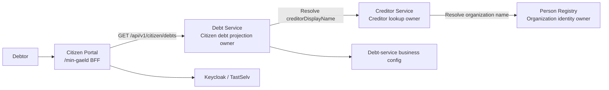
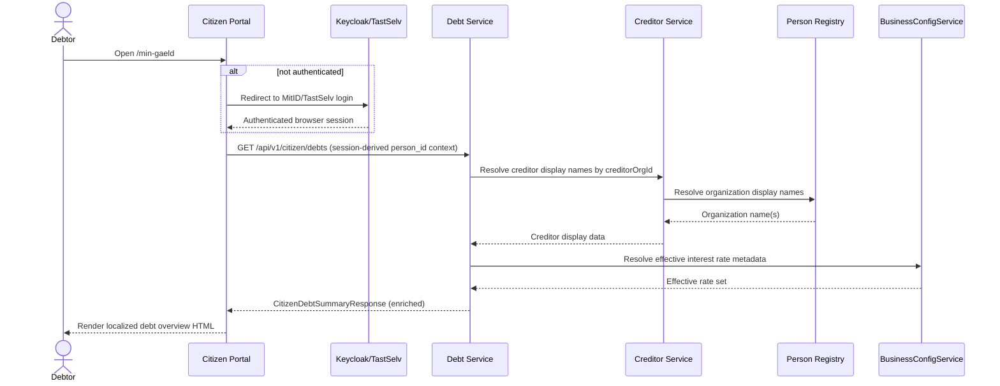

# Solution Architecture — Petition026: Citizen Debt Overview Page

**Document ID:** SA-026  
**Petition:** `petitions\petition026-citizen-debt-overview-page.md`  
**Outcome contract:** `petitions\petition026-citizen-debt-overview-page-outcome-contract.md`  
**Feature file:** `petitions\petition026-citizen-debt-overview-page.feature`  
**Concept alignment:** `C:\Users\AJ849XF\.copilot\session-state\aa376ae9-0b79-43f2-847f-daa8c9c6f6c9\files\petition026-concept-alignment.md`  
**NFR coverage:** `C:\Users\AJ849XF\.copilot\session-state\aa376ae9-0b79-43f2-847f-daa8c9c6f6c9\files\petition026-nfr-coverage.yaml`  
**Ownership map:** `C:\Users\AJ849XF\.copilot\session-state\aa376ae9-0b79-43f2-847f-daa8c9c6f6c9\files\petition026-component-assignment.yaml`  
**Ownership review:** `petitions\reviews\petition026-component-mapping-reviewer.yaml` — **PASS-WITH-WARNINGS**  
**Status:** Ready for architecture review  
**Depends on:** petition022, petition024, petition025, petition021, petition013  
**Binding ADRs:** ADR-0002, ADR-0004, ADR-0005, ADR-0007, ADR-0010, ADR-0014, ADR-0019, ADR-0020, ADR-0021, ADR-0024, ADR-0026, ADR-0031, ADR-0036, ADR-0037  
**ADR created by this run:** none  
**Authoritative run instruction:** creditor display on `/min-gaeld` uses **creditor name**

---

## 1. Architecture Overview

### 1.1 Problem Statement

Petition026 turns the citizen portal from a static landing page with an external “Mit gældsoverblik”
link into an authenticated internal debt-overview flow at `/min-gaeld`. The page must:

1. authenticate via MitID/TastSelv and Keycloak,
2. load citizen-scoped debt data from `opendebt-debt-service`,
3. display creditor **name**, debt type, amounts, due date, and status accessibly,
4. explain variable debt states such as paused interest and written-off debt without leaking
   internal or creditor-only concepts, and
5. keep `opendebt-citizen-portal` as a UI/BFF rather than a multi-service orchestration bucket.

The architectural pressure points in the current repository are real:

- `CitizenDebtItemDto` and `openapi-debt-service.yaml` do not yet carry creditor name or
  citizen-facing explanation metadata.
- `architecture\workspace.dsl` does not model the required `citizenPortal -> debtService`
  dependency.
- `openapi-creditor-service.yaml` exposes creditor operational data but not a display name.
- debt-service already owns the citizen debt projection, while creditor identity remains split
  between `creditor-service` and `person-registry`.

### 1.2 Terminology and Domain Grounding

`domain\concept-model.yaml` exists but is not yet approved, so it is used as advisory grounding
only. The relevant terms are still useful:

- `fordringshaver` → **Creditor**
- `skyldner` → **Debtor**
- `inddrivelsesrente` → **Recovery Interest**
- `forældelse` → **Limitation**
- `modregning` → **Set-off**
- `afdragsordning` → **Instalment Arrangement**

Two concept mismatches are resolved here:

1. **The citizen-facing “debt type” column uses Claim Type semantics, not Claim Art semantics.**  
   Petition024 already exposes `debtTypeCode` and `debtTypeName`. `claimArt` in the concept model
   is a higher-level regime classification (`INDR`, `MODR`) and is not the right citizen label.

2. **Citizen status is a presentation mapping, not a direct reuse of internal debt lifecycle enums.**  
   `DebtStatus` and `ClaimLifecycleState` remain internal domain/state carriers. Petition026 adds a
   citizen-safe presentation layer on top of them.

### 1.3 Ownership-Constrained Slice Model

Approved ownership is preserved.

| Slice ID | Primary owner | Responsibilities | Not responsible for |
|---|---|---|---|
| S1 | `opendebt-citizen-portal` | `/min-gaeld` routing, authenticated HTML rendering, i18n, accessibility, configured payment/PDF/contact links, graceful error state | Owning debt projection, resolving creditor identity itself, statutory rate logic |
| S2 | `opendebt-debt-service` | Citizen debt projection, creditor-name enrichment, citizen status mapping, paused-interest/write-off explanation codes, interest-rate metadata | HTML rendering, message-bundle text ownership |
| S3 | `opendebt-creditor-service` | Narrow creditor display lookup by `creditorOrgId`, reusing creditor-domain ownership and person-registry linkage | Page composition, citizen authorization, debt-state semantics |
| S4 | Keycloak + TastSelv/MitID | Authentication and citizen-session establishment | Debt retrieval or rendering logic |

### 1.4 Resolved Architecture Decisions

| Decision | Resolution | Why |
|---|---|---|
| D-026-01 — Where creditor name comes from | `debt-service` returns `creditorDisplayName` on the citizen debt projection. It resolves that name through `creditor-service`, and `creditor-service` remains the owner of creditor-domain lookup while sourcing organization identity from `person-registry`. | Keeps `citizen-portal` as a BFF/UI, fits ADR-0020 creditor ownership, avoids portal fan-out, and respects ADR-0007/ADR-0014. |
| D-026-02 — Whether the current interest-rate note is portal config or service-sourced | The **numeric/current rate metadata is service-sourced** from `debt-service` via `BusinessConfigService` and per-debt interest-rule resolution. The **surrounding explanatory prose** stays in citizen-portal message bundles. | Rate values are legal/business configuration and must not be duplicated in portal config. Text localization still belongs in the portal. |
| D-026-03 — How paused-interest/write-off/status explanation data reaches the portal | `debt-service` extends the citizen DTO with structured explanation fields and enums/codes; `citizen-portal` maps those codes to localized message-bundle text. No raw localized prose is returned by the service. | Satisfies API-first, keeps explanation truth with the projection owner, and preserves petition021 i18n rules. |
| D-026-04 — How to model the missing `citizenPortal -> debtService` dependency in `workspace.dsl` | Add the missing container relationship and additive portal/debt-service components: `DebtOverviewController`, `CitizenDebtClient`, `DebtOverviewView`, `CitizenDebtController`, `CitizenDebtService`, `CreditorDisplayClient`. Also add `debtService -> creditorService`, because creditor-name enrichment is now a runtime dependency. | The current C4 model is incomplete for petition026. The DSL must reflect the actual request path. |
| D-026-05 — Whether `/min-gaeld` reuses `DashboardController` | No. Petition026 gets a dedicated `DebtOverviewController` and page template. `DashboardController` stays separate as a generic placeholder route. | `/dashboard` is not the petition contract and should not become an accidental catch-all. |

### 1.5 High-Level Collaboration Diagram



---

## 2. Impacted Components

### 2.1 Component Impact Matrix

| Component / artifact | Current evidence | Petition026 impact |
|---|---|---|
| `opendebt-citizen-portal` container | `architecture\workspace.dsl`, `design\components\citizen-portal.yaml` | Gains the petition026 page/BFF path to debt-service. |
| `LandingPageController` + `index.html` | `opendebt-citizen-portal\src\main\java\...\LandingPageController.java`, `templates\index.html` | CTA changes from external URL to `/min-gaeld`. Controller stays simple; template/config change is the main impact. |
| `DashboardController` | `opendebt-citizen-portal\src\main\java\...\DashboardController.java` | Explicitly **not** reused as the petition026 owner. |
| Citizen portal config and i18n | `application.yml`, `messages_da.properties`, `messages_en_GB.properties` | Keep payment/PDF/contact configuration in portal config; add localized copy for debt overview page, citizen status text, pause/write-off explanation text, and accessible errors. |
| `CitizenDebtController`, `CitizenDebtService`, `CitizenDebtServiceImpl`, `CitizenDebtItemDto`, `CitizenDebtSummaryResponse` | `opendebt-debt-service\src\main\java\...` | Extend the citizen summary contract from “amounts only” to a true citizen projection: creditor name, structured explanations, interest-rate metadata, and citizen status mapping. |
| `api-specs\openapi-debt-service.yaml` | Existing `/api/v1/citizen/debts` contract | Must become the source of truth for the enriched petition026 response. |
| `opendebt-creditor-service` + `api-specs\openapi-creditor-service.yaml` | `CreditorController.java`, existing `Creditor` schema | Extend lookup response with `displayName` or an equivalent narrow display field for `creditorOrgId`-based enrichment. |
| `person-registry` internal org lookup | `api-specs\openapi-person-registry-internal.yaml` | No new portal dependency. Existing organization lookup remains behind creditor-service. |
| `architecture\workspace.dsl` | Missing `citizenPortal -> debtService`, missing debt-service -> creditor-service | Must be updated later using the additive block in this document. |

### 2.2 Internal Component Structure

#### S1 — Citizen Portal

**New/explicit petition026 sub-capabilities**

| Sub-capability | Responsibility |
|---|---|
| `DebtOverviewController` | Serve `GET /min-gaeld`, enforce authenticated flow, build the page model, and select accessible empty/error states |
| `CitizenDebtClient` | Call `debt-service` via injected `WebClient.Builder` with Resilience4j read profile and trace propagation |
| `DebtOverviewView` | Render semantic table, accessible alerts, localized explanatory text, and configured payment/PDF/contact links |

**Boundary**

- The portal **does not** call `creditor-service` or `person-registry` directly for this page.
- The portal owns message-bundle text, formatting, and ARIA/semantic HTML.
- The portal keeps external links and contact numbers in configuration.

#### S2 — Debt Service

**Petition026 sub-capabilities**

| Sub-capability | Responsibility |
|---|---|
| `CitizenDebtController` | External citizen summary surface at `/api/v1/citizen/debts` |
| `CitizenDebtService` | Retrieve citizen debts, assemble enriched projection, preserve `person_id` scoping |
| `CreditorDisplayClient` | Resolve `creditorDisplayName` from `creditor-service` using `creditorOrgId` |
| `CitizenDebtPresentationMapper` | Map internal status/lifecycle/interest facts into citizen-safe enums/codes |
| `BusinessConfigService` | Provide effective recovery-interest rate metadata keyed by interest rule |

**Boundary**

- Remains the authoritative owner of citizen debt projection.
- May call `creditor-service` synchronously for display enrichment.
- Does not localize text.
- Does not expose debtor PII or creditor-internal operational configuration.

#### S3 — Creditor Service

**Petition026 sub-capability**

| Sub-capability | Responsibility |
|---|---|
| `Creditor display lookup` | Return a public-institution display name for a given `creditorOrgId`, backed by existing creditor lookup plus organization identity resolution |

**Boundary**

- Still owns creditor master-data lookup boundary per ADR-0020.
- Does not own the citizen debt page or its composition.

---

## 3. Data Contract Changes

### 3.1 Public Debt-Service Contract

`GET /api/v1/citizen/debts` remains the only page-time backend call for `/min-gaeld`, but the
response must evolve from a narrow summary to a citizen presentation contract.

#### Required additions to `CitizenDebtItem`

| Field | Type | Purpose |
|---|---|---|
| `creditorDisplayName` | `string` | Petition026-required creditor **name** shown in the table |
| `citizenStatus` | enum | Presentation-safe status for the table column |
| `statusReasonCode` | enum? | Optional detail code backing sub-text for written-off or special statuses |
| `interestAccrualState` | enum | `ACTIVE` or `PAUSED` |
| `interestPauseReasonCode` | enum? | Machine-readable reason for paused interest |
| `interestRuleCode` | enum/string | Which rate regime applies to the debt |
| `currentInterestRate` | decimal? | Effective annual rate for that debt where applicable |
| `writtenOffReasonCode` | enum? | Present when `citizenStatus = WRITTEN_OFF` |

#### Required additions to `CitizenDebtSummaryResponse`

| Field | Type | Purpose |
|---|---|---|
| `effectiveInterestRates[]` | array | Page-level rate metadata so the portal can render a correct interest-rate note without hardcoding one number |
| `effectiveInterestRates[].interestRuleCode` | string | `INDR_STD`, `INDR_TOLD`, `INDR_TOLD_AFD`, `INDR_EXEMPT`, `INDR_CONTRACT`, etc. |
| `effectiveInterestRates[].annualRate` | decimal | Numeric annual rate |
| `effectiveInterestRates[].validFrom` | date | Governance/audit-safe effective date from business config |

#### Presentation enums/codes

Per ADR-0031, legally or contractually controlled code sets should be explicit enums rather than
free text. Petition026 therefore introduces a presentation contract like:

```yaml
CitizenDebtStatus:
  - IN_COLLECTION
  - SET_OFF
  - PAID
  - WRITTEN_OFF
  - DISPUTED
  - INSTALMENT_ARRANGEMENT
  - WAGE_GARNISHMENT

InterestAccrualState:
  - ACTIVE
  - PAUSED

InterestPauseReasonCode:
  - CLAIM_UNCLEAR_DEBTOR_CANNOT_PAY

WrittenOffReasonCode:
  - LIMITATION_EXPIRED
  - BANKRUPTCY
  - ESTATE_OF_DECEASED
  - DEBT_RESTRUCTURING
  - RECOVERY_FUTILE
  - RECOVERY_COST_DISPROPORTIONATE
```

These are **presentation contract enums**, not replacements for `DebtEntity.DebtStatus` or
`ClaimLifecycleState`.

### 3.2 Creditor-Service Internal Contract

`openapi-creditor-service.yaml` currently returns operational creditor data but no display name.
Petition026 requires one backward-compatible extension:

| Contract | Change |
|---|---|
| `GET /api/v1/creditors/{creditorOrgId}` | Add `displayName` to the `Creditor` response schema, sourced from the organization identity record |

This is preferred over portal-side creditor lookup because:

- it keeps creditor-domain lookup inside `creditor-service`,
- it keeps the citizen portal on a single backend dependency for `/min-gaeld`, and
- it aligns with ADR-0020, where `creditor-service` is the explicit creditor master-data boundary.

### 3.3 Portal Copy vs Service Data

The portal/service split must stay clean:

| Concern | Owner |
|---|---|
| Numeric interest-rate values and valid-from dates | `debt-service` |
| Creditor display name | `debt-service` response, sourced from `creditor-service` |
| Paused-interest and written-off reason codes | `debt-service` |
| Localized prose, button labels, captions, ARIA text | `citizen-portal` message bundles |
| Payment-page URL, PDF placeholder URL, phone number, phone-international | `citizen-portal` config |
| Back-link to landing page | `citizen-portal` route/navigation |

### 3.4 Contract Hardening Closed In This Correction Pass

This petition026 correction pass closes the live contract drifts identified during review:

1. `openapi-debt-service.yaml` now documents `pageNumber`, `pageSize`, and `totalElements` to
   match `CitizenDebtSummaryResponse.java`, while also describing the petition026 enrichment fields.
2. The citizen debt projection contract now includes creditor-name enrichment and citizen-safe
   explanation metadata, resolving the petition024 carry-over exclusion for the petition026 use
   case.

The OpenAPI specs are therefore the canonical source for the enriched citizen overview contract
before the portal client is implemented.

---

## 4. Runtime Flows

### 4.1 Primary Page-Load Flow



### 4.2 Portal Rendering Flow

1. `DebtOverviewController` reads the authenticated citizen session context.
2. `CitizenDebtClient` calls `debt-service` using injected `WebClient.Builder`.
3. If the response contains debts:
   - render total outstanding amount,
   - render the semantic debt table,
   - render creditor name from `creditorDisplayName`,
   - render status label and optional sub-text from message bundles using service codes,
   - render rate note using `effectiveInterestRates[]`.
4. If no debts are returned:
   - do not render an empty table,
   - render the accessible no-debt state.
5. If `debt-service` is unavailable:
   - show an accessible service-unavailable message,
   - keep payment/contact/back navigation visible.

### 4.3 Error and Degradation Rules

| Failure | Behavior |
|---|---|
| Missing/invalid authentication | Redirect to login flow |
| debt-service unavailable | Portal renders accessible service-unavailable page state; no stack trace |
| creditor-service name lookup unavailable inside debt-service | debt-service should fail the enrichment path predictably; do **not** make the portal perform a second lookup |
| one or more creditor names unavailable | return UUID fallback only as an explicit degraded value if product accepts it; otherwise fail fast and surface service-unavailable state |
| multiple interest rules apply | portal renders a rate list/note based on `effectiveInterestRates[]`, not a single hardcoded number |

### 4.4 Pagination Handling

Petition024 already made the citizen summary endpoint paginated. Petition026 does not remove that.
Therefore the portal must explicitly handle page metadata instead of assuming the entire debt set
fits in one response. The preferred first release is:

- request page `0`,
- use the maximum supported size that still meets performance and accessibility expectations, and
- add accessible pagination controls if `totalPages > 1`.

No hidden truncation is acceptable.

---

## 5. Risks and Mitigations

| Risk | Why it matters | Mitigation |
|---|---|---|
| Creditor name requires a new internal dependency | Current creditor-service contract has no `displayName` | Extend creditor-service lookup contract once, keep portal single-hop |
| Rate-note correctness across multiple rate regimes | Debt-service supports more than one interest rule (`INDR_STD`, `INDR_TOLD`, `INDR_TOLD_AFD`, exempt, contractual) | Service returns structured rate set; portal renders message-bundle prose around it |
| Status explanation drift | Internal debt states do not map 1:1 to citizen table labels | Introduce explicit citizen presentation enums and reason codes |
| Accessibility regression | Petition026 is citizen-facing and WCAG-bound | Keep all user-facing text in bundles, use semantic table markup, and require manual accessibility review in addition to automated checks |
| Runtime latency growth | `/min-gaeld` becomes portal -> debt-service -> creditor-service -> person-registry | Reuse ADR-0026 read-call resilience, consider small read-through caching in debt-service for creditor display names |
| Current spec/code drift | `CitizenDebtSummaryResponse` fields differ between Java DTO and OpenAPI | Normalize contract before portal implementation |

---

## 6. NFR Considerations

| NFR / ADR | Impact on petition026 | Architectural response |
|---|---|---|
| NFR-SEC-001 / ADR-0005 / ADR-0036 | `/min-gaeld` and `/api/v1/citizen/debts` must require authenticated citizen context | Browser SSO in portal; citizen-scoped token/role in debt-service |
| NFR-ARCH-001 / ADR-0007 | No cross-service DB access | Portal calls debt-service only; debt-service resolves creditor names via REST, not DB |
| NFR-GDPR-002 / ADR-0014 | No PII leakage | Only `person_id`/UUID references on the runtime path; no debtor name/CPR in response |
| NFR-API-001 / ADR-0004 | Contract must be explicit before build work | Update `openapi-debt-service.yaml` and `openapi-creditor-service.yaml` before implementation |
| NFR-OBS-002 / ADR-0024 | Trace propagation across portal and service calls | `CitizenDebtClient` and `CreditorDisplayClient` use injected `WebClient.Builder`; add missing runtime relation to DSL |
| NFR-RES-001 / NFR-RES-002 / ADR-0026 | Page must fail gracefully if debt-service or creditor-service is unstable | Read-profile circuit breaker/retry/timeouts on portal and debt-service outbound clients |
| NFR-PERF-001 / ADR-0037 | Page load is synchronous and citizen-facing | Keep `/min-gaeld` to a single portal -> debt-service hop; any further lookups stay inside debt-service and should be batched/cached |
| NFR-ACC-001 / ADR-0021 | WCAG 2.1 AA on a public portal | Semantic HTML table, accessible status/error states, keyboard navigation, screen-reader compatible messages |
| NFR-ARCH-004 / ADR-0032 | Catala for new statutory calculations | Not triggered for petition026 itself because the page renders existing service output; no new runtime legal calculation is introduced |

**Validation gap carried into review:** NFR-SEC-006 and NFR-ACC-001 still lack a fully automated
validation hook in the current register. Petition026 must therefore rely on explicit review
evidence, not automation alone.

---

## 7. Requirement-to-Slice Traceability Matrix

| Requirement cluster | Primary slice | Supporting slice(s) | Architectural allocation |
|---|---|---|---|
| Authenticated `/min-gaeld` route and landing-page CTA handoff | S1 | S4 | Citizen portal route/controller; Keycloak/TastSelv redirect |
| Citizen-scoped debt retrieval by session person | S2 | S1 | Debt-service remains the citizen summary owner; portal consumes it |
| Total amount, table rows, creditor name, debt type, due date, status | S2 | S1, S3 | Debt-service projects the data; portal renders it; creditor-service supplies creditor name |
| No-debt and service-unavailable states | S1 | S2 | Portal owns accessible rendering; debt-service provides empty/non-empty response semantics |
| Current interest-rate note | S2 | S1 | Rate metadata comes from debt-service; localized prose stays in portal bundles |
| Paused interest, written-off reasons, status explanations | S2 | S1 | Service provides codes/flags; portal localizes and renders sub-text |
| Payment link, PDF placeholder, contact info, back navigation | S1 | — | Portal config and template concern |
| i18n, accessibility, no-JS baseline | S1 | — | Portal owns semantic HTML and message bundles |
| Runtime dependency visibility in C4 model | S1 + S2 | S3 | Add `citizenPortal -> debtService` and `debtService -> creditorService` to DSL |

---

## 8. Rationale and Assumptions

### 8.1 Why the portal does not resolve creditor names itself

That would push `citizen-portal` into cross-service composition logic and make the page depend on
multiple backends for data correctness. Petition026 is better served by a single page-time domain
call to debt-service, with the enrichment kept where the citizen projection already lives.

### 8.2 Why the current rate note is not portal configuration

The repository already contains versioned business configuration and multiple interest rules in
debt-service. Duplicating a numeric rate in portal config would create governance drift and could
be wrong for some debts. The portal should localize the explanation, not own the legal/business
value.

### 8.3 Why explanation data is codes, not localized prose

Petition021 requires message-bundle ownership in the portal. Returning localized prose from
debt-service would duplicate translation responsibility and break consistent accessibility wording.

### 8.4 Assumptions

1. `creditor-service` can be extended without changing creditor-domain ownership.
2. Organization display names are acceptable for citizen display and are treated as organization
   identity data, not debtor PII.
3. Petition026 does not require write operations, ledger postings, or new Catala runtime logic.
4. The citizen portal keeps payment/PDF/contact links in configuration even after `/min-gaeld`
   becomes internal.

---

## 9. Architecture Review Readiness

This package is review-ready because:

- the ownership gate remains intact,
- the four open architecture choices are now explicitly resolved,
- the page-time runtime path is reduced to one portal -> domain call,
- creditor-name and interest-note sourcing are aligned with existing service ownership, and
- the missing C4 relations are expressed as additive DSL rather than hidden implementation drift.

### Warnings for review

1. Accessibility remains a manual-review-heavy area because the current NFR register still has a
   validation gap.

**Next handoff:** `solution-architecture-reviewer`

---

## Structurizr DSL Block

The following block is **additive** and intended for the `model` section of
`architecture\workspace.dsl`. It does **not** rewrite existing containers; it extends them with
petition026 components and the missing runtime dependencies.

```structurizr
citizenPortal {
    debtOverviewController = component "DebtOverviewController" "BFF/controller for GET /min-gaeld. Orchestrates the authenticated citizen debt overview page and its accessible empty/error states." "Spring MVC / BFF" "Component"
    citizenDebtClient = component "CitizenDebtClient" "Outbound client from citizen-portal to debt-service for the petition026 citizen debt summary." "HTTP client" "Component"
    debtOverviewView = component "DebtOverviewView" "Rendered Thymeleaf view for the citizen debt overview table, explanations, and configured actions." "Thymeleaf view" "Component"
}

debtService {
    citizenDebtController = component "CitizenDebtController" "External REST surface for GET /api/v1/citizen/debts." "REST API" "Component"
    citizenDebtService = component "CitizenDebtService" "Application service assembling the citizen debt projection, including creditor display names and citizen-safe status mapping." "Application service" "Component"
    creditorDisplayClient = component "CreditorDisplayClient" "Internal client resolving creditor display names from creditor-service by creditorOrgId." "HTTP client" "Component"
    businessConfigService = component "BusinessConfigService" "Resolves effective versioned interest-rate metadata for the citizen overview note." "Application service" "Component"
    citizenDebtPresentationMapper = component "CitizenDebtPresentationMapper" "Maps internal debt status, lifecycle, write-off, and paused-interest facts into citizen-safe enums and reason codes." "Presentation mapper" "Component"
}

creditorService {
    creditorController = component "CreditorController" "Internal creditor lookup surface. For petition026 it returns displayName together with creditor data for creditorOrgId-based resolution." "REST API" "Component"
}

citizenPortal -> debtService "Reads the citizen debt overview via" "HTTPS/REST"
debtService -> creditorService "Resolves creditor display names for the citizen projection via" "HTTPS/REST"

debtOverviewController -> citizenDebtClient "Requests the citizen debt summary through" "Java method call"
debtOverviewController -> debtOverviewView "Renders the debt overview page through" "Java method call"
citizenDebtClient -> citizenDebtController "Calls the citizen debt summary contract on" "HTTPS/REST"

citizenDebtController -> citizenDebtService "Delegates citizen debt projection assembly to" "Java method call"
citizenDebtService -> creditorDisplayClient "Resolves creditor display names through" "Java method call"
citizenDebtService -> businessConfigService "Resolves effective interest-rate metadata through" "Java method call"
citizenDebtService -> citizenDebtPresentationMapper "Maps internal debt facts to citizen-safe view fields through" "Java method call"

creditorDisplayClient -> creditorController "Calls creditor lookup for display-name enrichment on" "HTTPS/REST"
```
