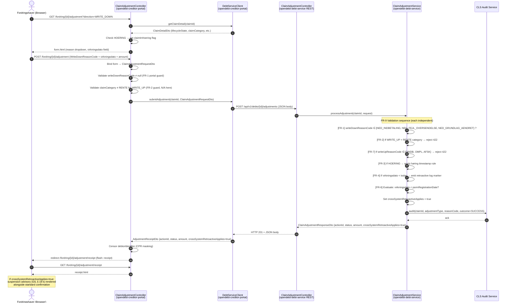
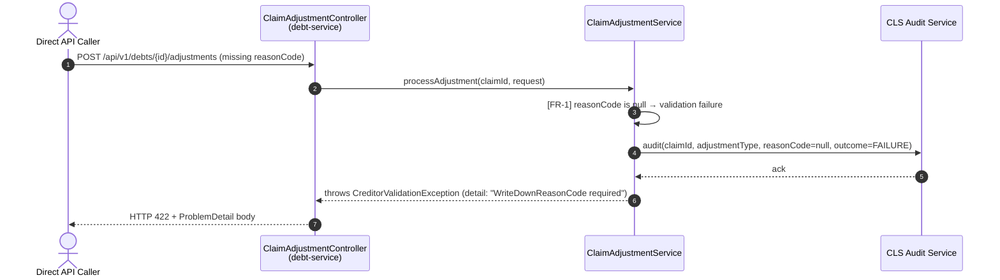

# Solution Architecture — P053: Opskrivning og nedskrivning (fuld G.A.-komplient)

**Petition:** 053  
**Status:** Ready for implementation  
**Supersedes:** Petition 034 (basic portal flow — now baseline)  
**Legal basis:** G.A.1.4.3, G.A.1.4.4, G.A.2.3.4.4, Gæld.bekendtg. § 7 stk. 1–2, GIL § 18 k  
**Authors:** solution-architect agent  
**Date:** 2025-07

---

## 1. Scope and Functional Requirements

### 1.1 In-scope FRs for this delivery

| FR | Title | Status | Module owner |
|----|-------|--------|-------------|
| **FR-1** | Nedskrivning — controlled reason dropdown | **New work** | portal + debt-service |
| FR-2 | Opskrivning — RENTE rejection | Baseline (compliance-fixes sprint) | portal |
| FR-3 | Opskrivning — høring timing banner | Baseline (compliance-fixes sprint) | portal |
| **FR-4** | Retroactive nedskrivning — user advisory | **New work** | portal + debt-service |
| **FR-5** | Annulleret nedskrivning — backdated type description | **New work** | portal |
| **FR-6** | Cross-system retroactive suspension advisory | **New work** | portal + debt-service |
| **FR-7** | Remove RIM-internal reason codes (DINDB/OMPL/AFSK) | **New work** | portal + debt-service |
| FR-8 | Permission-based type filtering | Baseline (petition 034) | portal + debt-service |
| **FR-9** | Backend enforcement independent of portal | **New work** | debt-service |

Baseline FRs (FR-2, FR-3, FR-8) are already implemented. Their Gherkin scenarios are retained for regression coverage only. **The implementation delta for this petition is FR-1, FR-4, FR-5, FR-6, FR-7, and FR-9.**

### 1.2 Non-functional requirements retained

- All new i18n keys present in both `messages_da.properties` and `messages_en_GB.properties`.
- Høring banner uses `role="status"` (WCAG 2.1 AA).
- Retroactive advisory uses `aria-live="polite"` (WCAG 2.1 AA).
- All adjustment submissions (success and failure) logged to CLS audit.

---

## 2. Architecture Decisions

### Decision 1 — FR-6: GIL § 18 k cross-system flag approach

**Decision: Flag approach — `crossSystemRetroactiveApplies: boolean`.**

`debt-service` evaluates GIL § 18 k applicability by comparing `virkningsdato` against the fordring's PSRM registration date. The result is returned as `crossSystemRetroactiveApplies: boolean` in the adjustment response DTO (`ClaimAdjustmentResponseDto`).

The portal renders the suspension advisory on the receipt page based solely on this flag. **The raw PSRM registration date is NOT exposed to the portal.**

| Option | Verdict |
|--------|---------|
| Flag approach (chosen) | Business-rule evaluation stays server-side; portal is a pure renderer. Minimal surface area. |
| Expose PSRM date to portal | Portal computes business rule; violates separation of concerns; PSRM internals leak to BFF. **Rejected.** |

**Rationale:** GIL § 18 k eligibility is a business rule tied to PSRM data that debt-service owns. Evaluating it in the portal would duplicate PSRM domain logic and create a cross-system date dependency in the BFF layer. The flag keeps the rule co-located with the data.

### Decision 2 — WriteDownReasonCode: Dual enum, no shared extraction

**Decision: Dual enum — one in each module. No extraction to `opendebt-common`.**

`WriteDownReasonCode` is defined independently in:
- `opendebt-creditor-portal/dto/WriteDownReasonCode.java` — portal DTO layer (form binding, BFF serialisation)
- `opendebt-debt-service/dto/WriteDownReasonCode.java` — service DTO layer (API validation)

Both enums must have identical values: `NED_INDBETALING`, `NED_FEJL_OVERSENDELSE`, `NED_GRUNDLAG_AENDRET`.

| Option | Verdict |
|--------|---------|
| Dual enum (chosen) | Values are legally stable (law-change only per Gæld.bekendtg. § 7 stk. 2). Independent module deployment. Convention-enforced parity. |
| Extract to opendebt-common | Introduces a shared-library dependency for a three-constant enum. Deployment coupling with no runtime benefit. **Rejected.** |

**Rationale:** The values are anchored in statute (§ 7 stk. 2) and cannot change without a legislative amendment. The coordination risk of divergence is extremely low, and keeping modules independently deployable outweighs the duplication cost. Parity is enforced by code review checklist.

### Decision 3 — ADR 0031 deviation: FR-7 removes portal-facing write-up codes

**Decision: FR-7 constitutes a bounded deviation from ADR 0031 §3 ("the creditor portal presents all values from the enum"). No ADR amendment required.**

ADR 0031 states: *"The creditor portal presents all values from the enum in the write-up form."* FR-7 removes `DINDB`, `OMPL`, and `AFSK` from the portal-facing `WriteUpReasonCode` enum.

These codes are classified in G.A.2.3.4.4 as RIM-internal initiation codes — they are not valid for creditor-initiated submissions through the fordringshaver portal, only for system-internal operations. ADR 0031's intent was to prevent configurable filtering of *valid portal codes*; it did not anticipate codes that are definitionally outside the portal's authorised operation set.

| Option | Verdict |
|--------|---------|
| Present all enum values including DINDB/OMPL/AFSK (ADR 0031 literal) | Exposes RIM-internal codes to creditors, violating G.A.2.3.4.4. **Rejected.** |
| Remove from portal enum, retain in debt-service denylist (chosen) | Eliminates portal exposure while preserving backend auditability. Consistent with G.A.2.3.4.4. |
| Amend ADR 0031 | Disproportionate — the issue is a single edge case in code classification, not a general policy failure. **Not required.** |

**Rationale:** G.A.2.3.4.4 restrictions are legally binding and supersede the ADR 0031 portal-presentation clause. The deviation is bounded to three specific enum constants that are definitionally not portal-accessible. Debt-service retains independent enforcement (FR-9) to reject these codes even if submitted directly.

---

## 3. Module Changes

### 3.1 `opendebt-creditor-portal`

| File | Action | FR | Rationale |
|------|--------|----|-----------|
| `dto/WriteDownReasonCode.java` | **CREATE** | FR-1 | New enum for the portal DTO layer: `NED_INDBETALING`, `NED_FEJL_OVERSENDELSE`, `NED_GRUNDLAG_AENDRET`. Used for Thymeleaf form binding on the nedskrivning dropdown. |
| `dto/WriteDownDto.java` | **MODIFY** | FR-1 | Replace `String reasonCode` (untyped) with `WriteDownReasonCode reasonCode` (typed enum). The free-text path is retired. |
| `dto/WriteUpReasonCode.java` | **MODIFY → DELETE** | FR-7 | Remove `DINDB`, `OMPL`, `AFSK`. All three are RIM-internal codes (G.A.2.3.4.4) and must not appear in the portal. Since the enum becomes empty after removal, **delete the file entirely**. Update `ClaimAdjustmentController` and `reloadFormWithErrors` to remove all references to `WriteUpReasonCode.allCodes()`. |
| `dto/ClaimAdjustmentRequestDto.java` | **MODIFY** | FR-1 | Add `WriteDownReasonCode writeDownReasonCode` field. Remove the `@NotBlank` constraint from the existing `String reason` field (reason for write-up path is now orphaned given WriteUpReasonCode deletion). Add `@NotNull(message = "{adjustment.validation.reason.required}")` on `writeDownReasonCode` field, with cross-field conditional validation handled in the controller (see §6). |
| `dto/AdjustmentReceiptDto.java` | **MODIFY** | FR-6 | Add `boolean crossSystemRetroactiveApplies` field. This field is populated from `ClaimAdjustmentResponseDto` returned by debt-service and drives the suspension advisory on the receipt page. |
| `controller/ClaimAdjustmentController.java` | **MODIFY** | FR-1,4,5,6,7 | Multiple changes — see §6.1 for full detail. |
| `resources/templates/claims/adjustment/form.html` | **MODIFY** | FR-1,4,5 | Multiple changes — see §5 for full detail. |
| `resources/templates/claims/adjustment/receipt.html` | **MODIFY** | FR-6 | Add conditional `crossSystemRetroactiveApplies` advisory block on the receipt page. |
| `resources/messages_da.properties` | **MODIFY** | FR-1,4,5,6 | Add 7 new message keys (see §7). |
| `resources/messages_en_GB.properties` | **MODIFY** | FR-1,4,5,6 | Add 7 new message keys in English (see §7). |

### 3.2 `opendebt-debt-service`

| File | Action | FR | Rationale |
|------|--------|----|-----------|
| `dto/WriteDownReasonCode.java` | **CREATE** | FR-1, FR-9 | Service-layer enum (Decision 2). Identical values to portal enum. Used for API validation at the `ClaimAdjustmentService` boundary. |
| `dto/WriteDownDto.java` | **CREATE** (or MODIFY if partial baseline exists) | FR-1, FR-9 | Service-layer DTO carrying `WriteDownReasonCode reasonCode`, `BigDecimal amount`, `LocalDate effectiveDate`, `String debtorId`. Replaces any untyped `String reason` field. |
| `dto/ClaimAdjustmentResponseDto.java` | **CREATE** | FR-6 | New response DTO returned from `POST /api/v1/debts/{id}/adjustments`. Carries `actionId`, `status`, `BigDecimal amount`, `boolean crossSystemRetroactiveApplies`. |
| `service/ClaimAdjustmentService.java` | **CREATE** | FR-9 | New service interface declaring `ClaimAdjustmentResponseDto processAdjustment(UUID claimId, ClaimAdjustmentRequestDto request)`. |
| `service/impl/ClaimAdjustmentServiceImpl.java` | **CREATE** | FR-9 | Implementation. Executes FR-9 validations in sequence (see §6.2), evaluates GIL § 18 k flag (Decision 1), emits retroactive log marker (FR-4), and calls CLS audit. |
| `controller/ClaimAdjustmentController.java` | **CREATE** (debt-service REST controller) | FR-9 | `@RestController @RequestMapping("/api/v1/debts/{id}/adjustments")` — exposes `POST` endpoint consumed by the portal BFF. |
| `api-specs/openapi-debt-service.yaml` | **MODIFY** | FR-9, FR-1, FR-6 | Add `POST /api/v1/debts/{id}/adjustments` path, `ClaimAdjustmentRequestDto` schema (including `writeUpReasonCode` and `writeDownReasonCode` fields), and `ClaimAdjustmentResponseDto` schema (including `crossSystemRetroactiveApplies`). Required per ADR 0004 (API-First Design) before implementation begins. |

> **Note on existing write-down endpoint:** `DebtController.writeDown()` (`POST /{id}/write-down`) is an internal caseworker/admin path that takes a raw `BigDecimal amount`. It is **not** the creditor-portal adjustment endpoint. The creditor-portal adjustment endpoint lives at `/api/v1/debts/{id}/adjustments` (already called by `DebtServiceClient.submitAdjustment()`). The new `ClaimAdjustmentController` in debt-service formalises and replaces any placeholder implementation at that path.

---

## 4. Data Flow — Nedskrivning Submission

The following sequence covers a write-down submission where `virkningsdato` predates the PSRM registration date (triggering all advisory paths). Baseline paths (permission check, RENTE guard, høring banner) are shown at abbreviated depth.



### 4.1 Failure path — CLS audit on validation rejection



---

## 5. Portal Form Changes (`form.html`)

### 5.1 Nedskrivning reason dropdown (FR-1)

**Remove:** The `<th:block th:if="${direction != 'WRITE_UP'}">` free-text `<input type="text">` for reason.

**Add:** A controlled `<select>` dropdown for `writeDownReasonCode` in the write-down block, mirroring the existing write-up pattern:

```html
<!-- Write-down: controlled reason dropdown (FR-1 / Gæld.bekendtg. § 7 stk. 2) -->
<th:block th:if="${direction != 'WRITE_UP'}">
  <select id="writeDownReasonCode"
          th:field="*{writeDownReasonCode}"
          class="skat-select"
          th:classappend="${#fields.hasErrors('writeDownReasonCode')} ? 'skat-input--error'"
          aria-describedby="writeDownReasonCode-error"
          th:aria-invalid="${#fields.hasErrors('writeDownReasonCode')} ? 'true' : 'false'"
          required="required">
    <option value="" th:text="#{adjustment.reason.placeholder}">-- Vælg årsag --</option>
    <option th:each="rc : ${writeDownReasonCodes}"
            th:value="${rc.name()}"
            th:text="#{|adjustment.reason.ned.${rc.name().toLowerCase().replace('ned_', '')}|}"
            th:selected="${adjustmentForm.writeDownReasonCode == rc}">Årsag</option>
  </select>
  <span id="writeDownReasonCode-error" class="skat-error-message" role="alert"
        th:if="${#fields.hasErrors('writeDownReasonCode')}"
        th:text="${#fields.errors('writeDownReasonCode')[0]}">Fejl</span>
</th:block>
```

The model attribute `writeDownReasonCodes` (a `List<WriteDownReasonCode>`) is added by `ClaimAdjustmentController.showAdjustmentForm()` when `direction == WRITE_DOWN`.

The i18n key pattern for the dropdown options resolves as follows:

| Enum constant | i18n key |
|---------------|----------|
| `NED_INDBETALING` | `adjustment.reason.ned.indbetaling` |
| `NED_FEJL_OVERSENDELSE` | `adjustment.reason.ned.fejl_oversendelse` |
| `NED_GRUNDLAG_AENDRET` | `adjustment.reason.ned.grundlag_aendret` |

### 5.2 Retroactive advisory below virkningsdato (FR-4)

Insert immediately after the `virkningsdato` field's error span:

```html
<!-- FR-4 / G.A.1.4.4: Inline advisory when virkningsdato is retroactive -->
<div id="retroaktiv-advisory"
     th:if="${retroaktivAdvisoryActive}"
     class="skat-alert skat-alert--warning"
     aria-live="polite">
  <p th:text="#{adjustment.info.retroaktiv.virkningsdato}">
    Virkningsdato er i fortiden. Gældsstyrelsen er forpligtet til at omfordele alle dækninger...
  </p>
</div>
```

The `retroaktivAdvisoryActive` model flag is set by `ClaimAdjustmentController` on form reload (POST path, after binding) when `adjustmentForm.effectiveDate != null && adjustmentForm.effectiveDate.isBefore(LocalDate.now())` and `direction == WRITE_DOWN`. It is **not set on GET** (the user has not yet entered a date). This is a server-side advisory; client-side JS enhancement is permitted but not architecturally required.

> **Test engineer note:** The retroactive advisory is observable only after a form POST submission causes a page reload — not on date-field input. Gherkin step definitions for FR-4 scenarios must trigger a form submission (POST) and observe the advisory in the resulting rendered response, not in an intermediate DOM state.

The advisory does not block submission. No `bindingResult.rejectValue()` call is made for this condition.

### 5.3 Backdated type description for OPSKRIVNING_OMGJORT_NEDSKRIVNING_REGULERING (FR-5)

Insert after the `adjustmentType` select, inside a conditional block:

```html
<!-- FR-5 / Gæld.bekendtg. § 7 stk. 1, 5. pkt.: Backdating description -->
<div th:if="${adjustmentForm.adjustmentType != null
             and adjustmentForm.adjustmentType.name() == 'OPSKRIVNING_OMGJORT_NEDSKRIVNING_REGULERING'}"
     class="skat-alert skat-alert--info">
  <p th:text="#{adjustment.type.description.omgjort_nedskrivning_regulering}">
    Opskrivning af annulleret nedskrivning: opskrivningsfordringen anses for modtaget...
  </p>
</div>
```

This block is purely declarative in the template; no controller change is needed beyond the existing `adjustmentType` model binding.

### 5.4 Write-up reason code section (FR-7 impact)

The existing write-up `<select>` for `reason` (bound to `WriteUpReasonCode.allCodes()`) is **removed** entirely, along with the `allowedReasonCodes` model attribute. After FR-7 removes `DINDB`, `OMPL`, and `AFSK` from `WriteUpReasonCode`, the enum is empty and deleted. The write-up form no longer presents a reason dropdown.

If a future petition requires write-up reason codes (fordringshaver-visible), a new `WriteUpReasonCode` enum populated with legal, non-RIM-internal codes would be introduced at that time.

---

## 6. Backend Enforcement

### 6.1 `ClaimAdjustmentController` changes (portal)

The following changes are required in addition to standard form binding:

**GET handler (`showAdjustmentForm`):**
- Remove `model.addAttribute("allowedReasonCodes", WriteUpReasonCode.allCodes())` (FR-7 — enum deleted).
- Add for `direction == WRITE_DOWN`: `model.addAttribute("writeDownReasonCodes", WriteDownReasonCode.values())`.

**POST handler (`submitAdjustment`):**
- Remove the write-up reason code allowlist validation block (bound to `WriteUpReasonCode.allCodes()` — deleted).
- Add for `direction == WRITE_DOWN`: validate `adjustmentForm.getWriteDownReasonCode() != null`; if null, `bindingResult.rejectValue("writeDownReasonCode", "adjustment.validation.reason.required", ...)`.
- After successful `debtServiceClient.submitAdjustment()`, map `receipt.isCrossSystemRetroactiveApplies()` into the flash attribute (already in `AdjustmentReceiptDto` per §3.1).
- After binding (whether or not there are errors), if `direction == WRITE_DOWN && adjustmentForm.getEffectiveDate() != null && adjustmentForm.getEffectiveDate().isBefore(LocalDate.now())`: `model.addAttribute("retroaktivAdvisoryActive", true)`.

**`reloadFormWithErrors` helper:**
- Remove `WriteUpReasonCode.allCodes()` reference.
- Add `writeDownReasonCodes` model attribute for `WRITE_DOWN`.
- Re-evaluate and set `retroaktivAdvisoryActive` on error reload.

### 6.2 `ClaimAdjustmentService` enforcement (debt-service)

All validations are evaluated **independently** and each produces a separate `HTTP 422` with a typed `ProblemDetail` body. They are not short-circuit-combined into a single validation pass — each rule is a distinct legal constraint.

| Rule | FR | Condition | Response |
|------|----|-----------|----------|
| WriteDownReasonCode required | FR-1 / FR-9 | `request.writeDownReasonCode == null` or not in `{NED_INDBETALING, NED_FEJL_OVERSENDELSE, NED_GRUNDLAG_AENDRET}` | HTTP 422, `detail: "WriteDownReasonCode is required and must be one of the legal values"` |
| RENTE + OPSKRIVNING_REGULERING | FR-2 / FR-9 | `adjustmentType == OPSKRIVNING_REGULERING && claim.claimCategory == RENTE` | HTTP 422, `detail: "RENTE claims must use a rentefordring, not an opskrivningsfordring (G.A.1.4.3)"` |
| Høring timing rule | FR-3 / FR-9 | `claim.lifecycleState == HOERING` | Apply: set opskrivningsfordring receipt timestamp = høring resolution time (not submission time). No 422. |
| RIM-internal reason codes | FR-7 / FR-9 | Write-up request with `reasonCode ∈ {DINDB, OMPL, AFSK}` | HTTP 422, `detail: "Reason code is reserved for RIM-internal operations (G.A.2.3.4.4)"` |
| Retroactive log marker | FR-4 / FR-9 | `request.effectiveDate < LocalDate.now()` | Log `WARN` with structured marker `{event: "retroactive_nedskrivning", claimId, virkningsdato}`. No 422. |
| GIL § 18 k evaluation | FR-6 / FR-9 | `request.effectiveDate < claim.psrmRegistrationDate` | Set `crossSystemRetroactiveApplies = true` in response. No 422. |

**CLS Audit call pattern:**

```
// Called on BOTH success and failure paths
clsAuditService.record(
    claimId,
    adjustmentType,          // WRITE_UP / WRITE_DOWN
    reasonCode,              // WriteDownReasonCode or null
    outcome,                 // SUCCESS / FAILURE
    creditorId,
    timestamp
)
```

The CLS call is made **after** validation (for failures, from the catch/finally block or the validation exception handler). A failed CLS call must not suppress the adjustment response — log and continue.

---

## 7. New Types

### 7.1 `WriteDownReasonCode` (both modules, identical values)

```
NED_INDBETALING         // Direkte indbetaling til fordringshaver (§ 7 stk. 2 nr. 1)
NED_FEJL_OVERSENDELSE   // Fejlagtig oversendelse til inddrivelse (§ 7 stk. 2 nr. 2)
NED_GRUNDLAG_AENDRET    // Opkrævningsgrundlaget har ændret sig (§ 7 stk. 2 nr. 3)
```

Values are legally anchored in Gæld.bekendtg. § 7 stk. 2. They can only change via a legislative amendment. Parity between modules is enforced by code review convention (see Decision 2).

### 7.2 `ClaimAdjustmentResponseDto` (debt-service, new)

Returned as the JSON body from `POST /api/v1/debts/{id}/adjustments`.

| Field | Type | Description |
|-------|------|-------------|
| `actionId` | `String` | PSRM action identifier for the processed adjustment |
| `status` | `String` | Processing status (e.g., `ACCEPTED`, `PENDING_HOERING`) |
| `amount` | `BigDecimal` | The adjustment amount that was processed |
| `crossSystemRetroactiveApplies` | `boolean` | `true` if `virkningsdato` < PSRM registration date, indicating potential GIL § 18 k suspension (Decision 1) |

### 7.3 `AdjustmentReceiptDto` changes (portal, existing class)

Add field:

| Field | Type | Description |
|-------|------|-------------|
| `crossSystemRetroactiveApplies` | `boolean` | Mapped from `ClaimAdjustmentResponseDto`. Drives suspension advisory on receipt page. |

### 7.4 `WriteUpReasonCode` — deletion

The enum currently contains `DINDB`, `OMPL`, `AFSK`. All three are RIM-internal codes (G.A.2.3.4.4). Per FR-7 and Decision confirmed in the outcome contract:

- All three constants are **removed**.
- The enum is **empty after removal** → **file is deleted**.
- All references in `ClaimAdjustmentController` and `reloadFormWithErrors` are removed.
- The write-up reason dropdown in `form.html` is removed (see §5.4).

---

## 8. i18n — New Message Keys

All 7 keys below must be present in **both** `messages_da.properties` and `messages_en_GB.properties`. Absence of any key from either file will cause the CI bundle-lint check to fail.

> **i18n key count resolved (7, not 8):** The petition outcome contract's success metric cited 8 new keys. After confirming the bundle, `adjustment.label.reason` (`Årsag / årsagskode`) already exists in both property files — it is reused as the form-field label for both write-up and write-down directions. No additional label key is required. The definitive count is **7 new keys**. The outcome contract success metric is updated accordingly.

| Key | DA value | EN value |
|-----|----------|----------|
| `adjustment.reason.ned.indbetaling` | Direkte indbetaling til fordringshaver | Direct payment to the creditor |
| `adjustment.reason.ned.fejl_oversendelse` | Fejlagtig oversendelse til inddrivelse | Erroneous referral for debt collection |
| `adjustment.reason.ned.grundlag_aendret` | Opkrævningsgrundlaget har ændret sig | The assessment basis has changed |
| `adjustment.validation.reason.required` | Vælg venligst en årsag til nedskrivningen | Please select a reason for the write-down |
| `adjustment.info.retroaktiv.virkningsdato` | Virkningsdato er i fortiden. Gældsstyrelsen er forpligtet til at omfordele alle dækninger foretaget efter denne dato og genberegne renter for den berørte periode. Behandlingen kan tage ekstra tid. Se G.A.1.4.4. | The effective date is in the past. The Danish Debt Collection Authority is obliged to reassign all coverages made after this date and recalculate interest for the affected period. Processing may take additional time. See G.A.1.4.4. |
| `adjustment.type.description.omgjort_nedskrivning_regulering` | Opskrivning af annulleret nedskrivning: opskrivningsfordringen anses for modtaget på samme tidspunkt som den fordring, der fejlagtigt blev nedskrevet (G.A.1.4.3). | Write-up reversing a cancelled write-down: the write-up claim is treated as received at the same time as the claim that was incorrectly written down (G.A.1.4.3). |
| `adjustment.info.suspension.krydssystem` | Restanceinddrivelsesmyndigheden kan suspendere inddrivelsen af denne fordring midlertidigt, mens korrektionen behandles, hvis korrektionen ikke kan gennemføres straks (GIL § 18 k). Suspensionen ophæves automatisk, når korrektionen er registreret. | The Danish Debt Collection Authority may temporarily suspend collection of this claim while the correction is being processed, if it cannot be completed immediately (GIL § 18 k). The suspension will be lifted automatically when the correction has been registered. |

---

## 9. Interface Contracts

### 9.1 Adjustment endpoint

**Path:** `POST /api/v1/debts/{id}/adjustments`  
**Auth:** `CREDITOR` or `ADMIN` role  
**Consumes:** `application/json`  
**Produces:** `application/json`

#### Request body

```json
{
  "adjustmentType": "WRITE_DOWN",
  "amount": 500.00,
  "effectiveDate": "2022-12-01",
  "writeDownReasonCode": "NED_INDBETALING",
  "writeUpReasonCode": null,
  "debtorId": "optional-debtor-uuid"
}
```

| Field | Type | Required | Validation |
|-------|------|----------|------------|
| `adjustmentType` | `String` (enum name) | Yes | Must be a valid `ClaimAdjustmentType` value |
| `amount` | `BigDecimal` | Yes | `> 0.00` |
| `effectiveDate` | `LocalDate` (ISO-8601) | Yes | Must not be null |
| `writeDownReasonCode` | `String` (enum name) | Conditional | Required when `adjustmentType` is `WRITE_DOWN`; must be one of `NED_INDBETALING`, `NED_FEJL_OVERSENDELSE`, `NED_GRUNDLAG_AENDRET` |
| `writeUpReasonCode` | `String` | Conditional | Optional when `adjustmentType` is `WRITE_UP`. Debt-service **rejects** any value in `{DINDB, OMPL, AFSK}` with HTTP 422 (FR-7 / G.A.2.3.4.4 enforcement). Null or absent is valid for write-up submissions where the portal sends no reason code. |
| `debtorId` | `String` (UUID) | Conditional | Required for payment-related types with multiple debtors |

#### Success response — HTTP 201

```json
{
  "actionId": "ACT-20240101-00042",
  "status": "ACCEPTED",
  "amount": 500.00,
  "crossSystemRetroactiveApplies": true
}
```

#### Error response — HTTP 422

```json
{
  "type": "https://opendebt.ufst.dk/problems/validation-failure",
  "title": "Unprocessable Entity",
  "status": 422,
  "detail": "WriteDownReasonCode is required and must be one of the legal values"
}
```

### 9.2 FR-6 flag propagation (internal BFF mapping)

```
debt-service JSON → DebtServiceClient → AdjustmentReceiptDto
                     (deserialises crossSystemRetroactiveApplies)
AdjustmentReceiptDto → RedirectAttributes flash
receipt.html → th:if="${receipt.crossSystemRetroactiveApplies}" → advisory block
```

No additional HTTP hops. The flag travels as a JSON field and a Java boolean through the BFF stack.

---

## 10. Traceability Matrix

| FR | Portal deliverable | debt-service deliverable |
|----|--------------------|--------------------------|
| FR-1 | `WriteDownReasonCode.java` (new), `WriteDownDto.java` (modify), `ClaimAdjustmentRequestDto.java` (add field), `form.html` (dropdown), `ClaimAdjustmentController` (validation + model) | `WriteDownReasonCode.java` (new), `WriteDownDto.java` (create), `ClaimAdjustmentServiceImpl` (FR-9 validation) |
| FR-2 (baseline) | `ClaimAdjustmentController` (existing RENTE guard) | `ClaimAdjustmentServiceImpl` (FR-9) |
| FR-3 (baseline) | `form.html` (existing `claimInHoering` banner) | `ClaimAdjustmentServiceImpl` (høring timestamp rule) |
| FR-4 | `form.html` (retroactive advisory div), `ClaimAdjustmentController` (set `retroaktivAdvisoryActive`), `messages_da/en_GB` | `ClaimAdjustmentServiceImpl` (retroactive log marker) |
| FR-5 | `form.html` (backdating description div), `messages_da/en_GB` | None (no additional backend work) |
| FR-6 | `AdjustmentReceiptDto.java` (add field), `receipt.html` (advisory block), `messages_da/en_GB` | `ClaimAdjustmentResponseDto.java` (new), `ClaimAdjustmentServiceImpl` (GIL § 18 k evaluation) |
| FR-7 | `WriteUpReasonCode.java` (delete), `ClaimAdjustmentController` (remove refs), `form.html` (remove write-up reason dropdown) | `ClaimAdjustmentServiceImpl` (reject DINDB/OMPL/AFSK) |
| FR-8 (baseline) | `ClaimAdjustmentController` (existing `grantedAdjustmentPermissions` filter) | `ClaimAdjustmentServiceImpl` (permission check) |
| FR-9 | N/A (portal-side is UX aid only) | `ClaimAdjustmentServiceImpl` — all FR-1..FR-7 rules enforced independently |

---

## 11. Assumptions and Open Points

| # | Assumption | Risk if wrong |
|---|------------|---------------|
| A1 | `POST /api/v1/debts/{id}/adjustments` does not currently have a production implementation with a signed API contract. Any placeholder from P034 can be replaced. | If a hard API contract exists, the new `ClaimAdjustmentResponseDto` shape (adding `crossSystemRetroactiveApplies`) requires a versioned endpoint or negotiated schema update. |
| **A2 — RESOLVED** | `DebtEntity.receivedAt` (LocalDateTime, column `received_at`) IS the PSRM registration date. It is set to `LocalDateTime.now()` by `ClaimLifecycleServiceImpl` when the claim is accepted for collection. Column comment confirms: *"Timestamp when claim was received for collection."* FR-6 evaluates `virkningsdato.isBefore(debt.getReceivedAt().toLocalDate())`. No new field or migration is required. | Resolved. Specs may use `debt.receivedAt` directly. |
| A3 | CLS audit service is already integrated in debt-service (used by other services). The `ClaimAdjustmentService` will use the same integration point. | If CLS is not yet integrated in debt-service, this is a separate infrastructure task (not tracked in this petition). |
| A4 | The `WriteUpReasonCode` enum's `allCodes()` method is not referenced outside `ClaimAdjustmentController` and `form.html`. | A wider usage sweep must be done before deletion. |
| A5 | Retroactive advisory (FR-4) is server-side rendered on POST reload. Client-side JS enhancement (showing advisory on date-field change without a round-trip) is out of scope but does not conflict with this design. | None — JS enhancement is additive. |

---

## 12. Out of Scope

The following items are explicitly **not addressed** in this petition or this architecture:

| Item | Reference | Tracked in |
|------|-----------|------------|
| Full retroactive timeline replay (dækning reassignment + interest recalculation in payment-service) | G.A.1.4.4, GIL § 18 l | **TB-038** |
| Rentegodtgørelse — Gældsstyrelsen's discretionary prospective virkningsdato option | GIL § 18 l, G.A.1.4.4 | **TB-039** |
| Interne opskrivninger (DINDB/OMPL/AFSK) as portal-initiated actions | G.A.2.3.4.4 | Intentionally excluded; RIM-internal only |
| Lønindeholdelse limitation warning at confirmation step | G.A.3.1.2.1.3 | Retained from P034 (already implemented) |
| Tilbagekald (withdrawal) flow | — | Existing separate flow |
| Genindsendelse (resubmission) flow | — | Existing separate flow |

---

*Document produced from petition artifacts: `petitions/petition053-fordringshaverportal-opskrivning-nedskrivning-fuld-spec.md`, outcome contract, feature file, and `petition053_map.yaml`. Architecture decisions on FR-6 flag approach and WriteDownReasonCode dual-enum are resolved per application-architect directional notes.*
