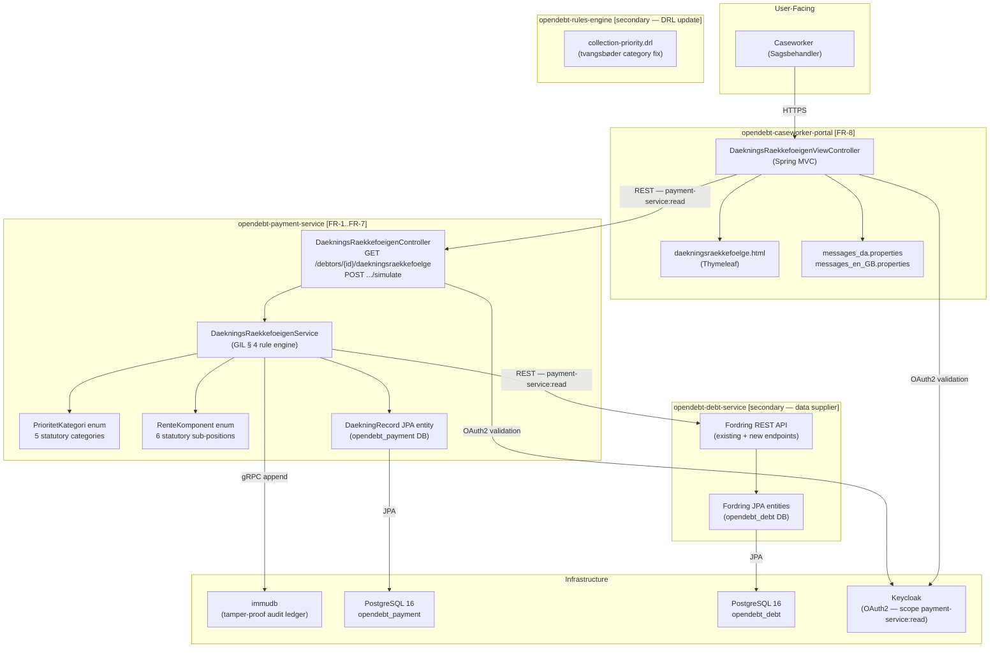
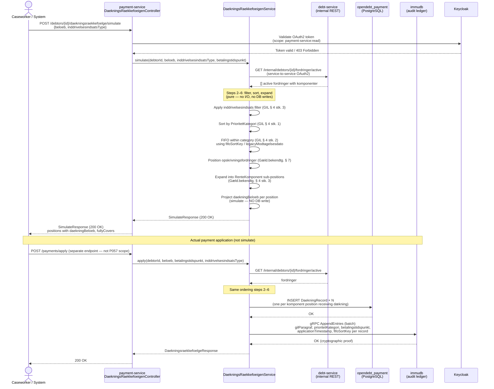
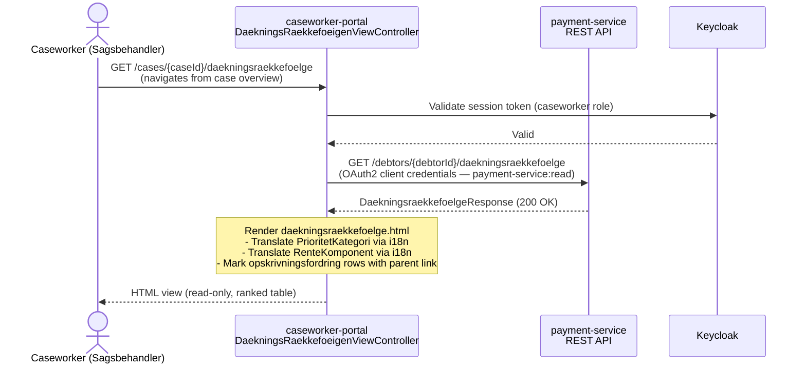

# Solution Architecture — P057: Dækningsrækkefølge (GIL § 4 Payment Application Order)

**Document ID:** SA-P057  
**Petition:** `petitions/petition057-daekningsraekkefoeigen.md`  
**Outcome contract:** `petitions/petition057-daekningsraekkefoeigen-outcome-contract.md`  
**Feature file:** `petitions/petition057-daekningsraekkefoeigen.feature` (27 scenarios — Phase 1 PASSED)  
**Catala companion:** `design/specs-p069-catala-spike-daekningsraekkefoeigen.md` (P069)  
**Status:** Approved for implementation  
**Legal basis:** GIL § 4 stk. 1–4; GIL § 6a stk. 1, 12; GIL § 9 stk. 1, 3; GIL § 10b;
Gæld.bekendtg. § 4 stk. 3; Gæld.bekendtg. § 7; Retsplejelovens § 507; Lov nr. 288/2022  
**G.A. snapshot:** v3.16 (2026-03-28)  
**Depends on:** SA-P007 (inddrivelsesskridt model baseline)  
**Depended on by:** P059 (forældelse), P062 (pro-rata distribution)  
**ADRs binding this document:** ADR-0002, ADR-0004, ADR-0007, ADR-0011, ADR-0014, ADR-0015,
ADR-0022, ADR-0029, ADR-0031, ADR-0032

---

## 1. Overview and Scope

### 1.1 Problem Statement

GIL § 4 mandates a fixed, hierarchical order in which Gældsstyrelsen must apply received
payments across a debtor's outstanding fordringer. This *dækningsrækkefølge* is not a system
configuration choice — it is statute. Incorrect application:

- Distributes money to the wrong fordring or the wrong creditor, creating legally invalid
  dækning records that must be reversed and replayed.
- Causes audit failures when the CLS log cannot confirm GIL § 4 compliance.
- Exposes Gældsstyrelsen to liability under forvaltningslovens § 22.

Petition 007 provided a two-level sketch of priority ordering sufficient to model the data
structure. This architecture specifies the **full GIL § 4 rule engine** replacing that
sketch, including all sub-rules of stk. 1–4 and the operational API and portal view.

### 1.2 Scope

| In scope | Out of scope |
|----------|--------------|
| GIL § 4 rule engine implementation in `opendebt-payment-service` | Actual payment ingestion (covered by P007 baseline) |
| `DaekningsRaekkefoeigenService` — core ordering and allocation logic | Pro-rata distribution (P062) |
| `PrioritetKategori` + `RenteKomponent` Java enums | Forældelse interruption logic (P059) |
| `DaekningRecord` JPA entity + Liquibase migrations | Catala encoding (P069 spike) |
| REST API: GET + POST /simulate endpoints | Payment ingestion from external channels |
| Sagsbehandler portal view (FR-8, `opendebt-caseworker-portal`) | Citizen/creditor portal payment views |
| `collection-priority.drl` update for tvangsbøder (lov nr. 288/2022) | Full Drools refactor |
| `architecture/workspace.dsl` clarification (payment-service owns GIL § 4) | New C4 containers |
| OpenAPI 3.1 spec additions | Breaking changes to existing endpoints |
| CLS audit log enrichment (gilParagraf, betalingstidspunkt) | immudb schema changes |

### 1.3 Key Non-Functional Requirements

| NFR | Requirement | Binding constraint |
|-----|-------------|-------------------|
| NFR-1 | **Determinism** — identical inputs produce identical ordered output on every run | ADR-0032 (Catala formal layer); validated by P069 oracle |
| NFR-2 | **Audit completeness** — every dækning event in immudb/CLS carries `gilParagraf`, `prioritetKategori`, `fifoSortKey`, `betalingstidspunkt`, `applicationTimestamp` | ADR-0022, ADR-0029 |
| NFR-3 | **GDPR isolation** — no CPR stored in `opendebt-payment-service`; fordring references use `person_id` UUID only | ADR-0014 |
| NFR-4 | **API-first** — all interfaces defined in OpenAPI 3.1 before implementation | ADR-0004 |
| NFR-5 | **No cross-service DB access** — `payment-service` fetches fordring data from `debt-service` via REST | ADR-0007 |
| NFR-6 | **Liquibase migrations** — schema changes managed as versioned Liquibase changesets | ADR-0011 |
| NFR-7 | **Statutory enums** — `PrioritetKategori` and `RenteKomponent` are Java enums, not DB/config tables | ADR-0031 |

---

## 2. Component Diagram



### 2.1 Component Responsibility Summary

| Component | Service | Responsibility | FR coverage |
|-----------|---------|---------------|-------------|
| `DaekningsRaekkefoeigenController` | payment-service | REST endpoints — GET (ordered list) + POST simulate | FR-7 |
| `DaekningsRaekkefoeigenService` | payment-service | Core GIL § 4 rule engine — ordering, FIFO, interest sequencing, udlæg exception | FR-1 to FR-6 |
| `PrioritetKategori` enum | payment-service | 5 statutory category codes (ADR-0031) | FR-1 |
| `RenteKomponent` enum | payment-service | 6 statutory interest sub-position codes (ADR-0031) | FR-3 |
| `DaekningRecord` entity | payment-service | Persisted allocation line item with full traceability | FR-6, NFR-2 |
| `DaekningsRaekkefoeigenViewController` | caseworker-portal | Spring MVC controller — fetches API, renders Thymeleaf view | FR-8 |
| `daekningsraekkefoelge.html` | caseworker-portal | Thymeleaf template — ranked table with translated labels | FR-8 |
| i18n bundles (DA + EN) | caseworker-portal | Translated labels for `PrioritetKategori` and `RenteKomponent` | FR-8, AC-17 |
| Fordring REST API (additions) | debt-service | New endpoints supplying fordring data to payment-service | NFR-5 |
| `collection-priority.drl` update | rules-engine | Reclassify tvangsbøder to category 2 (lov nr. 288/2022) | FR-1, AC-2 |

---

## 3. Data Model

### 3.1 `DaekningRecord` Entity

The `DaekningRecord` entity is the persisted line-item record for every allocation event
produced by the GIL § 4 rule engine. Each row represents a single atomic dækning of one
`RenteKomponent` of one `fordringId`.

```
DaekningRecord
──────────────────────────────────────────────────────────────────────
id                    UUID           PK — generated
fordringId            UUID           FK reference to fordring (debt-service owns source)
komponent             VARCHAR(64)    RenteKomponent enum value (NOT NULL)
daekningBeloeb        NUMERIC(19,2)  Amount allocated (≥ 0.00, NOT NULL)
betalingstidspunkt    TIMESTAMPTZ    Legal effect timestamp — when debtor lost control of funds (NOT NULL)
applicationTimestamp  TIMESTAMPTZ    When the rule engine ran (NOT NULL)
gilParagraf           VARCHAR(64)    e.g. "GIL § 4, stk. 1, nr. 2" (NOT NULL)
prioritetKategori     VARCHAR(64)    PrioritetKategori enum value (NOT NULL)
fifoSortKey           DATE           ISO-8601 date used for FIFO ordering; legacyModtagelsesdato for pre-2013 (NOT NULL)
udlaegSurplus         BOOLEAN        true iff payment is an udlæg surplus retained per Retsplejelovens § 507
inddrivelsesindsatsType VARCHAR(32)  e.g. "UDLAEG", "LOENINDEHOLDELSE", "MODREGNING", "FRIVILLIG" (nullable — null = normal application)
opskrivningAfFordringId UUID         Parent fordring UUID if this is an opskrivningsfordring (nullable)
createdBy             VARCHAR(128)   Audit — subject from OAuth2 token
createdAt             TIMESTAMPTZ    Audit — insert timestamp
version               BIGINT         Optimistic lock (audit, ADR-0022)
──────────────────────────────────────────────────────────────────────
```

**Key invariants:**
- `daekningBeloeb` is always ≥ 0. A zero-amount record is not written; the engine skips
  fully-covered fordringer.
- `betalingstidspunkt` ≤ `applicationTimestamp` always (payment precedes or equals application).
- `fifoSortKey` is set to `legacyModtagelsesdato` for fordringer with
  `modtagelsesdato < 2013-09-01`; otherwise it equals the `modtagelsesdato` from
  the fordring's overdragelse record.
- `udlaegSurplus = true` rows have `daekningBeloeb = 0` and represent retained surplus,
  not an actual allocation.

### 3.2 `PrioritetKategori` Enum (ADR-0031)

Statutory codes corresponding to GIL § 4, stk. 1, nr. 1–4 (with privatretlig/offentlig
split for underholdsbidrag per G.A.2.3.2).

```java
public enum PrioritetKategori {
    /** GIL § 4, stk. 1, nr. 1 / GIL § 6a, stk. 1, stk. 12 */
    RIMELIGE_OMKOSTNINGER,
    /** GIL § 4, stk. 1, nr. 2 / GIL § 10b — includes tvangsbøder (lov nr. 288/2022) */
    BOEDER_TVANGSBOEEDER_TILBAGEBETALING,
    /** GIL § 4, stk. 1, nr. 3 — privatretlige underholdsbidrag (covered before offentlige) */
    UNDERHOLDSBIDRAG_PRIVATRETLIG,
    /** GIL § 4, stk. 1, nr. 3 — offentlige underholdsbidrag */
    UNDERHOLDSBIDRAG_OFFENTLIG,
    /** GIL § 4, stk. 1, nr. 4 — all other fordringer */
    ANDRE_FORDRINGER
}
```

**Rationale:** Statutory categories are statute, not configuration. Making them enums
(ADR-0031) ensures: (1) compile-time exhaustiveness checking in switch expressions; (2) no
invalid category codes can enter the system at runtime; (3) Drools DRL rules reference the
same canonical enum, eliminating string-matching bugs.

**Note on tvangsbøder:** Prior to lov nr. 288/2022, tvangsbøder were placed in category 4
(`ANDRE_FORDRINGER`). Lov nr. 288/2022 moved them explicitly to category 2. The
`collection-priority.drl` rule that previously mapped tvangsbøder to category 4 must be
updated to `BOEDER_TVANGSBOEEDER_TILBAGEBETALING`. This is a breaking legal correction
(AC-2).

### 3.3 `RenteKomponent` Enum (ADR-0031)

Statutory sub-positions per Gæld.bekendtg. § 4, stk. 3. Ordering is by ordinal (ascending).

```java
public enum RenteKomponent {
    /** Sub-position 1: Opkrævningsrenter — interest accrued before transfer to inddrivelse */
    OPKRAEVNINGSRENTER,
    /** Sub-position 2: Inddrivelsesrenter — fordringshaver calculation (stk. 3) */
    INDDRIVELSESRENTER_FORDRINGSHAVER_STK3,
    /** Sub-position 3: Inddrivelsesrenter — accrued before tilbageførelse */
    INDDRIVELSESRENTER_FOER_TILBAGEFOERSEL,
    /** Sub-position 4: Inddrivelsesrenter — standard GIL § 9, stk. 1 */
    INDDRIVELSESRENTER_STK1,
    /** Sub-position 5: Øvrige renter calculated by PSRM under GIL § 9, stk. 3 */
    OEVRIGE_RENTER_PSRM,
    /** Sub-position 6: Hovedfordring (principal) — covered only after all rente sub-positions exhausted */
    HOVEDFORDRING
}
```

**Rationale:** The 6-tier interest ordering within a single fordring is the most
legally-sensitive ordering rule. Collapsing sub-positions (a known PSRM implementation
error) misallocates money. Enum ordinals enforce ascending coverage order at compile time.

### 3.4 Legacy `modtagelsesdato` Column

For fordringer received before 1 September 2013, the overdragelse API timestamp cannot be
used as the FIFO sort key because it was either unavailable or unreliable in the legacy EFI
system. The canonical date stored at migration must be preserved.

A new column `legacy_modtagelsesdato DATE` is added to the `fordring` table in
`opendebt_debt` (debt-service). This column:
- Is `NULL` for all fordringer with `modtagelsesdato >= 2013-09-01`.
- Is populated at migration time for pre-2013 fordringer from the legacy EFI export.
- Is treated as the authoritative `fifoSortKey` by `DaekningsRaekkefoeigenService` when
  non-null.

### 3.5 Entity-Relationship Sketch

```
┌─────────────────────────────────────┐         ┌─────────────────────────────────────┐
│  opendebt_debt (debt-service DB)    │         │  opendebt_payment (payment-service) │
│                                     │         │                                     │
│  fordring                           │         │  daekning_record                    │
│  ─────────                          │  REST   │  ──────────────                     │
│  id UUID PK                         │◄────────│  fordring_id UUID (reference only)  │
│  person_id UUID (no CPR — ADR-0014) │         │  komponent VARCHAR(64)              │
│  prioritet_kategori VARCHAR(64)     │         │  daekning_beloeb NUMERIC(19,2)      │
│  modtagelsesdato DATE               │         │  betalingstidspunkt TIMESTAMPTZ     │
│  legacy_modtagelsesdato DATE        │         │  application_timestamp TIMESTAMPTZ  │
│  fordringshaver_id UUID             │         │  gil_paragraf VARCHAR(64)           │
│  opskrivning_af_fordring_id UUID    │         │  prioritet_kategori VARCHAR(64)     │
│  inddrivelsesindsats_type VARCHAR   │         │  fifo_sort_key DATE                 │
│  saldo NUMERIC(19,2)                │         │  udlaeg_surplus BOOLEAN             │
│  ...                                │         │  inddrivelsesindsats_type VARCHAR   │
│                                     │         │  opskrivning_af_fordring_id UUID    │
│                                     │         │  created_by VARCHAR(128)            │
│                                     │         │  created_at TIMESTAMPTZ             │
│                                     │         │  version BIGINT                     │
└─────────────────────────────────────┘         └─────────────────────────────────────┘
```

**Critical constraint (ADR-0007):** The `daekning_record.fordring_id` is a logical reference
only. There is no foreign-key constraint across database boundaries. `payment-service` fetches
fordring data from `debt-service` via REST at dækning time and stores the UUID for audit
traceability.

---

## 4. API Design

### 4.1 `DaekningsRaekkefoeigenController` — Endpoints

#### 4.1.1 GET `/debtors/{debtorId}/daekningsraekkefoelge`

Returns the ordered list of the debtor's active fordringer as they would be covered by
the next payment application, without applying any payment.

**Security:** OAuth2 Bearer token with scope `payment-service:read`.

**Path parameters:**

| Parameter | Type | Description |
|-----------|------|-------------|
| `debtorId` | UUID | Debtor's `person_id` UUID (no CPR — ADR-0014) |

**Query parameters:**

| Parameter | Type | Required | Description |
|-----------|------|----------|-------------|
| `asOf` | ISO-8601 date | No | Return ordering as it would have been at this date (snapshot mode) |

**Response 200 — `DaekningsraekkefoelgeResponse`:**

```json
{
  "debtorId": "3fa85f64-5717-4562-b3fc-2c963f66afa6",
  "computedAt": "2026-04-01T14:23:00Z",
  "positions": [
    {
      "rank": 1,
      "fordringId": "a1b2c3d4-...",
      "fordringshaverId": "f0e1d2c3-...",
      "prioritetKategori": "RIMELIGE_OMKOSTNINGER",
      "gilParagraf": "GIL § 4, stk. 1, nr. 1",
      "komponent": "OPKRAEVNINGSRENTER",
      "tilbaestaaendeBeloeb": 1250.00,
      "modtagelsesdato": "2022-03-15",
      "fifoSortKey": "2022-03-15",
      "opskrivningAfFordringId": null
    },
    {
      "rank": 2,
      "fordringId": "a1b2c3d4-...",
      "fordringshaverId": "f0e1d2c3-...",
      "prioritetKategori": "RIMELIGE_OMKOSTNINGER",
      "gilParagraf": "GIL § 4, stk. 1, nr. 1",
      "komponent": "INDDRIVELSESRENTER_STK1",
      "tilbaestaaendeBeloeb": 87.50,
      "modtagelsesdato": "2022-03-15",
      "fifoSortKey": "2022-03-15",
      "opskrivningAfFordringId": null
    }
  ]
}
```

**Error responses:**

| HTTP | Condition |
|------|-----------|
| 403 | Token present but caller lacks access to this debtor |
| 404 | Debtor UUID not found in debt-service |
| 400 | `asOf` is not a valid ISO-8601 date |

#### 4.1.2 POST `/debtors/{debtorId}/daekningsraekkefoelge/simulate`

Computes a projected payment allocation for a given amount without persisting any changes.
Returns HTTP 200 (not 201) — this is a query, not a creation.

**Security:** Same as GET — scope `payment-service:read`.

**Request body — `SimulateRequest`:**

```json
{
  "beloeb": 5000.00,
  "inddrivelsesindsatsType": "LOENINDEHOLDELSE"
}
```

| Field | Type | Required | Constraint |
|-------|------|----------|------------|
| `beloeb` | decimal | Yes | Must be > 0; HTTP 422 if zero or negative |
| `inddrivelsesindsatsType` | string | No | One of: `UDLAEG`, `LOENINDEHOLDELSE`, `MODREGNING`, `FRIVILLIG`; null = normal application |

**Response 200 — `SimulateResponse`:**

```json
{
  "debtorId": "3fa85f64-...",
  "simulatedBeloeb": 5000.00,
  "inddrivelsesindsatsType": "LOENINDEHOLDELSE",
  "positions": [
    {
      "rank": 1,
      "fordringId": "a1b2c3d4-...",
      "fordringshaverId": "f0e1d2c3-...",
      "prioritetKategori": "RIMELIGE_OMKOSTNINGER",
      "gilParagraf": "GIL § 4, stk. 1, nr. 1",
      "komponent": "OPKRAEVNINGSRENTER",
      "tilbaestaaendeBeloeb": 1250.00,
      "fifoSortKey": "2022-03-15",
      "daekningBeloeb": 1250.00,
      "fullyCovers": true,
      "opskrivningAfFordringId": null,
      "udlaegSurplus": false
    }
  ],
  "remainingAfterAllocation": 3750.00,
  "udlaegSurplusRetained": 0.00
}
```

Additional fields vs GET response:

| Field | Type | Description |
|-------|------|-------------|
| `daekningBeloeb` | decimal | Projected amount allocated to this position |
| `fullyCovers` | boolean | True iff `daekningBeloeb` >= `tilbaestaaendeBeloeb` |
| `udlaegSurplus` | boolean | True iff this row's surplus is retained per udlæg exception |
| `opskrivningAfFordringId` | UUID | nullable — present when this position is an opskrivningsfordring; UUID of its parent fordring |
| `remainingAfterAllocation` | decimal | Payment amount not allocated (may be > 0 if all fordringer covered) |
| `udlaegSurplusRetained` | decimal | Amount retained as udlæg surplus (not applied to other fordringer) |

**Error responses:**

| HTTP | Condition |
|------|-----------|
| 422 | `beloeb` is zero or negative |
| 403 | Caller lacks access to debtor |
| 404 | Debtor not found |

### 4.2 OpenAPI 3.1 Specification Changes

The following additions are required in the OpenAPI 3.1 spec for `opendebt-payment-service`:

1. **New path:** `GET /debtors/{debtorId}/daekningsraekkefoelge`
2. **New path:** `POST /debtors/{debtorId}/daekningsraekkefoelge/simulate`
3. **New schemas:** `DaekningsraekkefoelgeResponse`, `DaekningsraekkefoelgePosition`,
   `SimulateRequest`, `SimulateResponse`, `SimulatePosition`
4. **New enum schemas:** `PrioritetKategoriDto` (5 values), `RenteKomponentDto` (6 values),
   `InddrivelsesindsatsTypeDto` (4 values: `UDLAEG`, `LOENINDEHOLDELSE`, `MODREGNING`, `FRIVILLIG`)
5. **Security requirement:** `payment-service:read` scope on both paths

All schemas must carry `description` fields with the GIL § 4 article reference for each
field where a legal basis exists (ADR-0004 API-first + UFST documentation standard).

### 4.3 Debt-Service REST Additions Required

`DaekningsRaekkefoeigenService` fetches fordring data from `debt-service` via REST
(ADR-0007). The following new endpoint is required from `debt-service`:

#### GET `/internal/debtors/{debtorId}/fordringer/active`

Returns all active fordringer for a debtor, with the fields needed by the payment-service
rule engine.

**Internal endpoint** — not exposed through the public API gateway. Called only by
`payment-service` with service-to-service OAuth2 client credentials.

**Response fields per fordring:**

| Field | Description |
|-------|-------------|
| `id` | fordring UUID |
| `fordringshaverId` | creditor UUID |
| `prioritetKategori` | `PrioritetKategoriDto` — statutory category |
| `modtagelsesdato` | Receipt date (ISO-8601 date) |
| `legacyModtagelsesdato` | Pre-2013 FIFO sort date (nullable) |
| `opskrivningAfFordringId` | Parent fordring UUID (nullable — opskrivningsfordring only) |
| `inddrivelsesindsatsType` | Type of active inddrivelsesindsats (nullable) |
| `komponenter` | Array of `{komponent: RenteKomponentDto, tilbaestaaendeBeloeb: decimal}` |

This endpoint is the single source of truth for fordring state during a dækning run.
`payment-service` must NOT read the `opendebt_debt` database directly (ADR-0007).

---

## 5. Rule Engine Algorithm

### 5.1 `DaekningsRaekkefoeigenService` — Ordering Algorithm

The algorithm implements GIL § 4, stk. 1–4 and Gæld.bekendtg. § 4, stk. 3. It is
**pure and side-effect-free** during execution; `DaekningRecord` rows are written only
after the full ordering is computed (determinism — NFR-1, ADR-0032).

#### Step 1 — Fetch active fordringer (GIL § 4, stk. 4)

Fetch all active fordringer for the debtor from `debt-service` at application time T3
(not at betalingstidspunkt T1). This ensures fordringer arriving between T1 and T3 are
included in the ordering (FR-6). The `betalingstidspunkt` is carried as input and stored
on every `DaekningRecord` for legal effect dating.

#### Step 2 — Apply inddrivelsesindsats filter (GIL § 4, stk. 3)

If `inddrivelsesindsatsType` is non-null:
- Partition fordringer into:
  - `indsatsFordringer`: fordringer associated with the triggering inddrivelsesindsats.
  - `remainingFordringer`: all other fordringer coverable by the same indsats type.
- **Udlæg exception (Retsplejelovens § 507):** If `inddrivelsesindsatsType = "UDLAEG"`,
  set `remainingFordringer = []`. Surplus from udlæg fordringer is NOT applied elsewhere;
  it is flagged `udlaegSurplus = true`.
- Process `indsatsFordringer` first (sub-steps 3–5 below).
- After `indsatsFordringer` are exhausted: if `inddrivelsesindsatsType != "UDLAEG"`,
  apply surplus to `remainingFordringer` (same sub-steps 3–5).
- **FRIVILLIG note:** `inddrivelsesindsatsType = "FRIVILLIG"` follows normal GIL § 4, stk. 1
  ordering (same behaviour as null — no partition, no udlæg exception). However, the value
  `"FRIVILLIG"` **must** be preserved on every resulting `DaekningRecord` for audit
  traceability; it must not be coerced to null before persistence.

#### Step 3 — Sort by priority category (GIL § 4, stk. 1)

Within the active fordring set, sort by `PrioritetKategori` ordinal (ascending):

```
1. RIMELIGE_OMKOSTNINGER          → GIL § 4, stk. 1, nr. 1 / GIL § 6a, stk. 1, stk. 12
2. BOEDER_TVANGSBOEEDER_TILBAGEBETALING → GIL § 4, stk. 1, nr. 2 / GIL § 10b
3. UNDERHOLDSBIDRAG_PRIVATRETLIG  → GIL § 4, stk. 1, nr. 3 (privatretlige before offentlige)
4. UNDERHOLDSBIDRAG_OFFENTLIG     → GIL § 4, stk. 1, nr. 3 (offentlige)
5. ANDRE_FORDRINGER               → GIL § 4, stk. 1, nr. 4
```

No fordring in category N+1 receives any dækning while any fordring in category N has a
positive `tilbaestaaendeBeloeb`.

#### Step 4 — Sort within category by FIFO (GIL § 4, stk. 2)

Within each `PrioritetKategori` group, sort fordringer ascending by `fifoSortKey`:
- `fifoSortKey = legacyModtagelsesdato` if `modtagelsesdato < 2013-09-01` AND
  `legacyModtagelsesdato IS NOT NULL`.
- `fifoSortKey = modtagelsesdato` otherwise.

#### Step 5 — Apply opskrivningsfordring positioning (Gæld.bekendtg. § 7)

After the initial FIFO sort, reposition opskrivningsfordringer:
- Each opskrivningsfordring is inserted immediately after its parent fordring in the sorted
  list, regardless of its own modtagelsesdato FIFO position.
- If the parent is already fully covered (`saldo = 0`), the opskrivningsfordring occupies
  the position where the parent would appear (same `fifoSortKey` as the parent).
- When a parent has multiple opskrivningsfordringer, they are sub-sorted among themselves
  by ascending `modtagelsesdato` (FIFO on the opskrivningsfordring's own receipt date).

#### Step 6 — Expand each fordring into RenteKomponent sub-positions (Gæld.bekendtg. § 4, stk. 3)

Each fordring in the sorted list is expanded into up to 6 line items, one per
`RenteKomponent` with a positive `tilbaestaaendeBeloeb`, in ascending ordinal order:

```
1. OPKRAEVNINGSRENTER
2. INDDRIVELSESRENTER_FORDRINGSHAVER_STK3
3. INDDRIVELSESRENTER_FOER_TILBAGEFOERSEL
4. INDDRIVELSESRENTER_STK1
5. OEVRIGE_RENTER_PSRM
6. HOVEDFORDRING  ← only after all 5 interest sub-positions are exhausted
```

This expansion produces the `positions` list returned by the GET endpoint.

#### Step 7 — Apply payment amount sequentially

Walk the `positions` list top-to-bottom, allocating the available payment amount to each
position until the payment is exhausted or all positions are covered:

```
for position in positions:
    if availableBeloeb <= 0:
        break
    allocated = min(availableBeloeb, position.tilbaestaaendeBeloeb)
    position.daekningBeloeb = allocated
    position.fullyCovers = (allocated >= position.tilbaestaaendeBeloeb)
    availableBeloeb -= allocated
```

For `simulate`: stop here, return the projected list. Do not write any `DaekningRecord`.

For actual application: write one `DaekningRecord` per position where `daekningBeloeb > 0`,
then append all records to the immudb audit ledger in a single gRPC batch.

#### Step 8 — Assign gilParagraf per position

| Position type | `gilParagraf` value |
|---------------|---------------------|
| Category-1 fordring | `"GIL § 4, stk. 1, nr. 1"` |
| Category-2 fordring | `"GIL § 4, stk. 1, nr. 2"` |
| Category-3 privatretlig | `"GIL § 4, stk. 1, nr. 3"` |
| Category-3 offentlig | `"GIL § 4, stk. 1, nr. 3"` |
| Category-4 fordring | `"GIL § 4, stk. 1, nr. 4"` |
| Inddrivelsesindsats allocation | `"GIL § 4, stk. 3"` (appended to category basis) |

#### 5.2 Determinism Guarantee (NFR-1 / ADR-0032)

The algorithm is stateless and pure during the ordering phase (steps 1–6). Given identical
inputs (same fordringer, same betalingstidspunkt, same beloeb), the output is always
identical. This is the precondition for validation against the P069 Catala oracle.

Determinism is enforced by:
- No random or time-based tiebreakers (ties in `fifoSortKey` are broken by `fordringId`
  UUID lexicographic order — stable and reproducible).
- Enum ordinals used for all sorting (not string comparison).
- The `applicationTimestamp` is injected (not `LocalDateTime.now()`) to allow
  replay testing.

---

## 6. Sequence Diagram — Payment Application Flow



### 6.1 Sagsbehandler Portal Flow



---

## 7. Cross-Cutting Concerns

### 7.1 Audit Logging (ADR-0022, ADR-0029)

Every actual payment application (not simulate) appends records to **immudb** via gRPC.
Each appended entry must carry:

| Field | Source |
|-------|--------|
| `gilParagraf` | Assigned by rule engine (step 8 of algorithm) |
| `prioritetKategori` | From `DaekningRecord.prioritetKategori` |
| `fifoSortKey` | From `DaekningRecord.fifoSortKey` |
| `betalingstidspunkt` | From input payment event |
| `applicationTimestamp` | From rule engine run timestamp |
| `fordringId` | From `DaekningRecord.fordringId` |
| `komponent` | From `DaekningRecord.komponent` |
| `daekningBeloeb` | From `DaekningRecord.daekningBeloeb` |
| `inddrivelsesindsatsType` | From input (nullable) |
| `createdBy` | From OAuth2 token subject |

**Simulate does NOT write to immudb.** The controller layer enforces this by calling
`service.simulate()` (which has no immudb dependency) vs `service.apply()`.

The `DaekningRecord` rows in PostgreSQL are the primary relational store. immudb provides
tamper-proof cryptographic proof for regulatory audit (ADR-0029). Both must be written
atomically — failure to append to immudb causes the entire payment application to roll back
(the Spring `@Transactional` boundary wraps both the PostgreSQL writes and the immudb
gRPC call; on immudb failure, the transaction is rolled back and a `DaekningAuditException`
is thrown).

### 7.2 GDPR (ADR-0014)

- `payment-service` stores `fordringId` (UUID) and `person_id` (UUID) only.
  No CPR, no name, no address is stored in `opendebt_payment`.
- `DaekningsRaekkefoeigenController` accepts `debtorId` as a UUID path parameter.
  The controller does not log or return CPR numbers.
- `caseworker-portal` displays fordring references and creditor names (non-PII) only.
  Debtor personal details are resolved by a separate call to `person-registry` if needed
  for the case overview — not included in the dækningsrækkefølge view.
- The `fordringshaverId` in the API response is the creditor UUID, not the CPR of any
  individual.

### 7.3 Authentication and Authorisation (ADR-0005)

- All `payment-service` endpoints require a valid Keycloak Bearer token.
- Required OAuth2 scope: `payment-service:read`.
- Role-based access control: the token must include a role that grants access to the
  specific debtor's cases. The controller delegates debtor-level access checks to
  `debt-service` (which owns case assignment data) via the REST response — if
  `debt-service` returns 403 for the fordring fetch, `payment-service` propagates 403.
- Service-to-service calls (payment-service → debt-service) use client credentials flow
  with a dedicated `payment-service` OAuth2 client. This client is granted the
  `debt-service:internal-read` scope.
- The `caseworker-portal` → `payment-service` call uses the caseworker's delegated token
  (on-behalf-of pattern), not the portal's own client credentials.

### 7.4 Determinism and Catala Validation (ADR-0032, NFR-1)

The P069 Catala spike encodes GIL § 4 as an executable Catala program. Once the spike
concludes (Go decision), the Catala output serves as an oracle:
- CI pipeline runs the Catala program against the same inputs as the Gherkin scenarios.
- Any discrepancy between Catala output and Java rule engine output is a **defect** requiring
  resolution before the build passes.

This architecture enforces the preconditions for Catala validation by:
1. Injecting `applicationTimestamp` (not `Instant.now()`) into the service method signature.
2. Keeping the ordering algorithm pure and stateless (no DB reads during computation).
3. Serialising the `gilParagraf` string in the same format the Catala article-anchor comments
   reference.

### 7.5 Resilience (ADR-0026)

- `DaekningsRaekkefoeigenService` calls `debt-service` with a Resilience4j circuit breaker
  (existing pattern). If `debt-service` is unavailable, the rule engine raises a
  `DaekningUnavailableException` (HTTP 503) rather than proceeding with stale data.
- The simulate endpoint is idempotent and cacheable. Implementations MAY cache the GET
  response for a short TTL (suggested: 5 seconds) per debtor to reduce load on `debt-service`
  during parallel requests from the portal.
- immudb write failures cause the entire payment application to roll back (see §7.1). This is
  intentional: a payment without an audit record is legally unacceptable.

---

## 8. Interface Changes — Debt-Service

### 8.1 New Internal Endpoint Required

`debt-service` must expose a new internal REST endpoint to supply `payment-service` with
the data needed by the rule engine. This endpoint does NOT exist today.

**New endpoint:** `GET /internal/debtors/{debtorId}/fordringer/active`

This endpoint is owned by `opendebt-debt-service`. Its implementation is out of scope for
P057 but is a **hard dependency** — P057 cannot be completed until this endpoint exists.

**Traceability:** This dependency should be tracked as a separate sub-petition or technical
backlog item against `opendebt-debt-service`.

**Response schema additions required in debt-service OpenAPI spec:**

```yaml
FordringForDaekningDto:
  type: object
  required: [id, fordringshaverId, prioritetKategori, modtagelsesdato, komponenter]
  properties:
    id:
      type: string
      format: uuid
    fordringshaverId:
      type: string
      format: uuid
    prioritetKategori:
      $ref: '#/components/schemas/PrioritetKategoriDto'
    modtagelsesdato:
      type: string
      format: date
    legacyModtagelsesdato:
      type: string
      format: date
      nullable: true
      description: "FIFO sort date for fordringer received before 2013-09-01 (FR-2, AC-4)"
    opskrivningAfFordringId:
      type: string
      format: uuid
      nullable: true
    inddrivelsesindsatsType:
      type: string
      nullable: true
    komponenter:
      type: array
      items:
        $ref: '#/components/schemas/KomponentSaldoDto'

KomponentSaldoDto:
  type: object
  required: [komponent, tilbaestaaendeBeloeb]
  properties:
    komponent:
      $ref: '#/components/schemas/RenteKomponentDto'
    tilbaestaaendeBeloeb:
      type: number
      format: decimal
```

### 8.2 `collection-priority.drl` Update (Rules Engine)

The existing `collection-priority.drl` in `opendebt-rules-engine` contains a rule that
maps tvangsbøder to `ANDRE_FORDRINGER` (category 4). This is incorrect per lov nr.
288/2022, which moved tvangsbøder to category 2.

**Required change:**

```
Old: rule "tvangsboeeder-category"
     when Fordring(type == "TVANGSBOEDE")
     then setPrioritetKategori(ANDRE_FORDRINGER)   // WRONG — pre-2022

New: rule "tvangsboeeder-category"
     when Fordring(type == "TVANGSBOEDE")
     then setPrioritetKategori(BOEDER_TVANGSBOEEDER_TILBAGEBETALING)   // CORRECT — lov nr. 288/2022
```

The `PrioritetKategori` enum imported into the DRL must be the same Java enum defined in
`DaekningsRaekkefoeigenService` (or a shared `opendebt-common` module). String matching
is explicitly prohibited (ADR-0031).

---

## 9. Migration Strategy (Liquibase)

### 9.1 `opendebt_debt` — Legacy Modtagelsesdato Column

**Changeset:** `db/changelog/changes/V_P057_001__add_legacy_modtagelsesdato.xml`

```xml
<changeSet id="P057-001" author="p057-daekningsraekkefoelge">
    <addColumn tableName="fordring">
        <column name="legacy_modtagelsesdato" type="DATE">
            <constraints nullable="true"/>
        </column>
    </addColumn>
    <rollback>
        <dropColumn tableName="fordring" columnName="legacy_modtagelsesdato"/>
    </rollback>
</changeSet>
```

**Population strategy:** A separate data migration changeset populates
`legacy_modtagelsesdato` from the EFI legacy export for all rows where
`modtagelsesdato < '2013-09-01'`. This is a one-time historical migration and must be
run with `runOnChange="false"`.

### 9.2 `opendebt_payment` — DaekningRecord Table

**Changeset:** `db/changelog/changes/V_P057_002__create_daekning_record.xml`

```xml
<changeSet id="P057-002" author="p057-daekningsraekkefoelge">
    <createTable tableName="daekning_record">
        <column name="id" type="UUID"><constraints primaryKey="true" nullable="false"/></column>
        <column name="fordring_id" type="UUID"><constraints nullable="false"/></column>
        <column name="komponent" type="VARCHAR(64)"><constraints nullable="false"/></column>
        <column name="daekning_beloeb" type="NUMERIC(19,2)"><constraints nullable="false"/></column>
        <column name="betalingstidspunkt" type="TIMESTAMPTZ"><constraints nullable="false"/></column>
        <column name="application_timestamp" type="TIMESTAMPTZ"><constraints nullable="false"/></column>
        <column name="gil_paragraf" type="VARCHAR(64)"><constraints nullable="false"/></column>
        <column name="prioritet_kategori" type="VARCHAR(64)"><constraints nullable="false"/></column>
        <column name="fifo_sort_key" type="DATE"><constraints nullable="false"/></column>
        <column name="udlaeg_surplus" type="BOOLEAN" defaultValueBoolean="false"/>
        <column name="inddrivelsesindsats_type" type="VARCHAR(32)"/>
        <column name="opskrivning_af_fordring_id" type="UUID"/>
        <column name="created_by" type="VARCHAR(128)"><constraints nullable="false"/></column>
        <column name="created_at" type="TIMESTAMPTZ" defaultValueComputed="NOW()"><constraints nullable="false"/></column>
        <column name="version" type="BIGINT" defaultValueNumeric="0"><constraints nullable="false"/></column>
    </createTable>

    <createIndex tableName="daekning_record" indexName="idx_daekning_fordring_id">
        <column name="fordring_id"/>
    </createIndex>

    <createIndex tableName="daekning_record" indexName="idx_daekning_betalingstidspunkt">
        <column name="betalingstidspunkt"/>
    </createIndex>

    <rollback>
        <dropTable tableName="daekning_record"/>
    </rollback>
</changeSet>
```

### 9.3 Migration Sequencing

| Order | Changeset | Service DB | Blocking dependency |
|-------|-----------|------------|---------------------|
| 1 | `V_P057_001` — add `legacy_modtagelsesdato` | `opendebt_debt` | None — additive |
| 2 | EFI data migration — populate pre-2013 dates | `opendebt_debt` | Must run after V_P057_001 |
| 3 | `V_P057_002` — create `daekning_record` table | `opendebt_payment` | None — new table |

Migrations 1 and 3 are safe to deploy before application code is active (additive, no
breaking changes to existing tables).

---

## 10. Traceability Matrix

| FR / NFR | Requirement | Slice(s) | AC |
|----------|-------------|----------|----|
| FR-1 | Priority categories — GIL § 4, stk. 1 | `DaekningsRaekkefoeigenService` + `PrioritetKategori` enum + `collection-priority.drl` | AC-1, AC-2 |
| FR-2 | Within-category FIFO — GIL § 4, stk. 2 | `DaekningsRaekkefoeigenService` + `legacy_modtagelsesdato` column + Liquibase V_P057_001 | AC-3, AC-4 |
| FR-3 | Interest ordering — Gæld.bekendtg. § 4, stk. 3 | `DaekningsRaekkefoeigenService` + `RenteKomponent` enum | AC-5, AC-6 |
| FR-4 | Inddrivelsesindsats rule — GIL § 4, stk. 3 | `DaekningsRaekkefoeigenService` (step 2 of algorithm) | AC-7, AC-8 |
| FR-5 | Opskrivningsfordring positioning — Gæld.bekendtg. § 7 | `DaekningsRaekkefoeigenService` (step 5 of algorithm) | AC-9, AC-10, AC-11 |
| FR-6 | Timing — GIL § 4, stk. 4 | `DaekningsRaekkefoeigenService` (step 1) + `DaekningRecord.betalingstidspunkt` | AC-12, AC-13 |
| FR-7 | Payment application API | `DaekningsRaekkefoeigenController` + OpenAPI 3.1 spec | AC-14, AC-15 |
| FR-8 | Sagsbehandler portal view | `DaekningsRaekkefoeigenViewController` + `daekningsraekkefoelge.html` + i18n | AC-16, AC-17 |
| NFR-1 | Determinism | Algorithm design (pure function, injected timestamp) | AC-13 (immudb record completeness) |
| NFR-2 | Audit completeness | `DaekningRecord` + immudb append | AC-13 |
| NFR-3 | GDPR isolation | UUID-only references in `opendebt_payment` | — |
| NFR-4 | API-first | OpenAPI 3.1 spec updated before implementation | — |
| NFR-5 | No cross-service DB | debt-service REST endpoint dependency | — |
| NFR-6 | Liquibase migrations | V_P057_001, V_P057_002 | AC-4 (legacyModtagelsesdato) |
| NFR-7 | Statutory enums | `PrioritetKategori`, `RenteKomponent` Java enums | AC-1, AC-2, AC-5, AC-6 |

---

## 11. Rationale and Assumptions

### 11.1 Architectural Decisions

| Decision | Rationale |
|----------|-----------|
| GIL § 4 engine lives in `payment-service`, not `rules-engine` | The rule is procedural (multi-step sequential allocation), not a production-rule system. Drools (`rules-engine`) excels at evaluating independent rule conditions (eligibility, thresholds). The FIFO sort + sequential allocation algorithm is not a good fit for Drools pattern matching. `payment-service` owns the payment domain. |
| `PrioritetKategori` and `RenteKomponent` are Java enums (not DB tables or config) | ADR-0031. These are statutory codes defined in GIL and Gæld.bekendtg. They do not vary by creditor or configuration. Compile-time exhaustiveness checking prevents invalid codes. |
| `simulate` returns HTTP 200, not 201 | The simulate endpoint is a query (it reads state and returns a projection). HTTP 201 (Created) implies a resource was created. No resource is created by simulate. |
| `fifoSortKey` is a separate field from `modtagelsesdato` in the API response | Makes the sort key transparent and auditable. Consumers (portal, Catala oracle) can verify which date was used for ordering without reconstructing the logic. |
| Opskrivningsfordringer are repositioned after initial FIFO sort (step 5) | Gæld.bekendtg. § 7 requires the opskrivningsfordring to follow its parent, overriding the opskrivningsfordring's own modtagelsesdato FIFO position. The two-pass approach (sort then reposition) is the cleanest implementation. |
| `debt-service` owns `legacy_modtagelsesdato` (not `payment-service`) | The modtagelsesdato is a property of the fordring, not of the payment. `debt-service` is the authoritative fordring store (ADR-0007). |
| immudb write failure rolls back the entire payment application | A payment record without a tamper-proof audit entry is legally unacceptable. The integrity of the CLS audit trail is a hard requirement (ADR-0029). |
| `workspace.dsl` clarification (not a new container) | The existing `debtService` container description says "prioritisation" which could be misread as owning GIL § 4 ordering. Adding a comment to `paymentService` clarifies ownership without adding a new container (the C4 structure is unchanged). |

### 11.2 Assumptions

| Assumption | Impact if wrong |
|------------|-----------------|
| `debt-service` will implement `GET /internal/debtors/{id}/fordringer/active` as a parallel sub-petition | P057 implementation is blocked until this endpoint exists |
| Pre-2013 EFI legacy export data is available and accurate for `legacyModtagelsesdato` population | AC-4 cannot be verified; pre-2013 FIFO sort keys will be wrong |
| `inddrivelsesindsatsType` is a known field on fordringer in `debt-service` | If not, the inddrivelsesindsats filter (FR-4) cannot be implemented without a schema change to `debt-service` |
| P069 Catala spike reaches a Go decision before P057 implementation is complete | If No-Go, NFR-1 determinism requirement remains verified only by Gherkin scenarios; no Catala oracle validation |
| The `collection-priority.drl` update for tvangsbøder does not affect any other rule in the DRL | If the DRL has other rules depending on the tvangsbøder category assignment, those must be reviewed |
| UFST HDP platform can schedule immudb with a persistent volume (TB-028-a) | ADR-0029 is conditionally accepted; if HDP cannot host immudb, the audit ledger strategy must be revisited before P057 goes live |

---

## 12. Structurizr DSL Block

The following block must be merged into `architecture/workspace.dsl`. It contains:
- Clarifying description update for `paymentService` (GIL § 4 engine ownership)
- Clarifying comment for `debtService` (prioritisation = claim readiness, not GIL § 4)
- New relationship: `caseworkerPortal → paymentService` (dækningsrækkefølge view)
- New relationship: `paymentService → debtService` (fordring data fetch for rule engine)
- New relationship: `paymentService → keycloak` (token validation)

> **Note:** No new C4 containers are introduced by P057. All slices live within existing
> containers. The DSL block below represents targeted additions and description corrections
> to existing model elements.

```structurizr
// ---------------------------------------------------------------
// P057 — Dækningsrækkefølge (GIL § 4) DSL additions
// Merge into: architecture/workspace.dsl
// Section: model > openDebt softwareSystem
// ---------------------------------------------------------------

// ── Description corrections ───────────────────────────────────
// Replace the existing paymentService container definition with:

paymentService = container "Payment Service" "Payment processing, reconciliation, and GIL § 4 dækningsrækkefølge rule engine. Applies received payments to outstanding fordringer in the legally mandated order (GIL § 4 stk. 1–4). Tracks incoming payments, distributes to claims, and posts to financial audit ledger." "Java 21 / Spring Boot 3.3, PostgreSQL" "Service"

// Replace the existing debtService container definition with:

debtService = container "Debt Service" "Fordring (debt claim) management. Handles claim registration, indrivelsesparathed (claim readiness) assessment, interest calculation, and offsetting (modregning). Note: GIL § 4 payment application order (dækningsrækkefølge) is owned by payment-service, not this service." "Java 21 / Spring Boot 3.3, PostgreSQL" "Service"

// ── New relationships ──────────────────────────────────────────
// Add to the Relationships — Portals to Backend Services section:

caseworkerPortal -> paymentService "Reads GIL § 4 dækningsrækkefølge via" "HTTPS/REST"

// Add to the Relationships — Service to Service section:

paymentService -> debtService "Fetches active fordringer for GIL § 4 rule engine via" "HTTPS/REST"

// Add to the Relationships — Cross-cutting Infrastructure section:

paymentService -> keycloak "Validates tokens via" "OAuth2/OIDC"
```

**Integration instructions for `workspace.dsl` maintainer:**

1. Replace the `paymentService = container ...` line with the updated description above.
2. Replace the `debtService = container ...` line with the updated description above.
3. Add `caseworkerPortal -> paymentService ...` after the existing caseworkerPortal relationships.
4. Add `paymentService -> debtService ...` after the existing `caseService -> paymentService ...` relationship.
5. Add `paymentService -> keycloak ...` in the cross-cutting infrastructure section (alongside the stub comment about remaining services).
6. Run `c4-model-validator` after merge to verify DSL syntax and structural completeness.

---

## Appendix A — Acceptance Criteria Cross-Reference

| AC | Gherkin scenario | Slice(s) exercised |
|----|-----------------|-------------------|
| AC-1 | Priority ordering across all four categories | `DaekningsRaekkefoeigenService` (step 3) |
| AC-2 | Tvangsbøder classified as bøder-category | `PrioritetKategori` enum + `collection-priority.drl` |
| AC-3 | FIFO within same category | `DaekningsRaekkefoeigenService` (step 4) |
| AC-4 | Pre-2013 legacy modtagelsesdato | `DaekningsRaekkefoeigenService` (step 4) + `legacy_modtagelsesdato` column |
| AC-5 | Interest before principal | `DaekningsRaekkefoeigenService` (step 6) + `RenteKomponent` enum |
| AC-6 | Full interest sub-position sequence | `DaekningsRaekkefoeigenService` (step 6) |
| AC-7 | Lønindeholdelse indsats — surplus to same-type | `DaekningsRaekkefoeigenService` (step 2) |
| AC-8 | Udlæg exception — surplus retained | `DaekningsRaekkefoeigenService` (step 2, udlæg branch) |
| AC-9 | Opskrivningsfordring after parent | `DaekningsRaekkefoeigenService` (step 5) |
| AC-10 | Opskrivningsfordring after already-covered parent | `DaekningsRaekkefoeigenService` (step 5, zero-saldo branch) |
| AC-11 | FIFO between multiple opskrivningsfordringer | `DaekningsRaekkefoeigenService` (step 5, sub-sort) |
| AC-12 | Late-arriving fordring included at application time | `DaekningsRaekkefoeigenService` (step 1) |
| AC-13 | Dækning logged with GIL § 4 reference | `DaekningRecord` entity + immudb append |
| AC-14 | API returns ordered list with required fields | `DaekningsRaekkefoeigenController` GET |
| AC-15 | Simulate does not persist | `DaekningsRaekkefoeigenController` POST simulate |
| AC-16 | Portal displays ordered list with GIL § 4 labels | `DaekningsRaekkefoeigenViewController` + `daekningsraekkefoelge.html` + i18n |
| AC-17 | i18n keys present in DA + EN bundles | CI bundle-lint (not a Gherkin scenario) |

---

## Appendix B — i18n Key Registry

The following i18n keys must be present in both `messages_da.properties` and
`messages_en_GB.properties` (AC-17):

```properties
# PrioritetKategori labels
daekningsraekkefoelge.prioritet.RIMELIGE_OMKOSTNINGER=Rimelige omkostninger ved udenretlig inddrivelse i udlandet
daekningsraekkefoelge.prioritet.BOEDER_TVANGSBOEEDER_TILBAGEBETALING=Bøder, tvangsbøder og tilbagebetalingskrav
daekningsraekkefoelge.prioritet.UNDERHOLDSBIDRAG_PRIVATRETLIG=Privatretlige underholdsbidrag
daekningsraekkefoelge.prioritet.UNDERHOLDSBIDRAG_OFFENTLIG=Offentlige underholdsbidrag
daekningsraekkefoelge.prioritet.ANDRE_FORDRINGER=Andre fordringer

# RenteKomponent labels
daekningsraekkefoelge.komponent.OPKRAEVNINGSRENTER=Opkrævningsrenter
daekningsraekkefoelge.komponent.INDDRIVELSESRENTER_FORDRINGSHAVER_STK3=Inddrivelsesrenter (fordringshaver, stk. 3)
daekningsraekkefoelge.komponent.INDDRIVELSESRENTER_FOER_TILBAGEFOERSEL=Inddrivelsesrenter (før tilbageførelse)
daekningsraekkefoelge.komponent.INDDRIVELSESRENTER_STK1=Inddrivelsesrenter (stk. 1)
daekningsraekkefoelge.komponent.OEVRIGE_RENTER_PSRM=Øvrige renter (PSRM)
daekningsraekkefoelge.komponent.HOVEDFORDRING=Hovedfordring

# View labels
daekningsraekkefoelge.view.title=Dækningsrækkefølge
daekningsraekkefoelge.view.rank=Rang
daekningsraekkefoelge.view.fordring=Fordring
daekningsraekkefoelge.view.fordringshaver=Fordringshaver
daekningsraekkefoelge.view.prioritet=GIL § 4 prioritet
daekningsraekkefoelge.view.komponent=Komponenter
daekningsraekkefoelge.view.tilbaestaaende=Tilbagestaende beløb
daekningsraakkefoelge.view.modtagelsesdato=Modtagelsesdato
daekningsraekkefoelge.view.opskrivning.indicator=↳ Opskrivning af
```
