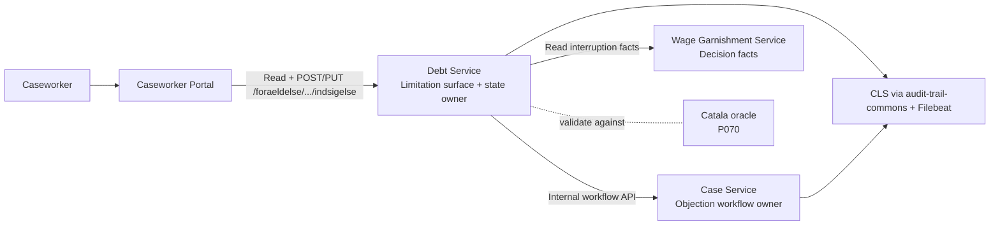
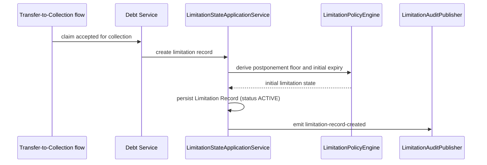
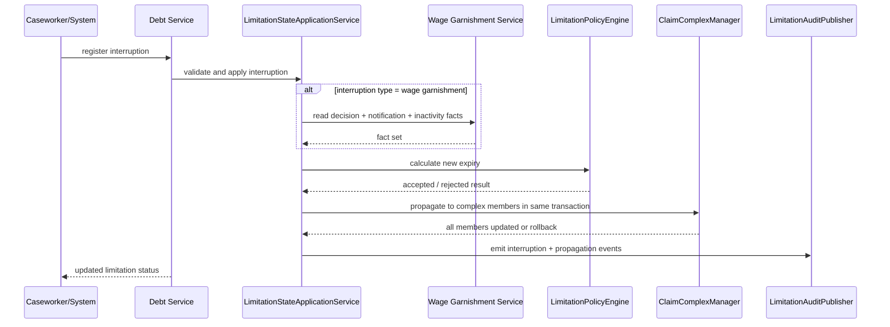
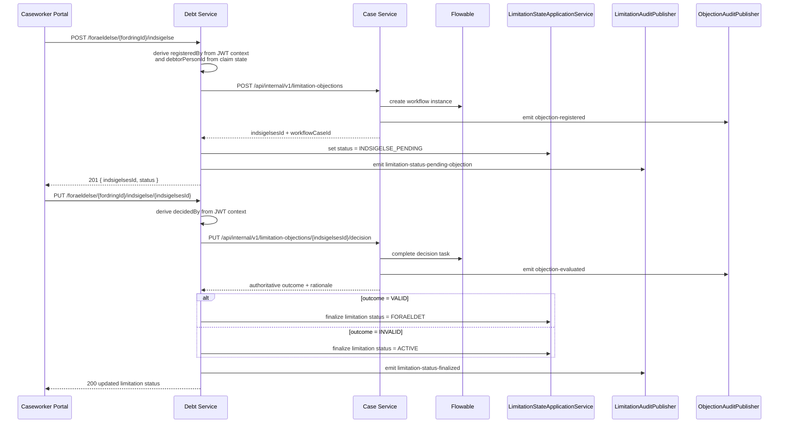
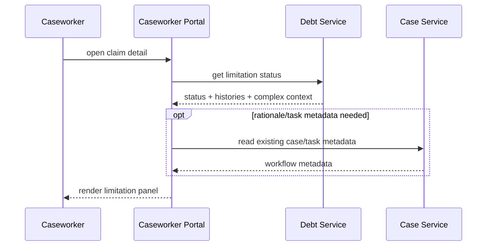

# Solution Architecture — P059: Forældelse (G.A.2.4 Prescription Rules)

**Document ID:** SA-P059  
**Petition:** `petitions/petition059-foraeldelse.md`  
**Outcome contract:** `petitions/petition059-foraeldelse-outcome-contract.md`  
**Feature file:** `petitions/petition059-foraeldelse.feature`  
**Ownership map:** `petitions/petition059_map.yaml`  
**Ownership review:** `petitions/reviews/petition059-component-mapping-reviewer.yaml` — **APPROVED**  
**Status:** Remediated to close ESC-057  
**Legal basis:** G.A.2.4; GIL §§ 18, 18a; Forældelsesl. §§ 3, 5, 18–19; Gæld.bekendtg.; SKM2015.718.ØLR  
**G.A. snapshot:** v3.16 (2026-03-28)  
**Depends on:** P057, P058, P070  
**ADRs binding this document:** ADR-0002, ADR-0004, ADR-0005, ADR-0007, ADR-0010, ADR-0011, ADR-0014, ADR-0016, ADR-0019, ADR-0021, ADR-0022, ADR-0024, ADR-0026, ADR-0031, ADR-0032, ADR-0035  
**ADR created by this run:** `architecture/adr/0038-prescription-objection-workflow-boundary.md` (title updated to reflect the debt-service façade boundary)  

---

## 1. Architecture Overview

### 1.1 Problem Statement

Petition059 introduces a legally binding limitation capability for claims in recovery. The architecture must now satisfy **both** of these constraints at the same time:

1. the approved ownership map keeps objection workflow authority in `opendebt-case-service`, and
2. the petition/outcome contract still exposes objection registration and evaluation on the limitation surface at `POST`/`PUT /foraeldelse/{fordringId}/indsigelse...`.

The package therefore needs a contract-preserving façade that keeps the observable limitation API in debt-service while preventing workflow ownership from sliding back out of case-service. The same façade must enforce the outcome-contract guardrail that public objection commands never trust caller-supplied `registeredBy`, `decidedBy`, or `debtorPersonId`.

### 1.2 Ownership-Constrained Slice Model

Approved ownership is preserved exactly:

| Slice ID | Primary owner | Responsibilities | Not responsible for |
|---|---|---|---|
| S1 | `opendebt-debt-service` | Limitation state, expiry calculation, postponement, interruption registration, claim-complex propagation, supplementary periods, contract-preserving limitation surface, final claim-state mutation, limitation audit emission | Owning objection workflow records or human decision lifecycle |
| S2 | `opendebt-case-service` | Objection workflow registration/evaluation, Flowable lifecycle, decision capture, workflow audit emission, authoritative workflow outcome | Owning limitation arithmetic or limitation persistence |
| S3 | `opendebt-caseworker-portal` | Presentation of limitation state, objection controls, role-based visibility, optional read enrichment from existing case APIs | Owning limitation or workflow state |
| S4 | `opendebt-wage-garnishment-service` | Source of wage-garnishment decision and inactivity facts needed by limitation rules | Limitation calculation or persistence |
| S5 | shared audit infrastructure | `audit-trail-commons` envelope conventions and CLS shipping via ADR-0022 pipeline | Business ownership of limitation or objection state |

No ownership remap is introduced.

### 1.3 Architectural Stance

1. **Debt-service keeps the limitation surface.**  
   The observable FR-6 contract remains on debt-service so the petition/outcome package stays true.

2. **Case-service keeps workflow ownership.**  
   Debt-service delegates objection registration and evaluation to a case-service internal workflow API. Case-service remains the owner of objection records, Flowable process state, and decision lifecycle.

3. **Debt-service applies claim-state mutation through an application seam, not controller re-entry.**  
   External limitation endpoints delegate to `LimitationObjectionFacade`, which in turn uses `LimitationStateApplicationService`. Internal callers such as P058 modregning also target that application seam directly.

4. **Portal commands go to the limitation surface.**  
   The portal reads limitation state from debt-service and submits FR-6 commands to debt-service, not directly to case-service. Existing case APIs may still be used for read-only workflow metadata where needed.

5. **API-first is closed now, not deferred.**  
   New OpenAPI 3.1 artefacts are defined for the debt-service limitation surface, the case-service internal workflow contract, and the wage-garnishment internal fact contract.

### 1.4 High-Level Collaboration Diagram



---

## 2. Slice Definitions

### 2.1 S1 — Debt Service: Limitation State + Contract Façade

**Purpose**  
Own the authoritative limitation aggregate and preserve the external limitation contract required by the petition package.

**Responsibilities**

- Create a limitation record when a claim enters recovery.
- Persist postponement date, legal-basis classifier, current expiry, status, histories, and claim-complex membership.
- Register interruption events for berostillelse, wage garnishment decision, attachment, and set-off.
- Apply claim-complex propagation atomically.
- Apply supplementary periods.
- Expose the limitation read model used by portal and workflow consumers.
- Expose `POST /foraeldelse/{fordringId}/indsigelse` and `PUT /foraeldelse/{fordringId}/indsigelse/{indsigelsesId}` on the limitation surface.
- Delegate objection workflow creation/evaluation to case-service.
- Apply resulting `INDSIGELSE_PENDING`, `FORAELDET`, or `ACTIVE` transitions through a dedicated application service.
- Emit limitation audit events to the shared audit pipeline.

**Internal sub-capabilities**

| Sub-capability | Responsibility |
|---|---|
| `LimitationApi` | External limitation surface for reads and petition-aligned objection commands |
| `LimitationObjectionFacade` | Contract-preserving application façade for FR-6 |
| `LimitationStateApplicationService` | Limitation reads, mutation orchestration, and clean domain/application seam |
| `LimitationPolicyEngine` | Deterministic limitation date arithmetic and legal branch evaluation |
| `ClaimComplexManager` | Membership maintenance and same-transaction propagation |
| `LimitationObjectionWorkflowClient` | Internal REST client to case-service workflow API |
| `WageGarnishmentFactClient` | Internal REST client to wage-garnishment-service fact API |
| `LimitationAuditPublisher` | CLS-ready audit emission via `audit-trail-commons` conventions |

**Boundary**

- Owns limitation persistence and claim-state mutation.
- Does **not** own objection workflow persistence or Flowable process state.
- Does **not** re-enter controllers internally; all internal callers target application services.
- Does **not** access another service database.

### 2.2 S2 — Case Service: Limitation Objection Workflow

**Purpose**  
Own the objection workflow lifecycle without owning the limitation aggregate.

**Responsibilities**

- Accept internal workflow registration/evaluation commands from debt-service.
- Create and track the objection workflow instance.
- Capture decision outcome and rationale.
- Return authoritative workflow results to debt-service so debt-service can mutate the claim state it owns.
- Emit workflow audit events to the shared audit pipeline.

**Internal sub-capabilities**

| Sub-capability | Responsibility |
|---|---|
| `LimitationObjectionWorkflowInternalApi` | Internal REST contract consumed by debt-service |
| `LimitationObjectionWorkflow` | Flowable-managed workflow state and human task lifecycle |
| `ObjectionAuditPublisher` | CLS-ready audit emission via `audit-trail-commons` conventions |

**Boundary**

- Owns workflow and decision lifecycle.
- Does **not** calculate limitation dates.
- Does **not** persist authoritative limitation history.
- Does **not** replace the external limitation surface.

### 2.3 S3 — Caseworker Portal: Limitation Presentation

**Purpose**  
Provide a single caseworker experience for limitation visibility and objection actions.

**Responsibilities**

- Render limitation status, expiry, postponement, histories, and claim-complex membership.
- Submit FR-6 objection registration/evaluation to debt-service limitation endpoints.
- Reuse existing case-service read APIs when the panel needs task metadata or rationale detail not present in the limitation read model.
- Enforce role-based visibility and accessibility rules.

### 2.4 S4 — Wage Garnishment Fact Supply

**Purpose**  
Provide the minimal fact set required to decide whether wage garnishment interrupts limitation periods.

**Responsibilities**

- Expose whether a formal decision exists.
- Expose debtor notification date.
- Expose which claims are covered by the same decision.
- Expose inactivity start date for one-year reset handling.

---

## 3. Domain Alignment and Contract Set

### 3.1 Domain Alignment Decisions

| Petition term | Concept-model anchor | Architectural treatment |
|---|---|---|
| Forældelse | `foraeldelse` | First-class state owned by debt-service |
| Fordringskompleks | `fordringskompleks` | First-class structural aggregate for propagation scope |
| Indsigelse | `indsigelse` | Workflow object owned by case-service, surfaced externally through debt-service façade |
| Lønindeholdelse | `loenindeholdelse` | External fact source; not re-owned by debt-service |
| Udlæg | `udlaeg` | Legal event input handled in debt-service until P066 introduces process ownership |
| Underretning | `underretning` | Timestamp fact needed for wage-garnishment interruption |
| Retsgrundlag | related to `kravgrundlag` | Limitation-specific legal-basis classifier derived from claim basis |

### 3.2 Canonical Information Objects

#### 3.2.1 Limitation Record

| Field | Meaning | Notes |
|---|---|---|
| `fordringId` | Technical claim identifier on the public contract | UUID only |
| `debtorPersonId` | Technical debtor reference used internally for authoritative lookups | Derived from claim state; never accepted as public objection input |
| `retsgrundlag` | Ordinary vs special legal basis | Derived from claim basis |
| `udskydelseDato` | Statutory floor date | Immutable after creation; nullable when no postponement rule applies |
| `isInUdskydelse` | Indicates whether the current date is still before `udskydelseDato` | Publicly observable boolean |
| `currentFristExpires` | Current next expiry date | Recomputed on valid mutations |
| `status` | `ACTIVE`, `FORAELDET`, `INDSIGELSE_PENDING` | Authoritative limitation state |
| `afbrydelseHistory[]` | Ordered interruption events | Includes `sourceFordringId`, `targetFordringId`, and `propagationReason` for propagated events |
| `tillaegsfristHistory[]` | Ordered additional-period events | Includes legal reference and `newFristExpires` |

#### 3.2.2 Objection Workflow Record

| Field | Meaning |
|---|---|
| `indsigelsesId` | Workflow-stable technical identifier |
| `fordringId` | Claim under review |
| `workflowCaseId` | Case-service workflow identifier |
| `status` | `REGISTERED`, `UNDER_REVIEW`, `VALID`, `INVALID`, `CLOSED` |
| `rationale` | Decision reasoning entered by caseworker |
| `debtorPersonId` | Internal debtor reference | Derived by debt-service from authoritative claim state before workflow creation |
| `registeredBy` / `registeredAt` | Registration audit metadata | Derived from authenticated server-side context; never caller-supplied on the public API |
| `decidedBy` / `decidedAt` | Decision audit metadata | Derived from authenticated server-side context; never caller-supplied on the public API |

### 3.3 API Contracts and OpenAPI Artefacts

#### 3.3.1 Debt-Service Limitation Surface (external)

The petition-visible limitation surface remains in debt-service. The legal-facing resource path `/foraeldelse/{fordringId}/indsigelse` is preserved verbatim inside the debt-service API namespace, and the public payloads are constrained to petition-visible fields only. Audit identity and debtor linkage are derived server-side.

| Endpoint | Consumer | Purpose | OpenAPI artefact |
|---|---|---|---|
| `GET /api/v1/foraeldelse/{fordringId}` | caseworker-portal | Read limitation panel state | `api-specs/openapi-debt-service-limitation.yaml` |
| `POST /api/v1/foraeldelse/{fordringId}/afbrydelse` | operational callers | Register valid interruption and recalculate expiry | `api-specs/openapi-debt-service-limitation.yaml` |
| `POST /api/v1/foraeldelse/{fordringId}/tillaegsfrist` | operational callers | Apply supplementary period | `api-specs/openapi-debt-service-limitation.yaml` |
| `POST /api/v1/fordringskompleks` | operational callers | Create claim-complex propagation scope with initial members | `api-specs/openapi-debt-service-limitation.yaml` |
| `POST /api/v1/fordringskompleks/{kompleksId}/members/{fordringId}` | operational callers | Add one member to an existing claim complex | `api-specs/openapi-debt-service-limitation.yaml` |
| `GET /api/v1/fordringskompleks/{kompleksId}/members` | operational callers | Read the current member list for an existing claim complex | `api-specs/openapi-debt-service-limitation.yaml` |
| `POST /api/v1/foraeldelse/{fordringId}/indsigelse` | caseworker-portal | Register objection while keeping the command on the limitation surface | `api-specs/openapi-debt-service-limitation.yaml` |
| `PUT /api/v1/foraeldelse/{fordringId}/indsigelse/{indsigelsesId}` | caseworker-portal | Evaluate objection while keeping the command on the limitation surface | `api-specs/openapi-debt-service-limitation.yaml` |

#### 3.3.2 Case-Service Limitation Workflow API (internal)

This is the new inter-service API that keeps workflow ownership in case-service.

| Endpoint | Consumer | Purpose | OpenAPI artefact |
|---|---|---|---|
| `POST /api/internal/v1/limitation-objections` | debt-service | Create workflow record and Flowable instance for a limitation objection | `api-specs/openapi-case-service-limitation-internal.yaml` |
| `PUT /api/internal/v1/limitation-objections/{indsigelsesId}/decision` | debt-service | Record authoritative workflow decision and return outcome metadata | `api-specs/openapi-case-service-limitation-internal.yaml` |

#### 3.3.3 Wage-Garnishment Fact API (internal)

This is the new inter-service read contract used by limitation arithmetic.

| Endpoint | Consumer | Purpose | OpenAPI artefact |
|---|---|---|---|
| `GET /api/internal/v1/limitation-facts/debtors/{debtorPersonId}` | debt-service | Resolve decision flag, notification date, covered fordringer, and inactivity start date | `api-specs/openapi-wage-garnishment-service-internal.yaml` |

#### 3.3.4 Existing case read APIs

No new caseworker-portal-to-case-service API is introduced by petition059. If the portal needs task metadata or rationale detail beyond the limitation read model, it reuses existing case/task query APIs already covered by `api-specs/openapi-case-service.yaml`.

---

## 4. Runtime Flows

### 4.1 Flow A — Claim Acceptance Creates Limitation State



### 4.2 Flow B — Interruption Registration and Claim-Complex Propagation



### 4.3 Flow C — FR-6 Objection Workflow with Debt-Service Façade



**Architectural rule**  
The external FR-6 command surface stays in debt-service, but workflow ownership remains in case-service. Debt-service never calls back into its own controller layer.

### 4.4 Flow D — Portal Read Model



---

## 5. Cross-Cutting Concerns

### 5.1 Security and Authorisation

- All HTTP interfaces are protected by OAuth2/OIDC via Keycloak (ADR-0005, policy ARCH-011).
- The case-service internal workflow API and wage-garnishment internal fact API require service-to-service tokens.
- Method-level authorisation remains mandatory on debt-service limitation writes and case-service workflow writes.
- Public objection commands reject caller-supplied `registeredBy`, `decidedBy`, and `debtorPersonId` as invalid input; only petition-visible fields are accepted on the external limitation surface.
- Debt-service derives `registeredBy` / `decidedBy` from authenticated server-side context and derives `debtorPersonId` from authoritative claim state before invoking case-service.

### 5.2 GDPR and PII Isolation

- Limitation records, histories, complex membership, and objection workflow state carry only technical UUID references.
- No CPR, CVR, name, address, email, phone, or free-text debtor identifiers are stored in this slice.
- Audit payloads sent toward CLS use technical claim/debtor identifiers only.

### 5.3 Audit and CLS Shipping

- Debt-service emits audit events for limitation record creation, interruptions, propagation, supplementary periods, and objection-driven state transitions.
- Case-service emits audit events for objection registration and evaluation.
- `audit-trail-commons` remains a shared library and is **not** a new deployable container.
- CLS shipping follows ADR-0022: service-local audit data is shaped with shared audit conventions and shipped through the CLS/Filebeat pipeline.

### 5.4 Resilience

- `debt-service -> case-service` uses synchronous REST with timeout and circuit breaker. Automatic retry of non-idempotent evaluation commands is controlled at the façade/workflow step level, not blind client retry.
- `debt-service -> wage-garnishment-service` uses circuit breaker, timeout, and retry only for idempotent fact reads.
- No message broker is introduced; ADR-0019 remains binding.

### 5.5 Performance

- `GET /api/v1/foraeldelse/{fordringId}` remains latency-sensitive and targets petition `p99 < 200 ms`.
- FR-6 command latency is bounded by one synchronous case-service call plus local state mutation.
- History reads must be indexed by `fordringId` and ordered deterministically.

### 5.6 Accessibility

- The limitation panel and objection controls remain subject to ADR-0021.
- Keyboard-only access, visible focus, semantic tables, labelled controls, and accessible error handling are mandatory.

### 5.7 Formal Compliance

- P070 Catala remains the oracle for postponement floors, legal-basis branches, wage-garnishment decision rules, claim-complex propagation, and supplementary-period arithmetic.
- The petition059 requirement package now covers the two P070-raised cases:
  1. GIL § 18a stk. 7 provisional interruption for empty claim-complex,
  2. PSRM/DMI boundary-date tests around postponement thresholds.

---

## 6. Dependency Map and Traceability

### 6.1 Dependency Map

| Source | Target | Contract | Purpose | Notes |
|---|---|---|---|---|
| caseworker-portal | debt-service | HTTPS/REST | Read limitation panel and submit FR-6 commands | Contract-preserving limitation surface |
| caseworker-portal | case-service | HTTPS/REST | Optional read enrichment only | Reuses existing case APIs; no new petition059 contract |
| debt-service | case-service | HTTPS/REST | Register/evaluate objection workflow | `api-specs/openapi-case-service-limitation-internal.yaml` |
| debt-service | wage-garnishment-service | HTTPS/REST | Resolve decision and inactivity facts | `api-specs/openapi-wage-garnishment-service-internal.yaml` |
| debt-service | CLS | structured audit pipeline | Compliance logging | Via `audit-trail-commons` + ADR-0022 shipping path |
| case-service | CLS | structured audit pipeline | Workflow compliance logging | Via `audit-trail-commons` + ADR-0022 shipping path |
| debt-service | Catala oracle artefacts | specification-time validation | Cross-check legal rule coverage | Not a runtime dependency |

### 6.2 Traceability Matrix

| Requirement | Primary slice(s) | Supporting slice(s) | Key contract / mechanism |
|---|---|---|---|
| FR-1 Forældelsesfrist tracking | S1 | S3 | Limitation record + status query |
| FR-2 Udskydelse | S1 | — | Immutable postponement calculation at creation |
| FR-3 Afbrydelse registration | S1 | S4, S5 | Interruption registration + fact lookup + audit |
| FR-4 Claim-complex propagation | S1 | S5 | Same-transaction propagation |
| FR-5 Tillægsfrister | S1 | S5 | Supplementary-period command |
| FR-6 Objection workflow | S2 | S1, S5 | Debt-service façade + case-service internal workflow API |
| FR-7 Caseworker portal visibility | S3 | S1, S2 | Portal reads limitation surface and optional case metadata |
| NFR-1 Deterministic date arithmetic | S1 | P070 oracle | Single policy engine, deterministic ordering |
| NFR-2 Full audit trail | S1, S2 | S5 | Structured state-change events to CLS pipeline |
| NFR-3 No PII outside UUID | S1, S2, S3 | — | UUID-only contracts and storage |
| NFR-4 Transactional consistency | S1 | — | Single transaction for limitation mutation and propagation |
| NFR-5 Performance | S1, S3 | — | Indexed read path and bounded synchronous calls |

---

## 7. Rationale, Assumptions, and Review Closure

### 7.1 Key Decisions

| Decision | Rationale |
|---|---|
| Debt-service keeps the external limitation/objection surface | Required to stay aligned with the petition/outcome contract |
| Case-service keeps objection workflow ownership | Required by the approved ownership review |
| Debt-service delegates FR-6 workflow to case-service | Preserves ownership without changing the external contract |
| `LimitationStateApplicationService` replaces controller re-entry | Clean application/domain seam for FR-6 and P058 interruption hooks |
| New OpenAPI artefacts are created now | Closes ADR-0004 / ARCH-010 gap before implementation |
| Deployment views are added to `architecture/workspace.dsl` now | Closes ARCH-005 instead of deferring it |

### 7.2 Assumptions

1. The legal-facing petition path `/foraeldelse/{fordringId}/indsigelse` is preserved within the standard debt-service API namespace.
2. Existing case-service read APIs remain sufficient for any optional portal metadata enrichment.
3. `audit-trail-commons` remains a shared library and does not alter deployable ownership.

### 7.3 Blocking Finding Closure

| Review finding | Closure in this package |
|---|---|
| 001 — External limitation contract drift | The public spec and narrative now use the exact petition/outcome field set: `fordringId`, `currentFristExpires`, `udskydelseDato`, `isInUdskydelse`, `retsgrundlag`, `afbrydelseHistory`, `tillaegsfristHistory`, plus propagation metadata `sourceFordringId` and `targetFordringId` |
| 002 — FR-4 membership management missing | The public surface now defines all petition-required ownership-neutral membership operations: `POST /api/v1/fordringskompleks`, `POST /api/v1/fordringskompleks/{kompleksId}/members/{fordringId}`, and `GET /api/v1/fordringskompleks/{kompleksId}/members` |
| 003 — FR-6 security and audit model unenforceable | Public objection commands now accept only petition-visible fields; debt-service derives `registeredBy` / `decidedBy` from OAuth2 context and `debtorPersonId` from authoritative claim state before delegating to case-service |
| 004 — DSL / ARCH-005 regression risk | DSL block and `architecture/workspace.dsl` still model debt-service → case-service workflow delegation, CLS relations, and a real production deployment environment |

---

## Structurizr DSL Block

The following block matches the remediated narrative and the updated `architecture/workspace.dsl`.

```structurizr
cls = softwareSystem "CLS" "UFST Common Logging System receiving shared audit events and database-shipped audit records." "internal" {
    tags "internal"
}

caseworkerPortal = container "Caseworker Portal" "Web UI for UFST caseworkers. Presents claim detail, limitation status, objection controls, and related debt actions while staying a composition layer over backend services." "Java 21 / Spring Boot 3.3, Thymeleaf" "Web Application" {
    properties {
        "domain.concepts" "foraeldelse, indsigelse, fordringskompleks, fordring"
    }

    limitationPanelController = component "LimitationPanelController" "BFF/controller for the petition059 limitation panel." "Spring MVC / BFF" "Component"
    limitationPanelView = component "LimitationPanelView" "Rendered view for limitation status, histories, and objection controls." "Thymeleaf view" "Component"
    limitationPortalClient = component "LimitationPortalClient" "Outbound client for debt-service limitation APIs." "HTTP client" "Component"
}

caseService = container "Case Service" "Central orchestration service. For petition059 it owns the limitation-objection workflow lifecycle behind an internal API consumed by debt-service." "Java 21 / Spring Boot 3.3, PostgreSQL" "Service" {
    properties {
        "domain.concepts" "indsigelse, foraeldelse, fordring"
    }

    limitationObjectionWorkflowInternalApi = component "LimitationObjectionWorkflowInternalApi" "Internal workflow API for limitation objections." "REST API" "Component"
    limitationObjectionWorkflow = component "LimitationObjectionWorkflow" "Flowable-managed objection workflow." "Flowable BPM / orchestration" "Component"
    objectionAuditPublisher = component "ObjectionAuditPublisher" "Publishes workflow audit events through the shared audit pipeline." "Audit publisher" "Component"
}

debtService = container "Debt Service" "Fordring management. For petition059 it additionally owns the authoritative limitation state and the external limitation surface required by the petition/outcome contract." "Java 21 / Spring Boot 3.3, PostgreSQL" "Service" {
    properties {
        "domain.concepts" "fordring, foraeldelse, fordringskompleks, modregning"
    }

    limitationApi = component "LimitationApi" "External limitation surface, including POST/PUT /foraeldelse/{fordringId}/indsigelse..." "REST API" "Component"
    limitationObjectionFacade = component "LimitationObjectionFacade" "Contract-preserving application façade for FR-6 objection commands." "Application service" "Component"
    limitationStateApplicationService = component "LimitationStateApplicationService" "Application seam for limitation reads, mutations, and interruption orchestration." "Application service" "Component"
    limitationPolicyEngine = component "LimitationPolicyEngine" "Deterministic limitation arithmetic and legal branch evaluation." "Domain service" "Component"
    claimComplexManager = component "ClaimComplexManager" "Claim-complex propagation manager." "Domain service" "Component"
    limitationObjectionWorkflowClient = component "LimitationObjectionWorkflowClient" "Internal client to case-service workflow API." "HTTP client" "Component"
    wageGarnishmentFactClient = component "WageGarnishmentFactClient" "Internal client to wage-garnishment limitation fact API." "HTTP client" "Component"
    limitationAuditPublisher = component "LimitationAuditPublisher" "Publishes limitation audit events through the shared audit pipeline." "Audit publisher" "Component"
}

wageGarnishmentService = container "Wage Garnishment Service" "Lønindeholdelse processing. Petition059 uses it as the source of decision, notification, covered-claim, and inactivity facts needed by limitation rules." "Java 21 / Spring Boot 3.3, PostgreSQL" "Service" {
    properties {
        "domain.concepts" "loenindeholdelse, underretning"
    }

    limitationFactApi = component "LimitationFactApi" "Fact-oriented internal API for petition059." "REST API" "Component"
}

caseworkerPortal -> debtService "Reads limitation status and submits FR-6 commands via" "HTTPS/REST"
caseworkerPortal -> caseService "Reads existing case/task metadata via" "HTTPS/REST"
debtService -> caseService "Delegates limitation objection workflow registration/evaluation via" "HTTPS/REST"
debtService -> wageGarnishmentService "Reads wage-garnishment decision and inactivity facts for limitation rules" "HTTPS/REST"
debtService -> cls "Ships limitation audit events via audit-trail-commons / ADR-0022 pipeline" "Structured audit pipeline"
caseService -> cls "Ships workflow audit events via audit-trail-commons / ADR-0022 pipeline" "Structured audit pipeline"

limitationPanelController -> limitationPortalClient "Uses for limitation reads and FR-6 actions" "Java method call"
limitationPanelController -> limitationPanelView "Renders limitation panel" "Java method call"
limitationPortalClient -> limitationApi "Calls debt-service limitation surface" "HTTPS/REST"
limitationApi -> limitationObjectionFacade "Delegates petition-aligned objection commands to" "Java method call"
limitationApi -> limitationStateApplicationService "Delegates limitation reads and direct mutations to" "Java method call"
limitationObjectionFacade -> limitationObjectionWorkflowClient "Delegates workflow lifecycle to" "Java method call"
limitationObjectionFacade -> limitationStateApplicationService "Applies resulting limitation-state transitions through" "Java method call"
limitationObjectionFacade -> limitationAuditPublisher "Emits limitation audit events through" "Java method call"
limitationStateApplicationService -> limitationPolicyEngine "Delegates date arithmetic and rule evaluation to" "Java method call"
limitationStateApplicationService -> claimComplexManager "Uses for claim-complex propagation" "Java method call"
limitationStateApplicationService -> wageGarnishmentFactClient "Resolves wage-garnishment interruption facts through" "Java method call"
limitationStateApplicationService -> limitationAuditPublisher "Emits state-change audit events through" "Java method call"
claimComplexManager -> limitationPolicyEngine "Reuses deterministic limitation arithmetic from" "Java method call"
limitationObjectionWorkflowClient -> limitationObjectionWorkflowInternalApi "Calls internal workflow contract on" "HTTPS/REST"
limitationObjectionWorkflowInternalApi -> limitationObjectionWorkflow "Delegates workflow commands to" "Java method call"
limitationObjectionWorkflow -> objectionAuditPublisher "Emits workflow audit events through" "Java method call"
wageGarnishmentFactClient -> limitationFactApi "Calls to obtain decision and inactivity facts" "HTTPS/REST"
modregningService -> limitationStateApplicationService "Registers set-off as a legally effective limitation interruption on" "Java method call"

// Add to model section in architecture/workspace.dsl

deploymentEnvironment "Production" {
    deploymentNode "UFST Horizontale Driftsplatform" "Azure AKS landing zone for OpenDebt" "Azure platform" {
        deploymentNode "AKS Cluster" "OpenDebt workloads" "Kubernetes 1.29" {
            deploymentNode "opendebt namespace" "Application namespace" "Kubernetes namespace" {
                containerInstance caseworkerPortal
                containerInstance citizenPortal
                containerInstance creditorPortal
                containerInstance caseService
                containerInstance creditorService
                containerInstance debtService
                containerInstance letterService
                containerInstance paymentService
                containerInstance wageGarnishmentService
                containerInstance rulesEngine
                containerInstance integrationGateway
                containerInstance personRegistry
            }
        }
    }
}
```
