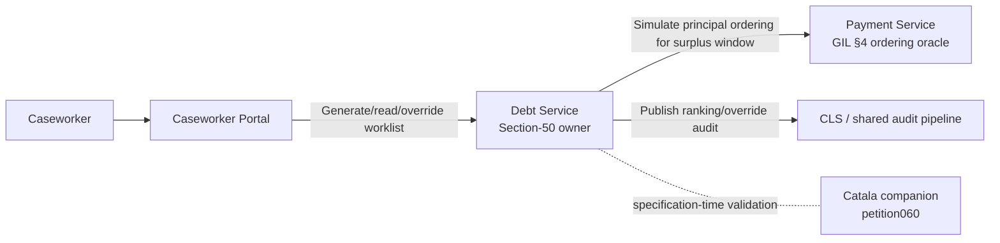
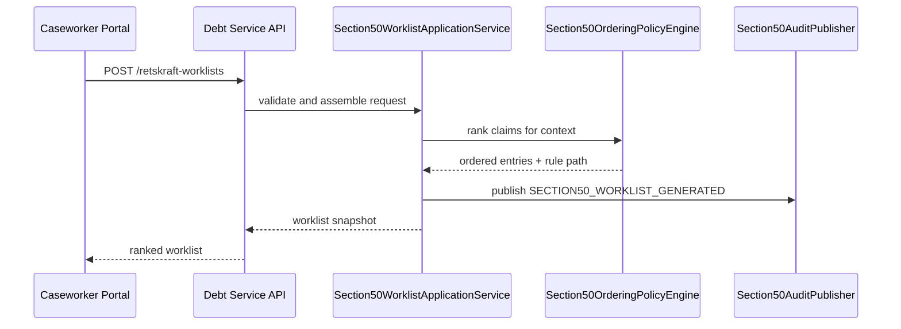
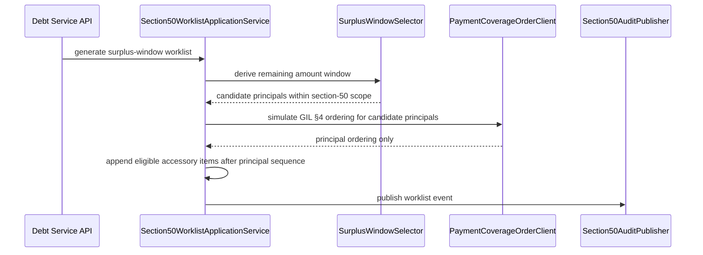
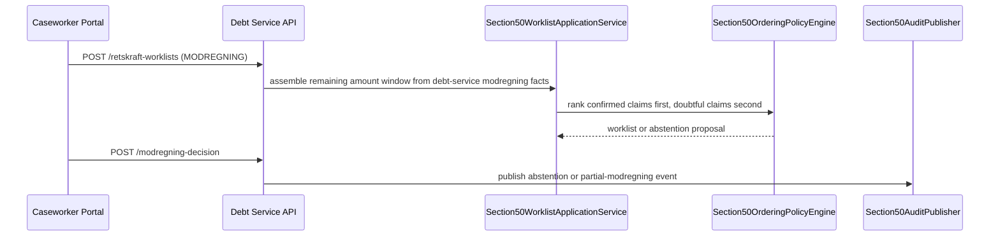

# Solution Architecture — P060: Retskraftvurdering (Section 50 Priority Ordering)

**Document ID:** SA-P060  
**Petition:** `petitions/petition060-retskraftvurdering.md`  
**Outcome contract:** `petitions/petition060-retskraftvurdering-outcome-contract.md`  
**Feature file:** `petitions/petition060-retskraftvurdering.feature`  
**Ownership map:** `petitions/petition060_map.yaml`  
**Ownership review:** `petitions/reviews/petition060-component-mapping-reviewer.yaml` — **APPROVED**  
**Status:** Ready for architecture review  
**Legal basis:** G.A.2.5; gaeldsinddrivelsesbekendtgoerelsens section 50; GIL sections 4, 7, 16, 18c  
**G.A. snapshot:** v3.16 (2026-03-28)  
**Depends on:** P057, P058, Catala companion for petition060  
**ADRs binding this document:** ADR-0002, ADR-0004, ADR-0005, ADR-0007, ADR-0010, ADR-0011, ADR-0014, ADR-0018, ADR-0019, ADR-0022, ADR-0024, ADR-0026, ADR-0027, ADR-0031, ADR-0032, ADR-0035  
**ADR created by this run:** none  

---

## 1. Architecture Overview

### 1.1 Problem Statement

Petition060 introduces a legally constrained ordering capability for *retskraftvurdering* under
section 50. The architecture must support four distinct but connected contexts without mixing
them into the wrong owner:

1. default section-50 ordering for doubtful claims,
2. discretionary ranking when suspected data error is present,
3. surplus-driven selection after voluntary payment, and
4. modregning-driven selection and abstention decisions.

The architecture must therefore create a deterministic, auditable section-50 worklist inside
`opendebt-debt-service`, while consulting `opendebt-payment-service` only for the legally
permitted GIL section-4 ordering reused by FR-05/FR-06 and reusing existing debt-service
modregning ownership from ADR-0027 and petition058.

### 1.2 Missing Grounding

`domain/concept-model.yaml` is absent in this repository, so terminology grounding is taken from
the petition, outcome contract, G.A.2.5, and the existing OpenDebt English mapping rules.
No escalation is required because the petition itself is specific enough for architectural
allocation.

### 1.3 Ownership-Constrained Slice Model

Approved ownership is preserved exactly.

| Slice ID | Primary owner | Responsibilities | Not responsible for |
|---|---|---|---|
| S1 | `opendebt-debt-service` | Section-50 worklist generation, override and discretionary ranking, accessory gating, surplus-window selection orchestration, modregning abstention decision recording, immutable decision snapshot | Owning GIL section-4 ordering logic, owning UI rendering |
| S2 | `opendebt-payment-service` | Read-only ordering oracle for principal claims when FR-05/FR-06 legally reuse petition057 coverage-order rules | Owning the section-50 worklist, storing section-50 override decisions |
| S3 | `opendebt-caseworker-portal` | Caseworker read and action surface for worklists, override submission, modregning abstention visibility | Owning ranking logic or audit truth |
| S4 | `audit-trail-commons` + CLS pipeline | Structured audit publication for ranking generation, override, discretionary mode, expedited deviation, and abstention outcomes | Owning business decisions |
| S5 | Catala companion (`catala/ga_2_5_retskraftvurdering.catala_da`) | Specification-time oracle for legal ordering and exception branches | Runtime worklist execution |

### 1.4 Architectural Stance

1. **Debt-service owns section-50.**  
   All ranking and selection decisions remain in debt-service because petition060 is about
   legal claim-evaluation ordering, not payment execution.

2. **Payment-service is consulted, not promoted.**  
   Debt-service calls payment-service only when section 50 explicitly allows reuse of
   petition057 coverage order for principal claims inside a surplus window.

3. **Modregning remains inside debt-service.**  
   Petition060 reuses petition058 ownership rather than creating a separate orchestration
   boundary for section-50 selection in modregning contexts.

4. **The portal remains a composition layer.**  
   Caseworker interactions go through debt-service APIs; the portal does not compute or
   persist ranking state.

5. **Ordering decisions are auditable but not ledger events.**  
   Generating a worklist or recording an override does not trigger ADR-0018 postings. Ledger
   activity begins only if later payment or set-off execution occurs.

6. **Catala is mandatory but off the runtime path.**  
   ADR-0032 applies as a pipeline oracle validating section-50 branches and tests, not as a
   production dependency.

### 1.5 High-Level Collaboration Diagram



---

## 2. Slice Definitions

### 2.1 S1 — Debt Service: Section-50 Worklist and Decision Ownership

**Purpose**  
Own the authoritative section-50 worklist, its inputs, deterministic ordering logic, and the
decision snapshot that explains why each claim or accessory amount was selected.

**Responsibilities**

- Generate the default ranking for fines, private maintenance claims, and other claims.
- Switch to discretionary ranking when suspected data error is present.
- Enforce the principal-before-accessory rule and exclude disproportionate accessory items.
- Calculate remaining amount windows for voluntary-payment surplus and modregning contexts.
- Consult payment-service for principal ordering only where section 50 allows reuse of GIL
  section-4 ordering.
- Record overrides, expedited deviations, and partial/no-modregning decisions with legal basis
  and rationale.
- Expose the caseworker/internal-consumer read model.
- Emit structured audit events for all ranking-producing and deviation-producing actions.

**Internal sub-capabilities**

| Sub-capability | Responsibility |
|---|---|
| `Section50WorklistApi` | External REST surface for generating, reading, overriding, and annotating section-50 worklists |
| `Section50WorklistApplicationService` | Application seam for request validation, orchestration, persistence, and result assembly |
| `Section50OrderingPolicyEngine` | Deterministic legal ordering engine for default, discretionary, expedited, and modregning ranking paths |
| `AccessoryEligibilityEvaluator` | Decides whether accessory amounts are suppressed, deferred, or eligible after principal confirmation |
| `SurplusWindowSelector` | Applies remaining-amount windows for voluntary-payment and modregning contexts |
| `PaymentCoverageOrderClient` | Read-only client to payment-service for petition057 ordering reuse |
| `Section50AuditPublisher` | Emits audit-trail-commons events for generated rankings and deviations |

**Boundary**

- Owns section-50 state and traceability.
- Reuses existing debt-service claim and modregning facts.
- Does **not** perform payment allocation or financial posting.
- Does **not** access any other service database directly.

### 2.2 S2 — Payment Service: Principal Ordering Oracle for Surplus Cases

**Purpose**  
Provide the existing petition057 ordering logic as a read-only collaborator for FR-05 and FR-06.

**Responsibilities**

- Accept a candidate principal-claim set for simulation.
- Return principal ordering consistent with petition057 rules.
- Remain side-effect free in petition060 calls.

**Boundary**

- Owns GIL section-4 ordering logic only.
- Does **not** store or return section-50 override reasons.
- Does **not** decide which doubtful claims enter the candidate set; debt-service does that.

### 2.3 S3 — Caseworker Portal: Section-50 Inspection and Action Surface

**Purpose**  
Give caseworkers a read/write surface for section-50 worklists without moving business
ownership out of debt-service.

**Responsibilities**

- Render ranked worklists and decision explanations.
- Submit override and expedited-deviation commands with caseworker rationale.
- Display partial/no-modregning decisions and audit metadata.
- Enforce role-based visibility and accessibility constraints from ADR-0021.

### 2.4 S4 — Shared Audit Pattern

**Purpose**  
Make ranking decisions reconstructable after the fact without storing PII outside Person
Registry.

**Responsibilities**

- Publish audit events carrying worklist ID, rule path, legal reference, actor/system origin,
  affected claim IDs, selected next item, and deviation reason where relevant.
- Ship events to CLS through the shared audit pipeline described in ADR-0022.

### 2.5 S5 — Catala Oracle Companion

**Purpose**  
Provide specification-time validation for section-50 ordering branches and exception paths.

**Responsibilities**

- Encode section-50 default order, override branch constraints, data-error discretion branch,
  principal-before-accessory rule, voluntary-payment surplus rules, and modregning window rules.
- Generate Catala tests aligned to the petition and feature file.
- Remain outside production runtime and data flow.

---

## 3. Canonical Information Objects

### 3.1 Section-50 Worklist Header

| Field | Meaning | Notes |
|---|---|---|
| `worklistId` | Stable technical identifier for one generated ranking snapshot | UUID |
| `debtorPersonId` | Technical debtor reference | UUID only; no PII |
| `contextType` | `DEFAULT`, `DATA_ERROR`, `VOLUNTARY_PAYMENT_SURPLUS`, `MODREGNING` | Determines legal branch |
| `orderingMode` | `DEFAULT_SECTION_50`, `OVERRIDE`, `DATA_ERROR_DISCRETIONARY`, `EXPEDITED_SURPLUS`, `MODREGNING_WINDOWED`, `MODREGNING_ABSTAINED` | Publicly visible mode label |
| `generatedAt` | Timestamp when the ranking was produced | Audit-visible |
| `generatedBy` | Actor or system origin | Derived from security context or system identity |
| `legalReference` | Governing legal path | E.g. section 50 default, subsection 4 surplus, subsection 5 modregning |
| `amountWindow` | Remaining amount available for doubtful-item selection | Nullable outside surplus/modregning contexts |
| `overrideReason` | Caseworker rationale for override or expedited deviation | Nullable |
| `overrideLegalBasis` | Legal basis for deviation | Nullable |

### 3.2 Section-50 Worklist Entry

| Field | Meaning | Notes |
|---|---|---|
| `entryId` | Stable technical identifier for one ranked item | UUID |
| `rank` | Position in the worklist | 1-based |
| `claimId` | Technical claim identifier | UUID/string contract, no PII |
| `itemType` | `PRINCIPAL` or `ACCESSORY` | Accessory never outranks an unconfirmed principal |
| `claimCategory` | `FINE`, `PRIVATE_MAINTENANCE`, `OTHER` | Statutory category |
| `suspectedDataError` | Indicates data-error branch relevance | Boolean |
| `confirmedRetskraft` | Indicates already-confirmed claim status | Boolean |
| `withinAmountWindow` | Whether the item is inside the current remaining amount window | Boolean |
| `selectionReason` | Human-readable explanation for why the item is ranked here | Read model field |
| `prioritisationFactors[]` | Applied factors when discretionary ranking is used | Empty outside discretionary mode |
| `suppressedReason` | Why an item is excluded or deferred | Used for disproportionate accessory exclusion |

### 3.3 Section-50 Decision Snapshot

| Field | Meaning |
|---|---|
| `decisionId` | Technical identifier for one persisted decision snapshot |
| `worklistId` | Associated worklist |
| `rulePath` | Concrete branch used by the engine |
| `inputHash` | Hash of the evaluated input set for reproducibility |
| `selectedNextItemId` | Item selected as next for evaluation |
| `auditEventId` | Correlation ID for CLS event |
| `notes` | Optional caseworker/system note without PII |

---

## 4. Interface Contracts

### 4.1 Debt-Service Section-50 Surface

| Endpoint | Consumer | Purpose | Notes |
|---|---|---|---|
| `POST /api/v1/debtors/{debtorId}/retskraft-worklists` | caseworker-portal, internal callers | Generate a section-50 worklist for one context | Returns worklist header + ranked entries |
| `GET /api/v1/debtors/{debtorId}/retskraft-worklists/{worklistId}` | caseworker-portal, internal callers | Read an existing worklist and decision snapshot | Supports FR-09/FR-10 inspection |
| `POST /api/v1/debtors/{debtorId}/retskraft-worklists/{worklistId}/override` | caseworker-portal | Apply special-circumstances override or expedited deviation | Requires reason + legal basis |
| `POST /api/v1/debtors/{debtorId}/retskraft-worklists/{worklistId}/modregning-decision` | caseworker-portal, internal debt-service callers | Record partial/no-modregning outcome for the current payout context | Covers FR-08 visibility |

#### 4.1.1 Worklist generation request

```yaml
type: object
required:
  - contextType
properties:
  contextType:
    type: string
    enum: [DEFAULT, DATA_ERROR, VOLUNTARY_PAYMENT_SURPLUS, MODREGNING]
  confirmedAmountCovered:
    type: number
    format: decimal
  availableAmount:
    type: number
    format: decimal
  candidateClaimIds:
    type: array
    items: { type: string, format: uuid }
  suspectedDataErrorFactors:
    type: array
    items: { type: string }
  requestedBySystem:
    type: string
```

**Contract rules**

- `availableAmount` is required for `VOLUNTARY_PAYMENT_SURPLUS` and `MODREGNING`.
- Caller-supplied PII is forbidden.
- Actor identity is derived from OAuth2/server context, not trusted from payload fields.

#### 4.1.2 Override request

```yaml
type: object
required:
  - overrideReason
  - legalBasis
properties:
  overrideReason:
    type: string
  legalBasis:
    type: string
  expedited:
    type: boolean
  selectedClaimOrder:
    type: array
    items: { type: string, format: uuid }
```

### 4.2 Payment-Service Internal Simulation Contract

Debt-service uses the existing petition057 simulation semantics rather than re-implementing GIL
section-4 ordering.

| Endpoint | Consumer | Purpose |
|---|---|---|
| `POST /api/v1/debtors/{debtorId}/daekningsraekkefoelge/simulate` | debt-service | Return ordering of principal claims for the provided candidate set and amount window |

**Architectural rule:** accessory amounts are **not** delegated to payment-service. Debt-service
applies the principal-before-accessory rule before and after the simulation result.

**Reuse contract details**

- Debt-service sends the petition057 simulation request shape (`beloeb`, `inddrivelsesindsatsType`)
  plus `candidatePrincipalClaimIds` for the petition060 candidate window.
- Payment-service returns the normal `SimulatePositionDto` list; debt-service derives the ordered
  candidate principal claims from those positions and keeps accessory handling local.

### 4.3 Audit Event Envelope

```yaml
type: object
required:
  - eventType
  - worklistId
  - rulePath
  - legalReference
  - origin
  - occurredAt
properties:
  eventType:
    type: string
    enum:
      - SECTION50_WORKLIST_GENERATED
      - SECTION50_OVERRIDE_APPLIED
      - SECTION50_EXPEDITED_DEVIATION_APPLIED
      - SECTION50_MODREGNING_ABSTAINED
  worklistId:
    type: string
    format: uuid
  claimIds:
    type: array
    items: { type: string, format: uuid }
  selectedNextItemId:
    type: string
    format: uuid
  legalReference:
    type: string
  origin:
    type: string
  occurredAt:
    type: string
    format: date-time
  reason:
    type: string
```

---

## 5. Flow Definitions

### 5.1 Default or data-error ranking flow



### 5.2 Voluntary-payment surplus flow



### 5.3 Modregning flow



---

## 6. Compliance, Security, and Resilience Patterns

### 6.1 Compliance Patterns

| Constraint | Architectural treatment |
|---|---|
| ADR-0014 GDPR isolation | Only technical debtor/claim identifiers appear in worklists, snapshots, audit events, and APIs |
| ADR-0007 no cross-service DB access | debt-service reads payment-service ordering only through REST |
| ADR-0031 statutory codes as code | `claimCategory`, `contextType`, `orderingMode`, and any section-50 controlled classifications are enum-backed, not runtime configuration |
| ADR-0032 Catala | Catala companion validates legal branches before implementation continues |
| ADR-0022 shared audit | All ranking and deviation actions emit structured audit events to the shared pipeline |
| ADR-0018 bookkeeping | No ledger posting for ranking-only actions; only later financial execution triggers postings |

### 6.2 Security Model

- All HTTP interfaces are protected by OAuth2/OIDC via Keycloak (ADR-0005, policy ARCH-011).
- Debt-service section-50 endpoints require caseworker/admin roles and the same OAuth2/OIDC
  security baseline as other internal caseworker-facing APIs.
- Override and modregning-decision commands derive actor identity server-side.
- Audit payloads must not embed names, CPR numbers, CVR numbers, or free-text copied from
  Person Registry responses.

### 6.3 Resilience Model

The only inter-service dependency introduced by petition060 is the debt-service read-only call to
payment-service simulation.

| Call | Pattern | Rationale |
|---|---|---|
| debt-service -> payment-service simulate | ADR-0026 Pattern A: circuit breaker + retry + timeout | Read-only simulation; safe to retry |
| caseworker-portal -> debt-service reads | timeout + explicit error to UI | No silent fallback; caseworker must see unavailable ranking state |
| caseworker-portal -> debt-service override writes | circuit breaker + timeout, no automatic retry | State-changing action |

### 6.4 Persistence Stance

The section-50 worklist and decision snapshot are persisted in debt-service so that inspection is
stable and reproducible. Persistence uses the service-local PostgreSQL database per ADR-0011 and
inherits audit fields via ADR-0022 patterns.

---

## 7. Requirement-to-Slice Traceability Matrix

| Requirement | Slice allocation | Architectural treatment |
|---|---|---|
| FR-01 | S1 | `Section50OrderingPolicyEngine` default branch for fines -> private maintenance -> others |
| FR-02 | S1 + S4 | override command on `Section50WorklistApi` plus immutable audit publication |
| FR-03 | S1 + S4 | discretionary branch with factor capture in snapshot and audit |
| FR-04 | S1 | `AccessoryEligibilityEvaluator` suppresses or defers accessory items |
| FR-05 | S1 + S2 | debt-service computes candidate set/window; payment-service simulates principal ordering |
| FR-06 | S1 + S2 + S4 | expedited deviation recorded in debt-service, optionally after payment-service consultation, always audited |
| FR-07 | S1 | debt-service reuses modregning facts and ranks confirmed claims before doubtful claims |
| FR-08 | S1 + S3 + S4 | abstention/partial-modregning decision stored in debt-service, shown in portal, audited |
| FR-09 | S1 + S3 | debt-service read model exposed through caseworker portal |
| FR-10 | S1 + S4 | persisted decision snapshot plus CLS event linkage |
| NFR-01 | S1 | deterministic engine + input snapshot hash |
| NFR-02 | S4 | structured audit publication for all deviation-producing actions |
| NFR-03 | S1 + S3 + S4 | UUID-only references in APIs, persistence, and audit |

---

## 8. Rationale and Assumptions

### 8.1 Key Decisions

| Decision | Rationale |
|---|---|
| Keep section-50 logic in debt-service | Ownership review approved debt-service as authoritative owner of claim/legal state |
| Reuse payment-service only for simulation | Prevents illegal duplication of petition057 ordering logic while preserving section-50 ownership |
| Persist a worklist snapshot | FR-09/FR-10 require later inspection of rule path, selected next item, and origin |
| Do not route through case-service | Petition060 is a ranking/decision-snapshot problem, not a workflow-ownership problem like petition059 |
| Keep Catala out of runtime | ADR-0032 defines Catala as a specification-time oracle only |

### 8.2 Assumptions

- debt-service can already distinguish confirmed retskraft claims, doubtful claims, and
  suspected-data-error cases from its authoritative claim state.
- payment-service petition057 simulation contract can be consumed as a side-effect-free internal
  API.
- section-50 override and abstention decisions are operational decisions captured by debt-service,
  not separate case-service workflows.

### 8.3 Open Risks

| Risk | Why it matters | Mitigation |
|---|---|---|
| payment-service simulate contract lacks the exact candidate-set shape needed by petition060 | FR-05/FR-06 depend on reuse, not reimplementation | clarify in specification stage before implementation |
| discretionary factor vocabulary could drift into uncontrolled strings | weakens audit comparability | define enum-backed factor catalogue in specs |
| worklist snapshots could be mistaken for financial allocation state | creates ADR-0018 confusion | keep naming and API language explicit: evaluation worklist only |

---

## 9. Architecture Review Readiness

This package is review-ready because:

- every petition requirement is allocated to an explicit slice,
- approved ownership is preserved without silent remapping,
- the payment-service dependency is narrowly constrained to read-only simulation,
- audit, GDPR, and resilience rules are explicit, and
- the Catala companion is included as a mandatory non-runtime validation layer.

**Next handoff:** `solution-architecture-reviewer`

---

## Structurizr DSL Block

The following block is intended for the `model` section of `architecture/workspace.dsl`.

```structurizr
cls = softwareSystem "CLS" "UFST Common Logging System receiving shared audit events and database-shipped audit records." "internal" {
    tags "internal"
}

caseworkerPortal = container "Caseworker Portal" "Web UI for UFST caseworkers. For petition060 it renders section-50 retskraft worklists and submits override or abstention actions while remaining a composition layer." "Java 21 / Spring Boot 3.3, Thymeleaf" "Web Application" {
    section50WorklistController = component "Section50WorklistController" "BFF/controller for petition060 section-50 worklist generation, inspection, and override actions." "Spring MVC / BFF" "Component"
    section50WorklistView = component "Section50WorklistView" "Rendered view for ranked section-50 worklists, amount windows, and audit explanation." "Thymeleaf view" "Component"
    section50PortalClient = component "Section50PortalClient" "Outbound client for debt-service section-50 APIs." "HTTP client" "Component"
}

debtService = container "Debt Service" "Fordring management. For petition060 it additionally owns the authoritative section-50 worklist, override decisions, and modregning-related evaluation snapshots." "Java 21 / Spring Boot 3.3, PostgreSQL" "Service" {
    modregningService = component "ModregningService" "Existing petition058 service orchestrating modregning context facts and decisions inside debt-service." "Application service" "Component"
    section50WorklistApi = component "Section50WorklistApi" "External REST surface for generating, reading, overriding, and annotating section-50 worklists." "REST API" "Component"
    section50WorklistApplicationService = component "Section50WorklistApplicationService" "Application seam for request validation, context assembly, persistence, and result composition." "Application service" "Component"
    section50OrderingPolicyEngine = component "Section50OrderingPolicyEngine" "Deterministic section-50 legal ordering engine for default, discretionary, expedited, and modregning paths." "Domain service" "Component"
    accessoryEligibilityEvaluator = component "AccessoryEligibilityEvaluator" "Determines whether accessory items are deferred, eligible, or excluded based on principal state and proportionality." "Domain service" "Component"
    surplusWindowSelector = component "SurplusWindowSelector" "Calculates remaining amount windows and candidate sets for voluntary-payment and modregning contexts." "Domain service" "Component"
    paymentCoverageOrderClient = component "PaymentCoverageOrderClient" "Read-only internal client to payment-service simulation for petition057 ordering reuse." "HTTP client" "Component"
    section50AuditPublisher = component "Section50AuditPublisher" "Publishes section-50 ranking and deviation audit events through the shared audit pipeline." "Audit publisher" "Component"
}

paymentService = container "Payment Service" "Payment processing, reconciliation, and GIL § 4 payment application order (dækningsraekkefoelge). For petition060 it acts only as a read-only ordering oracle for principal claims in surplus-window scenarios." "Java 21 / Spring Boot 3.3, PostgreSQL" "Service" {
    daekningsRaekkefoelgeSimulationApi = component "DaekningsRaekkefoelgeSimulationApi" "Simulation API returning principal ordering for a candidate set without applying payment." "REST API" "Component"
}

caseworkerPortal -> debtService "Reads section-50 worklists and submits override or modregning-decision commands via" "HTTPS/REST"
debtService -> paymentService "Requests read-only principal ordering simulation for voluntary-payment surplus cases" "HTTPS/REST"
debtService -> cls "Ships section-50 ranking and deviation audit events via audit-trail-commons / ADR-0022 pipeline" "Structured audit pipeline"

section50WorklistController -> section50PortalClient "Uses for section-50 reads and actions" "Java method call"
section50WorklistController -> section50WorklistView "Renders section-50 worklist screen" "Java method call"
section50PortalClient -> section50WorklistApi "Calls debt-service section-50 surface" "HTTPS/REST"
section50WorklistApi -> section50WorklistApplicationService "Delegates generation and decision commands to" "Java method call"
section50WorklistApplicationService -> section50OrderingPolicyEngine "Delegates ordering logic to" "Java method call"
section50WorklistApplicationService -> accessoryEligibilityEvaluator "Delegates accessory gating to" "Java method call"
section50WorklistApplicationService -> surplusWindowSelector "Derives remaining amount windows through" "Java method call"
section50WorklistApplicationService -> paymentCoverageOrderClient "Requests petition057 principal ordering through" "Java method call"
section50WorklistApplicationService -> section50AuditPublisher "Emits ranking and deviation events through" "Java method call"
paymentCoverageOrderClient -> daekningsRaekkefoelgeSimulationApi "Calls payment-service simulation contract" "HTTPS/REST"
modregningService -> section50WorklistApplicationService "Supplies modregning-context remaining amount and confirmed-claim facts to" "Java method call"

deploymentEnvironment "Production" {
    deploymentNode "UFST Horizontale Driftsplatform" "Azure AKS landing zone for OpenDebt" "Azure platform" {
        deploymentNode "AKS Cluster" "OpenDebt workloads" "Kubernetes 1.29" {
            deploymentNode "opendebt namespace" "Application namespace" "Kubernetes namespace" {
                containerInstance caseworkerPortal
                containerInstance debtService
                containerInstance paymentService
            }
        }
    }
}
```
