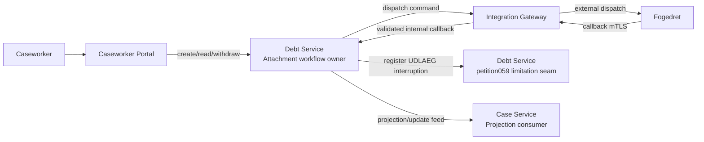
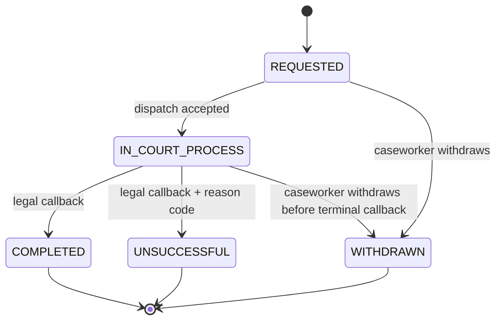

# Solution Architecture — P066: Udlæg PSRM Workflow (G.A.3.2)

**Document ID:** SA-P066  
**Petition:** `petitions/petition066-udlaeg-skaerpet-inddrivelse-psrm-workflow.md`  
**Outcome contract:** `petitions/petition066-udlaeg-skaerpet-inddrivelse-psrm-workflow-outcome-contract.md`  
**Feature file:** `petitions/petition066-udlaeg-skaerpet-inddrivelse-psrm-workflow.feature`  
**Ownership review:** `petitions/reviews/petition066-component-mapping-reviewer.yaml` — **APPROVED**  
**Status:** Ready for architecture review  
**Legal basis:** G.A.3.2; petition059 limitation interruption model; fogedret callback boundary rules  
**Depends on:** petition059, petition062  
**ADRs binding this document:** ADR-0004, ADR-0007, ADR-0014, ADR-0019, ADR-0022, ADR-0030, ADR-0034, ADR-0038, ADR-0040  
**ADR created by this run:** none

---

## 1. Architecture Overview

### 1.1 Problem Statement

Petition066 introduces a PSRM-side udlæg workflow that must be owned by debt-service as a dedicated aggregate instead of overloading generic collection-measure state. The architecture must preserve four non-negotiable properties from the petition package and ADR-0040:

1. one authoritative workflow aggregate and single writer,
2. asynchronous fogedret dispatch/callback correlation by OpenDebt `workflowReference`,
3. atomic coupling between terminal workflow persistence and petition059 `UDLAEG` interruption registration, and
4. strict idempotency and callback validation at both gateway and workflow layers.

The architecture therefore splits responsibility across debt-service, integration-gateway, case-service read consumption, and petition059 limitation internals without moving legal ownership out of debt-service.

### 1.2 Grounding and Current Evidence

Terminology grounding comes from the reopened petition066 package, `CONTEXT.md`, petition059 domain/architecture docs, and ADR-0040. No concept-model YAML was required because the repository already contains explicit glossary entries for attachment workflow terminology and interruptive legal effects.

### 1.3 Ownership-Constrained Slice Model

| Slice ID | Primary owner | Responsibilities | Not responsible for |
|---|---|---|---|
| S1 | `opendebt-debt-service` | Attachment workflow aggregate, eligibility gate, dispatch idempotency, callback state validation, terminal atomicity, petition059 interruption coupling, debtor-scoped read API | Exposing external court-facing endpoints, court process internals |
| S2 | `integration-gateway` | External fogedret dispatch/callback boundary, OCES3 mTLS, replay protection, translation to internal debtor-scoped debt-service APIs | Owning workflow state or legal interruption outcomes |
| S3 | `case-service` | Projection/read consumption of attachment workflow outcomes where case context needs visibility | Writing workflow truth or limitation effects |
| S4 | petition059 limitation capability in `opendebt-debt-service` | Registering `UDLAEG` interruption events, claim-complex propagation, policy-derived legal references | Owning attachment workflow lifecycle |
| S5 | `opendebt-caseworker-portal` | Caseworker-facing debtor-scoped read and command surface if/when UI is added, inspection only over debt-service APIs | Persisting workflow state or court callback correlation |

### 1.4 Architectural Stance

1. **Debt-service owns the udlæg workflow aggregate.**  
   All workflow writes, transition validation, and legal interruption emission stay inside debt-service.

2. **Integration-gateway is the only external court boundary.**  
   All fogedret traffic terminates at integration-gateway, which authenticates and deduplicates callbacks before forwarding to internal debt-service APIs.

3. **petition059 remains the interruption owner.**  
   Petition066 does not fork or reimplement limitation logic; it invokes the existing petition059 interruption seam using `type=UDLAEG`, court outcome date, and policy-derived legal references.

4. **Case-service is projection-only.**  
   Any case-level visibility consumes events or read APIs and never becomes a second workflow writer.

5. **Terminal outcomes are atomic, withdrawal is not interruptive.**  
   `COMPLETED` and `UNSUCCESSFUL` persist terminal workflow state and interruption effects in one transaction; `WITHDRAWN` persists state with mandatory reason and emits no interruption.

6. **Asynchronous court handling is explicit.**  
   Dispatch acceptance moves the aggregate to `IN_COURT_PROCESS`; court finalization arrives later via callback and is validated against debtor scope plus `workflowReference`.

### 1.5 High-Level Collaboration Diagram

---

## 2. Slice Definitions

### 2.1 S1 — Debt Service: Attachment Workflow Aggregate Ownership

**Purpose**  
Own the authoritative attachment workflow aggregate and all legal state transitions.

**Responsibilities**

- Create attachment workflows for a debtor with explicit `coveredFordringIds`.
- Enforce all-or-nothing eligibility on workflow creation.
- Persist immutable workflow scope from `REQUESTED` onward.
- Accept dispatch once and persist dispatch metadata plus `workflowReference`.
- Validate callback debtor scope + `workflowReference` + legal state transition.
- Persist `COMPLETED`, `UNSUCCESSFUL`, and `WITHDRAWN` outcomes.
- For terminal court outcomes, register petition059 `UDLAEG` interruption atomically.
- Emit one interruption per covered claim complex group or standalone claim.
- Expose debtor-scoped read APIs with status history and interruption linkage metadata.

**Internal sub-capabilities**

| Sub-capability | Responsibility |
|---|---|
| `AttachmentWorkflowApi` | Internal/public debtor-scoped REST surface for create, dispatch, callback, withdraw, and read |
| `AttachmentWorkflowApplicationService` | Validation, orchestration, transaction boundaries, result assembly |
| `AttachmentEligibilityGate` | Evaluates covered claims and returns per-claim ineligibility reasons |
| `AttachmentDispatchCoordinator` | Issues one outbound dispatch request per workflow and stores dispatch metadata |
| `AttachmentCallbackValidator` | Enforces debtor-scope match, `workflowReference` match, legal transition rules, and terminal idempotency |
| `AttachmentInterruptionBridge` | Registers petition059 `UDLAEG` interruptions with correct granularity and legal metadata |
| `AttachmentWorkflowHistoryProjector` | Produces chronological status history and interruption linkage fields for reads |

### 2.2 S2 — Integration Gateway: Court Boundary and Replay Protection

**Purpose**  
Protect the external boundary and translate court traffic into internal debt-service calls.

**Responsibilities**

- Terminate external dispatch/callback traffic.
- Enforce OCES3 mTLS on callback ingress.
- Deduplicate callbacks by callback identity tuple.
- Map transport fields to internal debtor-scoped command payloads.
- Keep replay rejection and transport-audit evidence.

**Boundary**

- Owns transport trust and replay protection only.
- Does **not** mutate workflow state directly.
- Does **not** derive legal interruption effects.

### 2.3 S3 — Case Service: Projection Consumer

**Purpose**  
Consume workflow outcome visibility where case-level orchestration or caseworker read models need it.

**Responsibilities**

- Consume attachment workflow status as a read/projection concern.
- Keep any case linkage read-only relative to workflow truth.

### 2.4 S4 — petition059 Limitation Seam

**Purpose**  
Reuse petition059 interruption handling instead of cloning limitation logic.

**Responsibilities**

- Accept `UDLAEG` interruption registration from petition066 terminal outcomes.
- Apply claim-complex propagation for covered members.
- Use policy-derived legal references.
- Recalculate expiry dates based on court outcome date.

### 2.5 S5 — Caseworker Portal

**Purpose**  
Remain a composition/read surface over debt-service APIs if a browser flow is implemented.

**Responsibilities**

- Display current workflow status and history.
- Display interruption linkage metadata.
- Submit caseworker-originated create/withdraw commands through debt-service APIs.

---

## 3. Canonical Information Objects

### 3.1 AttachmentWorkflow

| Field | Meaning | Notes |
|---|---|---|
| `workflowId` | Stable internal identifier | UUID |
| `debtorPersonId` | Technical debtor reference | UUID only |
| `coveredFordringIds` | Immutable covered claim set | Explicit at creation |
| `workflowReference` | OpenDebt-generated court correlation key | Primary callback identity |
| `status` | `REQUESTED`, `IN_COURT_PROCESS`, `COMPLETED`, `UNSUCCESSFUL`, `WITHDRAWN` | Canonical status set |
| `dispatchMetadata` | Outbound dispatch details | Includes dispatch timestamp and optional external case number |
| `outcomeQualifier` | `completed` or `unsuccessful` | Read-side qualifier only |
| `unsuccessfulReasonCode` | Canonical failure code | Required only for `UNSUCCESSFUL` |
| `unsuccessfulReasonDetail` | Optional free text | Optional |
| `withdrawalReason` | Mandatory caseworker reason | Required only for `WITHDRAWN` |
| `terminalOutcomeDate` | Court outcome date | Used as interruption event date |
| `interruptionLinkage` | References to petition059 effects | One or more emitted interruption references |
| `statusHistory` | Chronological transition log | Includes idempotent replay note where applicable |

### 3.2 CallbackIdentityTuple

| Field | Meaning | Notes |
|---|---|---|
| `workflowReference` | Workflow correlation key | Required |
| `outcomeDate` | Court outcome date | Required for terminal callbacks |
| `callbackMessageId` | Transport replay key | Required at gateway |

### 3.3 UnsuccessfulReasonCode (v1)

- `NO_ATTACHABLE_ASSETS`
- `INSOLVENCY_DECLARED`
- `LEGAL_OR_PROCEDURAL_DEFECT`
- `THIRD_PARTY_RIGHT_BLOCK`
- `COURT_REJECTION`

---

## 4. Interface Contracts

### 4.1 Debt-service API Surface

| Method | Path | Purpose |
|---|---|---|
| `POST` | `/api/internal/v1/debtors/{debtorId}/attachment-workflows` | Create workflow |
| `POST` | `/api/internal/v1/debtors/{debtorId}/attachment-workflows/{workflowId}/dispatch` | Idempotent dispatch |
| `POST` | `/api/internal/v1/debtors/{debtorId}/attachment-workflows/{workflowId}/withdraw` | Withdraw with mandatory reason |
| `POST` | `/api/internal/v1/debtors/{debtorId}/attachment-workflows/callbacks` | Apply validated callback from integration-gateway |
| `GET` | `/api/internal/v1/debtors/{debtorId}/attachment-workflows` | Debtor-scoped read list |
| `GET` | `/api/internal/v1/debtors/{debtorId}/attachment-workflows/{workflowId}` | Read single workflow |

### 4.2 Integration-gateway Surface

| Method | Path | Purpose |
|---|---|---|
| `POST` | `/api/external/v1/fogedret/attachment-dispatch` | External dispatch to court |
| `POST` | `/api/external/v1/fogedret/attachment-callbacks` | Callback ingress under OCES3 mTLS |

### 4.3 Error Handling Rules

- Creation rejects if any covered claim is ineligible; no workflow row is created.
- Scope mutation after creation is rejected; caller must withdraw and recreate.
- Repeated dispatch returns existing dispatch metadata and does not re-emit outbound dispatch.
- Callback is rejected when debtor scope or `workflowReference` mismatches.
- `UNSUCCESSFUL` without reason code is rejected.
- Duplicate terminal callback with same terminal status is idempotent no-op.
- Callback replay detected at gateway is rejected before debt-service mutation.

---

## 5. Transaction and State Model

### 5.1 State Machine

### 5.2 Terminal Atomicity

For `COMPLETED` and `UNSUCCESSFUL` transitions, one transaction must:

1. validate transition legality,
2. persist terminal workflow status and outcome metadata,
3. resolve covered claim-complex grouping,
4. invoke petition059 interruption registration with `type=UDLAEG`, event date = court outcome date, and policy-derived legal reference,
5. persist interruption linkage references,
6. append status-history entry.

`WITHDRAWN` skips interruption registration entirely.

---

## 6. C4 and Canonical Model Requirements

The canonical `architecture/workspace.dsl` must model:

- `AttachmentWorkflowApi`, `AttachmentWorkflowApplicationService`, `AttachmentEligibilityGate`, `AttachmentDispatchCoordinator`, `AttachmentCallbackValidator`, `AttachmentInterruptionBridge`, and `AttachmentWorkflowHistoryProjector` inside debt-service.
- `FogedretCallbackController`, `FogedretReplayGuard`, and internal debt-service client components inside integration-gateway.
- Relationships for caseworker-portal -> debt-service, debt-service -> integration-gateway, integration-gateway -> fogedret, integration-gateway -> debt-service callback, and debt-service -> petition059 limitation seam.
- At least one dedicated petition066 component view plus production deployment coverage.

---

## 7. NFR Alignment

Applicable NFR classes for petition066:

- security: mTLS callback ingress, technical-ID-only payloads, authenticated internal APIs
- auditability: traceable dispatch/callback/withdraw/terminal decisions
- resilience: idempotent dispatch and callback processing under retry
- API governance: explicit OpenAPI for internal and external surfaces
- performance: synchronous command responses for creation/dispatch/read; callback handling remains synchronous for validation + persistence under normal SLA
- architecture: no cross-service DB access, gateway boundary preserved, debt-service single writer

**Performance classification:** petition066 endpoints are synchronous. If callback processing or create/dispatch flows exceed 1 second p95 in implementation evidence, redesign review is required before closure.

---

## 8. Requirements-to-Slice Traceability

| Requirement area | Primary slice | Supporting slices |
|---|---|---|
| Create workflow + eligibility | S1 | — |
| Idempotent dispatch | S1 | S2 |
| Callback trust + replay protection | S2 | S1 |
| Callback legal transition validation | S1 | S2 |
| Terminal interruption coupling | S1 | S4 |
| Debtor-scoped reads/history | S1 | S5 |
| Case visibility | S3 | S1 |

---

## 9. OpenAPI and Implementation Handoff

The specs stage must name concrete artifact paths for:

- debt-service attachment workflow API
- integration-gateway fogedret callback/dispatch contract
- any caseworker-portal read dependency if a portal validation surface is required

No implementation may begin by exposing debt-service directly to the court boundary.
