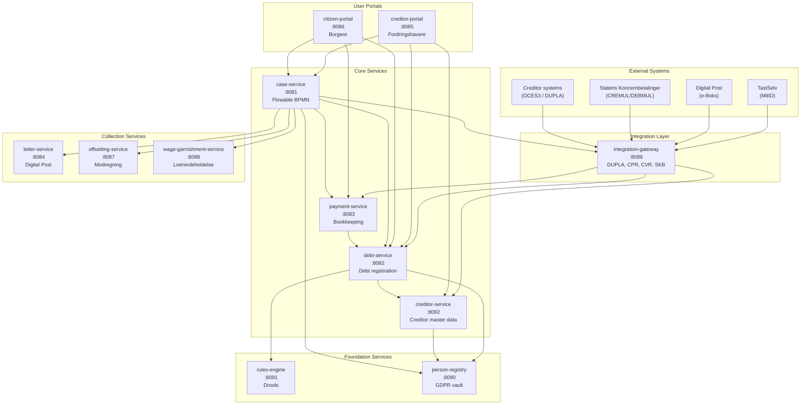
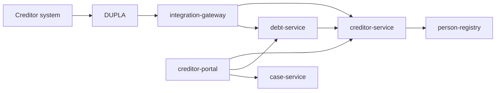
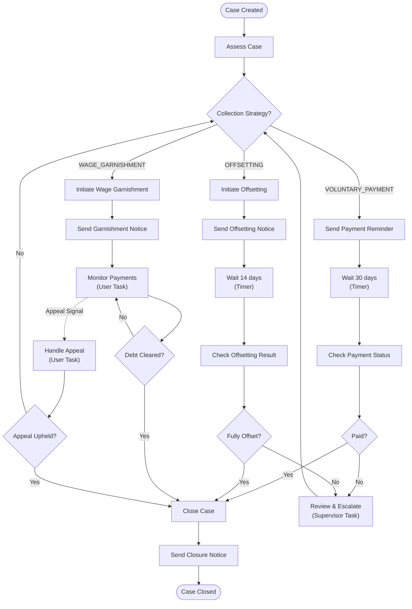
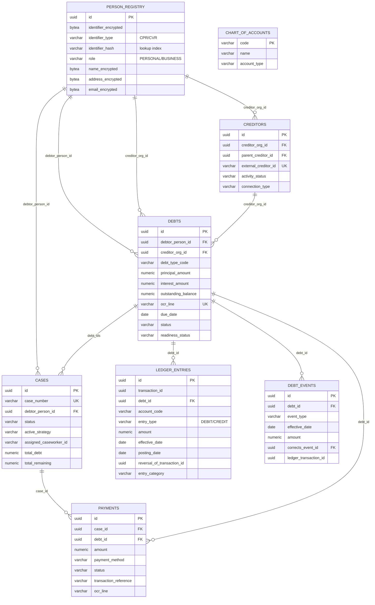
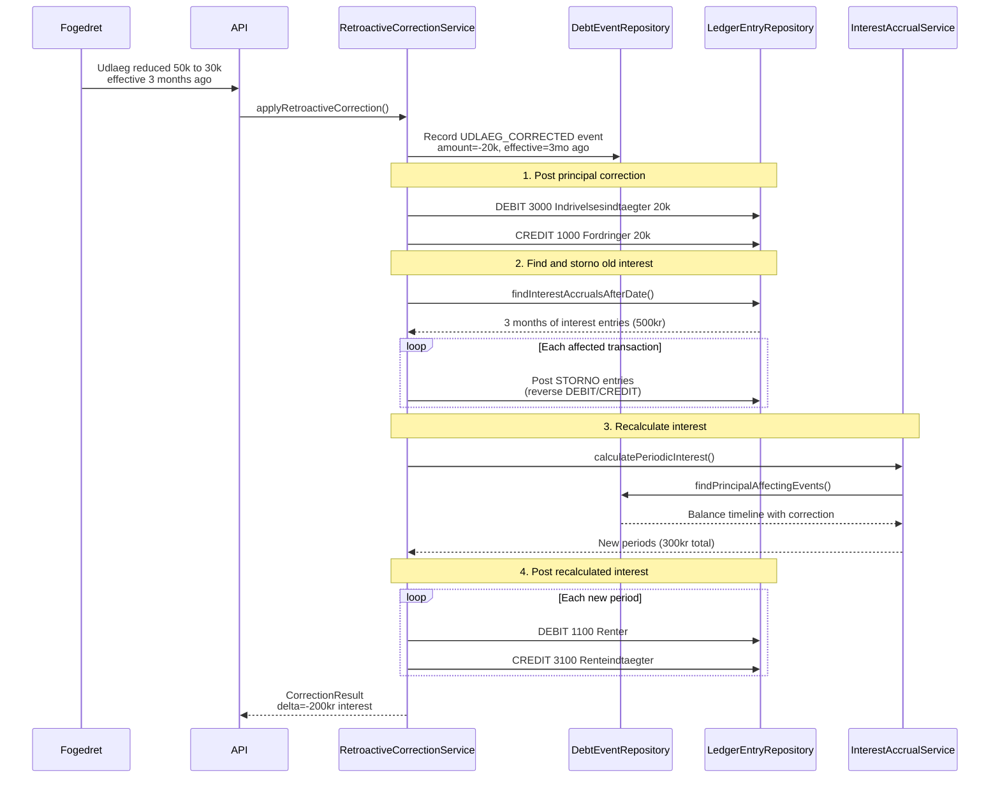
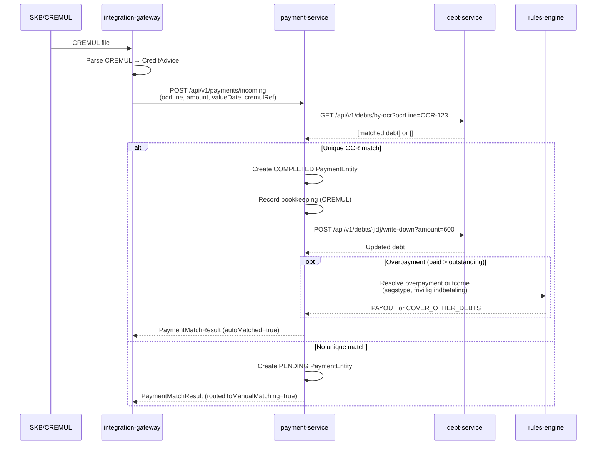
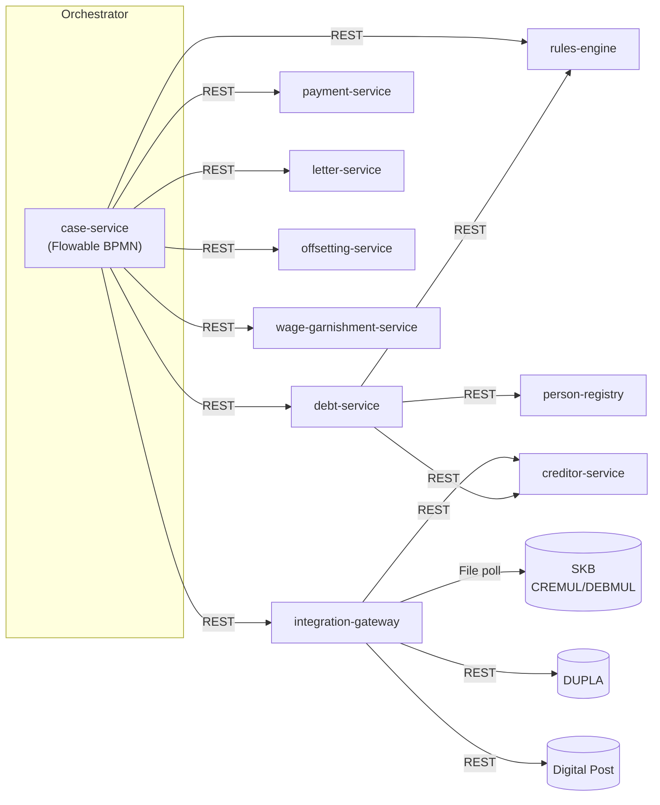

# OpenDebt - Architecture Overview and Implementation Status

## System Overview

OpenDebt is an open-source debt collection system for Danish public institutions (UFST), designed to replace legacy systems (EFI/DMI). It is built as a microservices architecture using Java 21, Spring Boot 3.3, and PostgreSQL 16, deployed on Kubernetes.

### Creditor Interaction Target Architecture (ADR-0020)

OpenDebt treats creditor interaction as two separate channels: **M2M/STP by default** and **portal/manual as a supplementary channel**. The target architecture is therefore:

- `integration-gateway` owns external M2M ingress via DUPLA
- `debt-service` owns `fordring` submission and lifecycle
- `creditor-service` (planned) owns non-PII `fordringshaver` master data and channel binding
- `creditor-portal` is a UI/BFF only, not a master-data system of record
- `person-registry` remains the source of organization identity and PII-like data

| Service | Target responsibility |
|---------|-----------------------|
| `creditor-portal` | Visualization, manual entry, and user interaction for creditor users |
| `integration-gateway` | External M2M ingress, protocol/security adaptation, routing, error mapping |
| `creditor-service` | Operational creditor master data, permissions, hierarchy, settlement setup, channel bindings |
| `debt-service` | Submission and lifecycle of `fordringer`, `restancer`, and transfer to collection |
| `person-registry` | Organization identity and PII-like reference data |

### Debt Collection Workflow (BPMN)

### Database Architecture

### Bookkeeping - Storno and Retroactive Correction Flow

### OCR-Based Payment Matching Flow (Petition 001)

### Communication Pattern (ADR-0019)

## Technology Stack

| Component | Technology | Version |
|-----------|-----------|---------|
| Language | Java | 21 |
| Framework | Spring Boot | 3.3.0 |
| Database | PostgreSQL | 16 |
| Auth | Keycloak (OAuth2/OIDC) | 24.0 |
| Workflow | Flowable BPMN | 7.0.1 |
| Rules | Drools | 9.44.0 |
| EDIFACT | Smooks EDI Cartridge | 2.0.1 |
| Bookkeeping | double-entry-bookkeeping-api | 4.3.0 |
| Build | Maven | 3.9+ |
| Deployment | Kubernetes | - |
| Mapping | MapStruct | 1.5.5 |
| Code style | Spotless (Google Java Format) | 2.43.0 |
| Coverage | JaCoCo (80% line, 70% branch) | 0.8.12 |

## Services

### person-registry (Port 8090)

**Purpose:** Centralized GDPR vault. The ONLY service that stores PII (CPR, CVR, names, addresses, email, phone). All other services reference persons by UUID only.

**Implementation status:** IMPLEMENTED

| Component | Status | Notes |
|-----------|--------|-------|
| PersonEntity (encrypted PII) | Done | AES encryption, hash-based lookup |
| OrganizationEntity | Done | CVR-based organizations |
| PersonController (REST API) | Done | lookup, CRUD, GDPR export/erase |
| EncryptionService | Done | Field-level encryption |
| PersonService | Done | Business logic |
| PersonRepository | Done | JPA + hash index for lookups |
| Flyway migration V1 | Done | Persons, organizations, audit |
| GDPR soft-delete | Done | `markAsDeleted()` clears encrypted fields |

**API endpoints:**
- `POST /api/v1/persons/lookup` - Lookup or create person (primary API for other services)
- `GET /api/v1/persons/{id}` - Get person details (PII)
- `PUT /api/v1/persons/{id}` - Update person
- `GET /api/v1/persons/{id}/exists` - Existence check (no PII returned)
- `POST /api/v1/persons/{id}/gdpr/export` - GDPR data export
- `DELETE /api/v1/persons/{id}/gdpr/erase` - GDPR erasure request

---

### debt-service (Port 8082)

**Purpose:** Debt registration and lifecycle management for `fordringer`, `restancer`, and readiness validation (indrivelsesparathed). It remains the owning service for creditor-submitted claims.

**Implementation status:** IMPLEMENTED

| Component | Status | Notes |
|-----------|--------|-------|
| DebtEntity | Done | Principal, interest, fees, status, readiness, ocrLine, outstandingBalance |
| DebtTypeEntity | Done | ~600 debt types with legal basis |
| DebtController | Done | Full CRUD + readiness validation |
| DebtService | Done | Interface defined |
| DebtServiceImpl | Done | Full CRUD + findByOcrLine + writeDown |
| ReadinessValidationService | Done | Calls rules-engine for evaluation |
| DebtRepository | Done | JPA with filtering indexes |
| Flyway migration V1 | Done | Debts, debt_types, audit, history |
| Flyway migration V2 | Done | ocr_line (unique), outstanding_balance |

**API endpoints:**
- `GET/POST /api/v1/debts` - List/create debts
- `GET/PUT /api/v1/debts/{id}` - Get/update debt
- `GET /api/v1/debts/debtor/{debtorId}` - Debts by debtor
- `GET /api/v1/debts/by-ocr?ocrLine={ocrLine}` - Find debts by OCR-linje
- `POST /api/v1/debts/{id}/validate-readiness` - Validate indrivelsesparathed
- `POST /api/v1/debts/{id}/approve-readiness` - Manual approval
- `POST /api/v1/debts/{id}/reject-readiness` - Rejection with reason
- `POST /api/v1/debts/{id}/write-down?amount={amount}` - Write down outstanding balance
- `DELETE /api/v1/debts/{id}` - Cancel (soft delete)

---

### case-service (Port 8081)

**Purpose:** Case management, workflow orchestration via Flowable BPMN, caseworker assignment.

**Implementation status:** IMPLEMENTED

| Component | Status | Notes |
|-----------|--------|-------|
| CaseEntity | Done | Status, strategy, debts, assignment |
| CaseController | Done | Full CRUD + assign + strategy + close |
| CaseService | Done | Interface defined |
| CaseRepository | Done | JPA |
| CaseWorkflowService | Done | Flowable start/complete/signal/cancel |
| CaseWorkflowServiceImpl | Done | Full Flowable RuntimeService integration |
| debt-collection-case.bpmn20.xml | Done | 3 paths: voluntary, offsetting, garnishment |
| CaseAssessmentDelegate | Done | Auto-assessment at case start |
| SendLetterDelegate | Done | Letter service integration (TODO: wire client) |
| CheckPaymentDelegate | Done | Payment check (TODO: wire client) |
| CloseCaseDelegate | Done | Case closure |
| Flyway migration V1 | Done | Cases, case_debt_ids, audit, history |

**Workflow paths (BPMN):**
1. **Voluntary Payment:** Send reminder -> wait 30 days -> check payment -> paid/escalate
2. **Offsetting (Modregning):** Initiate -> send notice -> wait 14 days -> check result -> paid/escalate
3. **Wage Garnishment (Loenindeholdelse):** Initiate -> send notice -> monitor (user task) -> cleared/continue

**API endpoints:**
- `GET/POST /api/v1/cases` - List/create cases
- `GET/PUT /api/v1/cases/{id}` - Get/update case
- `GET /api/v1/cases/debtor/{debtorId}` - Cases by debtor
- `POST /api/v1/cases/{id}/assign` - Assign caseworker
- `POST /api/v1/cases/{id}/strategy` - Set collection strategy
- `POST /api/v1/cases/{id}/close` - Close case

---

### payment-service (Port 8083)

**Purpose:** Payment processing, reconciliation, double-entry bookkeeping, retroactive corrections.

**Implementation status:** PARTIALLY IMPLEMENTED

| Component | Status | Notes |
|-----------|--------|-------|
| PaymentEntity | Done | Amount, method, status, transaction ref |
| Flyway V1 (payments) | Done | Payments, audit, history |
| **Bookkeeping module** | **Done** | |
| AccountCode (kontoplan) | Done | 7 accounts aligned with statsligt regnskab |
| LedgerEntryEntity (bi-temporal) | Done | effective_date + posting_date + storno |
| DebtEventEntity (timeline) | Done | Immutable event log for replay |
| BookkeepingService | Done | 6 operations with bi-temporal dates |
| BookkeepingServiceImpl | Done | Double-entry posting + event recording |
| InterestAccrualService | Done | Period-based interest calculation |
| RetroactiveCorrectionService | Done | Storno + recalculate + re-post |
| LedgerEntryRepository | Done | Queries for storno, interest, active entries |
| DebtEventRepository | Done | Timeline queries, principal-affecting events |
| Flyway V2 (ledger) | Done | ledger_entries, debt_events, chart_of_accounts, views |
| **Unit tests** | **Done** | BookkeepingServiceImplTest, RetroactiveCorrectionServiceImplTest, InterestAccrualServiceImplTest |
| **Payment matching module** | **Done** | |
| IncomingPaymentDto | Done | DTO for incoming CREMUL payments |
| PaymentMatchResult | Done | Result of OCR-based matching |
| OverpaymentOutcome | Done | Enum: PAYOUT, COVER_OTHER_DEBTS |
| PaymentMatchingService | Done | Interface for OCR matching logic |
| PaymentMatchingServiceImpl | Done | Auto-match, write-down, overpayment rules |
| OverpaymentRulesService | Done | Interface for rule-driven overpayment handling |
| OverpaymentRulesServiceImpl | Done | Placeholder (defaults to PAYOUT, Drools rules TBD) |
| DebtServiceClient | Done | REST client for debt-service (ADR-0007) |
| PaymentRepository | Done | JPA repository for PaymentEntity |
| PaymentController | Done | REST API for incoming payment processing |
| Flyway V3 (ocr_line, nullable case) | Done | OCR-linje column, nullable case_id/debtor fields |
| **Unit tests** | **Done** | PaymentMatchingServiceImplTest (10 tests) |
| ReconciliationService | Not started | Match CREMUL entries against ledger |

**API endpoints:**
- `POST /api/v1/payments/incoming` - Process incoming CREMUL payment (OCR-based matching)

---

### rules-engine (Port 8091)

**Purpose:** Centralized business rules evaluation using Drools. Called by other services via REST.

**Implementation status:** IMPLEMENTED

| Component | Status | Notes |
|-----------|--------|-------|
| DroolsConfig | Done | Auto-loads .drl and .xlsx from classpath |
| RulesService / RulesServiceImpl | Done | evaluateReadiness, calculateInterest, determinePriority |
| FordringValidationService / Impl | Done | Fordring action validation (petition015-018) |
| RulesController | Done | REST API for all rule types |
| debt-readiness.drl | Done | 9 rules including manual review triggers |
| interest-calculation.drl | Done | Standard rate, small amount exempt, not-due |
| collection-priority.drl | Done | 5 priority levels (child support > tax > fines > court > other) |
| fordring-validation.drl | Done | 114 rules: 23 core (petition015) + 14 authorization (petition016) + 32 lifecycle/reference (petition017) + 45 content (petition018) |
| Flyway migration V1 | Done | Rules audit tables |

**Fordring Validation Rules (petition015-018):**
| Category | Rules | Error Codes |
|----------|-------|-------------|
| Structure validation | 10 | 403, 404, 406, 407, 412, 444, 447, 448, 458, 505 |
| Currency validation | 1 | 152 |
| Art type validation | 1 | 411 |
| Interest rate validation | 1 | 438 |
| Date validation | 6 | 409, 464, 467, 548, 568, 569 |
| Agreement validation | 3 | 2, 151, 156 |
| Debtor validation | 1 | 5 |
| Authorization validation | 14 | 400, 416, 419, 420, 421, 437, 465, 466, 480, 497, 501, 508, 511, 543 |
| Genindsend validation | 5 | 539, 540, 541, 542, 544 |
| Tilbagekald validation | 5 | 434, 538, 546, 547, 570 |
| Action reference validation | 5 | 418, 429, 526, 527, 530 |
| Opskrivning/Nedskrivning | 13 | 469, 470, 471, 473, 474, 477, 493, 494, 502, 503, 504, 506 |
| State validation | 4 | 428, 488, 496, 498 |
| Document/Note validation | 6 | 164, 181, 220, 413, 415, 516 |
| Claim amount validation | 5 | 201, 215, 227, 408, 425 |
| Sub-claim validation | 4 | 270, 423, 459, 461 |
| Interest validation | 4 | 436, 441, 442, 443 |
| Nedskriv reason validation | 4 | 410, 433, 519, 571 |
| Hovedstol validation | 4 | 510, 512, 517, 518 |
| Hæftelse validation | 6 | 528, 531, 532, 533, 557, 559 |
| Routing validation | 4 | 422, 426, 565, 572 |
| Claim type validation | 5 | 509, 537, 550, 574, 575 |
| Identifier validation | 3 | 486, 602, 603 |

**API endpoints:**
- `POST /api/v1/rules/readiness/evaluate` - Debt readiness check
- `POST /api/v1/rules/interest/calculate` - Interest calculation
- `POST /api/v1/rules/priority/evaluate` - Collection priority
- `POST /api/v1/rules/priority/sort` - Sort debts by priority

---

### integration-gateway (Port 8089)

**Purpose:** External system integration via DUPLA. This is the target M2M ingress for creditor systems as well as SKB CREMUL/DEBMUL processing.

**Implementation status:** PARTIALLY IMPLEMENTED

| Component | Status | Notes |
|-----------|--------|-------|
| IntegrationGatewayApplication | Done | Spring Boot app |
| **SKB adapter** | **Done** | |
| CreditAdvice / DebitAdvice / SkbMessage | Done | EDIFACT model classes |
| SkbEdifactService | Done | Parse CREMUL, generate DEBMUL |
| SkbEdifactServiceImpl | Done | Smooks-based, DEBMUL generation working |
| SkbController | Done | REST API for CREMUL upload + DEBMUL download |
| cremul-config.xml (Smooks) | Done | Template (TODO: map to SKB directory version) |
| **Unit tests** | **Done** | SkbEdifactServiceImplTest |
| Creditor M2M ingress | Planned | DUPLA/OCES3 entry point for debt submission and status queries |
| DUPLA client | Not started | OCES3 certificate integration |
| CPR/CVR register client | Not started | External lookups |
| Digital Post client | Not started | Letter delivery |
| File polling for CREMUL | Not started | Scheduled pickup from SKB directory |

**API endpoints:**
- `POST /api/v1/skb/cremul/parse` - Upload and parse CREMUL file
- `POST /api/v1/skb/debmul/generate` - Generate DEBMUL file

---

### creditor-service (Port 8092)

**Purpose:** Operational `fordringshaver` master data service. Owns non-PII creditor configuration, hierarchy, permissions, settlement setup, and channel access resolution.

**Implementation status:** IMPLEMENTED

| Component | Status | Notes |
|-----------|--------|-------|
| CreditorEntity / model | Done | Implements Petition 008 operational data model |
| ChannelBindingEntity / model | Done | Binds M2M and portal identities to creditors |
| CreditorController | Done | Internal APIs for lookup and administration |
| CreditorService / CreditorServiceImpl | Done | Creditor lookup, hierarchy, action validation |
| ChannelBindingService / ChannelBindingServiceImpl | Done | Channel binding CRUD, access resolution |
| CreditorMapper / ChannelBindingMapper | Done | MapStruct mappers |
| CreditorRepository | Done | JPA with filtering indexes |
| ChannelBindingRepository | Done | JPA repository |
| SecurityConfig | Done | OAuth2 resource server, actuator/swagger permitted |
| Flyway migration V1 | Done | `creditors`, audit, history |
| Flyway migration V2 | Done | `channel_bindings`, audit, history |

**API endpoints:**
- `GET /api/v1/creditors/{creditorOrgId}` - Resolve creditor master data by organization reference
- `GET /api/v1/creditors/by-external-id/{externalCreditorId}` - Resolve creditor by legacy external ID
- `POST /api/v1/creditors/{creditorOrgId}/validate-action` - Validate creditor status and permissions

---

### letter-service (Port 8084)

**Purpose:** Letter generation and delivery via Digital Post.

**Implementation status:** SCAFFOLD ONLY

| Component | Status | Notes |
|-----------|--------|-------|
| LetterServiceApplication | Done | Spring Boot app |
| Flyway migration V1 | Done | Letters, templates, audit |
| LetterController | Not started | |
| LetterService | Not started | |
| Digital Post integration | Not started | Via integration-gateway |

---

### offsetting-service (Port 8087)

**Purpose:** Modregning (offsetting) processing.

**Implementation status:** SCAFFOLD ONLY

| Component | Status | Notes |
|-----------|--------|-------|
| OffsettingServiceApplication | Done | Spring Boot app |
| application.yml | Done | Priority rules config |
| Controllers/Services | Not started | |

---

### wage-garnishment-service (Port 8088)

**Purpose:** Loenindeholdelse (wage garnishment) processing.

**Implementation status:** SCAFFOLD ONLY

| Component | Status | Notes |
|-----------|--------|-------|
| WageGarnishmentServiceApplication | Done | Spring Boot app |
| application.yml | Done | |
| Controllers/Services | Not started | |

---

### creditor-portal (Port 8085)

**Purpose:** UI/BFF for fordringshavere (creditors) to view data and perform manual interactions. It is not the system of record for creditor master data and not the primary M2M entry point.

**Accessibility requirement:** Must comply with ADR-0021 and the applicable requirements from EN 301 549 / WCAG 2.1 AA, and must have its own accessibility statement.

**Implementation status:** SCAFFOLD ONLY

| Component | Status | Notes |
|-----------|--------|-------|
| CreditorPortalApplication | Done | Spring Boot app |
| application.yml | Done | References debt-service, case-service |
| BFF/API aggregation | Planned | Reads creditor master data from creditor-service |
| Controllers/Views | Not started | |

---

### citizen-portal (Port 8086)

**Purpose:** UI/API for borgere (citizens) to view debts and make payments. TastSelv/MitID integration.

**Accessibility requirement:** Must comply with ADR-0021 and the applicable requirements from EN 301 549 / WCAG 2.1 AA, and must have its own accessibility statement.

**Implementation status:** SCAFFOLD ONLY

| Component | Status | Notes |
|-----------|--------|-------|
| CitizenPortalApplication | Done | Spring Boot app |
| application.yml | Done | References debt, case, payment services |
| Controllers/Views | Not started | |

---

### opendebt-common (Shared library)

**Purpose:** Shared DTOs, exceptions, and audit infrastructure.

**Implementation status:** IMPLEMENTED

| Component | Status | Notes |
|-----------|--------|-------|
| CaseDto, DebtDto, PaymentDto, LetterDto | Done | Shared DTOs |
| DebtorIdentifier | Done | CPR/CVR identifier model |
| ErrorResponse | Done | Standard error format |
| OpenDebtException | Done | Base exception with error code + severity |
| GlobalExceptionHandler | Done | @ControllerAdvice |
| AuditContextFilter | Done | Extracts user context for audit |
| AuditContextService | Done | Sets PostgreSQL audit context |

## Database Architecture

Each service owns its own PostgreSQL database (no cross-service DB access, ADR-0007):

| Database | Service | Key Tables |
|----------|---------|------------|
| opendebt_person | person-registry | persons, organizations |
| opendebt_case | case-service | cases, case_debt_ids, ACT_* (Flowable) |
| opendebt_debt | debt-service | debts, debt_types |
| opendebt_creditor | creditor-service | creditors, channel_bindings, creditor_permissions |
| opendebt_payment | payment-service | payments, ledger_entries, debt_events, chart_of_accounts |
| opendebt_letter | letter-service | letters, letter_templates |
| opendebt_rules | rules-engine | rule_audit |

All databases include:
- `audit_log` table with trigger-based audit logging
- `*_history` tables for temporal versioning (sys_period)
- UUID primary keys
- Flyway-managed migrations

## Communication Pattern

**Explicit orchestration via Flowable BPMN + synchronous REST** (ADR-0019). No message broker.

See the Communication Pattern diagram above.

## Security Model

- **Authentication:** OAuth2/OIDC via Keycloak (ADR-0005)
- **Authorization:** Role-based (`@PreAuthorize`) per endpoint
- **Roles:** ADMIN, SUPERVISOR, CASEWORKER, CREDITOR, SERVICE, GDPR_OFFICER
- **PII isolation:** All personal data encrypted in person-registry only (ADR-0014)
- **Audit:** PostgreSQL trigger-based audit on all tables

## Accessibility and digital inclusion

- **Compliance baseline:** Public UIs must comply with ADR-0021 and applicable EN 301 549 v3.2.1 requirements; WCAG 2.1 AA is the practical baseline for web UI implementation.
- **Accessibility statements:** Each web site and future mobile application must have its own accessibility statement created in WAS-Tool, updated on material change and at least annually.
- **Engineering expectation:** Keyboard access, visible focus, semantic structure, accessible forms/error handling, sufficient contrast, and accessible documents are mandatory qualities for UI delivery.
- **Operational expectation:** Each UI should expose a discoverable link to its accessibility statement, preferably in the footer and, where practical, via `/was`.

## Deployment

- **Local:** Docker Compose with all services, PostgreSQL 16, Keycloak 24
- **Kubernetes:** Kustomize-based with base + staging/production overlays
  - Namespace: `opendebt`
  - Service discovery via internal DNS
  - ConfigMap for service URLs and JVM options
  - Only case-service has full K8s manifests (deployment + service); other services pending

## OpenAPI Specifications

Pre-defined API specs (API-first, ADR-0004):
- `api-specs/openapi-debt-service.yaml` - Debt management APIs
- `api-specs/openapi-case-service.yaml` - Case management and workflow APIs

## Architecture Decision Records (ADRs)

| ADR | Decision |
|-----|----------|
| 0001 | Record Architecture Decisions |
| 0002 | Microservices Architecture |
| 0003 | Java/Spring Boot Technology Stack |
| 0004 | API-First Design with OpenAPI |
| 0005 | Keycloak Authentication |
| 0006 | Kubernetes Deployment |
| 0007 | No Cross-Service Database Connections |
| 0008 | Letter Management Strategy |
| 0009 | DUPLA Integration |
| 0010 | Faellesoffentlige Arkitekturprincipper Compliance |
| 0011 | PostgreSQL Database |
| 0012 | Debtor Identification Model (CPR/CVR with Role) |
| 0013 | Enterprise PostgreSQL with Audit and History |
| 0014 | GDPR Data Isolation - Person Registry |
| 0015 | Drools Rules Engine |
| 0016 | Flowable Workflow Engine |
| 0017 | Smooks EDIFACT CREMUL/DEBMUL (SKB Integration) |
| 0018 | Double-Entry Bookkeeping (Bi-Temporal with Storno) |
| 0019 | Orchestration over Event-Driven Architecture |
| 0020 | Creditor Channel and Master Data Architecture |
| 0021 | UI Accessibility and Webtilgængelighed Compliance |

## Unit Tests

| Test Class | Service | Tests | Coverage |
|------------|---------|-------|----------|
| BookkeepingServiceImplTest | payment-service | 9 | Bi-temporal posting, all 6 operations, event recording |
| RetroactiveCorrectionServiceImplTest | payment-service | 5 | Storno, recalculation, delta verification |
| InterestAccrualServiceImplTest | payment-service | 6 | Period-based calculation, corrections, edge cases |
| PaymentMatchingServiceImplTest | payment-service | 10 | OCR matching, write-down, overpayment rules, manual routing |
| SkbEdifactServiceImplTest | integration-gateway | 6 | CREMUL parsing, DEBMUL generation, UTF-8 |
| DebtServiceImplTest | debt-service | 8 | findByOcrLine, writeDown, balance clamping, status transitions |
| OverpaymentRulesServiceImplTest | payment-service | 1 | Placeholder default outcome |

## Implementation Summary

| Service | Status | Java Files | Endpoints | DB Migrations |
|---------|--------|-----------|-----------|---------------|
| opendebt-common | Done | 6 | - | - |
| person-registry | Done | 9 | 6 | V1 |
| debt-service | Done | 6 | 10 | V1, V2 |
| case-service | Done | 10 | 8 | V1 |
| rules-engine | Done | 16 | 534 | V1 |
| payment-service | Partial | 22 | 1 | V1, V2, V3 |
| integration-gateway | Partial | 7 | 2 | - |
| creditor-service | Done | 32 | 3 | V1, V2 |
| letter-service | Scaffold | 1 | 0 | V1 |
| offsetting-service | Scaffold | 1 | 0 | - |
| wage-garnishment-service | Scaffold | 1 | 0 | - |
| creditor-portal | Scaffold | 1 | 0 | - |
| citizen-portal | Scaffold | 1 | 0 | - |
| **Total** | | **105** | **34** | **12** |
