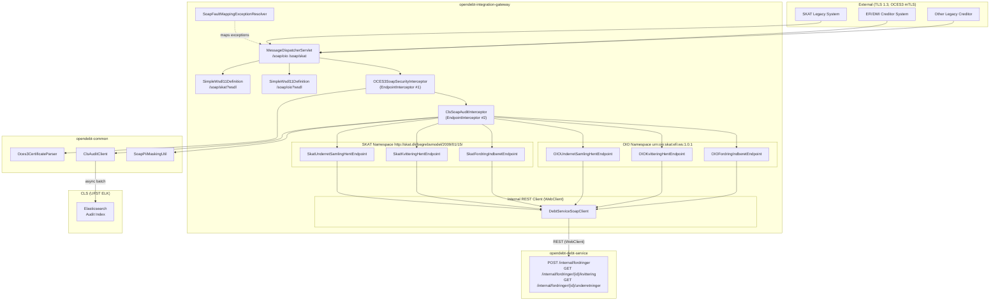
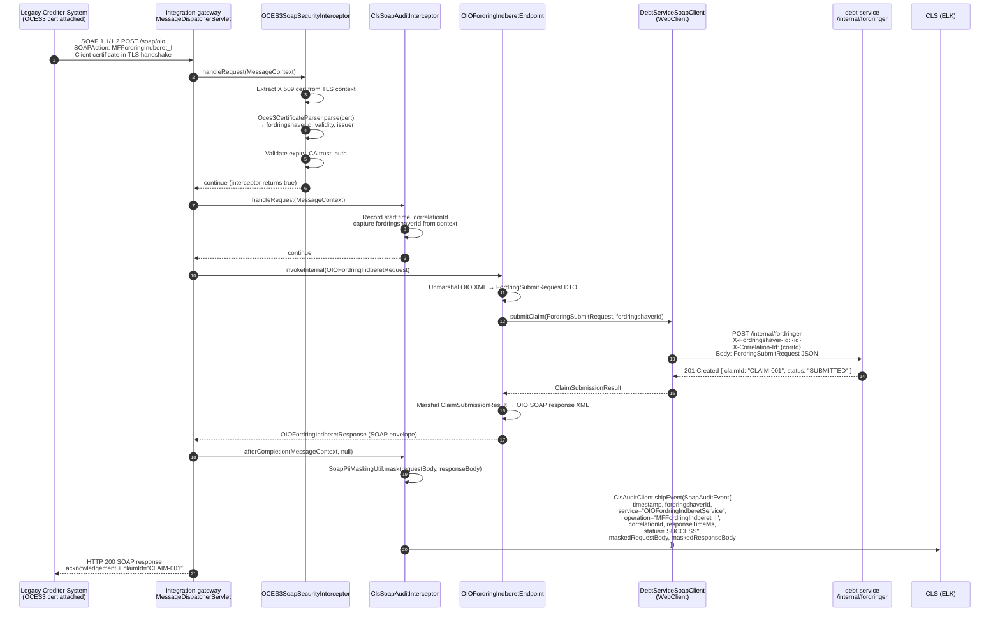

# Solution Architecture — Petition 019: Legacy SOAP Endpoints

**Status:** Approved for implementation  
**Date:** 2026-03-25  
**Author:** Solution Architecture Agent  
**Petition:** [petition019-legacy-soap-endpoints.md](../../petitions/petition019-legacy-soap-endpoints.md)  
**Outcome contract:** [petition019-legacy-soap-endpoints-outcome-contract.md](../../petitions/petition019-legacy-soap-endpoints-outcome-contract.md)  
**Component map:** [petition019_map.yaml](../../petitions/petition019_map.yaml)  

---

## Table of Contents

1. [Architecture Overview](#1-architecture-overview)
2. [Component Diagram](#2-component-diagram)
3. [Sequence Diagram — Successful SOAP Claim Submission](#3-sequence-diagram--successful-soap-claim-submission)
4. [SOAP Infrastructure Design](#4-soap-infrastructure-design)
5. [OCES3 Authentication Design](#5-oces3-authentication-design)
6. [CLS Audit Interceptor Design](#6-cls-audit-interceptor-design)
7. [SOAP Fault Mapping Design](#7-soap-fault-mapping-design)
8. [WSDL Exposure Design](#8-wsdl-exposure-design)
9. [XSD Placement and Versioning Strategy](#9-xsd-placement-and-versioning-strategy)
10. [Interface Contracts — Debt-Service REST Delegation](#10-interface-contracts--debt-service-rest-delegation)
11. [ADR Considerations](#11-adr-considerations)
12. [Traceability Matrix](#12-traceability-matrix)
13. [Rationale and Assumptions](#13-rationale-and-assumptions)

---

## 1. Architecture Overview

Petition 019 extends `opendebt-integration-gateway` (established in petition 011 as the single M2M ingress point) with a second transport and authentication protocol:

| Dimension | Existing (petition 011) | Addition (petition 019) |
|-----------|------------------------|-------------------------|
| Transport | REST over HTTP/2 | SOAP over HTTP (1.1 and 1.2) |
| Auth protocol | OAuth2/OIDC via DUPLA | OCES3 X.509 client certificate |
| Caller type | Modern creditor systems | Legacy EFI/DMI / SKAT systems |
| Gateway role | Normalise + route to `debt-service` | Unmarshal + authenticate + route to `debt-service` |

**No architecture exception is needed.** This is purely additive: the gateway absorbs a new protocol stack (Spring-WS) while the downstream business-logic delegation path to `debt-service` is identical to the REST channel.

### System Slices

| Slice | Module | Role in petition 019 |
|-------|--------|----------------------|
| **SOAP Gateway** | `opendebt-integration-gateway` | **PRIMARY** — Spring-WS host, OCES3 interceptor, CLS audit interceptor, fault resolver, WSDL exposure |
| **Business Logic** | `opendebt-debt-service` | **SECONDARY** — accepts internal REST calls; source of domain exceptions |
| **Cross-cutting Utilities** | `opendebt-common` | **SECONDARY** — `Oces3CertificateParser`, `SoapPiiMaskingUtil`, `ClsAuditClient` |

---

## 2. Component Diagram



---

## 3. Sequence Diagram — Successful SOAP Claim Submission

The flow below uses `OIOFordringIndberetService.MFFordringIndberet_I` as the representative success path. The SKAT namespace follows an identical flow with SKAT XSD marshalling.



---

## 4. SOAP Infrastructure Design

### 4.1 Spring-WS Bean Configuration

Spring-WS requires a dedicated `MessageDispatcherServlet` registered separately from Spring MVC's `DispatcherServlet`. Both coexist in the same Spring Boot application.

**Package:** `dk.ufst.opendebt.integrationgateway.soap`

```
opendebt-integration-gateway/
└── src/main/java/dk/ufst/opendebt/integrationgateway/
    ├── soap/
    │   ├── SoapConfig.java                         ← Spring-WS bean configuration
    │   ├── oio/
    │   │   ├── OIOFordringIndberetEndpoint.java
    │   │   ├── OIOKvitteringHentEndpoint.java
    │   │   └── OIOUnderretSamlingHentEndpoint.java
    │   ├── skat/
    │   │   ├── SkatFordringIndberetEndpoint.java
    │   │   ├── SkatKvitteringHentEndpoint.java
    │   │   └── SkatUnderretSamlingHentEndpoint.java
    │   ├── interceptor/
    │   │   ├── Oces3SoapSecurityInterceptor.java
    │   │   └── ClsSoapAuditInterceptor.java
    │   └── fault/
    │       └── SoapFaultMappingResolver.java
```

**`SoapConfig.java` — key beans:**

| Bean | Type | Purpose |
|------|------|---------|
| `messageDispatcherServlet` | `MessageDispatcherServlet` | Spring-WS dispatcher; `transformWsdlLocations=true` |
| `oioWsdl` | `SimpleWsdl11Definition` | Exposes `/soap/oio?wsdl`; wraps static `oio-fordring.wsdl` (dual SOAP binding) |
| `skatWsdl` | `SimpleWsdl11Definition` | Exposes `/soap/skat?wsdl`; wraps static `skat-fordring.wsdl` (dual SOAP binding) |
| `oces3SecurityInterceptor` | `Oces3SoapSecurityInterceptor` | `EndpointInterceptor` — OCES3 cert validation |
| `clsAuditInterceptor` | `ClsSoapAuditInterceptor` | `EndpointInterceptor` — CLS logging |
| `faultResolver` | `SoapFaultMappingResolver` | `AbstractEndpointExceptionResolver` — domain → SOAP fault |
| `endpointInterceptors` | Ordered list | [oces3SecurityInterceptor, clsAuditInterceptor] |

**Servlet mapping:**

```yaml
# application.yml
spring:
  mvc:
    servlet:
      path: /api          # Spring MVC DispatcherServlet stays on /api
soap:
  servlet:
    path: /soap           # Spring-WS MessageDispatcherServlet on /soap
```

The `MessageDispatcherServlet` is registered programmatically via `ServletRegistrationBean` to mount it at `/soap/*` without conflicting with the existing REST `DispatcherServlet`.

### 4.2 SOAP 1.1 and SOAP 1.2 Dual Protocol Support

Spring-WS supports dual-protocol binding via `SoapMessageFactory` configuration:

- `SaajSoapMessageFactory` with `soapVersion = SoapVersion.SOAP_11` for SOAP 1.1  
- `SaajSoapMessageFactory` with `soapVersion = SoapVersion.SOAP_12` for SOAP 1.2  

The `MessageDispatcherServlet` is configured with a `SaajSoapMessageFactory` set to detect the protocol version automatically from the `Content-Type` header:

| Header | Protocol |
|--------|----------|
| `text/xml; charset=UTF-8` | SOAP 1.1 |
| `application/soap+xml; action="..."` | SOAP 1.2 |

Spring-WS's `SaajSoapMessageFactory` detects the incoming `Content-Type` and produces a response envelope in the same protocol version — no additional routing logic is required.

### 4.3 New Maven Dependencies for `opendebt-integration-gateway`

The following dependencies are not yet present and must be added to `opendebt-integration-gateway/pom.xml`:

| GroupId | ArtifactId | Rationale |
|---------|-----------|-----------|
| `org.springframework.ws` | `spring-ws-core` | Spring-WS core — `MessageDispatcherServlet`, endpoint infrastructure |
| `org.springframework.ws` | `spring-ws-support` | `SaajSoapMessageFactory`, SAAJ dependency |
| `javax.xml.soap` (or `jakarta.xml.soap`) | `jakarta.xml.soap-api` | SAAJ API for SOAP message construction (Jakarta EE 9+ namespace) |
| `com.sun.xml.messaging.saaj` | `saaj-impl` | SAAJ reference implementation for message factory |

> **Note:** Spring Boot 3.3 + Spring-WS 4.x require the `jakarta.*` namespace. Verify `spring-ws-core` version compatibility with `spring-boot-starter-parent 3.3.x` in `pom.xml` before implementation.

### 4.4 Statelessness Guarantee

All SOAP endpoints are annotated `@Endpoint` (Spring-WS singleton beans). No HTTP session state or instance state is held between requests. The `fordringshaverId`, `correlationId`, and timing information are propagated through the `MessageContext` attribute map within the single request processing thread. This satisfies the statelessness requirement (FR-NFR-4) and supports horizontal scaling.

---

## 5. OCES3 Authentication Design

### 5.1 Overview

OCES3 is the Danish Public Sector X.509 certificate standard (replacing NemID OCES2). Authentication uses mutual TLS: the client presents its OCES3 certificate during the TLS handshake. The gateway extracts the certificate from the Java `SSLSession`, parses its DN fields to identify the `fordringshaver`, and validates it before any SOAP processing occurs.

> **No OAuth2/Keycloak involvement.** OCES3 authentication bypasses DUPLA entirely. The gateway terminates TLS directly and performs certificate validation in-process.

### 5.2 `Oces3CertificateParser` (in `opendebt-common`)

**Package:** `dk.ufst.opendebt.common.soap` (new sub-package of `opendebt-common`)

This is a stateless utility class shared across the platform (to allow future reuse by any SOAP-capable service).

**Responsibilities:**
- Parse the `javax.security.cert.X509Certificate` (or `java.security.cert.X509Certificate`) presented in the TLS handshake
- Extract `fordringshaverId` from the certificate DN (strategy: CN field, configurable via property)
- Validate certificate validity period (not before / not after)
- Validate issuer against a configured trusted CA list
- Return an `Oces3AuthContext` value object: `{ fordringshaverId, cn, issuer, validFrom, validTo, serialNumber }`

**DN-to-fordringshaver mapping strategy:**

```
Subject DN: CN=CREDITOR-001, O=Gældstyrelsen, C=DK
               ↑
   fordringshaverId = "CREDITOR-001"
```

The CN field is the primary mapping key. The mapping is purely DN-based (no external database lookup at authentication time). Authorization (channel binding) is a subsequent step using the resolved `fordringshaverId` against the creditor master data already established by petition 010/011.

**Configuration:**

```yaml
opendebt:
  soap:
    oces3:
      trusted-ca-subjects:
        - "CN=OCES3 Udstedende CA 1, O=Nets DanID A/S, C=DK"
        - "CN=OCES3 Udstedende CA 2, O=Nets DanID A/S, C=DK"
      fordringshaver-dn-field: CN    # Configurable: CN or OU
```

### 5.3 `Oces3SoapSecurityInterceptor` (in `opendebt-integration-gateway`)

**Package:** `dk.ufst.opendebt.integrationgateway.soap.interceptor`  
**Implements:** `org.springframework.ws.server.EndpointInterceptor`

**Interceptor order:** Position 0 (first in chain — must run before CLS audit interceptor to populate `fordringshaverId` into `MessageContext`).

**`handleRequest` logic:**

```
1. Obtain X.509 certificate from TLS context (see §5.4 for PATH A / PATH B extraction)
2. If no certificate → throw Oces3AuthenticationException("Certifikat mangler")
                       → SoapFaultMappingResolver maps to CLIENT fault
3. Invoke Oces3CertificateParser.parse(cert) → Oces3AuthContext
4. If expired → throw Oces3AuthenticationException("Certifikat er udløbet")
5. If issuer not trusted → throw Oces3AuthenticationException("Udsteder ikke godkendt")
6. Store Oces3AuthContext in MessageContext attribute "oces3AuthContext"
   Set X-Fordringshaver-Id = fordringshaverId (propagated to all downstream REST calls)
7. Return true (continue interceptor chain)
```

> **Authorization note:** The interceptor performs **authentication only** (identity of the calling system).
> Authorization (is this fordringshaver permitted to submit claims via SOAP?) is enforced **downstream in `debt-service`**
> via the `X-Fordringshaver-Id` header and the existing internal REST auth flow. No `CreditorServiceClient` call is made
> in the interceptor critical path — this is consistent with **Assumption A6**: `fordringshaverId` is uniquely and
> sufficiently derived from the certificate CN field at authentication time.

**`handleResponse` / `handleFault`:** No-op (logging handled by `ClsSoapAuditInterceptor`).

**`afterCompletion`:** No-op.

### 5.4 Certificate Extraction from TLS Context

Spring-WS provides `TransportContextHolder.getTransportContext()` which, for servlet-based transports, wraps the `HttpServletRequest`. Two TLS termination paths are supported, selected by a single configuration property:

```yaml
soap:
  security:
    tls-termination-mode: ingress   # Default for standard Kubernetes deployment (ADR-0006)
                                    # Use 'embedded' for local development / direct-TLS scenarios
```

---

#### PATH A — Embedded TLS (local development and direct-TLS scenarios)

Tomcat performs the mTLS handshake directly. The JVM holds the client certificate in the `SSLSession`.

**Spring Boot TLS configuration:**

```yaml
# application-local.yml
server:
  ssl:
    client-auth: need               # Require client certificate
    bundle: oces3-trust             # References spring.ssl.bundle below
spring:
  ssl:
    bundle:
      jks:
        oces3-trust:
          keystore:
            location: classpath:tls/gateway-keystore.p12
            password: ${SSL_KEYSTORE_PASSWORD}
            type: PKCS12
          truststore:
            location: classpath:tls/oces3-truststore.p12
            password: ${SSL_TRUSTSTORE_PASSWORD}
            type: PKCS12
```

**Interceptor certificate extraction (PATH A):**

```java
HttpServletRequest httpRequest = ((HttpServletConnection)
    TransportContextHolder.getTransportContext().getConnection())
    .getHttpServletRequest();
X509Certificate[] certs = (X509Certificate[])
    httpRequest.getAttribute("javax.servlet.request.X509Certificate");
```

---

#### PATH B — Ingress-forwarded certificate (default for Kubernetes — ADR-0006)

The Kubernetes ingress controller (nginx) terminates TLS and forwards the client certificate as a Base64-encoded DER
header. **PATH B is the default** for all standard Kubernetes deployments per ADR-0006.

**Header specification:**

| Property | Value |
|----------|-------|
| Header name | `X-Client-Cert` |
| Encoding | Plain Base64-encoded PEM (no URL encoding; PEM boundary lines included) |
| Set by | Kubernetes nginx ingress via `$ssl_client_raw_cert` |

**Interceptor certificate extraction (PATH B):**

```java
HttpServletRequest httpRequest = ((HttpServletConnection)
    TransportContextHolder.getTransportContext().getConnection())
    .getHttpServletRequest();
// 1. Read header value (plain Base64 PEM, no URL encoding)
String pemHeader = httpRequest.getHeader("X-Client-Cert");
// 2. Strip PEM boundary lines and remove whitespace/newlines
String base64Der = pemHeader
    .replace("-----BEGIN CERTIFICATE-----", "")
    .replace("-----END CERTIFICATE-----", "")
    .replaceAll("\\s+", "");
// 3. Base64-decode to DER bytes
byte[] derBytes = Base64.getDecoder().decode(base64Der);
// 4. Construct X509Certificate from DER bytes
CertificateFactory cf = CertificateFactory.getInstance("X.509");
X509Certificate cert = (X509Certificate) cf.generateCertificate(
    new ByteArrayInputStream(derBytes));
```

**Kubernetes ingress annotation (nginx):**

```yaml
nginx.ingress.kubernetes.io/auth-tls-pass-certificate-to-upstream: "true"
nginx.ingress.kubernetes.io/auth-tls-secret: "opendebt/oces3-truststore-secret"
nginx.ingress.kubernetes.io/auth-tls-verify-client: "on"
nginx.ingress.kubernetes.io/configuration-snippet: |
  proxy_set_header X-Client-Cert $ssl_client_raw_cert;
```

---

**Mode-switching logic in `Oces3SoapSecurityInterceptor`:**

```java
// Injected from property: soap.security.tls-termination-mode
private final TlsTerminationMode tlsTerminationMode;   // EMBEDDED | INGRESS

private X509Certificate extractCertificate(HttpServletRequest request) {
    return switch (tlsTerminationMode) {
        case EMBEDDED -> extractFromRequestAttribute(request);
        case INGRESS  -> extractFromHeader(request, "X-Client-Cert");
    };
}
```

---

## 6. CLS Audit Interceptor Design

### 6.1 `ClsSoapAuditInterceptor` (in `opendebt-integration-gateway`)

**Package:** `dk.ufst.opendebt.integrationgateway.soap.interceptor`  
**Implements:** `org.springframework.ws.server.EndpointInterceptor`  
**Interceptor order:** Position 1 (after `Oces3SoapSecurityInterceptor` — requires `fordringshaverId` in `MessageContext`).

### 6.2 What Gets Logged

Every SOAP call (success and fault) produces one `SoapAuditEvent` written to CLS via `ClsAuditClient.shipEvent()`. The following fields are logged:

| CLS Field | Source | PII Risk |
|-----------|--------|----------|
| `eventId` | Generated UUID | None |
| `timestamp` | `Instant.now()` at request start | None |
| `serviceName` | `"integration-gateway"` | None |
| `operation` | Composite: `"{ServiceName}.{OperationName}"` e.g. `"OIOFordringIndberetService.MFFordringIndberet_I"` | None |
| `resourceType` | `"SOAP_CALL"` | None |
| `userId` | `fordringshaverId` from `MessageContext` | None — this is a system identifier, not a person |
| `clientApplication` | Cert CN / serial number | None |
| `clientIp` | Remote address from `TransportContext` | Low — IP address only |
| `correlationId` | SOAP `wsa:MessageID` header, or generated UUID if absent | None |
| `responseTimeMs` | `Instant.now() - startTime` in `afterCompletion` | None |
| `status` | `"SUCCESS"` or `"FAULT"` | None |
| `changedFields` | Operation-specific: `["claimId"]` for submit, empty for reads | None |
| `newValues` | `{"claimId": "<uuid>"}` for submit, `{}` for reads | None |
| `oldValues` | `{}` (SOAP is stateless — no pre-state) | None |
| `requestBody` | Masked SOAP envelope XML (see §6.3) | Masked |
| `responseBody` | Masked SOAP envelope XML (see §6.3) | Masked |
| `faultCode` | Populated only on fault path | None |
| `faultMessage` | Populated only on fault path (Danish text) | None |
| `stackTrace` | Populated only on fault path | None |

**CLS index:** `opendebt-audit-soap-{yyyy.MM}` (separate from DB audit index to allow different retention).

### 6.3 PII Masking Strategy (`SoapPiiMaskingUtil` in `opendebt-common`)

**Package:** `dk.ufst.opendebt.common.soap`

`SoapPiiMaskingUtil` is a stateless XML transformer that accepts a SOAP envelope `String` and returns a masked copy. It operates via XPath-based element replacement (no DOM serialisation round-trip if possible — use SAX streaming for performance).

**Masking rules:**

| XML Element / Attribute | Namespace | Masking action |
|------------------------|-----------|---------------|
| `<CPRNummer>`, `<cprNummer>`, `<SkyldnerCPR>` | Any | Replace content with `"[MASKED]"` |
| `<Navn>` / `<SkyldnerNavn>` where parent is `<Skyldner>` or `<Debitor>` | Any | Replace with `"[MASKED]"` |
| `<Adresse>`, `<PostNummer>`, `<By>` where parent is debtor element | Any | Replace with `"[MASKED]"` |
| `<BankKontoNummer>` | Any | Replace with `"[MASKED]"` |
| `<CVRNummer>`, `<SkyldnerCVR>` under any debtor parent element | Any | Replace with `"[MASKED-CVR]"` |
| `<Email>`, `<EmailAdresse>` under any debtor parent element | Any | Replace with `"[MASKED-EMAIL]"` |
| `<Telefon>`, `<TelefonNummer>` under any debtor parent element | Any | Replace with `"[MASKED-PHONE]"` |
| UUID debtor references (e.g. `<SkyldnerUUID>`) | Any | **Preserved** — UUID references are not PII |

**Performance constraint:** Schema validation completes within 500ms per message (FR-NFR-5). PII masking is applied after successful processing during `afterCompletion` — it does not block the response path.

**GDPR basis (ADR-0014):** CLS receives audit metadata with UUID references only. No CPR, name, or address data is transmitted to CLS. This aligns with the platform-wide constraint that person data stays within the `person-registry` boundary.

### 6.4 Interceptor Lifecycle in Spring-WS

```
handleRequest()   → Security interceptor runs first
                    Audit interceptor: record start time, correlationId, fordringshaverId
                    → continue
[endpoint invoked]
handleResponse()  → Audit interceptor: capture response envelope (before masking)
                    → continue
afterCompletion() → Audit interceptor: mask bodies, compute response time, ship to CLS
                    (Called for BOTH success and fault paths)
handleFault()     → Audit interceptor: capture fault envelope, set status="FAULT",
                    extract faultCode / faultMessage / stackTrace
                    → continue (afterCompletion will ship)
```

---

## 7. SOAP Fault Mapping Design

### 7.1 `SoapFaultMappingResolver` (in `opendebt-integration-gateway`)

**Package:** `dk.ufst.opendebt.integrationgateway.soap.fault`  
**Extends:** `org.springframework.ws.soap.server.endpoint.AbstractFaultCreatingValidatingInterceptor` (or implements `EndpointExceptionResolver` for custom mapping).

The resolver maps OpenDebt domain exceptions to SOAP faults **before** the fault is written to the SOAP envelope, ensuring consistent fault codes and Danish-language messages across both SOAP versions.

### 7.2 SOAP 1.1 vs SOAP 1.2 Fault Structure

Spring-WS automatically writes the correct fault structure based on the request's SOAP version. The `SoapFaultMappingResolver` sets fault fields at the abstraction level; the serialisation is handled by Spring-WS's `SaajSoapMessageFactory`.

| Concept | SOAP 1.1 Element | SOAP 1.2 Element |
|---------|-----------------|-----------------|
| Error code | `<faultcode>` | `<env:Code>/<env:Value>` |
| Human-readable message | `<faultstring xml:lang="da">` | `<env:Reason>/<env:Text xml:lang="da">` |
| Structured detail | `<detail>` | `<env:Detail>` |
| Role indicator | `<faultactor>` | `<env:Role>` |

### 7.3 Fault Code Mapping Table

| OpenDebt Exception | HTTP Equivalent | SOAP 1.1 `faultcode` | SOAP 1.2 `Code/Value` | Danish `faultstring` |
|-------------------|----------------|---------------------|----------------------|---------------------|
| `Oces3AuthenticationException` | 401 | `env:Client.Authentication` | `env:Sender` / subcode `Authentication` | `"Autentificering fejlede: certifikat mangler eller er ugyldigt"` |
| `Oces3AuthorizationException` | 403 | `env:Client.Authorization` | `env:Sender` / subcode `Authorization` | `"System er ikke autoriseret til denne operation"` |
| `CertificateExpiredException` | 403 | `env:Client.CertificateExpired` | `env:Sender` / subcode `CertificateExpired` | `"Certifikat er udløbet"` |
| `FordringValidationException` | 422 | `env:Client.ValidationError` | `env:Sender` / subcode `ValidationError` | `"Valideringsfejl i fordringen: {field}"` |
| `OpenDebtException` (generic) | 500 | `env:Server` | `env:Receiver` | `"Intern serverfejl — kontakt UFST support"` |
| `SAAJException` / malformed XML | 400 | `env:Client` | `env:Sender` | `"Ugyldig SOAP-meddelelse: skemavalidering fejlede"` |

### 7.4 SOAP Fault Detail Element Structure

For `FordringValidationException`, the `<detail>` (SOAP 1.1) / `<Detail>` (SOAP 1.2) element contains structured field-level error information:

```xml
<!-- SOAP 1.1 detail -->
<detail>
  <ValidationErrors xmlns="urn:oio:skat:efi:ws:1.0.1">
    <ValidationError>
      <Field>beloeb</Field>
      <Code>AMOUNT_MUST_BE_POSITIVE</Code>
      <Message>Beløb skal være positivt</Message>
    </ValidationError>
  </ValidationErrors>
</detail>
```

```xml
<!-- SOAP 1.2 Detail -->
<env:Detail>
  <ValidationErrors xmlns="urn:oio:skat:efi:ws:1.0.1">
    <ValidationError>
      <Field>beloeb</Field>
      <Code>AMOUNT_MUST_BE_POSITIVE</Code>
      <Message>Beløb skal være positivt</Message>
    </ValidationError>
  </ValidationErrors>
</env:Detail>
```

Field-level errors are sourced from the `FordringValidationException` returned by `debt-service` and forwarded (without modification) through the `SoapFaultMappingResolver`. The SOAP namespace for the `ValidationErrors` element matches the request namespace (OIO or SKAT) so that legacy clients can parse errors consistently.

---

## 8. WSDL Exposure Design

### 8.1 SimpleWsdl11Definition Beans

Spring-WS exposes static WSDL files via `SimpleWsdl11Definition`. This approach is chosen because `DefaultWsdl11Definition` only generates SOAP 1.1 bindings and cannot produce the required dual SOAP 1.1 + 1.2 binding structure mandated by AC-29.

| Bean name | URL path | WSDL source | Namespace |
|-----------|----------|-------------|-----------|
| `oioWsdl` | `/soap/oio?wsdl` | `classpath:wsdl/oio/OIOFordringService.wsdl` | `urn:oio:skat:efi:ws:1.0.1` |
| `skatWsdl` | `/soap/skat?wsdl` | `classpath:wsdl/skat/SkatFordringService.wsdl` | `http://skat.dk/begrebsmodel/2009/01/15/` |

`SimpleWsdl11Definition` takes a single `Resource` argument pointing to the static WSDL file. The static WSDL gives full control over dual bindings and eliminates the risk of Spring-WS generating a non-conformant document.

```java
@Bean(name = "oioWsdl")
public SimpleWsdl11Definition oioWsdl() {
    return new SimpleWsdl11Definition(new ClassPathResource("wsdl/oio/OIOFordringService.wsdl"));
}
@Bean(name = "skatWsdl")
public SimpleWsdl11Definition skatWsdl() {
    return new SimpleWsdl11Definition(new ClassPathResource("wsdl/skat/SkatFordringService.wsdl"));
}
```

### 8.2 Operations per WSDL

Both WSDL documents expose the same three operations (identical names, different namespaces):

| Operation | Input message | Output message |
|-----------|--------------|---------------|
| `MFFordringIndberet_I` | `MFFordringIndberet_IRequest` | `MFFordringIndberet_IResponse` |
| `MFKvitteringHent_I` | `MFKvitteringHent_IRequest` | `MFKvitteringHent_IResponse` |
| `MFUnderretSamlingHent_I` | `MFUnderretSamlingHent_IRequest` | `MFUnderretSamlingHent_IResponse` |

### 8.3 SOAP 1.1 and 1.2 Bindings in WSDL

See §8.1 for the `SimpleWsdl11Definition` rationale and bean definitions. The static WSDL files embed both SOAP 1.1 and SOAP 1.2 binding sections; no dynamic generation is used.

---

## 9. XSD Placement and Versioning Strategy

### 9.1 File Layout

```
opendebt-integration-gateway/src/main/resources/
└── wsdl/
    ├── oio/
    │   ├── oio-fordring.wsdl          ← WSDL 1.1 (static, dual SOAP binding)
    │   └── oio-fordring.xsd           ← OIO XSD v1.0.1 (namespace urn:oio:skat:efi:ws:1.0.1)
    └── skat/
        ├── skat-fordring.wsdl         ← WSDL 1.1 (static, dual SOAP binding)
        └── skat-fordring.xsd          ← SKAT XSD 2009/01/15 (namespace http://skat.dk/...)
```

### 9.2 XSD Versioning Strategy

The XSD files encode the schema version in their namespace URIs (not in file names). This matches the legacy EFI/DMI convention:

| Schema | Namespace = version identifier | File |
|--------|-------------------------------|------|
| OIO | `urn:oio:skat:efi:ws:1.0.1` | `oio-fordring.xsd` |
| SKAT | `http://skat.dk/begrebsmodel/2009/01/15/` | `skat-fordring.xsd` |

**Version bump procedure (future):**  
1. Create a new sub-directory: `wsdl/oio/v2/`  
2. Copy and modify XSD + WSDL with new namespace URI  
3. Register a new `SimpleWsdl11Definition` bean at `/soap/oio/v2?wsdl`  
4. Maintain the old path until legacy clients migrate (estimated 5–10 year coexistence)

**No breaking changes rule:** Existing XSD elements may not be removed or renamed. New optional elements may be added with `minOccurs="0"`. Changes that remove or change element names require a new namespace/version.

### 9.3 JAXB Class Generation

JAXB classes for OIO and SKAT namespaces are generated at build time from the XSD files using the `jaxb2-maven-plugin`. Generated sources are placed in:

```
target/generated-sources/jaxb/
├── dk/ufst/opendebt/integrationgateway/soap/oio/generated/
└── dk/ufst/opendebt/integrationgateway/soap/skat/generated/
```

Binding customisation files (`oio-bindings.xjb`, `skat-bindings.xjb`) are used to:
- Map XSD date types to `java.time.LocalDate`
- Map XSD decimal types to `java.math.BigDecimal`
- Suppress XSD-generated `JAXBElement<>` wrappers where possible

---

## 10. Interface Contracts — Debt-Service REST Delegation

### 10.1 Design Principle

SOAP endpoints are pure protocol adapters. All business logic lives in `debt-service`. The gateway calls `debt-service` via **internal REST** (not exposed through DUPLA) using `WebClient.Builder` injected per ADR-0024. The existing `WebClientConfig` bean (`WebClient.Builder`) in `integration-gateway` is reused as-is.

The gateway adds the following headers to every internal REST call:

| Header | Value | Purpose |
|--------|-------|---------|
| `X-Fordringshaver-Id` | `fordringshaverId` from OCES3 cert | Authorization context propagation |
| `X-Correlation-Id` | SOAP `wsa:MessageID` or generated UUID | End-to-end request tracing |
| `Content-Type` | `application/json` | Already set by `WebClientConfig` |

### 10.2 `DebtServiceSoapClient` (in `opendebt-integration-gateway`)

**Package:** `dk.ufst.opendebt.integrationgateway.soap`  
**Base URL config:** `opendebt.services.debt-service.url` (same property as existing `DebtServiceClient` used by REST channel)

Resilience patterns per ADR-0026:

| Method | Pattern | Rationale |
|--------|---------|-----------|
| `submitClaim()` | `@CircuitBreaker(name="debtService")` (NO retry, NO @TimeLimiter) | Non-idempotent POST; timeout enforced by WebClient-native settings (see below) |
| `getKvittering()` | `@CircuitBreaker(name="debtService")` + `@Retry(name="debtService")` | Idempotent GET; timeout enforced by WebClient-native settings |
| `getUnderretninger()` | `@CircuitBreaker(name="debtService")` + `@Retry(name="debtService")` | Idempotent GET; timeout enforced by WebClient-native settings |

> **Why `@TimeLimiter` is NOT used:**
> `@TimeLimiter` AOP annotation does not enforce timeouts when `WebClient.block()` is called in a synchronous servlet
> thread — the AOP proxy fires after the fact but the blocking call already holds the thread for the full duration.
> Per ADR-0026 §Mitigations, explicit `connectTimeout` and `responseTimeout` on the `WebClient` builder are used instead.
> These are enforced on the underlying HTTP connection and correctly time out blocking calls.

**WebClient timeout configuration:**

```java
// DebtServiceSoapClient constructor
WebClient webClient = webClientBuilder
    .baseUrl(debtServiceUrl)
    .clientConnector(new ReactorClientHttpConnector(
        HttpClient.create()
            .connectTimeout(Duration.ofSeconds(2))    // connectTimeout: 2s (enforced on TCP connect)
            .responseTimeout(Duration.ofMillis(1500))  // 1.5s budget for debt-service; leaves 0.5s for gateway overhead within AC-30 2s SLA
    ))
    .build();
```

### 10.3 REST Endpoint Contracts

#### Claim Submission

```
POST /internal/fordringer
Headers:
  X-Fordringshaver-Id: {fordringshaverId}
  X-Correlation-Id:    {correlationId}

Request body (JSON):
{
  "fordringsType":      string,        // mapped from OIO/SKAT XSD element
  "beloeb":            BigDecimal,     // claim amount (must be > 0)
  "renteBeloeb":       BigDecimal,     // optional interest
  "skyldnerPersonId":  UUID,           // person-registry UUID (never CPR)
  "fordringsDato":     LocalDate,
  "forfaldsDato":      LocalDate,
  "eksternId":         string,         // creditor's own reference
  // ... additional fields per FordringSubmitRequest DTO
}

Response 201 Created:
{
  "claimId":   UUID,
  "status":    "SUBMITTED",
  "timestamp": Instant
}

Response 422 Unprocessable Entity:
{
  "errors": [
    { "field": "beloeb", "code": "AMOUNT_MUST_BE_POSITIVE", "message": "..." }
  ]
}
```

#### Receipt Retrieval

```
GET /internal/fordringer/{claimId}/kvittering
Headers:
  X-Fordringshaver-Id: {fordringshaverId}
  X-Correlation-Id:    {correlationId}

Response 200 OK:
{
  "kvitteringId":  UUID,
  "claimId":       UUID,
  "status":        "SUBMITTED" | "ACCEPTED" | "REJECTED",
  "modtagetDato":  Instant,
  "behandletDato": Instant,
  "afvisningKode": string | null,
  "afvisningTekst": string | null
}

Response 404 Not Found:
{
  "error": "CLAIM_NOT_FOUND",
  "message": "Fordring med id {claimId} ikke fundet"
}
```

#### Notification Collection Retrieval

```
GET /internal/fordringer/{claimId}/underretninger
Headers:
  X-Fordringshaver-Id: {fordringshaverId}
  X-Correlation-Id:    {correlationId}
Query params:
  ?skyldnerId={UUID}   (optional filter)

Response 200 OK:
{
  "claimId": UUID,
  "underretninger": [
    {
      "underretningId":   UUID,
      "type":             string,     // e.g. "PAAKRAV", "UNDERRETNING"
      "dato":             LocalDate,
      "beloeb":           BigDecimal,
      "skyldnerPersonId": UUID        // UUID reference only, no CPR
    }
  ],
  "total": integer
}
```

### 10.4 DTO Mapping Strategy

OIO and SKAT XML types are structurally similar but use different element names and namespaces. The SOAP endpoints convert them to the common `FordringSubmitRequest` / `KvitteringResponse` / `UnderretSamlingResponse` DTOs before calling `DebtServiceSoapClient`.

| Layer | Type | Package |
|-------|------|---------|
| OIO JAXB generated | `MFFordringIndberet_IRequest` | `.soap.oio.generated` |
| SKAT JAXB generated | `MFFordringIndberet_IRequest` (different namespace) | `.soap.skat.generated` |
| Common REST DTO | `FordringSubmitRequest` | `opendebt-common` `.dto.fordring` |
| Mapping class (OIO) | `OioFordringMapper` | `.soap.oio` |
| Mapping class (SKAT) | `SkatFordringMapper` | `.soap.skat` |

Mappers are implemented with **MapStruct** (already present in `debt-service` pom; add to `integration-gateway` pom).

---

## 11. ADR Considerations

### 11.1 Existing ADRs — No Amendments Required

| ADR | Title | Status relative to petition 019 |
|-----|-------|-------------------------------|
| **ADR-0007** | REST-only inter-service data access | ✅ Satisfied — gateway calls `debt-service` via REST; no direct DB access |
| **ADR-0011** | PostgreSQL per service | ✅ Not affected — integration-gateway has no DB; no new database required |
| **ADR-0019** | Orchestration over event-driven | ✅ Satisfied — SOAP calls are synchronous; no broker or async patterns introduced |
| **ADR-0022** | Shared audit infrastructure | ✅ Extended — `ClsAuditClient` (from `opendebt-common`) is reused; `SoapPiiMaskingUtil` is added to `opendebt-common` as a utility, not a new pattern |
| **ADR-0024** | Observability (Grafana stack) | ✅ Compatible — Spring-WS endpoints emit Micrometer metrics automatically via `@Observed` or manual `Timer`; traces propagate via existing OTel bridge |
| **ADR-0026** | Inter-service resilience | ✅ Applied — `DebtServiceSoapClient` uses Resilience4j circuit breaker + retry per pattern catalogue |

### 11.2 ADR-0007 — "REST-only" Note

ADR-0007 mandates API-only inter-service data access. The title references "no direct database connections" — not a prohibition on SOAP as a transport. The SOAP layer is purely an **inbound** protocol translator in `integration-gateway`. All **inter-service** calls remain REST. This is not an exception; it is a complementary inbound channel.

### 11.3 WebClient.Builder Injection Rule (Referenced as ADR-0024)

The project convention — `WebClient.Builder` must be **injected** (never `WebClient.create()`) — is established by the existing `WebClientConfig` bean in `integration-gateway`. The new `DebtServiceSoapClient` will inject `WebClient.Builder webClientBuilder` via constructor injection and call `.build()` locally. This is consistent with all existing service clients.

### 11.4 New ADR Recommended: ADR-0030 — SOAP/Spring-WS for Legacy Creditor Integration

**Recommendation:** Create `architecture/adr/0030-soap-spring-ws-legacy-creditor-integration.md`

**Reason:** Adding Spring-WS (`spring-ws-core`, `spring-ws-security`) to a Spring Boot 3.3 application that uses Spring MVC is a non-trivial architectural decision with implications for:
- Dual-servlet registration (MVC `DispatcherServlet` + WS `MessageDispatcherServlet`)
- Authentication protocol divergence (OAuth2 for REST, OCES3 for SOAP)
- Scope and duration of SOAP maintenance burden (5–10 year estimate)
- XSD version freeze policy

This ADR should document: the decision to use Spring-WS (vs. JAX-WS / Apache CXF), the rationale for hosting in `integration-gateway` rather than `debt-service`, and the long-term maintenance commitment.

**Impact if not created:** Future engineers will have no documented rationale for why Spring-WS was introduced or why it lives in the gateway — increasing the risk of drift.

### 11.5 ADR-0022 Java CLS Client Exception

**ADR-0022** marks `ClsAuditClient` as deprecated in favour of Filebeat log shipping. However, Filebeat requires polling a database `audit_log` table (as established in other services). `integration-gateway` has **no PostgreSQL database** (ADR-0011). Therefore Filebeat is not applicable for SOAP audit events in this service.

`ClsAuditClient` is used deliberately as the edge-case fallback described in ADR-0022 §Consequences: *"CLS Client (Java - DEPRECATED) — Optional fallback for direct API shipping."*

This constitutes a **documented exception**. No new ADR is required: the deviation is bounded, justified by the absence of a service-local database, and explicitly permitted by ADR-0022's own fallback clause.

---

## 12. Traceability Matrix

| Functional Requirement | Scenario(s) | Primary Slice | Secondary Slices |
|-----------------------|-------------|--------------|-----------------|
| FR-OIO-1: OIOFordringIndberetService | 001, 002 | integration-gateway | debt-service |
| FR-OIO-2: OIOKvitteringHentService | 003 | integration-gateway | debt-service |
| FR-OIO-3: OIOUnderretSamlingHentService | 004 | integration-gateway | debt-service |
| FR-SKAT-1: SkatFordringIndberetService | 005, 006 | integration-gateway | debt-service |
| FR-SKAT-2: SkatKvitteringHentService | 007 | integration-gateway | debt-service |
| FR-SKAT-3: SkatUnderretSamlingHentService | 008 | integration-gateway | debt-service |
| FR-SEC-1: OCES3 cert required | 009 | integration-gateway | opendebt-common |
| FR-SEC-2: Expired cert rejected | 010 | integration-gateway | opendebt-common |
| FR-SEC-3: Unauthorized system rejected | 011 | integration-gateway | opendebt-common |
| FR-SEC-4: Cert DN → fordringshaver mapping | 012 | integration-gateway | opendebt-common |
| FR-LOG-1: CLS logging on success | 013 | integration-gateway | opendebt-common |
| FR-LOG-2: CLS logging on fault | 014 | integration-gateway | opendebt-common |
| FR-LOG-3: Bodies logged, PII excluded | 015 | integration-gateway | opendebt-common |
| FR-ERR-1: Field-level validation fault | 016, 002, 006 | integration-gateway | debt-service |
| FR-ERR-2: Malformed SOAP fault | 017 | integration-gateway | — |
| FR-NFR-1: SOAP 1.1 support | 024 | integration-gateway | — |
| FR-NFR-2: SOAP 1.2 support | 025, 026, 027 | integration-gateway | — |
| FR-NFR-3: WSDL at /soap/oio?wsdl | 022 | integration-gateway | — |
| FR-NFR-4: WSDL at /soap/skat?wsdl | 023 | integration-gateway | — |
| FR-NFR-5: Stateless, horizontally scalable | 028 | integration-gateway | — |
| FR-NFR-6: OIO XSD validation | 029 | integration-gateway | — |
| FR-NFR-7: SKAT XSD validation | 030 | integration-gateway | — |
| AC-17 (FR-INT-1): Same validation rules as REST | — | integration-gateway | debt-service (`SoapFaultMappingResolver` delegates to `debt-service` validation path; errors returned as-is) |
| AC-18 (FR-INT-2): Same business logic as REST | — | integration-gateway | debt-service (`DebtServiceSoapClient` calls `/internal/*` REST endpoints — business logic runs only in `debt-service`) |
| AC-19 (FR-INT-3): Synchronous responses only | — | integration-gateway | — (no async executor, no WS-Addressing `ReplyTo` in `SoapConfig`) |
| AC-20 (FR-INT-4): XSD schema compatibility with EFI/DMI | — | integration-gateway | — (static OIO 1.0.1 and SKAT 2009/01/15 XSDs in `src/main/resources/wsdl/`) |
| AC-22 (FR-ERR-3): SOAP fault structure (code + Danish string + detail) | — | integration-gateway | — (`SoapFaultMappingResolver` produces both SOAP 1.1 and 1.2 fault envelopes; see §7) |
| AC-23 (FR-ERR-4): Exception → fault code mapping | — | integration-gateway | — (`SoapFaultMappingResolver` exception table; see §7.3) |
| AC-30 (FR-NFR-8): Response time < 2s | — | integration-gateway | debt-service (`WebClient` `connectTimeout(2s)` + `responseTimeout(1500ms)` on `DebtServiceSoapClient`) |
| AC-31 (FR-NFR-9): 100 concurrent connections | — | integration-gateway | — (stateless design + Kubernetes HPA) |
| AC-33 (FR-NFR-10): Schema validation < 500ms | — | integration-gateway | — (`PayloadValidatingInterceptor` uses pre-compiled XSD validator compiled once at startup) |
| AC-34 (FR-NFR-11): Request ID tracking | — | integration-gateway | debt-service (`X-Correlation-Id` propagated from SOAP `wsa:MessageID` through CLS audit and REST delegation) |
| AC-35 (FR-NFR-12): TLS 1.3 | — | integration-gateway | — (PATH A: `server.ssl.*`; PATH B: ingress nginx TLS policy; see §5.4) |

---

## 13. Rationale and Assumptions

### 13.1 Key Architectural Decisions

| Decision | Rationale |
|----------|-----------|
| **Host SOAP in `integration-gateway`, not `debt-service`** | `integration-gateway` already owns the M2M authentication boundary (petition 011). OCES3 cert validation is an ingress concern, not a business concern. Placing Spring-WS in `debt-service` would collapse protocol-adaptation into the business-logic layer, violating single-responsibility and the pattern established by petition 011. |
| **Static WSDL files via `SimpleWsdl11Definition`** | `DefaultWsdl11Definition` only generates SOAP 1.1 bindings. The requirement mandates both SOAP 1.1 and SOAP 1.2 bindings in the WSDL. Static WSDLs give full control and eliminate runtime generation surprises. |
| **`Oces3CertificateParser` in `opendebt-common`** | Any future SOAP-capable service (e.g., if a letter-service ever needs SOAP) can reuse the parser without duplicating cert-parsing logic. The parser has no dependencies beyond `java.security.cert.*`. |
| **`SoapPiiMaskingUtil` in `opendebt-common`** | PII masking is a compliance concern shared across the platform. Placing it in `opendebt-common` makes it reusable and auditable in one place, consistent with how `ClsAuditEventMapper` already handles PII for DB audit events. |
| **MapStruct for OIO/SKAT → common DTO mapping** | MapStruct is already used in `debt-service`. Adding it to `integration-gateway` follows the existing pattern. The alternative (manual mapping) introduces error-prone boilerplate in a namespace-heavy domain. |
| **No DUPLA involvement for SOAP** | Legacy SOAP systems use OCES3 certificates, not OAuth2/OIDC. DUPLA is an OAuth2 gateway. Routing SOAP through DUPLA would require protocol bridging that is explicitly out of scope (petition 019 constraints). |
| **`WebClient` for internal REST calls from SOAP endpoints** | `integration-gateway` already uses `WebClient` (reactive) for REST calls. Consistency with existing `DebtServiceClient`. The reactive client is used in a blocking-wrapped manner from synchronous SOAP endpoints (`.block()` with timeout), which is acceptable for a moderate-volume SOAP channel. |
| **Synchronous response only** | Petition 019 explicitly excludes WS-Addressing and WS-ReliableMessaging. Synchronous responses keep the implementation simple and aligned with ADR-0019 (orchestration over event-driven). |

### 13.2 Assumptions

| # | Assumption | Impact if Wrong |
|---|-----------|----------------|
| A1 | `spring-ws-core` 4.x is compatible with `spring-boot-starter-parent 3.3.x` (Jakarta EE 9+ namespace) | If not, a Jakarta-compatible Spring-WS version or alternative (Apache CXF) must be evaluated |
| A2 | TLS termination occurs at the embedded Tomcat in `integration-gateway`, not at the Kubernetes ingress | If TLS is terminated at ingress, a different cert-forwarding mechanism (e.g., `X-Client-Cert` header with Base64) must be configured |
| A3 | Legacy EFI/DMI systems present OCES3 certificates issued by the listed trusted CAs (Nets DanID) | If legacy certs use a different CA chain, the `trusted-ca-subjects` configuration list must be expanded |
| A4 | `debt-service` exposes `/internal/fordringer` and related endpoints as internal REST APIs (from petition 015–018 implementation) | If these endpoints do not exist when petition 019 implementation begins, a dependency on petition 015–018 delivery must be tracked |
| A5 | The OIO and SKAT XSD schemas must be reconstructed from documentation (original WSDLs not available) | Reconstructed schemas may not be 100% compatible with all legacy clients; a compatibility testing period with pilot creditors is required |
| A6 | `fordringshaverId` can be uniquely derived from the certificate CN field without an external lookup at authentication time | If DN-to-ID mapping requires a database lookup, an additional call to `creditor-service` must be inserted in `Oces3SoapSecurityInterceptor`, adding latency |
| A7 | The 2-second response SLA (FR-NFR-2) includes time for OCES3 validation, XSD unmarshalling, REST delegation to `debt-service`, and SOAP marshalling | If `debt-service` response time under load exceeds ~1 second, the SLA cannot be met without caching or pre-warming |

### 13.3 Out-of-Scope Confirmations

The following items are explicitly **not designed** in this document, matching the petition's out-of-scope declarations:

- DUPLA integration for SOAP endpoints
- WS-Addressing or WS-ReliableMessaging (asynchronous SOAP patterns)
- SOAP message transformation or protocol bridging
- Legacy SOAP client library implementations
- Detailed XSD schema content (implementation detail for specifications phase)
- SOAP versioning beyond OIO 1.0.1 and SKAT 2009/01/15

---

*Document end — Petition 019 Solution Architecture*
