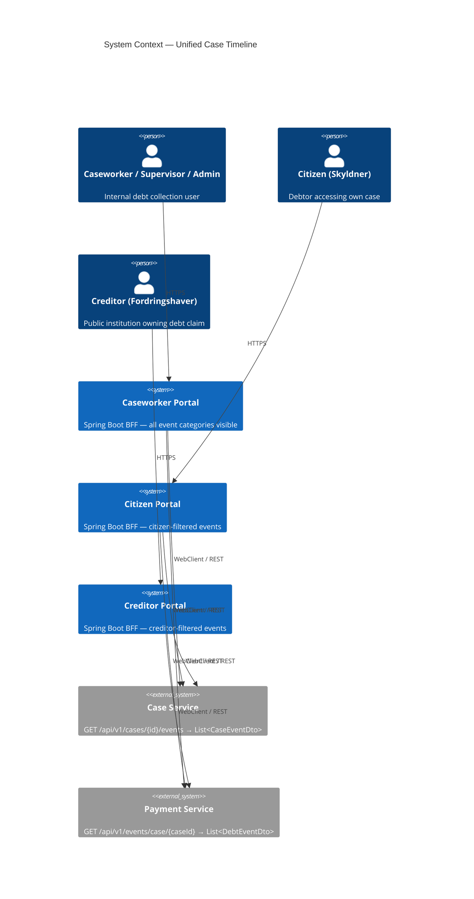
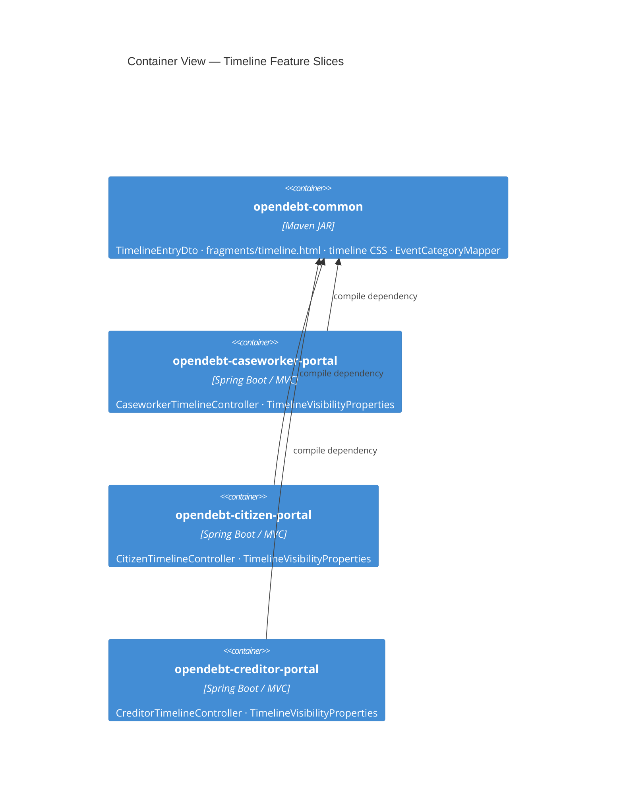
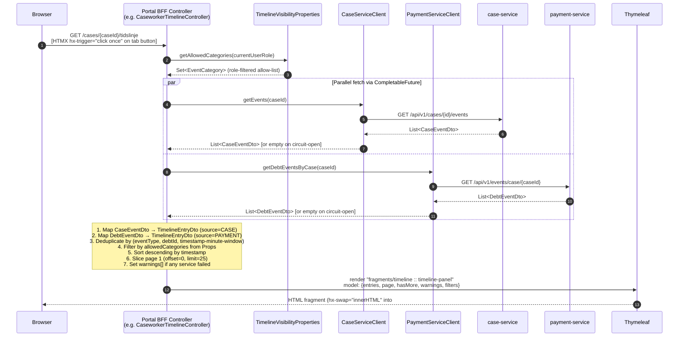
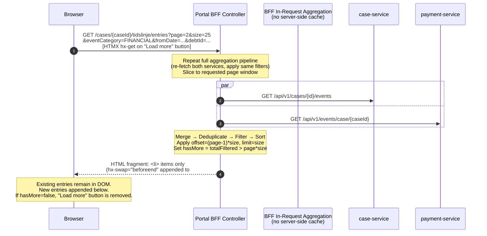
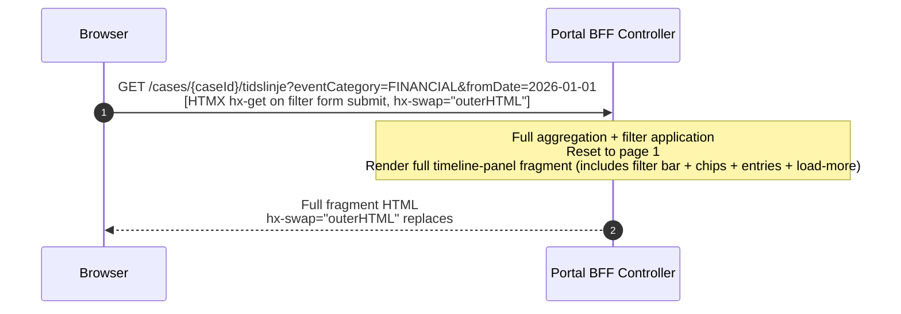

# Solution Architecture: Petition 050 — Unified Case Timeline UI

| Field | Value |
|---|---|
| Document ID | SA-050 |
| Petition | petition050-unified-case-timeline-ui |
| Status | Draft |
| Author | Solution Architecture Agent |
| Date | 2026-03-23 |
| Stack | Spring Boot 3.3 · Thymeleaf · HTMX 2.0.4 · Spring WebClient · SKAT Design System |

---

## Table of Contents

1. [Architecture Overview](#1-architecture-overview)
2. [Component Diagram](#2-component-diagram)
3. [BFF Aggregation Sequence](#3-bff-aggregation-sequence)
4. [Data Model](#4-data-model)
5. [Interface Contracts](#5-interface-contracts)
6. [Key Design Decisions](#6-key-design-decisions)
7. [Role Visibility Matrix](#7-role-visibility-matrix)
8. [Compliance and Resilience Patterns](#8-compliance-and-resilience-patterns)
9. [Traceability Matrix](#9-traceability-matrix)
10. [Assumptions and Open Items](#10-assumptions-and-open-items)

---

## 1. Architecture Overview

The Unified Case Timeline replaces the existing per-service event tabs (Hændelseslog) with a single chronological stream aggregated at the **BFF (Backend-for-Frontend) layer** in each portal. No new backend microservice is introduced; data aggregation, deduplication, role filtering, and rendering happen inside each portal's Spring MVC controller and shared Thymeleaf fragment.

### 1.1 System Context



### 1.2 Container View

Each portal is a self-contained Spring Boot application. The only shared deployable artefact is `opendebt-common` (a Maven library JAR), which carries the shared DTO, Thymeleaf fragment, CSS, and utility code.



---

## 2. Component Diagram

```mermaid
graph TD
    subgraph opendebt-common ["opendebt-common (shared library JAR)"]
        DTO["TimelineEntryDto\n(id, timestamp, eventCategory,\neventType, title, description,\namount, debtId, performedBy, metadata)"]
        MAPPER["EventCategoryMapper\n(eventType → EventCategory enum)"]
        FRAGMENT["templates/fragments/timeline.html\n(Thymeleaf fragment — shared across portals)"]
        CSS["static/css/timeline.css\n(SKAT design-system aligned badges/icons)"]
        DEDUPER["TimelineDeduplicator\n(composite-key deduplication utility)"]
        DTO --- MAPPER
        FRAGMENT --- CSS
    end

    subgraph opendebt-caseworker-portal ["opendebt-caseworker-portal (BFF)"]
        CW_CTRL["CaseworkerTimelineController\n@GetMapping /cases/{id}/tidslinje\n@GetMapping /cases/{id}/tidslinje/entries"]
        CW_PROPS["TimelineVisibilityProperties\n@ConfigurationProperties\n(opendebt.timeline.visibility)"]
        CW_SVC_CLIENT["CaseServiceClient (existing)\ngetEvents(caseId)"]
        CW_PAY_CLIENT["PaymentServiceClient (new/extended)\ngetDebtEvents(caseId)"]
        CW_CTRL --> CW_PROPS
        CW_CTRL --> CW_SVC_CLIENT
        CW_CTRL --> CW_PAY_CLIENT
        CW_CTRL --> DTO
        CW_CTRL --> DEDUPER
    end

    subgraph opendebt-citizen-portal ["opendebt-citizen-portal (BFF)"]
        CIT_CTRL["CitizenTimelineController\n@GetMapping /cases/{id}/tidslinje\n@GetMapping /cases/{id}/tidslinje/entries"]
        CIT_PROPS["TimelineVisibilityProperties\n@ConfigurationProperties"]
        CIT_SVC_CLIENT["CaseServiceClient (new)\ngetEvents(caseId)"]
        CIT_PAY_CLIENT["PaymentServiceClient (new)\ngetDebtEvents(caseId)"]
        CIT_CTRL --> CIT_PROPS
        CIT_CTRL --> CIT_SVC_CLIENT
        CIT_CTRL --> CIT_PAY_CLIENT
        CIT_CTRL --> DTO
        CIT_CTRL --> DEDUPER
    end

    subgraph opendebt-creditor-portal ["opendebt-creditor-portal (BFF)"]
        CR_CTRL["CreditorTimelineController\n@GetMapping /cases/{id}/tidslinje\n@GetMapping /cases/{id}/tidslinje/entries"]
        CR_PROPS["TimelineVisibilityProperties\n@ConfigurationProperties"]
        CR_SVC_CLIENT["CaseServiceClient (existing)\ngetEvents(caseId)"]
        CR_PAY_CLIENT["PaymentServiceClient (new)\ngetDebtEvents(caseId)"]
        CR_CTRL --> CR_PROPS
        CR_CTRL --> CR_SVC_CLIENT
        CR_CTRL --> CR_PAY_CLIENT
        CR_CTRL --> DTO
        CR_CTRL --> DEDUPER
    end

    subgraph upstream ["Upstream Services"]
        CASE_SVC["case-service\nGET /api/v1/cases/{id}/events\n→ List<CaseEventDto>"]
        PAY_SVC["payment-service\nGET /api/v1/events/case/{caseId}\n→ List<DebtEventDto>"]
    end

    CW_SVC_CLIENT -->|WebClient + Resilience4j| CASE_SVC
    CW_PAY_CLIENT -->|WebClient + Resilience4j| PAY_SVC
    CIT_SVC_CLIENT -->|WebClient + Resilience4j| CASE_SVC
    CIT_PAY_CLIENT -->|WebClient + Resilience4j| PAY_SVC
    CR_SVC_CLIENT -->|WebClient + Resilience4j| CASE_SVC
    CR_PAY_CLIENT -->|WebClient + Resilience4j| PAY_SVC

    FRAGMENT -.->|classpath:/templates/fragments/timeline.html| CW_CTRL
    FRAGMENT -.->|classpath:/templates/fragments/timeline.html| CIT_CTRL
    FRAGMENT -.->|classpath:/templates/fragments/timeline.html| CR_CTRL
```



---

## 3. BFF Aggregation Sequence

### 3.1 Initial Timeline Load (Full Fragment)



### 3.2 "Load More" Pagination (Append)



### 3.3 Filter Update (Full Fragment Replace)



---

## 4. Data Model

### 4.1 TimelineEntryDto (new — lives in `opendebt-common`)

| Field | Type | Nullable | Source |
|---|---|---|---|
| `id` | `UUID` | No | Source event `id` |
| `timestamp` | `LocalDateTime` | No | `CaseEventDto.performedAt` / `DebtEventDto.createdAt` (see §4.3) |
| `eventCategory` | `EventCategory` (enum) | No | Derived by `EventCategoryMapper` from `eventType` |
| `eventType` | `String` | No | `CaseEventDto.eventType` / `DebtEventDto.eventType` |
| `title` | `String` | No | Localisation key resolved by `EventCategoryMapper` |
| `description` | `String` | Yes | `CaseEventDto.description` / `DebtEventDto.description` |
| `amount` | `BigDecimal` | Yes | `null` for case events; `DebtEventDto.amount` for financial events |
| `debtId` | `UUID` | Yes | `null` for case-level events; `DebtEventDto.debtId` |
| `performedBy` | `String` | Yes | `CaseEventDto.performedBy`; `null` for payment events |
| `metadata` | `String` | Yes | `CaseEventDto.metadata`; `DebtEventDto.reference` or `correctsEventId` serialised |
| `source` | `TimelineSource` (enum: `CASE`, `PAYMENT`) | No | Set at mapping time; **not exposed to UI** |
| `dedupeKey` | `String` | No | Computed; **not exposed to UI** — see §4.4 |

> `source` and `dedupeKey` are used internally during aggregation and are not rendered in the Thymeleaf template.

### 4.2 EventCategory Enum (new — lives in `opendebt-common`)

```
CASE           — case lifecycle events (creation, status change, assignment)
DEBT_LIFECYCLE — debt state transitions (registration, write-off, reinstatement)
FINANCIAL      — monetary events (payment received, refund, partial payment)
COLLECTION     — collection measures (wage garnishment initiated, offsetting applied)
CORRESPONDENCE — letters and notifications sent to parties
OBJECTION      — objection filed, objection outcome
JOURNAL        — internal journal entries and notes
```

### 4.3 Mapping Rules

#### From `CaseEventDto` → `TimelineEntryDto`

| Target field | Mapping rule |
|---|---|
| `id` | `CaseEventDto.id` |
| `timestamp` | `CaseEventDto.performedAt` |
| `eventType` | `CaseEventDto.eventType` |
| `eventCategory` | `EventCategoryMapper.fromCaseEventType(eventType)` |
| `title` | `EventCategoryMapper.titleKeyFor(eventType)` (i18n key, resolved at render time) |
| `description` | `CaseEventDto.description` |
| `amount` | `null` |
| `debtId` | `null` (case-level events; debtId may appear in metadata for future enrichment) |
| `performedBy` | `CaseEventDto.performedBy` |
| `metadata` | `CaseEventDto.metadata` |
| `source` | `TimelineSource.CASE` |

#### From `DebtEventDto` → `TimelineEntryDto`

| Target field | Mapping rule |
|---|---|
| `id` | `DebtEventDto.id` |
| `timestamp` | `DebtEventDto.createdAt` (precise creation instant); `effectiveDate.atStartOfDay()` used only as fallback if `createdAt` is null |
| `eventType` | `DebtEventDto.eventType` |
| `eventCategory` | `EventCategoryMapper.fromDebtEventType(eventType)` |
| `title` | `EventCategoryMapper.titleKeyFor(eventType)` (i18n key) |
| `description` | `DebtEventDto.description` |
| `amount` | `DebtEventDto.amount` |
| `debtId` | `DebtEventDto.debtId` |
| `performedBy` | `null` (payment events are system-generated) |
| `metadata` | `"ref:" + DebtEventDto.reference` if non-null, appended with `" corrects:" + correctsEventId` if non-null |
| `source` | `TimelineSource.PAYMENT` |

### 4.4 Deduplication Key

Two timeline entries are considered duplicates of the same logical action when all three conditions hold:

1. **Same canonical event type family** — `CaseEventDto.eventType` and `DebtEventDto.eventType` map to the same `EventCategory` *and* represent the same action (e.g., both `DEBT_REGISTERED` and `DEBT_REGISTRATION` → `DEBT_LIFECYCLE/DEBT_REGISTERED`).
2. **Same debt scope** — both entries share the same `debtId` (or both are case-level with `debtId=null`).
3. **Timestamp within 60-second window** — `|entry1.timestamp − entry2.timestamp| ≤ 60 seconds`.

**Deduplication algorithm:**

```
dedupKey = normalize(eventType) + "|" + (debtId ?? "CASE") + "|" + timestamp.truncatedTo(MINUTES)
```

Entries are collected into a `LinkedHashMap<String, TimelineEntryDto>` keyed by `dedupKey`. Case-service entries are inserted first; a payment-service entry is inserted (overwriting) only when:
- The key does not yet exist, **or**
- The existing entry has `amount=null` and the incoming entry has `amount≠null` (payment-service carries the richer financial data).

The `PAYMENT`-source entry is preferred for `FINANCIAL` and `DEBT_LIFECYCLE` categories when there is a conflict, because it carries `amount`, `reference`, and `ledgerTransactionId`.

### 4.5 Sorting

After deduplication and role-based filtering, entries are sorted descending by `timestamp` (`Comparator.comparing(TimelineEntryDto::getTimestamp).reversed()`). Ties are broken by `source` order (`CASE` before `PAYMENT`) to produce stable ordering.

### 4.6 TimelineFilterDto

Carries the active filter state; passed as a model attribute to the timeline fragment for chip rendering and form pre-population.

| Field | Type | Nullable | Description |
|-------|------|----------|-------------|
| eventCategories | Set<EventCategory> | No (empty = all role-allowed categories) | Selected category filters |
| fromDate | LocalDate | Yes | Inclusive start of date range filter |
| toDate | LocalDate | Yes | Inclusive end of date range filter |
| debtId | UUID | Yes | Filter to specific debt; null = all debts |

### 4.7 CaseDebtDto

Minimal DTO for populating the debt selector dropdown in the filter bar (FR-5.1, AC-D3). Check whether an existing portal DTO (e.g. a case-service response DTO) already satisfies this contract before creating a new one.

| Field | Type | Nullable | Description |
|-------|------|----------|-------------|
| id | UUID | No | Debt technical identifier |
| reference | String | No | Human-readable debt reference for display in dropdown |

---

## 5. Interface Contracts

### 5.1 New BFF Endpoints (per portal)

Each portal exposes two new endpoints under its own context path. The table below shows caseworker-portal paths; citizen and creditor portals follow the same pattern under their respective context roots.

#### `GET /cases/{caseId}/tidslinje`

**Purpose:** Returns the full timeline panel fragment. Called by HTMX when the Tidslinje tab is first activated (`hx-trigger="click once"`), and on every filter form submission (`hx-swap="outerHTML"`).

| Parameter | Type | Required | Default | Description |
|---|---|---|---|---|
| `caseId` | `UUID` (path) | Yes | — | Case identifier |
| `page` | `int` (query) | No | `1` | Page number (1-based) |
| `size` | `int` (query) | No | `25` | Page size; max `100` |
| `eventCategory` | `String[]` (query, multi-value) | No | all | Filter to one or more `EventCategory` values |
| `fromDate` | `LocalDate` (query, `yyyy-MM-dd`) | No | none | Include only entries on or after this date |
| `toDate` | `LocalDate` (query, `yyyy-MM-dd`) | No | none | Include only entries on or before this date |
| `debtId` | `UUID` (query) | No | none | Filter to entries for this debt (case-level entries always included) |

**Response:** HTTP 200, `Content-Type: text/html`  
**View:** `fragments/timeline :: timeline-panel`  
**Security:** Requires authenticated session; role determines which event categories are eligible for display (enforced server-side; not a query parameter).

**Model attributes passed to fragment:**

| Attribute | Type | Description |
|---|---|---|
| `entries` | `List<TimelineEntryDto>` | Current page of filtered, sorted entries |
| `page` | `int` | Current page number |
| `size` | `int` | Page size |
| `hasMore` | `boolean` | True when more pages exist |
| `totalCount` | `int` | Total entries matching current filters (for display) |
| `filters` | `TimelineFilterDto` | Active filter state (for chip rendering and form pre-population) |
| `warnings` | `List<String>` | i18n message keys for service-unavailability warnings |
| `caseId` | `UUID` | For HTMX URL construction in template |
| `availableDebts` | `List<CaseDebtDto>` | Debt selector population |

---

#### `GET /cases/{caseId}/tidslinje/entries`

**Purpose:** Returns only the `<li>` timeline entry items. Called by HTMX when the user clicks "Load more" (`hx-swap="beforeend"` on `#timeline-entries`). Active filters are forwarded as query parameters so pagination respects the current filter state.

| Parameter | Type | Required | Default | Description |
|---|---|---|---|---|
| `caseId` | `UUID` (path) | Yes | — | Case identifier |
| `page` | `int` (query) | Yes | — | Page to fetch (2, 3, …) |
| `size` | `int` (query) | No | `25` | Page size |
| `eventCategory` | `String[]` (query) | No | active | Must match active filter |
| `fromDate` | `LocalDate` (query) | No | active | Must match active filter |
| `toDate` | `LocalDate` (query) | No | active | Must match active filter |
| `debtId` | `UUID` (query) | No | active | Must match active filter |

**Response:** HTTP 200, `Content-Type: text/html`  
**View:** `fragments/timeline :: timeline-entries` (partial fragment — entry `<li>` elements only, plus conditionally the updated "Load more" `<button>`)  
**Security:** Same session and role check as above.

---

### 5.2 Thymeleaf Fragment Contract (`opendebt-common`)

**Location in JAR:** `classpath:/templates/fragments/timeline.html`  
**Resolved by:** Spring Boot default Thymeleaf `ClassPathTemplateResolver` (`classpath:/templates/` prefix), which sees all JARs on the portal's runtime classpath.

The fragment file declares two named selectors:

| Selector | Purpose | Used by |
|---|---|---|
| `timeline-panel` | Full panel: filter bar + chip row + entry list + load-more button + warning banner | Tab load and filter-replace |
| `timeline-entries` | `<li>` entry items + load-more button **only** | "Load more" append |

**Thymeleaf variables consumed by the fragment:**

All variables are identical to the model attributes listed in §5.1. The fragment must not contain any role-checking logic — all filtering is done before the fragment is rendered.

**Fragment invocation from portal layout:**

```html
<!-- In cases/detail.html — Tidslinje tab panel -->
<div role="tabpanel" id="panel-events" aria-labelledby="tab-events" style="display: none;"
     th:attr="hx-get=@{/cases/{id}/tidslinje(id=${caseDto.id})}"
     hx-trigger="revealed"
     hx-swap="innerHTML">
  <!-- HTMX loads the fragment on first reveal; static fallback for no-JS -->
  <p th:text="#{timeline.loading}">Indlæser tidslinje…</p>
</div>
```

---

### 5.3 Upstream Service Client Extensions

#### `PaymentServiceClient` (new or extended per portal)

Each portal requires a client method that calls `GET /api/v1/events/case/{caseId}`. The caseworker portal already has a `PaymentServiceClient`; citizen and creditor portals require a new one. Pattern is identical to the existing `CaseServiceClient`:

```
@CircuitBreaker(name = "payment-service", fallbackMethod = "getDebtEventsByCase­Fallback")
@Retry(name = "payment-service")
List<DebtEventDto> getDebtEventsByCase(UUID caseId)

// Fallback:
List<DebtEventDto> getDebtEventsByCaseFallback(UUID caseId, Throwable t) → List.of()
```

**Note:** `DebtEventDto` must be promoted from `opendebt-payment-service` to `opendebt-common` so that all three portals can depend on a single shared type without cross-module coupling. This is a prerequisite implementation task (see §10).

#### `CaseServiceClient` (citizen and creditor portals — new)

The creditor portal has an existing `CaseServiceClient` (with `listCases()` method) that must be **extended** with a `getEvents(UUID caseId)` method. The citizen portal has no `CaseServiceClient` and requires a **new** client class following the same Resilience4j pattern.

---

## 6. Key Design Decisions

### DD-1: BFF Aggregation — No New Microservice

**Decision:** Aggregate events at the BFF layer inside each portal controller. Do not introduce a dedicated Timeline Aggregation Service.

**Rationale:**
- ADR-0019 mandates explicit orchestration over event-driven patterns; a new service would add deployment complexity without proportional benefit at current scale.
- The two source APIs (`case-service` and `payment-service`) are already consumed by the caseworker portal; adding two parallel calls per timeline load is negligible overhead.
- Portal BFFs already carry circuit breakers and retry logic (ADR-0026); graceful degradation is handled uniformly.
- A shared aggregation service would require its own RBAC, violating the data-minimisation principle (ADR-0014): each portal should only retrieve what its users are entitled to see.

**Trade-off accepted:** Each portal re-aggregates independently, meaning three sets of upstream calls per timeline view. At the event volumes involved (dozens to hundreds of events per case, not millions), this is acceptable.

---

### DD-2: Parallel Fetch via `CompletableFuture`

**Decision:** Use `CompletableFuture.supplyAsync()` to run the two blocking WebClient `.block()` calls concurrently, joined with a 4-second timeout.

**Rationale:**
- The existing BFF clients use `.block()` on `Mono` results (synchronous pattern consistent across all portals). Switching to full reactive pipelines would require a non-trivial refactor of the controller layer and is out of scope.
- `CompletableFuture.supplyAsync()` on the shared application thread pool achieves parallelism without changing the blocking client contract.
- A 4-second composite timeout (shorter than the individual Resilience4j TimeLimiter of 5s per call) ensures the combined operation stays within the 500 ms server-side NFR budget for typical cases; the timeout is a safety net for pathological cases only.
- Each `CompletableFuture` has an independent `.exceptionally()` handler, preserving partial results when one service fails (DD-6).

**Alternative considered:** `Mono.zip()` with reactive WebClient. Rejected because it would require changing the existing BFF client contract and pulling reactive logic into controllers — scope creep for this petition.

A dedicated bounded `ExecutorService` Spring bean named `bffFetchExecutor` must be defined in each portal's `WebClientConfig` (or a new `TimelineConfig`) and injected into the BFF controller constructor. Use `Executors.newFixedThreadPool(10, namedThreadFactory("bff-fetch-%d"))` as a starting configuration. Pass this executor as the second argument to all `CompletableFuture.supplyAsync()` calls. This avoids blocking the `ForkJoinPool.commonPool()` which is unsuitable for blocking I/O under concurrent load.

---

### DD-3: Role Visibility Externalised to `TimelineVisibilityProperties`

**Decision:** Define a `@ConfigurationProperties` class `TimelineVisibilityProperties` (prefix: `opendebt.timeline.visibility`) in `opendebt-common`, bound per-portal in `application.yml`.

**Rationale:**
- FR-3.4 and AC-B4 explicitly require the visibility matrix to be configurable and not hard-coded in templates.
- `@ConfigurationProperties` is the established pattern in all three portals (e.g., `PortalLinksProperties`, `CitizenAuthProperties`, `I18nProperties`).
- Placing the class in `opendebt-common` gives each portal a single type to bind; the actual values are set in each portal's `application.yml` independently, allowing portals to diverge if future requirements demand it.

**Configuration structure:**

```yaml
# application.yml (caseworker-portal)
opendebt:
  timeline:
    visibility:
      role-categories:
        CASEWORKER: [CASE, DEBT_LIFECYCLE, FINANCIAL, COLLECTION, CORRESPONDENCE, OBJECTION, JOURNAL]
        SUPERVISOR:  [CASE, DEBT_LIFECYCLE, FINANCIAL, COLLECTION, CORRESPONDENCE, OBJECTION, JOURNAL]
        ADMIN:       [CASE, DEBT_LIFECYCLE, FINANCIAL, COLLECTION, CORRESPONDENCE, OBJECTION, JOURNAL]

# application.yml (citizen-portal)
opendebt:
  timeline:
    visibility:
      role-categories:
        CITIZEN: [FINANCIAL, DEBT_LIFECYCLE, CORRESPONDENCE, COLLECTION]

# application.yml (creditor-portal)
opendebt:
  timeline:
    visibility:
      role-categories:
        CREDITOR: [FINANCIAL, DEBT_LIFECYCLE, COLLECTION]
```

**`TimelineVisibilityProperties` structure:**

```java
@ConfigurationProperties(prefix = "opendebt.timeline.visibility")
public class TimelineVisibilityProperties {
    private Map<String, Set<EventCategory>> roleCategories = new HashMap<>();
    // + getter/setter
    public Set<EventCategory> getAllowedCategories(String role) { ... }
}
```

The BFF controller resolves the current user's role via Spring Security's `Authentication` object and calls `visibilityProperties.getAllowedCategories(role)` before filtering. The Thymeleaf template receives an already-filtered `entries` list and performs no role checks.

---

### DD-4: HTMX Pagination — Append with `hx-swap="beforeend"`

**Decision:** The "Load more" button uses `hx-get`, `hx-target="#timeline-entries"`, and `hx-swap="beforeend"` to append new entries without replacing existing DOM nodes.

**Rationale:**
- FR-6.3 requires that existing entries remain visible when older entries are fetched.
- `beforeend` appends child elements inside the target `<ol id="timeline-entries">`, preserving all previously rendered `<li>` items.
- Active filter state is forwarded as query parameters on the "Load more" button's `hx-get` URL, generated server-side by Thymeleaf (`th:attr="hx-get=@{...}"`). This avoids client-side JavaScript state management.
- The "Load more" button itself is re-rendered by the `/entries` fragment response: if `hasMore=false`, the button is omitted from the response, and HTMX `hx-swap="outerHTML"` on the button element removes it from the DOM.

**HTMX markup pattern in `timeline.html`:**

```html
<ol id="timeline-entries" aria-live="polite" aria-label="#{timeline.entries.label}">
  <li th:each="entry : ${entries}" th:fragment="timeline-entry(entry)" ...>
    <!-- entry rendering -->
  </li>
</ol>

<div id="load-more-container" th:fragment="load-more-button">
  <button th:if="${hasMore}"
          th:attr="hx-get=@{/cases/{id}/tidslinje/entries(id=${caseId},
                    page=${page + 1}, size=${size},
                    eventCategory=${filters.eventCategories},
                    fromDate=${filters.fromDate},
                    toDate=${filters.toDate},
                    debtId=${filters.debtId})}"
          hx-target="#timeline-entries"
          hx-swap="beforeend"
          class="skat-btn skat-btn--secondary"
          th:text="#{timeline.load.more}">
    Indlæs flere
  </button>
</div>
```

The `/entries` endpoint response contains both the `<li>` entries and a replacement `#load-more-container` via HTMX `hx-swap-oob="true"`, updating the button (or removing it) out-of-band.

> **Note:** The `hx-on::after-request` attribute has been intentionally omitted. The load-more container update must be driven entirely by `hx-swap-oob="true"` on the element returned in the server response. The `/entries` response fragment must include `<div id="load-more-container" hx-swap-oob="true">...</div>` to conditionally show or hide the button based on the `hasMore` flag returned by the controller.

---

### DD-5: Shared Fragment via Classpath Template Resolution

**Decision:** Place `fragments/timeline.html` and `static/css/timeline.css` in `opendebt-common/src/main/resources/`. All three portals resolve these from the classpath at runtime.

**Rationale:**
- FR-8.1 and AC-F1 require that all portals share the same fragment and CSS without duplication.
- Spring Boot's default `ClassPathTemplateResolver` resolves Thymeleaf templates from `classpath:/templates/`. Since `opendebt-common` is a Maven dependency of all three portals, its JAR is on each portal's runtime classpath, making `fragments/timeline.html` resolvable as `classpath:/templates/fragments/timeline.html`.
- Static resources in `opendebt-common/src/main/resources/static/` are served by each portal's embedded web server under `/css/timeline.css`.
- No additional Thymeleaf configuration is required; the default `ClassPathTemplateResolver` handles this out of the box.

**Naming collision risk:** If any portal already has a file at `templates/fragments/timeline.html`, it would shadow the common version. The convention adopted is: the common fragment is the **authoritative** file; portals must not create their own `timeline.html`.

**Fragment isolation:** The fragment is self-contained — it uses only the model attributes documented in §5.1 and standard Thymeleaf utilities (`#temporals`, `#numbers`, `#messages`). It does not import any portal-specific beans or fragments.

---

### DD-6: Graceful Degradation — Partial Results with Warning Banner

**Decision:** If either upstream service is unavailable (circuit open, timeout, or 5xx), the BFF returns whatever events could be retrieved from the available service, plus a warning message in the `warnings` model attribute.

**Rationale:**
- AC-G3 requires partial rendering with a non-blocking warning rather than a hard error page.
- ADR-0026 specifies that read operations use `@CircuitBreaker` with a fallback that returns an empty list. The timeline BFF relies on this contract: a `List.of()` fallback from a failed client call is treated as "no events available from this source."
- A `warnings` list is populated when a `CompletableFuture.exceptionally()` handler fires. The fragment renders the warning banner when `!warnings.isEmpty()`.
- The warning message key `timeline.warning.partial` maps to: `"Nogle hændelser kunne ikke hentes"` (da) / `"Some events could not be retrieved"` (en).

**Degradation matrix:**

| case-service | payment-service | Result |
|---|---|---|
| ✅ Available | ✅ Available | Full timeline; no warning |
| ✅ Available | ❌ Unavailable | Case events only + warning banner |
| ❌ Unavailable | ✅ Available | Debt/payment events only + warning banner |
| ❌ Unavailable | ❌ Unavailable | Empty timeline + warning banner |

An empty timeline still renders the "no events" message (`"Ingen hændelser registreret"`) from AC-G1; the warning banner is displayed above it to distinguish "truly empty" from "degraded empty."

---

### DD-7: Deduplication Strategy

**Decision:** Deduplicate using a composite key of `normalize(eventType) + "|" + (debtId ?? "CASE") + "|" + timestamp.truncatedTo(MINUTES)`, with `PAYMENT`-source entries overwriting `CASE`-source entries when both are present and the `PAYMENT` entry carries a non-null `amount`.

**Rationale:**
- AC-A2 requires that duplicate entries for the same logical action do not appear twice.
- Case-service and payment-service can both record the same real-world event (e.g., debt registration) from their respective perspectives. The event types may differ slightly by naming convention (e.g., `DEBT_REGISTERED` vs `DEBT_REGISTRATION`), so `normalize(eventType)` must canonicalise known aliases before keying.
- A 1-minute timestamp window (truncate to minute) absorbs clock skew and transaction commit timing differences between the two databases.
- Preferring the `PAYMENT` source when it provides `amount` ensures that financial entries retain their monetary value in the unified view.
- `EventCategoryMapper` is responsible for maintaining the normalisation table (eventType aliases → canonical key string).

**Known duplicate pair candidates:**

| case-service `eventType` | payment-service `eventType` | Canonical key | Winner |
|---|---|---|---|
| `DEBT_REGISTERED` | `DEBT_REGISTRATION` | `DEBT_REGISTERED` | PAYMENT (has amount) |
| `PAYMENT_APPLIED` | `PAYMENT_RECEIVED` | `PAYMENT_RECEIVED` | PAYMENT (has amount) |
| `CASE_CREATED` | *(none)* | `CASE_CREATED` | CASE only |
| `WRITEOFF` | `DEBT_WRITEOFF` | `DEBT_WRITEOFF` | PAYMENT (has amount) |

---

## 7. Role Visibility Matrix

| Event Category | CASEWORKER | SUPERVISOR | ADMIN | CITIZEN | CREDITOR |
|---|:---:|:---:|:---:|:---:|:---:|
| `CASE` | ✅ | ✅ | ✅ | ❌ | ❌ |
| `DEBT_LIFECYCLE` | ✅ | ✅ | ✅ | ✅ | ✅ |
| `FINANCIAL` | ✅ | ✅ | ✅ | ✅ | ✅ |
| `COLLECTION` | ✅ | ✅ | ✅ | ✅ | ✅ |
| `CORRESPONDENCE` | ✅ | ✅ | ✅ | ✅ | ❌ |
| `OBJECTION` | ✅ | ✅ | ✅ | ❌ | ❌ |
| `JOURNAL` | ✅ | ✅ | ✅ | ❌ | ❌ |

This matrix is enforced in the BFF controller via `TimelineVisibilityProperties` (DD-3). The Thymeleaf template receives only pre-filtered entries; no role logic exists in the template.

---

## 8. Compliance and Resilience Patterns

### 8.1 GDPR — Data Minimisation (ADR-0014)

- The BFF for each portal fetches and renders only the event data that the authenticated user's role is entitled to see. No over-fetching occurs in the API calls (both upstream APIs return all events for the case), but the visibility filter is applied **before** any data touches the HTTP response.
- `performedBy` (caseworker identity) appears only in the CASEWORKER/SUPERVISOR/ADMIN view. It is present in `CaseEventDto.performedBy` but the fragment renders it conditionally on `entry.performedBy != null` — when the visibility config excludes `CASE` events, `performedBy` is never present in the filtered entry list.
- PII is not stored in timeline entries. `performedBy` is a caseworker username (not a CPR number). All person references are by UUID (per ADR-0014 Person Registry pattern).
- The timeline is read-only; no user-submitted data flows back to upstream services.

### 8.2 Inter-Service Resilience (ADR-0026)

All upstream calls are wrapped with Resilience4j annotations following **Pattern A (safe reads)**:

```
@CircuitBreaker(name = "case-service",    fallbackMethod = "...")
@CircuitBreaker(name = "payment-service", fallbackMethod = "...")
@Retry(name = "case-service")
@Retry(name = "payment-service")
```

| Parameter | Value |
|---|---|
| Failure rate threshold | 50% over 10 calls |
| Circuit open wait | 30 s |
| Retry attempts | 3 |
| Retry backoff | 500 ms × 2 (exponential) |
| TimeLimiter | 5 s per individual call |
| Composite fetch timeout | 4 s (CompletableFuture join) |

Fallbacks return `List.of()` and trigger a warning banner (DD-6).

### 8.3 Accessibility (ADR-0021)

The timeline fragment must satisfy WCAG 2.1 AA:

- `<ol aria-live="polite">` announces appended entries to screen readers without interrupting current reading.
- Each `<li>` carries `role="article"` and an `aria-label` composed of the entry's timestamp and title.
- Colour-coded badges are supplemented by icon glyphs and text labels — colour is never the sole carrier of category meaning.
- The filter form uses proper `<label for="...">` associations; date inputs use `type="date"` with explicit labels.
- "Load more" button has an `aria-controls="timeline-entries"` attribute.
- All user-facing strings are in `messages.properties` for both `da` and `en` locales.

### 8.4 ADR-0022 Audit Logging

**ADR-0022 Audit Logging:** The existing `AuditContextFilter` in each portal logs all authenticated HTTP requests to the audit trail. The new `/tidslinje` and `/tidslinje/entries` endpoints are standard Spring MVC endpoints subject to this filter and require no additional audit event emission. Timeline view access by citizen and creditor users (who previously had no event visibility) is therefore automatically captured in the portal audit log at the HTTP request level. No bespoke `ClsAuditEvent` is required for read-only timeline access.

### 8.5 Performance

| Operation | Target | Design mechanism |
|---|---|---|
| Initial tab load (25 entries) | < 500 ms server-side | Parallel fetch (DD-2); no DB queries in BFF |
| "Load more" (next 25) | < 300 ms server-side | Same parallel fetch; lightweight slice |
| Filter update | < 500 ms server-side | Same pipeline; HTMX avoids full page reload |

No server-side caching of timeline results is introduced. Upstream services are expected to serve from their own read optimisations (indexed queries). If profiling reveals that repeated aggregation within a single page session is costly, a short-lived request-scoped or session-scoped cache (e.g., Caffeine, TTL=30s) may be added in a follow-up, but is not architecturally required now.

---

## 9. Traceability Matrix

| Requirement | Architectural element | Decision ref |
|---|---|---|
| FR-1.1 — `TimelineEntryDto` | `opendebt-common` DTO; fields per §4.1 | DD-5 |
| FR-1.2 — `eventCategory` | `EventCategory` enum + `EventCategoryMapper` in `opendebt-common` | DD-7 |
| FR-1.3 — `visibleTo` (server-side only) | BFF filtering via `TimelineVisibilityProperties`; not in DTO or template | DD-3 |
| FR-2.1 — Fetch from both APIs | `CaseServiceClient.getEvents()` + `PaymentServiceClient.getDebtEventsByCase()` | DD-2 |
| FR-2.2 — Merge, deduplicate, sort | BFF controller aggregation logic; `TimelineDeduplicator` util in common | DD-7 |
| FR-2.3 — Role-based filtering | `TimelineVisibilityProperties.getAllowedCategories(role)` in BFF | DD-3 |
| FR-2.4 — Pagination (page, size) | `/tidslinje` and `/tidslinje/entries` endpoints (§5.1) | DD-4 |
| FR-2.5 — Optional filters | Query parameters on `/tidslinje` endpoint (§5.1) | DD-4 |
| FR-3.1–3.3 — Role visibility rules | Visibility matrix (§7); enforced by BFF not template | DD-3 |
| FR-3.4 — Configurable visibility | `TimelineVisibilityProperties` `@ConfigurationProperties` | DD-3 |
| FR-4.1 — Reusable Thymeleaf fragment | `fragments/timeline.html` in `opendebt-common`; classpath resolution | DD-5 |
| FR-4.2 — Entry fields in UI | Fragment renders timestamp, badge, title, description, amount | DD-5 |
| FR-4.3 — Reverse chronological | `Comparator.comparing(timestamp).reversed()` in BFF | DD-7 |
| FR-4.4 — Category badges | SKAT-aligned CSS classes in `timeline.css`; category drives CSS modifier | DD-5 |
| FR-4.5 — DKK formatting | `#numbers.formatDecimal(amount, 1, 'COMMA', 2, 'POINT')` in fragment | DD-5 |
| FR-4.6 — Debt reference link | `entry.debtId` rendered as anchor to `/cases/{id}/debts/{debtId}` | DD-5 |
| FR-5.1–5.4 — Filter bar | Filter form in `timeline-panel` fragment; chips rendered from `filters` model | DD-4 |
| FR-6.1 — Initial 25 entries | Default `size=25`, `page=1` on `/tidslinje` | DD-4 |
| FR-6.2–6.3 — Load more append | `/tidslinje/entries` + `hx-swap="beforeend"` | DD-4 |
| FR-6.4 — Hide load more | `hasMore` flag controls button visibility | DD-4 |
| FR-7.1–7.2 — Replace Hændelseslog | Tab button label → `#{case.detail.tab.timeline}`; panel HTMX-loads fragment | DD-5 |
| FR-7.3 — Posteringslog unchanged | No changes to existing Posteringslog tab or `TransactionLogController` | — |
| FR-8.1 — Common fragment/DTO | Both live in `opendebt-common` Maven module | DD-5 |
| FR-8.2 — Portal-own BFF controllers | One `*TimelineController` per portal; all reference common DTO | DD-1 |
| NFR — Performance < 500 ms | Parallel fetch (DD-2); page size limits (DD-4) | DD-2, DD-4 |
| NFR — WCAG 2.1 AA | Accessible markup per §8.3; ARIA attributes in fragment | §8.3 |
| NFR — i18n (da, en) | All labels via `#{...}` message keys; new keys documented in §5.1 | §8.3 |
| AC-G2 — No CORRESPONDENCE entries | Category silently absent if no events mapped; no placeholder rendered | DD-6 |
| AC-G3 — Service unavailability | Partial results + `warnings` banner per DD-6 | DD-6 |

---

## 10. Assumptions and Open Items

### Resolved Assumptions

| # | Assumption |
|---|---|
| A-1 | `DebtEventDto` is promoted from `opendebt-payment-service` to `opendebt-common` before this feature is implemented. This is a blocking prerequisite — without it, citizen-portal and creditor-portal cannot depend on the DTO type. **Implementation task: move/copy `DebtEventDto` to `opendebt-common` and update `opendebt-payment-service` to import from common.** |
| A-2 | The Thymeleaf classpath template resolver in each portal resolves templates from dependency JARs. This is the default Spring Boot behaviour and requires no additional configuration. |
| A-3 | Both upstream APIs (`GET /api/v1/cases/{id}/events` and `GET /api/v1/events/case/{caseId}`) are accessible from citizen and creditor portal network security contexts. Currently the payment-service endpoint uses `hasRole('CASEWORKER') or hasRole('ADMIN')`. **For citizen and creditor portals to call this endpoint, the service-to-service auth token (client credentials) used by portal clients must carry an appropriate scope, or the endpoint's `@PreAuthorize` must be extended.** This requires coordination with the security team and is flagged as a prerequisite task. |
| A-4 | Debt-service lifecycle events (`ClaimLifecycleEvent`) have no REST endpoint. The `DEBT_LIFECYCLE` category will only be populated from `DebtEventDto` (payment-service) until TB-024 is resolved. The architecture degrades gracefully — `DEBT_LIFECYCLE` entries will be present but may be incomplete. |
| A-5 | The `CORRESPONDENCE` category will be empty for the foreseeable future (letter-service does not emit events yet). The fragment renders no placeholder for empty categories — they simply do not appear. |

### Open Items / Escalations

| # | Item | Owner | Impact |
|---|---|---|---|
| OI-1 | **payment-service `@PreAuthorize` scope** — must allow service-account calls from citizen and creditor portals. Currently restricted to `CASEWORKER`/`ADMIN` roles. | Security / case-service team | Blocking for citizen and creditor portal integration |
| OI-2 | **`DebtEventDto` promotion to `opendebt-common`** — requires a minor refactor of `opendebt-payment-service` and a common library release. | Platform / common library owner | Blocking for all portal BFF clients |
| OI-3 | **EventType normalisation table** — the canonical mapping of all known `CaseEventDto.eventType` and `DebtEventDto.eventType` values to `EventCategory` is not yet fully enumerated. A complete table must be produced during implementation specification. | Implementation team | Required for `EventCategoryMapper` and deduplication |
| OI-4 | **TB-024 — Debt-service lifecycle REST endpoint** — `ClaimLifecycleEvent` entity exists but has no API. Until exposed, `DEBT_LIFECYCLE` events are partial. The timeline architecture handles this gracefully but the gap should be tracked. | Debt-service team | Non-blocking (graceful degradation); affects completeness |
| OI-5 | **Petition 049 (Case Handler Assignment) in progress** — assignment events will appear in the timeline as `CASE` category once P049 lands. No architectural dependency; the timeline picks them up automatically from `case-service`. | Petition 049 team | Non-blocking |
| OI-6 | **`opendebt-common` module structure** — `opendebt-common` is currently an empty Maven module (pom.xml only, no src/ content). Implementation must verify: (a) the module is declared as a `<module>` in the parent pom.xml, and (b) `src/main/resources/` is present so Thymeleaf fragment JARs are correctly included during the Maven build. | Implementation team | Blocking for shared fragment and CSS delivery |

---

*This document is the authoritative solution architecture for Petition 050. Downstream specification (seq-specs), test generation (bdd-test-generator), and implementation (tdd-enforcer) sequences must be traceable to this artefact.*
