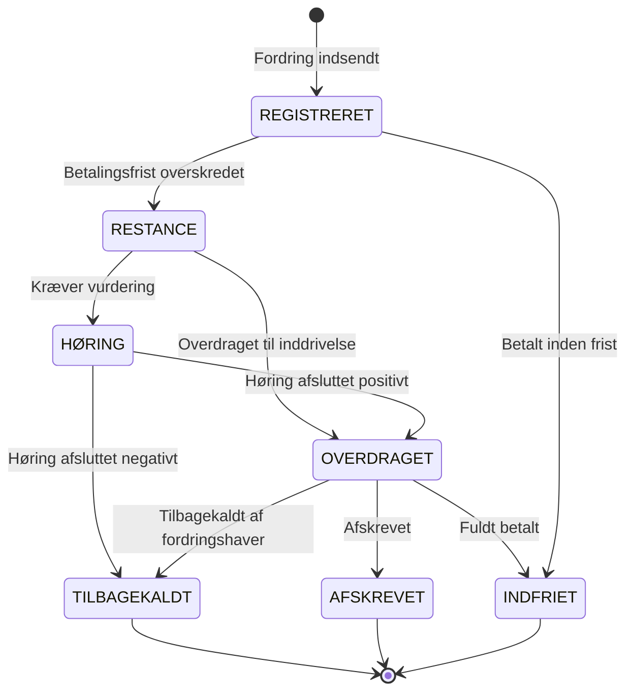

# Fordringens livscyklus

Enhver fordring i OpenDebt gennemgår en livscyklus med klart definerede tilstande og overgange.

## Tilstande

## Tilstandsbeskrivelser

### REGISTRERET

Fordringen er modtaget og registreret i systemet. Skyldneren har stadig mulighed for at betale inden betalingsfristen.

### RESTANCE

Betalingsfristen er overskredet, og skyldneren har ikke betalt det fulde beløb. Fordringen er nu en restance og kan overdrages til inddrivelse.

### HØRING

Fordringen er under vurdering. Dette kan skyldes, at skyldneren har gjort indsigelse, eller at fordringen kræver yderligere dokumentation.

### OVERDRAGET

Fordringen er overdraget til inddrivelse hos Gældsstyrelsen. Inddrivelsesskridt (modregning, lønindeholdelse, udlæg) kan nu iværksættes.

Fra dette tidspunkt begynder **inddrivelsesrente** at løbe (5,75% p.a. pr. 1. januar 2026).

### TILBAGEKALDT

Fordringen er trukket tilbage. Årsagskoder:

| Kode | Årsag | Konsekvens |
|------|-------|------------|
| KLAG | Klage med opsættende virkning | Fordringen låses; kan genindsedes |
| HENS | Henstand givet af fordringshaver | Fordringen låses; kan genindsedes |
| FEJL | Fejl i fordringen | Dækninger ophæves; kan IKKE genindsedes |
| ANDET | Øvrige årsager | Fordringen lukkes |

### AFSKREVET

Fordringen er afskrevet og ikke længere under inddrivelse. Typiske årsager:

- Forældelse (forældelsesfrist nået)
- Konkurs
- Gældssanering
- Dødsbo

### INDFRIET

Fordringen er fuldt betalt. Hovedstol, renter og gebyrer er dækket.

## Hvad kan du gøre i hver tilstand?

| Tilstand | Opskrivning | Nedskrivning | Tilbagekald | Genindsendelse |
|----------|:-----------:|:------------:|:-----------:|:--------------:|
| REGISTRERET | Ja | Ja | Ja | -- |
| RESTANCE | Ja | Ja | Ja | -- |
| HØRING | Nej | Nej | Ja | -- |
| OVERDRAGET | Ja | Ja | Ja | -- |
| TILBAGEKALDT | Nej | Nej | Nej | Ja (undtagen FEJL) |
| AFSKREVET | Nej | Nej | Nej | Nej |
| INDFRIET | Nej | Nej | Nej | Nej |
