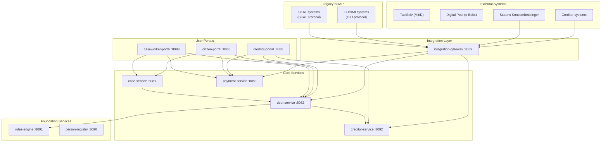
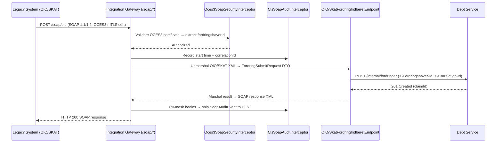
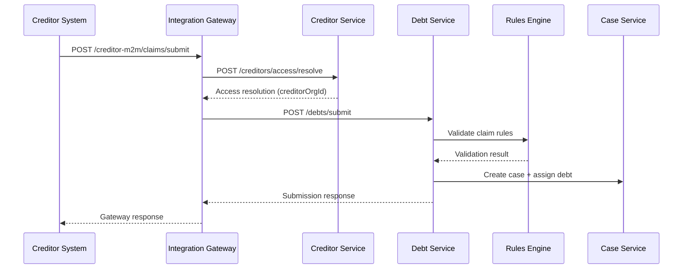
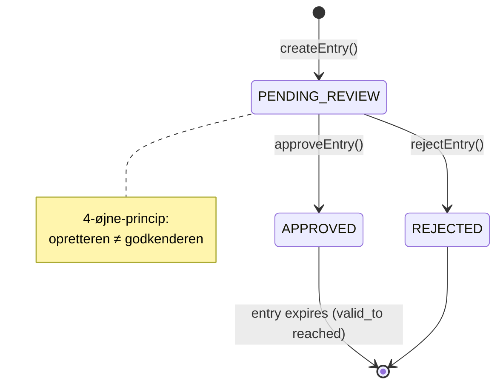

# Architecture

OpenDebt is a microservices-based debt collection system built on Java 21, Spring Boot 3.3, and PostgreSQL 16.

## System overview

## Service inventory

| Service | Port | Responsibility |
|---------|------|----------------|
| debt-service | 8082 | Claim registration, lifecycle management, validation |
| case-service | 8081 | Case management with Flowable BPMN workflows |
| payment-service | 8083 | Payment matching (OCR), bookkeeping (double-entry), debt event log, immudb tamper-evidence (ADR-0029) |
| creditor-service | 8092 | Creditor master data, channel binding, access resolution |
| person-registry | 8090 | GDPR vault for personal data (CPR/CVR encryption) |
| rules-engine | 8091 | Drools-based validation rules |
| integration-gateway | 8089 | DUPLA, SKB CREMUL/DEBMUL, M2M creditor ingress, legacy SOAP (OIO/SKAT, petition019) |
| creditor-portal | 8085 | Fordringshaver web portal (Thymeleaf + HTMX); timeline at `/fordring/{id}/tidslinje` |
| citizen-portal | 8086 | Skyldner web portal (Thymeleaf + HTMX); case detail + timeline at `/cases/{id}/tidslinje` |
| caseworker-portal | 8093 | Sagsbehandler web portal; unified timeline at `/cases/{id}/tidslinje` |
| letter-service | 8084 | Digital Post integration |
| offsetting-service | 8087 | Modregning (set-off) |
| wage-garnishment-service | 8088 | Loenindeholdelse (wage garnishment) |
| opendebt-common | JAR | Shared library: audit infrastructure, DTOs, timeline components (petition050) |
| **immudb** | **3322 (gRPC)** | **Cryptographic tamper-evidence KV store for financial ledger entries (ADR-0029)** |

## Technology stack

| Layer | Technology |
|-------|-----------|
| Language | Java 21 |
| Framework | Spring Boot 3.5 |
| Database | PostgreSQL 16 |
| Authentication | Keycloak (OAuth2/OIDC) |
| Rules engine | Drools |
| Workflow engine | Flowable BPMN |
| Tamper-evidence ledger | immudb 1.10 + immudb4j 1.0.1 |
| API gateway | DUPLA (external), integration-gateway (internal) |
| Frontend | Thymeleaf + HTMX |
| Observability | Grafana + Prometheus + Loki + Tempo |
| Deployment | Kubernetes |
| Build | Maven |

## Data flow: Legacy SOAP claim submission (petition019)

## Data flow: Claim submission

## Business configuration (petition 046/047)

Time-versioned business values (interest rates, fees, thresholds) are stored in the `business_config` table in **debt-service** and accessed via `BusinessConfigService`. No configuration lives in `application.yml` for business values.

When `RATE_NB_UDLAAN` is created or updated, three derived rate entries are automatically computed and created as `PENDING_REVIEW`:

| Config key | Derivation |
|------------|------------|
| `RATE_INDR_STD` | NB + 4 pp |
| `RATE_INDR_TOLD` | NB + 2 pp |
| `RATE_INDR_TOLD_AFD` | NB + 1 pp |

The `InterestAccrualJob` and `InterestRecalculationService` resolve the effective rate per day, splitting interest periods at rate-change boundaries (see petition 045/046 implementation).

## Key architectural decisions

See the [ADR Index](adr-index.md) for all decisions. The most impactful are:

- **ADR-0007**: No cross-service database connections
- **ADR-0014**: GDPR data isolation in person-registry
- **ADR-0018**: Double-entry bookkeeping for payments
- **ADR-0019**: Orchestration over event-driven architecture
- **ADR-0024**: Observability with Grafana stack
- **ADR-0029**: immudb for cryptographic financial ledger integrity (conditionally accepted; pending TB-028-a HDP validation)
- **ADR-0030**: SOAP legacy gateway (OIO/SKAT protocols via `integration-gateway`)
