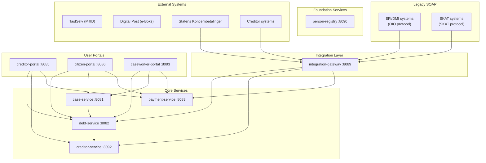
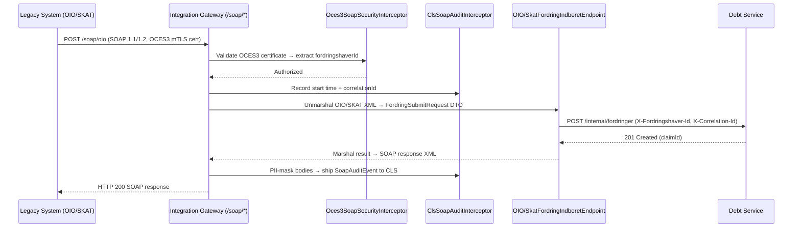
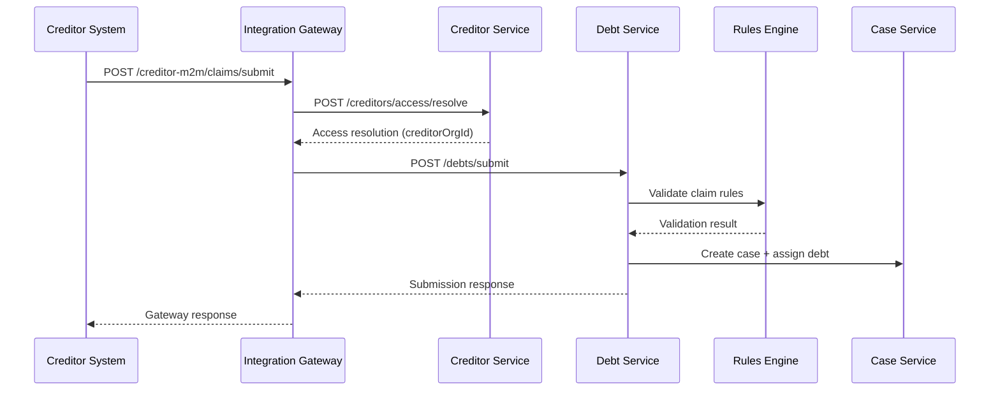
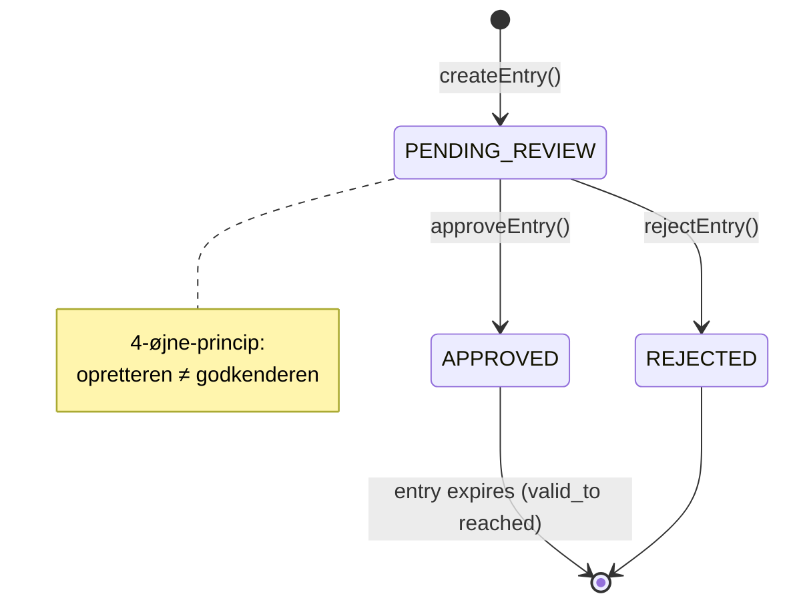

# Architecture

OpenDebt is a microservices-based debt collection system built on Java 21, Spring Boot 3.5, and PostgreSQL 16.

## System overview

Drools rules are packaged in `ufst-rules-lib` and executed in-process by consumer services per
ADR-0035. There is no standalone `rules-engine` runtime service.

## Service inventory

| Service | Port | Responsibility |
|---------|------|----------------|
| debt-service | 8082 | Claim registration, lifecycle management, validation, set-off (ADR-0027) |
| case-service | 8081 | Case management with Flowable BPMN workflows |
| payment-service | 8083 | Payment matching (OCR), bookkeeping (double-entry), debt event log, immudb tamper-evidence (ADR-0029) |
| creditor-service | 8092 | Creditor master data, channel binding, access resolution, citizen-safe creditor display names |
| person-registry | 8090 | GDPR vault for personal data (CPR/CVR encryption) |
| integration-gateway | 8089 | DUPLA, SKB CREMUL/DEBMUL, M2M creditor ingress, legacy SOAP (OIO/SKAT, petition019) |
| creditor-portal | 8085 | Fordringshaver web portal (Thymeleaf + HTMX); timeline at `/fordring/{id}/tidslinje` |
| citizen-portal | 8086 | Skyldner web portal (Thymeleaf + HTMX); debt overview at `/min-gaeld`; case detail + timeline at `/cases/{id}/tidslinje` |
| caseworker-portal | 8093 | Sagsbehandler web portal; unified timeline at `/cases/{id}/tidslinje` |
| letter-service | 8084 | Digital Post integration |
| wage-garnishment-service | 8088 | Loenindeholdelse (wage garnishment) |
| opendebt-common | JAR | Shared library: audit infrastructure, DTOs, timeline components (petition050) |
| ufst-rules-lib | JAR | Shared library: in-process Drools rules and KIE container wiring (ADR-0035) |
| **immudb** | **3322 (gRPC)** | **Cryptographic tamper-evidence KV store for financial ledger entries (ADR-0029)** |

## Technology stack

## Citizen debt overview (petition026)

The petition026 debt overview is split across three services:

- `citizen-portal` owns the authenticated `/min-gaeld` page, pagination links, accessible
  no-debt/service-unavailable states, and the OAuth2-aware `WebClient.Builder` used outside
  `dev/test`.
- `debt-service` owns `GET /api/v1/citizen/debts`, including bearer-auth protection, `pageNumber` /
  `pageSize`, person scoping, citizen-safe status mapping, and page-level `effectiveInterestRates`.
- `creditor-service` remains the source for creditor projection data and now exposes a
  citizen-safe `displayName` so the portal does not fan out to creditor-service directly.

| Layer | Technology |
|-------|-----------|
| Language | Java 21 |
| Framework | Spring Boot 3.5 |
| Database | PostgreSQL 16 |
| Authentication | Keycloak (OAuth2/OIDC) |
| Rules engine | Drools via `ufst-rules-lib` (in-process) |
| Workflow engine | Flowable BPMN |
| Tamper-evidence ledger | immudb 1.10 + immudb4j 1.0.1 |
| API gateway | DUPLA (external), integration-gateway (internal) |
| Frontend | Thymeleaf + HTMX |
| Observability | Grafana + Prometheus + Loki + Tempo |
| Deployment | Kubernetes |
| Build | Maven |

## Data flow: Legacy SOAP claim submission (petition019)

## Data flow: Claim submission

## Business configuration (petition 046/047)

Time-versioned business values (interest rates, fees, thresholds) are stored in the `business_config` table in **debt-service** and accessed via `BusinessConfigService`. No configuration lives in `application.yml` for business values.

When `RATE_NB_UDLAAN` is created or updated, three derived rate entries are automatically computed and created as `PENDING_REVIEW`:

| Config key | Derivation |
|------------|------------|
| `RATE_INDR_STD` | NB + 4 pp |
| `RATE_INDR_TOLD` | NB + 2 pp |
| `RATE_INDR_TOLD_AFD` | NB + 1 pp |

The `InterestAccrualJob` and `InterestRecalculationService` resolve the effective rate per day, splitting interest periods at rate-change boundaries (see petition 045/046 implementation).

## Limitation capability (petition059)

ADR-0038 defines the petition059 boundary: **debt-service** keeps the public limitation surface, **case-service** owns the objection workflow lifecycle, **wage-garnishment-service** exposes an internal fact seam used by limitation rules, and **caseworker-portal** renders the caseworker-facing limitation panel on claim detail.

| Service | Petition059 responsibility |
|---------|----------------------------|
| `debt-service` | Authoritative limitation state, interruption registration, supplementary periods, claim-complex maintenance, and the public objection façade |
| `case-service` | Internal limitation-objection workflow creation and decision recording |
| `wage-garnishment-service` | Internal wage-garnishment facts used to determine whether garnishment interrupts limitation |
| `caseworker-portal` | Read-only/read-write limitation panel for caseworkers on claim detail pages |

The limitation policy engine in debt-service is wired through an injected `limitationClock` bean. That keeps date-based calculations deterministic in tests and reproducible across environments, which is the relevant petition059 NFR-1 concern.

The capability also follows ADR-0014 privacy constraints. Cross-service contracts use technical references only — `fordringId`, `debtorPersonId`, `kompleksId`, and `workflowCaseId` — so limitation processing never introduces CPR, names, or addresses outside person-registry.

Claim-complex propagation is modeled explicitly. `FordringskompleksLink` groups related fordringer, and when a legally effective interruption applies to one member, debt-service records propagated `AfbrydelseEvent` entries for the linked members with source/target claim references and a propagation reason. That keeps the recalculated expiry dates auditable without adding cross-service database coupling.

## Section-50 retskraft evaluation capability (petition060)

Petition060 adds a debt-service-local section-50 capability for generating and persisting retskraft evaluation worklists per debtor. The runtime stores four technical-ID-only tables: candidate items, worklists, ranked worklist entries, and decision snapshots with an input hash for reproducibility. That keeps the legal ordering evidence auditable without leaking CPR, names, or addresses outside person-registry.

The ordering engine supports four paths: default section-50 ordering, discretionary data-error ordering, voluntary-payment surplus windowing that reuses GIL section-4 principal order via an internal client seam, and modregning windowing with an explicit no-modregning outcome. Overrides and expedited deviations are persisted on the existing worklist so the decision trail remains inspectable through one petition060 surface.

The caseworker-facing petition060 surface now lives in `caseworker-portal` at `/debtors/{debtorId}/retskraft-worklists/{worklistId}` (under the portal context path `/caseworker-portal`). That page is intentionally a direct inspection route: it renders override reason, deviation reason, modregning outcome, ranked entries, and the decision snapshot using technical identifiers only, while debt-service remains the sole owner of the legal state and persistence.

## Key architectural decisions

See the [ADR Index](adr-index.md) for all decisions. The most impactful are:

- **ADR-0007**: No cross-service database connections
- **ADR-0014**: GDPR data isolation in person-registry
- **ADR-0018**: Double-entry bookkeeping — every financial transaction posts to the payment-service ledger (see amendment #3); local journal tables are not a substitute
- **ADR-0019**: Orchestration over event-driven architecture
- **ADR-0024**: Observability with Grafana stack
- **ADR-0029**: immudb for cryptographic financial ledger integrity (conditionally accepted; pending TB-028-a HDP validation)
- **ADR-0030**: SOAP legacy gateway (OIO/SKAT protocols via `integration-gateway`)
- **ADR-0038**: Limitation objection boundary with debt-service façade and case-service workflow ownership
