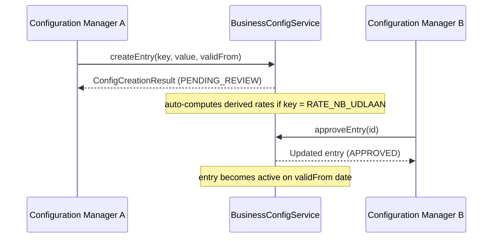

# Developer Guide

This guide helps new contributors get OpenDebt running locally and understand the development workflow.

## Prerequisites

| Tool | Version | Purpose |
|------|---------|---------|
| Java | 21 (LTS) | Runtime and compilation |
| Maven | 3.9+ | Build tool |
| Docker + Docker Compose | Latest | PostgreSQL, Keycloak, observability stack |
| Git | 2.40+ | Version control |

## Repository structure

```
opendebt/
├── opendebt-common/              # Shared DTOs, exceptions, audit infrastructure
├── opendebt-debt-service/        # Claim registration, lifecycle, validation (:8082)
├── opendebt-case-service/        # Case management with Flowable BPMN (:8081)
├── opendebt-payment-service/     # Payment matching, bookkeeping (:8083)
├── opendebt-creditor-service/    # Creditor master data, channel binding (:8092)
├── opendebt-person-registry/     # GDPR vault for PII (CPR/CVR) (:8090)
├── opendebt-creditor-portal/     # Creditor-facing Thymeleaf+HTMX portal (:8085)
├── opendebt-citizen-portal/      # Citizen-facing portal (:8086)
├── opendebt-caseworker-portal/   # Caseworker portal (:8093)
├── opendebt-integration-gateway/ # DUPLA, SKB, M2M ingress (:8089)
├── opendebt-rules-engine/        # Drools validation rules (:8091)
├── opendebt-letter-service/      # Digital Post integration (:8084)
├── opendebt-offsetting-service/  # Modregning (set-off) (:8087)
├── opendebt-wage-garnishment-service/ # Loenindeholdelse (:8088)
├── api-specs/                    # OpenAPI 3.1 specifications
├── config/                       # Keycloak realm, PostgreSQL init scripts
├── docs/                         # Architecture docs, ADRs, begrebsmodel
├── petitions/                    # Feature petitions and execution plans
└── k8s/                          # Kubernetes manifests
```

## Building the project

```bash
# Full build with tests and formatting check
mvn clean verify

# Fix code formatting (required before commit)
mvn spotless:apply

# Build without tests (fast)
mvn clean package -DskipTests

# Build a single module
mvn test -pl opendebt-debt-service
```

## Local development setup

### 1. Start infrastructure

```bash
docker compose up -d postgres keycloak
```

This starts:

- **PostgreSQL 16** on port 5432 (user: `opendebt`, password: `opendebt`, 8 databases auto-created)
- **Keycloak 24** on port 8080 (admin: `admin`/`admin`, realm `opendebt` auto-imported)

To also start **immudb** (required when running `payment-service` with `opendebt.immudb.enabled=true`):

```bash
docker compose up -d postgres keycloak immudb
```

- **immudb 1.10** on port 3322 (gRPC) — default credentials: `immudb` / `immudb`
- immudb web console: http://localhost:8094 (shows Document Store; KV ledger data is in the KV namespace, not visible in the browser UI — use `docs/spike/immudb-view.py` to inspect)

To include the observability stack with the provisioned RBAC dashboard and alerts:

```bash
docker compose -f docker-compose.yml -f docker-compose.observability.yml up -d
```

Grafana loads dashboard JSON files from `config/grafana/provisioning/dashboards/` and alert-rule templates from `config/grafana/provisioning/alerting/` on startup.

### 2. Run a service

```bash
cd opendebt-debt-service
mvn spring-boot:run
```

Or run the main class from your IDE with the Spring profile `dev`.

### 3. Access Swagger UI

Each service exposes Swagger UI at `http://localhost:{port}/{context-path}/swagger-ui.html`.

For example: `http://localhost:8082/debt-service/swagger-ui.html`

## Coding conventions

### Package structure

```
dk.ufst.opendebt.<service>/
├── config/          # Spring @Configuration classes
├── controller/      # @RestController classes
├── service/         # Business logic interfaces
│   └── impl/        # Service implementations
├── client/          # WebClient-based clients for other services
├── dto/             # Data transfer objects
├── mapper/          # MapStruct mappers
└── exception/       # Custom exceptions
```

### Naming

- **Classes**: PascalCase (`DebtController`, `CaseService`)
- **Methods**: camelCase (`createDebt`, `validateReadiness`)
- **REST endpoints**: kebab-case (`/api/v1/debt-types`)
- **JSON fields**: camelCase (`debtorId`, `principalAmount`)
- **Database columns**: snake_case (`debtor_person_id`)

### Domain terminology

All code uses **English**. Danish domain terms are mapped to English equivalents via the begrebsmodel (see [Domain Model](domain-model.md)). Danish appears only in i18n message bundles (`messages_da.properties`).

### Key architectural rules

1. **No cross-service database access** (ADR-0007): Each service owns its database. Cross-service data access is via REST APIs.
2. **GDPR data isolation** (ADR-0014): All PII (CPR, CVR, names, addresses) is stored only in `person-registry`. Other services store `person_id` UUIDs.
3. **Injected WebClient.Builder** (ADR-0024): Never use `WebClient.create()`. Always inject `WebClient.Builder` for distributed trace propagation.
4. **Security annotations**: Every endpoint must have `@PreAuthorize` with appropriate role checks.
5. **immudb writes are non-blocking** (ADR-0029): The `ImmuLedgerClient.appendAsync()` call must never block or roll back the PostgreSQL `@Transactional` path. immudb failure is logged and handled asynchronously.

### Time-versioned entities pattern (petition 046)

Business values that change over time (interest rates, fees, thresholds) are stored as immutable versioned rows in `business_config`, **not** in `application.yml`. Each entry has a `valid_from` / `valid_to` validity window.

```java
// Resolve the effective rate on a specific date
BigDecimal rate = businessConfigService.getDecimalValue("RATE_INDR_STD", LocalDate.now());
```

New entries are created with `ReviewStatus.PENDING_REVIEW` and require approval before they become effective. `BusinessConfigService` caches the resolved values and exposes `clearCache()` for batch job use.

When an NB-rate entry (`RATE_NB_UDLAAN`) is approved, the three derived standard rates are auto-computed and created as new `PENDING_REVIEW` entries.

See [API Reference](api-reference.md) for the `/api/v1/config` endpoints and the [Konfiguration](../sagsbehandler/konfiguration.md) user guide.

### Config approval workflow



See [AGENTS.md](https://github.com/ufst/opendebt/blob/main/AGENTS.md) for the complete coding guidelines.

## Testing

### Unit tests

- Framework: JUnit 5 + Mockito
- Coverage targets: 80% line coverage, 70% branch coverage
- Pattern: Mock dependencies, test service logic in isolation

### BDD tests

- Framework: Cucumber with JUnit Platform
- Feature files: `src/test/resources/features/*.feature`
- Step definitions: `src/test/java/.../steps/*.java`
- Each petition has corresponding BDD scenarios

### Architecture tests

- Framework: ArchUnit
- Shared rules in `opendebt-common` (`SharedArchRules.java`):
    - `ENTITIES_MUST_NOT_STORE_PII` -- no PII field names in `@Entity` classes
    - `noAccessToOtherServiceRepositories()` -- no cross-service DB imports

### Running tests

```bash
# All tests for a module
mvn test -pl opendebt-debt-service

# All tests across all modules
mvn test

# Full verification (tests + spotless + coverage)
mvn verify
```

## Contribution workflow

OpenDebt uses an **AI-driven petition pipeline** orchestrated by Gas City. Work flows
from petition → agents → human review gates → merge. Here is what the process looks
like from a developer or contributor perspective.

### Starting work

Work items live in three places, at different granularities:

| Tracker | Granularity | Tool |
|---|---|---|
| **Beads** | Sprint subtasks and pipeline steps | `bd` CLI |
| **Wasteland** | Petition-level wanted board (federated, visible to all rigs) | `dolt` + DoltHub |
| `petitions/program-status.yaml` | Programme-level petition status | YAML + Git |

To find unblocked work ready to start:

```bash
bd ready          # sprint-level items ready to claim
```

Or browse the federated wanted board:

```bash
cd ~/.hop/commons/mfhens/ufst
dolt pull origin main
dolt sql -q "SELECT id, title, status, effort_level FROM wanted WHERE status='open' ORDER BY priority"
```

### Submitting a petition (automated pipeline)

The full pipeline runs via Gas City:

```bash
gc start ~/GitHub/opendebt        # start the orchestrator
bd list --assignee human          # find your review gates
bd close <id> "Approved"          # release a gate
gc stop ~/GitHub/opendebt         # stop when done
```

See [Gas City](gas-city.md) for the complete workflow, agent roles, and
troubleshooting guide.

### Manual contribution (without Gas City)

1. Create a feature branch from `main`
2. Implement the change following coding conventions
3. Write/update tests (unit + BDD where applicable)
4. Run `mvn spotless:apply` to fix formatting
5. Run `mvn verify` to ensure all checks pass
6. Commit using the conventional commit format: `type(scope): description`
   ```
   feat(debt-service): add fordring suspension endpoint (P055)
   
   Co-authored-by: Copilot <223556219+Copilot@users.noreply.github.com>
   ```
7. Open a pull request against `main`

### Marking work complete in the Wasteland

When a petition or technical backlog item is implemented, update the federated registry:

```bash
cd ~/.hop/commons/mfhens/ufst
GIT_SHA=$(git -C ~/GitHub/opendebt rev-parse --short HEAD)
dolt sql -q "INSERT IGNORE INTO completions \
  (id, wanted_id, completed_by, evidence, completed_at) \
  VALUES ('<petition-id>-cmp', '<petition-id>', 'mfhens', 'commit:${GIT_SHA}', NOW())"
dolt sql -q "UPDATE wanted SET status='done' WHERE id='<petition-id>'"
dolt add . && dolt commit -m 'complete: <petition-id>' && dolt push origin main
```

### Session close checklist

Every work session must end with all three stores pushed:

```bash
git pull --rebase && git push                          # code
bd dolt push                                           # beads
cd ~/.hop/commons/mfhens/ufst && dolt push origin main  # wasteland
```

## Documentation

Documentation is built with MkDocs. To preview locally:

```bash
pip install -r requirements-docs.txt
mkdocs serve
```

The site is available at `http://localhost:8000`.
