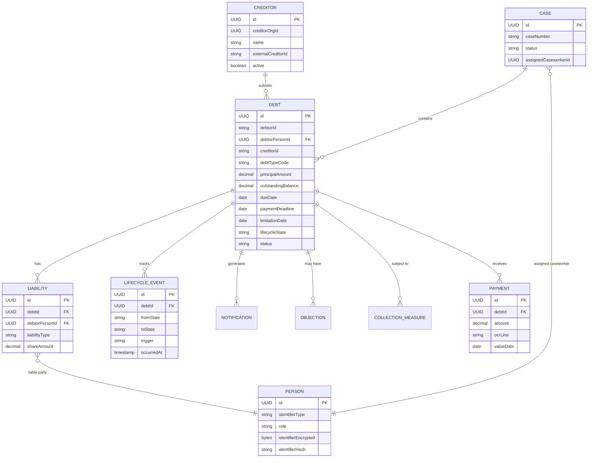
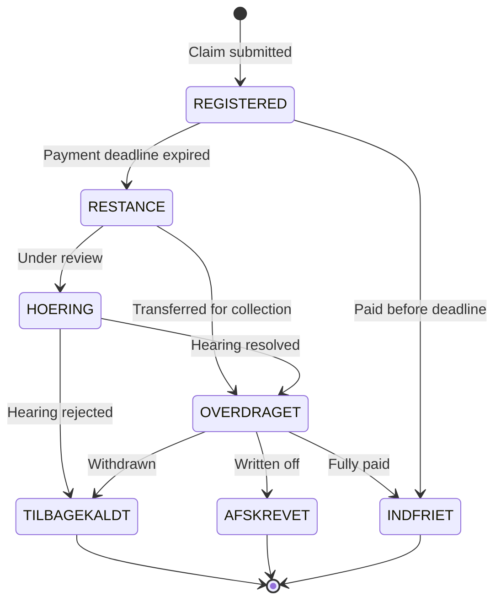

# Domain Model

OpenDebt follows the UFST begrebsmodel (concept model) for Danish public debt collection. All source code uses **English** terms; the mapping below is the canonical reference.

## Terminology mapping

| Danish (begrebsmodel) | English (code) | Example usage |
|----------------------|----------------|---------------|
| Fordringshaver | Creditor | `CreditorService`, `creditor_org_id` |
| Skyldner | Debtor | `DebtorPersonId`, `debtor_person_id` |
| Fordring | Claim / Debt | `DebtEntity`, `/api/v1/debts` |
| Restance | Overdue Claim | `ClaimLifecycleState.RESTANCE` |
| Fordringstype | Claim Type | `debtTypeCode` |
| Hovedstol | Principal | `principalAmount` |
| Betalingsfrist | Payment Deadline | `paymentDeadline` |
| Forældelse | Limitation | `limitationDate` |
| Overdragelse til inddrivelse | Transfer for Collection | `transferForCollection()` |
| Inddrivelsesskridt | Collection Measure | `CollectionMeasure` |
| Modregning | Set-off | `offsetting-service` |
| Lønindeholdelse | Wage Garnishment | `wage-garnishment-service` |
| Udlæg | Attachment | `AttachmentService` |
| Hæftelse | Liability | `LiabilityEntity` |
| Indsigelse | Objection | `ObjectionService` |
| Underretning | Notification | `NotificationService` |
| Påkrav | Demand for Payment | `PAAKRAV` |
| Rykker | Reminder Notice | `RYKKER` |
| Inddrivelsesrente | Recovery Interest | `recoveryInterestRate` |
| Regulering | Claim Adjustment | `ClaimAdjustmentEvent` |
| Opskrivning | Write-up | write-up endpoint |
| Nedskrivning | Write-down | `/debts/{id}/write-down` |
| Tilbagekald | Withdrawal | `TILBAGEKALDT` state |
| Høring | Hearing | `HOERING` state |
| Sag | Case | `CaseEntity` |
| Rentesats | Interest Rate | `interestRate`, `RATE_NB_UDLAAN` |
| Konfiguration | Business Configuration | `BusinessConfigEntity`, `/api/v1/config` |
| Konfigurationspost | Config Entry | `BusinessConfigEntity` instance |
| Gyldighedsperiode | Validity Period | `validFrom` / `validTo` on config entries |
| Godkendelse | Approval | `ReviewStatus.APPROVED` |
| Afventer godkendelse | Pending Review | `ReviewStatus.PENDING_REVIEW` |
| Afledt sats | Derived Rate | auto-computed from `RATE_NB_UDLAAN` |
| Rentejournal | Interest Journal | `InterestJournalEntry` |
| Rentegrænse | Rate Boundary | year-boundary split in interest recalculation |
| Dækning | Recovery / Payment applied | payment matching |
| Dækningsrækkefølge | Coverage Priority | interest before fees before principal |

## Entity relationships

## Claim lifecycle states

For the full begrebsmodel, see `docs/begrebsmodel/Inddrivelse-begrebsmodel-UFST-v3.md` in the repository.
