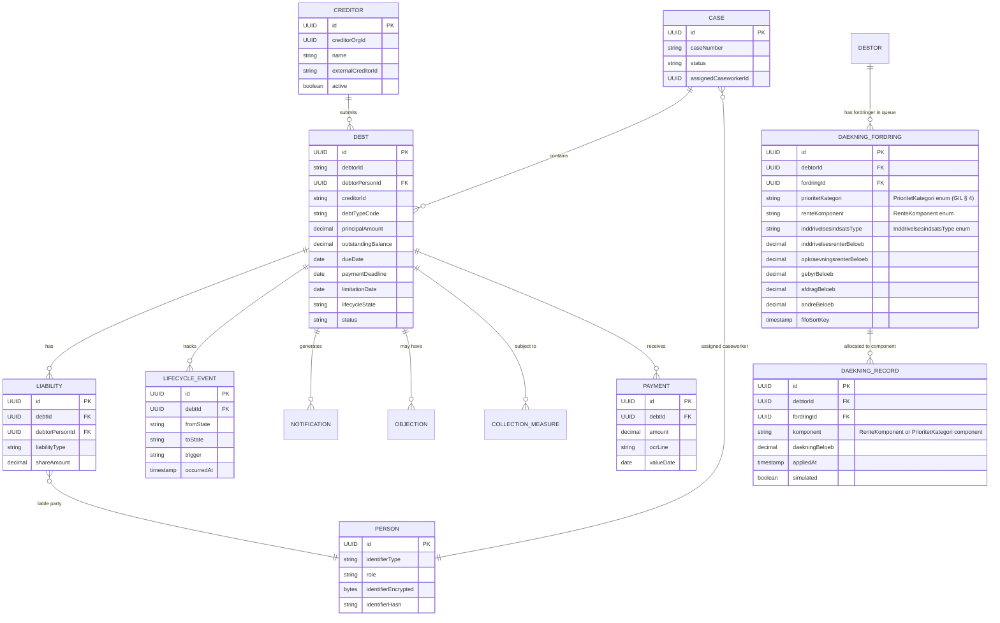
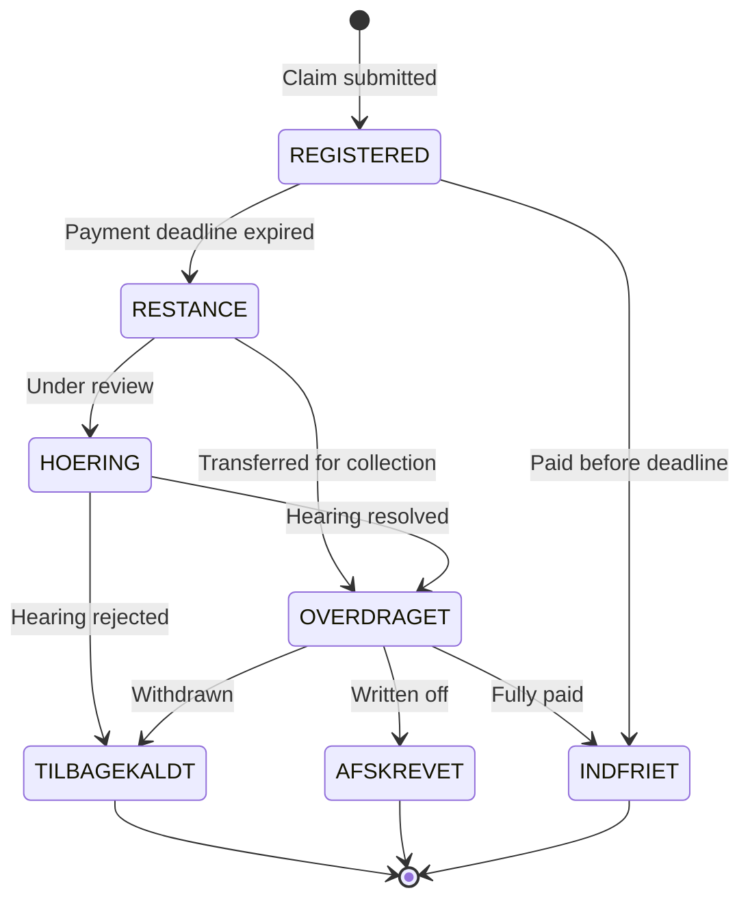

# Domain Model

OpenDebt follows the UFST begrebsmodel (concept model) for Danish public debt collection. All source code uses **English** terms; the mapping below is the canonical reference.

## Terminology mapping

| Danish (begrebsmodel) | English (code) | Example usage |
|----------------------|----------------|---------------|
| Fordringshaver | Creditor | `CreditorService`, `creditor_org_id` |
| Skyldner | Debtor | `DebtorPersonId`, `debtor_person_id` |
| Fordring | Claim / Debt | `DebtEntity`, `/api/v1/debts` |
| Restance | Overdue Claim | `ClaimLifecycleState.RESTANCE` |
| Fordringstype | Claim Type | `debtTypeCode` |
| Hovedstol | Principal | `principalAmount` |
| Betalingsfrist | Payment Deadline | `paymentDeadline` |
| Forældelse | Limitation | `limitationDate` |
| Overdragelse til inddrivelse | Transfer for Collection | `transferForCollection()` |
| Inddrivelsesskridt | Collection Measure | `CollectionMeasure` |
| Modregning | Set-off | `ModregningService` in `debt-service` |
| Lønindeholdelse | Wage Garnishment | `wage-garnishment-service` |
| Udlæg | Attachment | `AttachmentService` |
| Hæftelse | Liability | `LiabilityEntity` |
| Indsigelse | Objection | `ObjectionService` |
| Underretning | Notification | `NotificationService` |
| Påkrav | Demand for Payment | `PAAKRAV` |
| Rykker | Reminder Notice | `RYKKER` |
| Inddrivelsesrente | Recovery Interest | `recoveryInterestRate` |
| Regulering | Claim Adjustment | `ClaimAdjustmentEvent` |
| Opskrivning | Write-up | write-up endpoint |
| Nedskrivning | Write-down | `/debts/{id}/write-down` |
| Tilbagekald | Withdrawal | `TILBAGEKALDT` state |
| Høring | Hearing | `HOERING` state |
| Sag | Case | `CaseEntity` |
| Rentesats | Interest Rate | `interestRate`, `RATE_NB_UDLAAN` |
| Konfiguration | Business Configuration | `BusinessConfigEntity`, `/api/v1/config` |
| Konfigurationspost | Config Entry | `BusinessConfigEntity` instance |
| Gyldighedsperiode | Validity Period | `validFrom` / `validTo` on config entries |
| Godkendelse | Approval | `ReviewStatus.APPROVED` |
| Afventer godkendelse | Pending Review | `ReviewStatus.PENDING_REVIEW` |
| Afledt sats | Derived Rate | auto-computed from `RATE_NB_UDLAAN` |
| Rentejournal | Interest Journal | `InterestJournalEntry` |
| Rentegrænse | Rate Boundary | year-boundary split in interest recalculation |
| Dækning | Recovery / Payment applied | payment matching |
| Dækningsrækkefølge | Coverage Priority / Payment Application Order | GIL § 4 — 5-category priority sort + FIFO |
| Prioritetkategori | Priority Category | `PrioritetKategori` enum (INDDRIVELSESRENTER, OPKRAEVNINGSRENTER, GEBYRER, AFDRAG, ANDRE) |
| Rentekomponent | Interest Component | `RenteKomponent` enum — 6 sub-positions for inddrivelsesrenter allocation (GIL § 4 stk. 1–4) |
| Inddrivelsesindsats | Collection Effort Type | `InddrivelsesindsatsType` enum (LOENINDEHOLDELSE, UDLAEG, BEGGE, INGEN) — determines stk. 3 surplus routing |
| Dækningspost | Payment Application Record | `DaekningRecord` — immutable audit record written per fordring component |

## Entity relationships

## Limitation domain entities (petition059)

| Entity | Service | Purpose | Key fields |
|--------|---------|---------|------------|
| `ForaeldelseRecord` | debt-service | Authoritative limitation state for one `fordring` | `fordringId`, `debtorPersonId`, `retsgrundlag`, `udskydelseDato`, `inUdskydelse`, `currentFristExpires`, `status`, `kompleksId` |
| `AfbrydelseEvent` | debt-service | Records a legally effective interruption and any claim-complex propagation | `fordringId`, `type`, `eventDate`, `newFristExpires`, `legalReference`, `sourceFordringId`, `targetFordringId`, `propagationReason` |
| `TillaegsfristEvent` | debt-service | Records a supplementary limitation period | `fordringId`, `type`, `appliedDate`, `extensionYears`, `newFristExpires`, `legalReference` |
| `FordringskompleksLink` | debt-service | Links a `fordring` into a claim complex used for propagation | `kompleksId`, `fordringId`, `linkedAt` |
| `LimitationObjectionLinkage` | debt-service | Keeps the debt-service reference from `indsigelsesId` to the case-service workflow record | `fordringId`, `indsigelsesId`, `workflowCaseId`, `status`, `rationale` |

`ForaeldelseRecord`, `AfbrydelseEvent`, `TillaegsfristEvent`, and `LimitationObjectionLinkage` extend `AuditableEntity`, so creation/update metadata is captured without introducing PII into the limitation model.

## Retskraft evaluation entities (petition060)

| Entity | Service | Purpose | Key fields |
|--------|---------|---------|------------|
| `Section50CandidateItemEntity` | debt-service | Candidate principal/accessory item prepared for section-50 evaluation | `debtorPersonId`, `claimId`, `itemType`, `claimCategory`, `amount`, `suspectedDataError`, `confirmedRetskraft`, `accessoryOfClaimId` |
| `Section50WorklistEntity` | debt-service | One persisted petition060 worklist per generation/override cycle | `debtorPersonId`, `contextType`, `orderingMode`, `legalReference`, `amountWindow`, `selectedNextItemId`, `overrideReason`, `modregningOutcome` |
| `Section50WorklistEntryEntity` | debt-service | Ranked entry within one petition060 worklist | `worklistId`, `rankOrder`, `claimId`, `itemType`, `claimCategory`, `withinAmountWindow`, `selectionReason`, `prioritisationFactors`, `amount` |
| `Section50DecisionSnapshotEntity` | debt-service | Reproducible decision metadata for audit and caseworker inspection | `worklistId`, `rulePath`, `inputHash`, `selectedNextItemId`, `legalReference`, `auditEventId`, `origin`, `occurredAt`, `notes` |

### Limitation enums

| Enum | Values | Notes |
|------|--------|-------|
| `Retsgrundlag` | `ORDINARY`, `SPECIAL` | Persisted on `ForaeldelseRecord` to distinguish ordinary and special legal basis calculations |
| `AfbrydelsesType` | `BEROSTILLELSE`, `LOENINDEHOLDELSE`, `MODREGNING`, `UDLAEG` | Stored on `AfbrydelseEvent` |
| `ForaeldelseStatus` | `ACTIVE`, `FORAELDET`, `INDSIGELSE_PENDING` | Public limitation-state values exposed on `ForaeldelseStatusDto` |
| `ObjectionStatus` | `ACTIVE`, `FORAELDET`, `INDSIGELSE_PENDING` | Current implementation value set stored on `LimitationObjectionLinkage.status`; internal workflow commands use `VALID` / `INVALID` as decision outcomes |

## Claim lifecycle states

For the full begrebsmodel, see `docs/begrebsmodel/Inddrivelse-begrebsmodel-UFST-v3.md` in the repository.
