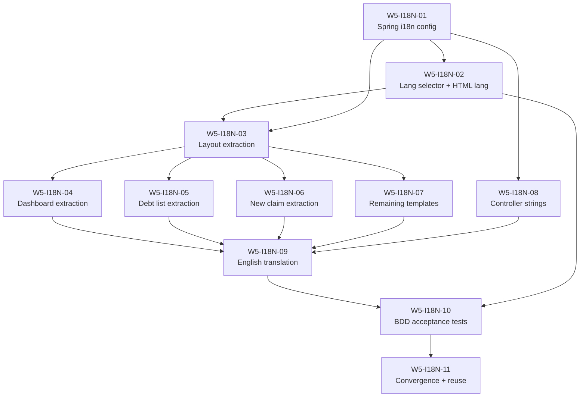

# Execution Plan — 2026-03-16

## Wave 5: Internationalization (i18n) for petition021

| Field | Value |
|---|---|
| Scope | Wave 5 — petition021 (Internationalization / i18n) |
| Basis | petition021 petition, outcome contract, creditor-portal template audit, program-status.yaml |
| Phase | phase-5 (Cross-cutting quality and observability) |
| Sprints | sprint-8 (infrastructure + extraction), sprint-9 (translation + acceptance) |
| Tickets | W5-I18N-01 through W5-I18N-11 |
| Dependencies | Wave 3 creditor portal must be complete (it is) |

## Current state assessment

### Creditor portal (opendebt-creditor-portal)

The creditor portal is fully functional with 8 Thymeleaf templates and 48 passing tests (39 unit + 9 BDD). **All user-facing text is hardcoded in Danish.** There are:

- **Zero** `messages.properties` files
- **Zero** `MessageSource` configuration
- **Zero** `LocaleResolver` or `LocaleChangeInterceptor` beans
- **Zero** `#{...}` message expressions in templates

Templates requiring i18n extraction:

| Template | Hardcoded strings (approx.) | Complexity |
|---|---|---|
| `layout/default.html` | ~15 (skip-link, nav items, breadcrumb label, footer link, title pattern) | Medium — shared layout affects all pages |
| `index.html` | ~30 (headings, profile labels, card titles/descriptions, buttons, alerts, form labels/hints) | High — most text-dense page |
| `fordringer.html` | ~12 (heading, column headers, empty state, buttons, success placeholder) | Low |
| `fordring-ny.html` | ~18 (heading, form labels, validation summary, buttons, acting-on-behalf-of text) | Medium — form labels need careful key naming |
| `sager.html` | ~8 (heading, column headers, empty state, under-dev notice, button) | Low |
| `error.html` | ~5 (heading, default error message, button) | Low |
| `was.html` | ~40 (accessibility statement — many paragraphs, section headings, contact info) | High — long-form content |
| `fragments/form-field.html` | ~2 (default label, default error) | Low |
| **Java controllers** | ~8 (DashboardController error strings, FordringController messages) | Medium |

**Estimated total: ~140 message keys** to extract into `messages_da.properties`.

### Citizen portal (opendebt-citizen-portal)

Skeleton only — `CitizenPortalApplication.java` and `application.yml`. No templates exist. Petition022 (landing page) depends on petition021 i18n infrastructure being in place. Wave 5 only needs to ensure the citizen-portal `application.yml` includes the `opendebt.i18n` configuration section so petition022 can build with i18n from the start.

### Translator droid

The `translator-droid` is registered at `.factory/droids/translator.md` and is ready to generate `messages_en_GB.properties` from the Danish source bundle. It preserves key order, placeholders, and applies OpenDebt domain terminology.

## Sprint 8: i18n infrastructure and string extraction

### W5-I18N-01 — Spring i18n infrastructure configuration

| Field | Value |
|---|---|
| Objective | Configure MessageSource, LocaleResolver, and LocaleChangeInterceptor in the creditor-portal |
| Modules | `opendebt-creditor-portal` |
| Depends on | Nothing (Wave 3 is complete) |

This is the foundation ticket. It creates:

1. **`I18nConfig.java`** — A `@Configuration` class in `dk.ufst.opendebt.creditor.config` containing:
   - `ReloadableResourceBundleMessageSource` bean with basename `classpath:messages`, default encoding UTF-8, fallback to system locale disabled, default locale `da`
   - `CookieLocaleResolver` bean with default locale `da-DK`, cookie name `opendebt-lang`, max age 30 days
   - `LocaleChangeInterceptor` bean intercepting the `lang` request parameter

2. **`WebMvcConfig.java`** — A `WebMvcConfigurer` implementation that registers the `LocaleChangeInterceptor` via `addInterceptors()`.

3. **`I18nProperties.java`** — A `@ConfigurationProperties(prefix = "opendebt.i18n")` class with `defaultLocale` and `supportedLocales` list, used by the language selector and future portals.

4. **`application.yml`** update:
   ```yaml
   opendebt:
     i18n:
       default-locale: da-DK
       supported-locales:
         - da-DK
         - en-GB
   ```

5. **`messages_da.properties`** — Empty initially (populated by extraction tickets).

6. **Unit test** verifying that `MessageSource` resolves a test key in Danish and falls back correctly.

### W5-I18N-02 — Dynamic HTML lang attribute and language selector

| Field | Value |
|---|---|
| Objective | Add locale-aware `lang` attribute and language drop-down to the layout header |
| Modules | `opendebt-creditor-portal` |
| Depends on | W5-I18N-01 |

Changes:

1. **`layout/default.html`**: Change `lang="da"` to `th:lang="${#locale.language}"` on the `<html>` element.

2. **`fragments/language-selector.html`**: New Thymeleaf fragment rendering a `<select>` element from the `opendebt.i18n.supported-locales` configuration. Each option displays the language name in its own language ("Dansk", "English"). On change, JavaScript navigates to the current URL with `?lang=<selected>`.

3. **Layout integration**: The language selector fragment is included in the `skat-header__inner` div, positioned after the nav.

4. **CSS**: Add `.skat-lang-select` class in `skat-tokens.css` for consistent styling.

5. **Accessibility**: The `<select>` has `aria-label="#{layout.lang.selector.label}"`.

6. **Controller support**: A `@ControllerAdvice` or `@ModelAttribute` on a base controller exposes `supportedLocales` to all templates.

### W5-I18N-03 — Extract layout/default.html strings

| Field | Value |
|---|---|
| Objective | Replace all hardcoded Danish in the shared layout with `#{...}` expressions |
| Modules | `opendebt-creditor-portal` |
| Depends on | W5-I18N-01, W5-I18N-02 |

Message keys to extract (prefix `layout.`):

| Key | Danish value |
|---|---|
| `layout.skip.link` | Gå til hovedindhold |
| `layout.title.suffix` | OpenDebt Fordringshaverportal |
| `layout.nav.label` | Hovednavigation |
| `layout.nav.citizen` | Borger |
| `layout.nav.business` | Erhverv |
| `layout.nav.search` | Søg |
| `layout.nav.login` | Log på |
| `layout.breadcrumb.label` | Brødkrumme |
| `layout.breadcrumb.home` | Forside |
| `layout.footer.accessibility` | Tilgængelighedserklæring |
| `layout.lang.selector.label` | Vælg sprog |

### W5-I18N-04 — Extract index.html (dashboard) strings

| Field | Value |
|---|---|
| Objective | Replace all hardcoded Danish in the dashboard with `#{...}` expressions |
| Modules | `opendebt-creditor-portal` |
| Depends on | W5-I18N-03 |

Message keys to extract (prefix `dashboard.`):

| Key | Danish value |
|---|---|
| `dashboard.title` | Fordringshaverportal |
| `dashboard.breadcrumb` | Forside |
| `dashboard.page.title` | Forside |
| `dashboard.acting.indicator` | Du handler på vegne af fordringshaver: |
| `dashboard.acting.title` | Handle på vegne af |
| `dashboard.acting.label` | Fordringshaver-ID (UUID) |
| `dashboard.acting.placeholder` | Indtast fordringshaver-UUID |
| `dashboard.acting.hint` | Angiv UUID for den fordringshaver, du ønsker at handle på vegne af. |
| `dashboard.acting.button` | Skift fordringshaver |
| `dashboard.profile.heading` | Fordringshaverprofil |
| `dashboard.profile.title.prefix` | Fordringshaver: |
| `dashboard.profile.field.externalId` | Eksternt ID |
| `dashboard.profile.field.status` | Status |
| `dashboard.profile.field.connectionType` | Forbindelsestype |
| `dashboard.shortcuts.heading` | Genveje |
| `dashboard.shortcut.create.title` | Opret fordring |
| `dashboard.shortcut.create.description` | Indsend en ny fordring til inddrivelse. |
| `dashboard.shortcut.create.button` | Opret fordring |
| `dashboard.shortcut.debts.title` | Se fordringer |
| `dashboard.shortcut.debts.description` | Se og administrer dine indsendte fordringer. |
| `dashboard.shortcut.debts.button` | Se fordringer |
| `dashboard.shortcut.cases.title` | Se sager |
| `dashboard.shortcut.cases.description` | Følg status på inddrivelsessager. |
| `dashboard.shortcut.cases.button` | Se sager |

### W5-I18N-05 — Extract fordringer.html (debt list) strings

| Field | Value |
|---|---|
| Objective | Replace all hardcoded Danish in the debt list page |
| Modules | `opendebt-creditor-portal` |
| Depends on | W5-I18N-03 |

Key prefix: `debts.` — covers page title, breadcrumb, column headers (Type, Hovedstol, Udestående, Forfaldsdato, Status), empty state text, currency suffix, and button labels.

### W5-I18N-06 — Extract fordring-ny.html (new claim form) strings

| Field | Value |
|---|---|
| Objective | Replace all hardcoded Danish in the claim submission form |
| Modules | `opendebt-creditor-portal` |
| Depends on | W5-I18N-03 |

Key prefix: `claim.new.` — covers page title, breadcrumb, form labels (Skyldner-ID, Beløb, Fordringstype, Forfaldsdato, Beskrivelse), validation error summary, submit and cancel buttons, acting-on-behalf-of indicator.

### W5-I18N-07 — Extract remaining templates (sager, error, was, form-field)

| Field | Value |
|---|---|
| Objective | Complete string extraction for all remaining templates |
| Modules | `opendebt-creditor-portal` |
| Depends on | W5-I18N-03 |

This is a batch ticket covering four simpler templates:

- **sager.html** (`cases.` prefix): page title, column headers, empty state, under-development notice, back button
- **error.html** (`error.` prefix): heading, default message, back button
- **was.html** (`accessibility.` prefix): all section headings and body paragraphs (~40 keys — the largest single template)
- **fragments/form-field.html**: default label and error placeholder text

### W5-I18N-08 — Externalize Java controller strings

| Field | Value |
|---|---|
| Objective | Move hardcoded Danish error/success messages from controllers to MessageSource |
| Modules | `opendebt-creditor-portal` |
| Depends on | W5-I18N-01 |

Controllers affected:

1. **DashboardController**: `"Backend-tjenesten er ikke tilgængelig..."`, `"Fordringshaver ikke fundet..."`, `"Adgang nægtet: ..."`, `"Du har ikke tilladelse..."`
2. **FordringController**: Any submission success/error messages

Pattern: Inject `MessageSource` and `LocaleContextHolder` to resolve messages at request time.

## Sprint 9: Translation and acceptance testing

### W5-I18N-09 — Generate English translations via translator-droid

| Field | Value |
|---|---|
| Objective | Create `messages_en_GB.properties` with complete English translations |
| Modules | `opendebt-creditor-portal` |
| Depends on | W5-I18N-03 through W5-I18N-08 |

Invoke the `translator-droid` to translate `messages_da.properties` to `en-GB`. The droid will:

1. Read the complete Danish bundle
2. Translate all values using OpenDebt domain terminology
3. Write `messages_en_GB.properties` with auto-translation header
4. Preserve key order, placeholders, and HTML entities

If `ValidationMessages_da.properties` was created by W5-I18N-08, also translate that.

### W5-I18N-10 — BDD acceptance tests for i18n

| Field | Value |
|---|---|
| Objective | Add Cucumber scenarios for i18n and verify existing tests pass |
| Modules | `opendebt-creditor-portal` |
| Depends on | W5-I18N-09, W5-I18N-02 |

Create `petition021.feature` with scenarios:

1. **Default language is Danish** — Portal loads with Danish text and `lang="da"` on the HTML element
2. **Switch to English** — User selects English from the language selector; page re-renders with English text and `lang="en"`
3. **Language persists across navigation** — After switching to English, navigating to another page retains English
4. **Fallback to Danish** — If a key is missing in the English bundle, the Danish translation is shown (not the raw key)
5. **Language selector lists configured languages** — The selector shows "Dansk" and "English"

Also verify:
- All 3 petition012 BDD scenarios still pass
- All 3 petition013 BDD scenarios still pass
- All 3 petition014 BDD scenarios still pass
- All existing unit tests pass
- `mvn verify` succeeds

### W5-I18N-11 — Reusability verification and convergence

| Field | Value |
|---|---|
| Objective | Ensure i18n infrastructure is portable and all acceptance criteria are met |
| Modules | `opendebt-creditor-portal`, `opendebt-citizen-portal`, `opendebt-common` |
| Depends on | W5-I18N-10 |

Final convergence ticket:

1. Add `opendebt.i18n` configuration section to citizen-portal `application.yml` (ready for petition022)
2. Verify the language selector fragment can be included by any portal layout
3. Run a grep audit confirming zero hardcoded Danish text in creditor-portal templates
4. Verify all petition021 outcome contract acceptance criteria (12 items) are satisfied
5. Run `mvn verify` on the full project
6. Update petition021 status in `program-status.yaml` to `validated`

## Dependency graph



## Parallelization opportunities

| Parallel group | Tickets | Notes |
|---|---|---|
| Infrastructure | W5-I18N-01 | Must complete first |
| Header + selector | W5-I18N-02 | Can overlap late with 01 |
| Layout extraction | W5-I18N-03 | Must complete before page extractions |
| Page extractions | W5-I18N-04, 05, 06, 07 | All independent once layout is done |
| Controller strings | W5-I18N-08 | Independent of template extraction |
| Translation | W5-I18N-09 | Waits for all extraction |
| Acceptance | W5-I18N-10, 11 | Sequential after translation |

## Estimated effort

| Sprint | Tickets | Effort estimate |
|---|---|---|
| sprint-8 | W5-I18N-01 through W5-I18N-08 | 8 focused implementation sessions |
| sprint-9 | W5-I18N-09 through W5-I18N-11 | 3 focused implementation sessions |
| **Total** | **11 tickets** | **~11 sessions** |

## Risk and mitigation

| Risk | Impact | Mitigation |
|---|---|---|
| Template refactoring breaks existing BDD tests | Medium | W5-I18N-10 explicitly verifies petition012/013/014 BDD pass |
| Thymeleaf `#{...}` expressions not resolving in tests | Medium | W5-I18N-01 includes MessageSource unit test to catch early |
| Inconsistent message key naming | Low | Key prefixes defined per-page in this plan |
| was.html has ~40 strings making extraction tedious | Low | Single ticket (W5-I18N-07) keeps it contained |
| Controller error messages require locale context at call site | Medium | W5-I18N-08 uses `LocaleContextHolder.getLocale()` pattern |
