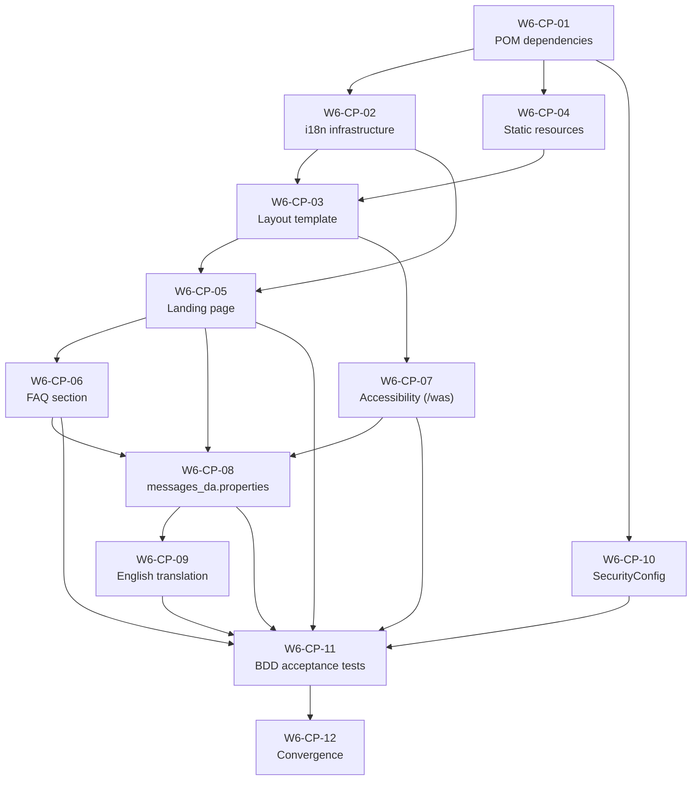

# Execution Plan — Skyldnerportal Landing Page (Petition 022)

## Wave 6: Citizen Portal (Skyldnerportal)

| Field | Value |
|---|---|
| Scope | Wave 6 — petition022 (Skyldnerportal landing page) |
| Basis | petition022 petition, outcome contract, creditor-portal reference implementation, program-status.yaml |
| Phase | phase-6 (Citizen portal) |
| Sprints | sprint-10 (infrastructure + landing page), sprint-11 (i18n, security, acceptance) |
| Tickets | W6-CP-01 through W6-CP-12 |
| Dependencies | petition013 (accessibility) ✅ validated, petition014 (accessibility statements) ✅ validated, petition021 (i18n) ✅ validated |

## Current state assessment

### Citizen portal (opendebt-citizen-portal)

The citizen portal exists as a **skeleton module** with:

- **`CitizenPortalApplication.java`** — Empty Spring Boot application class
- **`application.yml`** — Configured with TastSelv OAuth2 placeholders, `opendebt.i18n` section (da-DK + en-GB), service URLs, server port 8086, context-path `/borger`
- **`CitizenPortalArchitectureTest.java`** — ArchUnit test enforcing no cross-service DB access
- **`logback-spring.xml`** — Structured JSON logging (from Wave 4 OTel)
- **`pom.xml`** — Spring Boot Web, OAuth2 Client/Resource Server, WebFlux (missing), Actuator, OTel, ArchUnit

**What is missing** (to be delivered by Wave 6):

| Missing Component | Ticket |
|---|---|
| Thymeleaf + layout dialect + HTMX dependencies | W6-CP-01 |
| WebFlux dependency (for future WebClient) | W6-CP-01 |
| Cucumber/BDD test dependencies | W6-CP-01 |
| I18nConfig, I18nProperties, I18nModelAdvice | W6-CP-02 |
| Layout template (layout/default.html) | W6-CP-03 |
| Static resources (skat-tokens.css, a11y.js, fonts) | W6-CP-04 |
| Landing page controller and template | W6-CP-05 |
| FAQ section (7 items) | W6-CP-06 |
| Accessibility statement page (/was) | W6-CP-07 |
| messages_da.properties (~80-100 keys) | W6-CP-08 |
| messages_en_GB.properties (English translations) | W6-CP-09 |
| SecurityConfig (public access) | W6-CP-10 |
| BDD acceptance tests | W6-CP-11 |

### Creditor portal (reference implementation)

The creditor portal is the **reference implementation** for the citizen portal. Key patterns to reuse:

| Pattern | Creditor Portal Location | Citizen Portal Action |
|---|---|---|
| Thymeleaf + layout dialect | pom.xml dependencies | Copy to citizen pom.xml |
| SKAT layout (header, breadcrumb, content, footer) | templates/layout/default.html | Adapt with citizen branding |
| skat-tokens.css | static/css/skat-tokens.css | Copy to citizen portal |
| a11y.js (focus management) | static/js/a11y.js | Copy to citizen portal |
| Language selector fragment | templates/fragments/language-selector.html | Copy to citizen portal |
| I18nConfig + I18nProperties + I18nModelAdvice | config/ package | Duplicate in citizen config/ package |
| SecurityConfig (permitAll) | config/SecurityConfig.java | Adapt for citizen portal |
| AccessibilityController (/was) | controller/AccessibilityController.java | Duplicate in citizen portal |
| Message bundle structure | messages_da.properties (83 keys) | Create new citizen-specific bundle |

### CRITICAL: Petition022 scope is ONLY the landing page

Petition022 delivers a **public, unauthenticated, informational** landing page. It does **NOT** require:

- Backend service calls (all content is static with configurable links)
- MitID/TastSelv authentication
- Person registry lookup
- Debt service integration
- Payment processing

The MitID login button is a **link to an external configurable URL** (defaults to `https://mitgaeldsoverblik.gaeldst.dk/`), not an actual OAuth2 flow.

## Sprint 10: Citizen portal infrastructure and landing page

### W6-CP-01 — Add Thymeleaf + HTMX + layout dialect dependencies

| Field | Value |
|---|---|
| Objective | Add all missing frontend dependencies to the citizen portal POM |
| Modules | `opendebt-citizen-portal` |
| Depends on | Nothing |

The citizen portal POM currently has Spring Boot Web, OAuth2, Actuator, and OTel dependencies but is missing the Thymeleaf stack. Add:

1. **`spring-boot-starter-thymeleaf`** — Thymeleaf template engine
2. **`thymeleaf-layout-dialect` 3.3.0** — Shared layout decoration (same version as creditor portal)
3. **`htmx.org` 2.0.4 WebJar** — HTMX library for interactive elements
4. **`spring-boot-starter-webflux`** — WebClient for future service client calls
5. **Test dependencies**: `cucumber-java`, `cucumber-spring`, `cucumber-junit-platform-engine`, `junit-platform-suite`, `spring-security-test`, `mockwebserver`
6. **`application.yml`** — Add Thymeleaf configuration:
   ```yaml
   spring:
     thymeleaf:
       prefix: classpath:/templates/
       suffix: .html
       cache: false  # for development
   ```

### W6-CP-02 — Duplicate i18n infrastructure for citizen portal

| Field | Value |
|---|---|
| Objective | Create i18n config classes adapted from creditor portal |
| Modules | `opendebt-citizen-portal` |
| Depends on | W6-CP-01 |

Duplicate three classes into `dk.ufst.opendebt.citizen.config`:

1. **`I18nConfig.java`** — `@Configuration` with `ReloadableResourceBundleMessageSource` (basename `classpath:messages`, default encoding UTF-8, fallback disabled, default locale `da`), `CookieLocaleResolver` (cookie name `opendebt-citizen-lang`, default locale from config, 30-day max age), `LocaleChangeInterceptor` (param `lang`), and `WebMvcConfigurer` integration.

2. **`I18nProperties.java`** — `@ConfigurationProperties(prefix = "opendebt.i18n")` with `defaultLocale` and `supportedLocales` fields. The `application.yml` already has this section configured.

3. **`I18nModelAdvice.java`** — `@ControllerAdvice` exposing `supportedLocales` and `localeNativeNames` model attributes to all templates.

**Design decision**: Duplicate rather than share via opendebt-common because:
- Each portal may have different cookie names (citizen vs creditor sessions)
- Each portal may support different locale sets in the future
- The classes are small (~50 lines each) and easy to maintain independently
- If a third portal is added, consider extracting to a shared module

### W6-CP-03 — Create citizen portal layout template

| Field | Value |
|---|---|
| Objective | Create the SKAT-branded layout for the citizen portal |
| Modules | `opendebt-citizen-portal` |
| Depends on | W6-CP-01, W6-CP-02, W6-CP-04 |

The creditor portal layout (`layout/default.html`) is the starting point. Key adaptations for the citizen portal:

| Element | Creditor Portal | Citizen Portal |
|---|---|---|
| Title suffix | "OpenDebt Fordringshaverportal" | "Gældsstyrelsen — Borgerportal" |
| Header logo text | "OpenDebt" | "Gældsstyrelsen" |
| Nav items | Borger, Erhverv, Søg, Log på | Se din gæld, Om gæld, Kontakt, Log på med MitID |
| Breadcrumb home | "Forside" | "Forside" (same) |
| Footer link | /was | /was (same pattern) |

The layout retains:
- Dark navy SKAT header
- Skip link for accessibility
- Landmark roles (banner, navigation, main, contentinfo)
- Language selector in header
- `th:lang="${#locale.language}"` on `<html>` element
- IBM Plex Sans font integration via skat-tokens.css
- Thymeleaf layout:title-pattern for child page titles

### W6-CP-04 — Copy shared static resources

| Field | Value |
|---|---|
| Objective | Copy CSS, JS, and font files to citizen portal |
| Modules | `opendebt-citizen-portal` |
| Depends on | W6-CP-01 |

Copy from creditor portal to citizen portal:

| Source | Destination |
|---|---|
| `static/css/skat-tokens.css` | `static/css/skat-tokens.css` |
| `static/js/a11y.js` | `static/js/a11y.js` |
| `static/fonts/` (all subdirectories) | `static/fonts/` |
| `templates/fragments/language-selector.html` | `templates/fragments/language-selector.html` |

**Design note**: Resources are copied rather than shared because the citizen portal may later need a different color scheme or typography. If resources remain identical, a future technical debt ticket can extract to a shared static assets module.

### W6-CP-05 — Create landing page controller and template

| Field | Value |
|---|---|
| Objective | Implement the main landing page with debt overview content and MitID CTA |
| Modules | `opendebt-citizen-portal` |
| Depends on | W6-CP-03, W6-CP-02 |

Create:

1. **`CitizenExternalLinksProperties.java`** — `@ConfigurationProperties(prefix = "opendebt.citizen.external-links")` exposing configurable URLs:
   ```yaml
   opendebt:
     citizen:
       external-links:
         mit-gaeldsoverblik: ${MIT_GAELDSOVERBLIK_URL:https://mitgaeldsoverblik.gaeldst.dk/}
         payment-info: ${PAYMENT_INFO_URL:https://gaeldst.dk/borger/saadan-betaler-du-din-gaeld}
         interest-rates: ${INTEREST_RATES_URL:https://gaeldst.dk/borger/betal-min-gaeld/renter-og-gebyrer}
         payment-difficulties: ${PAYMENT_DIFFICULTIES_URL:https://gaeldst.dk/borger/hvis-du-ikke-kan-betale-din-gaeld}
         debt-counselling: ${DEBT_COUNSELLING_URL:https://gaeldst.dk/borger/hvis-du-ikke-kan-betale-din-gaeld/brug-for-raadgivning-om-din-gaeld}
         creditor-list: ${CREDITOR_LIST_URL:https://gaeldst.dk/borger/om-gaeld-til-inddrivelse/se-hvem-vi-inddriver-gaeld-for}
         debt-errors: ${DEBT_ERRORS_URL:https://gaeldst.dk/borger/om-gaeld-til-inddrivelse/hvis-der-er-fejl-i-din-gaeld}
         phone-number: "70 15 73 04"
         phone-international: "+45 70 15 73 04"
   ```

2. **`LandingPageController.java`** — Spring MVC `@Controller`:
   ```java
   @Controller
   @RequiredArgsConstructor
   public class LandingPageController {
       private final CitizenExternalLinksProperties externalLinks;
       
       @GetMapping("/")
       public String landingPage(Model model) {
           model.addAttribute("externalLinks", externalLinks);
           return "index";
       }
   }
   ```

3. **`templates/index.html`** — Thymeleaf template with:
   - Heading: "Overblik over din gæld" (via `#{landing.heading}`)
   - Three ways to view debt section (MitID self-service, Digital Post, phone)
   - Prominent MitID CTA button linking to `${externalLinks.mitGaeldsoverblik}`
   - Snapshot explanation (interest accrues daily)
   - Old debt errors section (2013-2015) with configurable link
   - All text via `#{...}` message expressions
   - All URLs from `${externalLinks.*}` (not hardcoded)

### W6-CP-06 — Create FAQ section

| Field | Value |
|---|---|
| Objective | Add 7 expandable FAQ items to the landing page |
| Modules | `opendebt-citizen-portal` |
| Depends on | W6-CP-05 |

Add an FAQ section to `index.html` using HTML5 `<details>`/`<summary>` elements:

```html
<section class="skat-faq" aria-labelledby="faq-heading">
  <h2 id="faq-heading" th:text="#{faq.heading}">Ofte stillede spørgsmål</h2>
  
  <details class="skat-faq__item">
    <summary th:text="#{faq.q1}">Hvor kan jeg se min samlede gæld?</summary>
    <div class="skat-faq__answer" th:utext="#{faq.a1}">...</div>
  </details>
  <!-- ... repeat for q2-q7 ... -->
</section>
```

The 7 FAQ items:

| # | Question (da-DK) | Answer links to |
|---|---|---|
| 1 | Hvor kan jeg se min samlede gæld? | Mit gældsoverblik, Digital Post, phone |
| 2 | Hvordan betaler jeg min gæld? | Payment info URL |
| 3 | Hvor meget skal jeg betale i rente? | Interest rates URL |
| 4 | Hvad gør jeg, hvis jeg har svært ved at betale? | Payment difficulties URL |
| 5 | Kan jeg få rådgivning omkring min gæld? | Debt counselling URL |
| 6 | Skal jeg betale, selv om min gæld er gammel? | (no external link, inline text) |
| 7 | Hvem inddriver I gæld for? | Creditor list URL |

FAQ answers use `th:utext` (unescaped) because they contain links:
```properties
faq.a2=Du kan betale din gæld via <a th:href="${externalLinks.paymentInfo}">betalingsoplysninger</a>.
```

**Accessibility**: `<details>`/`<summary>` are natively keyboard-accessible (Enter/Space to toggle). No HTMX enhancement needed. Add CSS in skat-tokens.css for consistent styling:
```css
.skat-faq__item { border-bottom: 1px solid var(--skat-border); padding: 1rem 0; }
.skat-faq__item summary { cursor: pointer; font-weight: 600; }
.skat-faq__answer { padding-top: 0.5rem; }
```

## Sprint 11: i18n, security, and acceptance

### W6-CP-07 — Create accessibility statement page (/was)

| Field | Value |
|---|---|
| Objective | Create the citizen portal accessibility statement |
| Modules | `opendebt-citizen-portal` |
| Depends on | W6-CP-03 |

Duplicate from the creditor portal with citizen-specific text:

1. **`AccessibilityController.java`** — Identical to creditor portal version
2. **`was.html`** — Same structure but with:
   - Heading: "Tilgængelighedserklæring for OpenDebt Borgerportal" (not "Fordringshaverportal")
   - Same compliance status, inaccessible content, basis, contact, enforcement sections
   - All text via `#{...}` message expressions

### W6-CP-08 — Create messages_da.properties

| Field | Value |
|---|---|
| Objective | Create the complete Danish message bundle for the citizen portal |
| Modules | `opendebt-citizen-portal` |
| Depends on | W6-CP-05, W6-CP-06, W6-CP-07 |

Estimated key count: **80–100 keys** organized by section:

| Section | Key prefix | Estimated keys |
|---|---|---|
| Layout | `layout.*` | ~12 |
| Landing page | `landing.*` | ~15 |
| FAQ | `faq.*` | ~16 (heading + 7 questions + 7 answers + section intro) |
| Accessibility statement | `was.*` | ~25 |
| Controller messages | `controller.*` | ~3 |
| **Total** | | **~71 minimum** |

Key naming follows the same unprefixed pattern as the creditor portal (each portal has its own independent message bundle within its module).

### W6-CP-09 — English translations via translator-droid

| Field | Value |
|---|---|
| Objective | Generate messages_en_GB.properties |
| Modules | `opendebt-citizen-portal` |
| Depends on | W6-CP-08 |

Invoke the `translator-droid` registered at `.factory/droids/translator.md` to translate the Danish bundle. The droid preserves key order, placeholders, HTML entities, and applies OpenDebt domain terminology.

### W6-CP-10 — SecurityConfig for public access

| Field | Value |
|---|---|
| Objective | Configure Spring Security to allow unauthenticated access to the landing page |
| Modules | `opendebt-citizen-portal` |
| Depends on | W6-CP-01 |

```java
@Configuration
@EnableWebSecurity
public class SecurityConfig {
    @Bean
    public SecurityFilterChain filterChain(HttpSecurity http) throws Exception {
        http.authorizeHttpRequests(auth -> auth
                // Public pages (landing, accessibility statement)
                .requestMatchers("/", "/was").permitAll()
                // Static resources
                .requestMatchers("/css/**", "/js/**", "/fonts/**", "/webjars/**").permitAll()
                // Actuator health
                .requestMatchers("/actuator/health").permitAll()
                // All other requests require authentication (future: MitID/TastSelv)
                .anyRequest().authenticated())
            .csrf(csrf -> csrf.disable());
        // AIDEV-TODO: Wire MitID/TastSelv OAuth2 login for authenticated pages
        return http.build();
    }
}
```

**Key design decision**: The landing page is public. All other paths are locked down by default (`anyRequest().authenticated()`), even though no authenticated pages exist yet. This follows the principle of least privilege and ensures that when authenticated pages are added later, they are protected by default.

### W6-CP-11 — BDD acceptance tests

| Field | Value |
|---|---|
| Objective | Cover all 13 petition022 acceptance criteria with Cucumber scenarios |
| Modules | `opendebt-citizen-portal` |
| Depends on | W6-CP-05 through W6-CP-10 |

Create `petition022.feature` with scenarios mapped to acceptance criteria:

| Scenario | Acceptance Criterion | What it verifies |
|---|---|---|
| Landing page displays heading | AC-1, AC-2 | Page at root path, heading text |
| Three ways to view debt | AC-3 | MitID, Digital Post, phone sections present |
| MitID call-to-action button | AC-4 | Prominent link with configurable URL |
| Snapshot explanation | AC-5 | Interest accrual text present |
| FAQ section with 7 items | AC-6 | 7 `<details>` elements present |
| FAQ items are keyboard-accessible | AC-7 | `<details>`/`<summary>` semantics |
| Old debt errors section | AC-8 | 2013-2015 section with link |
| SKAT layout applied | AC-9 | Header, breadcrumb, content, footer present |
| Text externalized to message bundles | AC-10 | No hardcoded Danish in template |
| Language selector switches language | AC-11 | ?lang=en-GB switches to English |
| Accessibility infrastructure | AC-12 | Skip-link, landmarks, headings, /was link |
| External links configurable | AC-13 | URLs from application.yml, not hardcoded |

Test infrastructure:
- `RunCucumberTest.java` — JUnit Platform Suite runner
- `CucumberSpringConfig.java` — `@CucumberContextConfiguration` with `@SpringBootTest`
- `Petition022Steps.java` — Step definitions using `MockMvc`

### W6-CP-12 — Convergence

| Field | Value |
|---|---|
| Objective | Verify everything works end-to-end and update program status |
| Modules | `opendebt-citizen-portal`, `petitions` |
| Depends on | W6-CP-11 |

Final convergence:

1. `mvn verify -pl opendebt-citizen-portal` — all tests pass, JaCoCo gate met
2. `mvn verify` (full project) — no regressions in other modules
3. Update `program-status.yaml`: petition022 status → `validated`
4. Update JaCoCo thresholds from 0.00 to actual minimum coverage
5. Document conditions for full citizen portal functionality (see below)
6. Verify citizen portal architecture test passes with new packages

## Dependency graph



## Parallelization opportunities

| Parallel group | Tickets | Notes |
|---|---|---|
| POM bootstrap | W6-CP-01 | Must complete first |
| Resource setup | W6-CP-02, W6-CP-04 | Both depend only on W6-CP-01 |
| Layout | W6-CP-03 | Depends on W6-CP-02 + W6-CP-04 |
| Landing page + FAQ | W6-CP-05, W6-CP-06 | Sequential (FAQ is part of landing page) |
| Accessibility + Security | W6-CP-07, W6-CP-10 | Independent after layout/POM |
| Message bundles | W6-CP-08, W6-CP-09 | Sequential (Danish first, then English) |
| Acceptance + convergence | W6-CP-11, W6-CP-12 | Sequential, blocks completion |

## Estimated effort

| Sprint | Tickets | Effort estimate |
|---|---|---|
| sprint-10 | W6-CP-01 through W6-CP-06 | 6 focused implementation sessions |
| sprint-11 | W6-CP-07 through W6-CP-12 | 6 focused implementation sessions |
| **Total** | **12 tickets** | **~12 sessions** |

## Conditions for full citizen portal functionality

Petition022 delivers **only the informational landing page**. For the citizen portal to become a real self-service application, the following additional work is required. These should be tracked as **future petition candidates**:

| # | Condition | Services affected | Notes |
|---|---|---|---|
| **a** | Person Registry needs a person/CPR lookup API | person-registry | Resolve MitID-authenticated CPR to `person_id` UUID. Currently only organization/CVR APIs exist. |
| **b** | debt-service needs a citizen-facing debt summary endpoint | debt-service | Authenticated by `person_id` (not `creditorId`). Current `GET /api/v1/debts?debtorId=` exists but requires proper citizen auth scope. |
| **c** | MitID/TastSelv OAuth2 browser flow must be wired | citizen-portal | SecurityConfig has TastSelv OAuth2 client config placeholders but no actual login flow. |
| **d** | "Mit gældsoverblik" authenticated debt overview page | citizen-portal | The core citizen self-service page showing personal debt. Requires (a), (b), (c). |
| **e** | payment-service needs a citizen payment initiation API | payment-service | No citizen-facing payment endpoint exists. Requires payment provider integration. |
| **f** | Digital Post integration for letter retrieval | letter-service / citizen-portal | Allow citizens to view collection letters sent via Digital Post. |

These conditions are **out of scope** for petition022 but are documented here and in `program-status.yaml` petition022 notes for future sprint planning.

## Risk and mitigation

| Risk | Impact | Mitigation |
|---|---|---|
| FAQ content diverges from gaeldst.dk | Low | FAQ based on March 2026 snapshot; periodic review ticket recommended |
| skat-tokens.css diverges between portals after copy | Low | Future tech debt ticket to extract shared CSS module if needed |
| OAuth2 config conflicts with public access | Medium | SecurityConfig explicitly permits landing page paths; future OAuth2 only for authenticated pages |
| Citizen portal i18n duplicated from creditor | Low | Small codebase; extract to common if a third portal is added |
| JaCoCo 0.00 threshold masks coverage regressions | Medium | W6-CP-12 explicitly raises thresholds to actual minimums |
