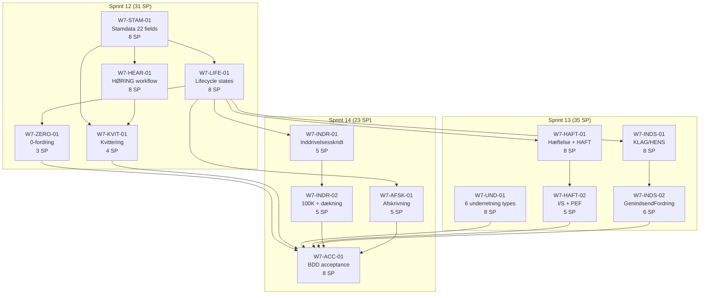

# Wave 7 Execution Plan: Downstream Collection Model (PSRM-enriched)

**Created:** 2026-03-16
**Source:** Petitions 002-007, 015, 017, 018, 024, 026 (PSRM-enriched)
**PSRM Reference:** `docs/psrm-reference/`
**Sprints:** 12, 13, 14 (14 tickets total)

---

## 1. Wave Overview

### Objective

Implement the downstream collection domain model informed by Gældsstyrelsen's PSRM business rules. This wave bridges the gap between claim ingestion (Waves 1-2) and citizen-facing features (Wave 6) by building the core fordring lifecycle, notification infrastructure, liability model, dispute/withdrawal workflows, and collection step engine.

### Success Criteria

- All 22 PSRM stamdata fields modelled with obligatorisk/valgfri classification
- Fordring lifecycle transitions enforced (FORDRING → RESTANCE → OVERDRAGET)
- HØRING workflow operational with portal UI for creditor response
- 6 underretning types implemented with delivery tracking
- Solidarisk hæftelse model with HAFT/I/S/PEF rules
- KLAG/HENS/BORD/BORT/FEJL tilbagekald workflows with Flowable BPMN
- GenindsendFordring function with stamdata match validation
- Inddrivelsesskridt model with civilretlige constraints and dækningsrækkefølge
- Afskrivning reason codes mapped to citizen-friendly statuses
- Full BDD acceptance coverage, mvn verify passes

### Total Effort Estimate: **89 story points**

| Sprint | Points | Tickets |
|--------|--------|---------|
| Sprint 12 | 31 | 5 tickets (stamdata, lifecycle, 0-fordring, høring, kvittering) |
| Sprint 13 | 35 | 5 tickets (underretning, hæftelse, I/S-PEF, tilbagekald, genindsend) |
| Sprint 14 | 23 | 4 tickets (inddrivelsesskridt, threshold, afskrivning, BDD acceptance) |

---

## 2. Sprint 12: Fordring Lifecycle, Stamdata, and Hearing Workflow

**Goal:** Establish the foundational fordring data model (22 stamdata fields), lifecycle state machine, 0-fordring pattern, HØRING workflow, and kvittering response — providing the substrate for all downstream work.

**Capacity note:** W7-STAM-01 must land first (sprint day 1-4). W7-LIFE-01 and W7-HEAR-01 can then run in parallel (days 3-8). W7-ZERO-01 follows W7-LIFE-01 (days 7-9). W7-KVIT-01 depends on both STAM-01 and HEAR-01 (days 7-10).

### W7-STAM-01: 22 PSRM Stamdata Field Model (8 SP)

**Petitions:** 002, 003 | **PSRM source:** `01-generelle-krav-til-fordringer.md`
**Modules:** opendebt-debt-service, opendebt-integration-gateway, api-specs

#### Implementation Tasks

1. **Entity update** — Extend `DebtEntity` (or create `FordringEntity`) with all 22 stamdata columns:

   | Field | Java type | Column | Nullable |
   |-------|-----------|--------|----------|
   | beloeb | BigDecimal | beloeb | NOT NULL |
   | hovedstol | BigDecimal | hovedstol | NOT NULL |
   | fordringshaverId | UUID | fordringshaver_id | NOT NULL |
   | fordingshaverReference | String(50) | fordringshaver_reference | NOT NULL |
   | fordringsart | FordringsartEnum | fordringsart | NOT NULL |
   | fordringsTypeKode | String(20) | fordringstype_kode | NOT NULL |
   | hovedfordringsId | UUID | hovedfordrings_id | nullable |
   | skyldnerIdentifikation | UUID | debtor_person_id | NOT NULL |
   | foraeldelsesdato | LocalDate | foraeldelsesdato | NOT NULL |
   | beskrivelse | String(100) | beskrivelse | nullable |
   | periodeFra | LocalDate | periode_fra | nullable |
   | periodeTil | LocalDate | periode_til | nullable |
   | stiftelsesdato | LocalDate | stiftelsesdato | nullable* |
   | forfaldsdato | LocalDate | forfaldsdato | nullable* |
   | sidsreRettigBetalingsdato | LocalDate | srb | nullable* |
   | bobehandling | Boolean | bobehandling | nullable (S2S) / NOT NULL (portal) |
   | domsdato | LocalDate | domsdato | nullable |
   | forligsdato | LocalDate | forligsdato | nullable |
   | rentevalg | RentevalgEmbeddable | (renteRegel, renteSatsKode, merRenteSats) | nullable |
   | fordringsnote | String(500) | fordringsnote | nullable |
   | kundenote | String(500) | kundenote | nullable |
   | pNummer | String(20) | p_nummer | nullable |

   *nullable depends on fordringstype — enforced by Drools, not DB constraint

2. **Enums** — `FordringsartEnum` (INDR, MODR), `FordringKategori` (HF = hovedfordring, UF = underfordring)
3. **Embeddable** — `RentevalgEmbeddable` (renteRegel, renteSatsKode, merRenteSats)
4. **DTO layer** — `FordringCreateRequest`, `FordringStamdataDto` with MapStruct mapper
5. **GDPR Beskrivelse validator** — `@BeskrivelseSafe` annotation: max 100 chars, regex rejection of CPR patterns (10 consecutive digits), no names/addresses of third parties
6. **Drools decision table** — `stamdata-obligatorisk-rules.xlsx`: per fordringstype which fields are obligatorisk
7. **OpenAPI spec** — Update `fordring-api.yaml` with full stamdata schema and field descriptions
8. **Flyway migration** — `V{next}__add_stamdata_fields.sql` adding columns to debt table
9. **Architecture test** — Extend `DebtServiceArchitectureTest` verifying PII isolation (no CPR/name columns)
10. **Unit tests** — Obligatorisk field rejection, valgfri acceptance, Beskrivelse GDPR validation, FordringsartEnum mapping

**Acceptance criteria:**
- All 22 stamdata fields persisted and queryable
- Obligatorisk fields enforced per fordringstype via Drools
- Beskrivelse GDPR constraint rejects PII patterns
- OpenAPI spec documents all fields with descriptions and examples
- `mvn verify` passes in debt-service

---

### W7-LIFE-01: Fordring Lifecycle State Machine (8 SP)

**Petitions:** 003 | **PSRM source:** `01-generelle-krav-til-fordringer.md`
**Modules:** opendebt-debt-service
**Depends on:** W7-STAM-01

#### Implementation Tasks

1. **Lifecycle state enum** — `FordringLifecycleState`:
   - `REGISTERED` — fordring created but not overdue
   - `RESTANCE` — SRB passed, not fully paid
   - `HOERING` — submitted but in hearing (see W7-HEAR-01)
   - `OVERDRAGET` — accepted for inddrivelse (slutstatus UDFØRT)
   - `TILBAGEKALDT` — withdrawn (with årsagskode sub-state)
   - `AFSKREVET` — written off (with reason code)
   - `INDFRIET` — fully paid

2. **State machine** — Spring Statemachine or custom `FordringLifecycleService`:
   - `REGISTERED → RESTANCE`: triggered when SRB date passes and debt unpaid
   - `RESTANCE → OVERDRAGET`: requires pre-conditions (rykkerprocedure, underretning, separation)
   - `OVERDRAGET → TILBAGEKALDT`: tilbagekald with årsagskode
   - `OVERDRAGET → AFSKREVET`: afskrivning with reason code
   - `OVERDRAGET → INDFRIET`: full dækning received

3. **Pre-condition validators** (Drools or service methods):
   - `SrbExpiryValidator` — SRB date must be in past
   - `RykkerprocedureValidator` — at least one rykker on record
   - `SkriftligUnderretningValidator` — underretning sent to each hæfter
   - `ClaimSeparationValidator` — hovedfordring and renter are separate fordringer
   - `MedhæfterSimultanValidator` — all medhæftere reported in same submission

4. **Overdragelse audit** — `OverdragelseEvent` entity: restanceId, fordringshaverId, modtagerId (RIM), tidspunkt, extends `AuditableEntity`
5. **Scheduled job** — `RestanceTransitionJob` (daily): scan fordringer where SRB < today AND not fully paid → transition to RESTANCE
6. **Unit tests** — Each state transition, pre-condition failures, audit trail persistence

**Acceptance criteria:**
- Fordring transitions to RESTANCE automatically when SRB passes
- Overdragelse blocked if pre-conditions not met (returns specific failure reason)
- Audit trail records all state transitions with actor and timestamp
- No invalid state transitions accepted (enforced by state machine)

---

### W7-ZERO-01: 0-Fordring Pattern (3 SP)

**Petitions:** 003 | **PSRM source:** `01-generelle-krav-til-fordringer.md`
**Modules:** opendebt-debt-service
**Depends on:** W7-LIFE-01

#### Implementation Tasks

1. **Allow 0-saldo fordring** — Remove `beloeb > 0` validation for hovedfordringer when flagged as 0-fordring
2. **Submission order validation** — When submitting rente/gebyr underfordring referencing a hovedfordring with saldo 0: verify 0-fordring exists and has all required stamdata
3. **HovedfordringsID reference** — Underfordring.hovedfordringsId must point to the 0-fordring
4. **Unit tests** — 0-fordring creation, rente referencing 0-fordring, rejection when 0-fordring missing

**Acceptance criteria:**
- 0-saldo hovedfordring can be created with full stamdata
- Rente underfordring can reference a 0-fordring via HovedfordringsID
- Rejection if rente submitted without corresponding 0-fordring

---

### W7-HEAR-01: HØRING Workflow (8 SP)

**Petitions:** 002 | **PSRM source:** `02-fordringer-i-hoering.md`
**Modules:** opendebt-debt-service, opendebt-creditor-portal
**Depends on:** W7-STAM-01

#### Implementation Tasks

1. **Indgangsfilter rules** — Drools decision table `indgangsfilter-rules.xlsx`: per fordringstype, define stamdata value ranges that trigger høring (deviations from expected patterns)
2. **HØRING sub-states** — Enum: `AFVENTER_FORDRINGSHAVER`, `AFVENTER_RIM`, `GODKENDT`, `AFVIST`, `FORTRUDT`
3. **Flowable BPMN** — `fordring-hoering.bpmn20.xml`:
   - Start event: indgangsfilter deviation detected
   - User task (fordringshaver): approve with justification OR withdraw (fortryd)
   - User task (RIM caseworker): after fordringshaver approval → godkend / afvis / tilpas filter
   - Timer boundary event: 14-day SLA reminder
   - End events: GODKENDT → OVERDRAGET, AFVIST → return to fordringshaver, FORTRUDT → fordringshaver can resubmit

4. **Creditor portal UI** — Thymeleaf template `fordringer-i-hoering.html`:
   - Table listing claims in HØRING with status badges
   - Detail view with stamdata deviation explanation
   - Form for approve (justification textarea) or withdraw (reason textarea)
   - HTMX for status refresh without page reload

5. **Forældelse clock** — While in HØRING: fordringshaver's own forældelsesregler apply (NOT received for inddrivelse). Display warning if forældelsesdato is approaching.

6. **Unit tests** — Indgangsfilter trigger, workflow state transitions, 14-day SLA, portal form submission
7. **Integration tests** — Full høring cycle: submit → deviation → fordringshaver approves → RIM decides

**Acceptance criteria:**
- Stamdata deviating from indgangsfilter triggers HØRING (not UDFØRT or AFVIST)
- Creditor can approve with justification or withdraw in portal
- 14-day SLA tracked; reminder generated if exceeded
- Forældelse warning displayed for claims approaching expiry while in HØRING

---

### W7-KVIT-01: Kvittering Response Model (4 SP)

**Petitions:** 002, 003 | **PSRM source:** `01-generelle-krav-til-fordringer.md`
**Modules:** opendebt-debt-service, opendebt-integration-gateway, api-specs
**Depends on:** W7-STAM-01, W7-HEAR-01

#### Implementation Tasks

1. **Slutstatus enum** — `SlutstatusEnum`: UDFOERT, AFVIST, HOERING
2. **KvitteringResponse DTO** — fordringsId (UUID), slutstatus, haeftelsesforhold (list of skyldner references), akrNummer (if assigned), afvistBegrundelse (error code + description, null if UDFØRT/HØRING), hoeringInfo (deviation details, null if not HØRING)
3. **Pipeline integration** — After validation pipeline:
   - All rules pass → slutstatus = UDFOERT
   - Any validation error → slutstatus = AFVIST, populate error codes
   - Indgangsfilter deviation but no hard error → slutstatus = HOERING
4. **OpenAPI spec** — `KvitteringResponse` schema in fordring-api.yaml
5. **Unit tests** — Kvittering for each slutstatus, error code mapping, HØRING info population

**Acceptance criteria:**
- Every fordring submission returns a KvitteringResponse
- UDFØRT, AFVIST, HØRING correctly mapped from validation pipeline results
- API consumers can differentiate outcome and take appropriate action

---

## 3. Sprint 13: Underretning, Hæftelse, and Tilbagekald Workflows

**Goal:** Build the notification infrastructure, liability model with debtor management, and the full tilbagekald/genindsend workflow suite. These are the operational backbone connecting claim lifecycle to creditor/debtor interactions.

**Capacity note:** W7-UND-01 and W7-HAFT-01 can start simultaneously (both depend only on Sprint 12 outputs). W7-INDS-01 runs in parallel. W7-HAFT-02 follows W7-HAFT-01. W7-INDS-02 follows W7-INDS-01.

### W7-UND-01: 6 PSRM Underretning Types (8 SP)

**Petitions:** 004 | **PSRM source:** `06-underretningsmeddelelser.md`
**Modules:** opendebt-notification-service, api-specs

#### Implementation Tasks

1. **UnderretningEntity** — extends `AuditableEntity`:
   - id (UUID), type (enum), fordringId (UUID), fordringshaverId (UUID), recipientPersonIds (List UUID), channel (PORTAL / S2S / EBOKS), deliveryState (PENDING / DELIVERED / EXPIRED), content (JSONB), createdAt, expiresAt (created + 3 months)

2. **UnderretningType enum:**
   - `AFREGNING` — monthly; triggered on last business day; content: CPR ref, beløb, dato, fordring ref
   - `UDLIGNING` — daily on saldo movement; content: fordringId, previous saldo, new saldo, movement type
   - `ALLOKERING` — daily (mutually exclusive with UDLIGNING per fordringshaver); content: breakdown afdrag/hovedstol/renter
   - `RENTER` — monthly or daily (daily only for S2S); content: tilskrevet rente, period, fordring ref
   - `AFSKRIVNING` — on afskrivning event; content: fordringsId, beløb, reason code, skyldner ref if multiple hæftere
   - `TILBAGESEND_RETURNERING` — on tilbagekald or return; content: fordringsId, returneret saldo, renter

3. **Services:**
   - `AfregningService` — scheduled last business day of month (Spring `@Scheduled` with business-day calendar)
   - `UdligningAllokeringService` — event-driven (triggered on saldo change)
   - `RenteUnderretningService` — monthly scheduled + optional daily for S2S
   - `AfskrivningUnderretningService` — event-driven from lifecycle state change
   - `TilbagesendUnderretningService` — event-driven from tilbagekald workflow

4. **Mutual exclusivity config** — `UnderretningPreferences` per fordringshaver: choose UDLIGNING or ALLOKERING, monthly or daily RENTER
5. **3-month expiry** — Scheduled cleanup job; API returns 404 for expired notifications
6. **REST API** — `GET /api/v1/notifications?fordringshaverId=&type=&since=` with pagination
7. **Unit tests** — Each type generation, mutual exclusivity enforcement, expiry cleanup, API filtering

**Acceptance criteria:**
- All 6 underretning types generated at correct triggers
- UDLIGNING / ALLOKERING mutual exclusivity enforced per fordringshaver
- Notifications older than 3 months not retrievable
- Fordringshaver can fetch own notifications via API

---

### W7-HAFT-01: Solidarisk Hæftelse + HAFT Workflow (8 SP)

**Petitions:** 005 | **PSRM source:** `03-tilfoej-fjern-skyldner.md`
**Modules:** opendebt-debt-service
**Depends on:** W7-LIFE-01

#### Implementation Tasks

1. **HæftelseEntity** — extends `AuditableEntity`:
   - id (UUID), fordringId (UUID), skyldnerPersonId (UUID), liabilityType (SOLIDARISK), underretningGiven (boolean), underretningDate (LocalDate)

2. **Solidarisk-only validation** — Reject submissions with non-solidary liability at API level; fordringshaver must split claims themselves

3. **HAFT tilbagekald workflow:**
   - Withdraw fordring with årsagskode HAFT
   - Dækninger preserved (NOT reversed)
   - Inddrivelsesrenter returned to fordringshaver
   - Fordringshaver notifies all skyldnere (tracked via underretningGiven flags)
   - Resubmit with updated skyldner list
   - New modtagelsestidspunkt → new position in dækningsrækkefølge

4. **REINDGI fordringstype** — Special claim type for re-submitting returned inddrivelsesrenter after HAFT
5. **Individual underretning** — Validation: each hæfter must have individual underretning before overdragelse
6. **Remove skyldner** — Not self-service in PSRM; flagged as "contact support" action
7. **Unit tests** — Hæftelse CRUD, HAFT workflow states, REINDGI submission, underretning validation

**Acceptance criteria:**
- Multiple skyldnere can be linked to fordring via solidarisk hæftelse
- HAFT tilbagekald preserves dækninger and returns renter
- Resubmitted fordring gets new dækningsrækkefølge position
- Individual underretning enforced per medhæfter

---

### W7-HAFT-02: I/S and PEF Skyldner Rules (5 SP)

**Petitions:** 005 | **PSRM source:** `10-is-og-pef-skyldnere.md`
**Modules:** opendebt-debt-service, opendebt-person-registry
**Depends on:** W7-HAFT-01

#### Implementation Tasks

1. **I/S submission validation** — When virksomhedstype = I/S: require CVR for partnership AND at least one CPR/CVR for each liable interessent
2. **PEF submission validation** — When virksomhedstype = PEF: if firm active → CVR required; if firm ceased → CPR required
3. **Auto-add CPR for PEF** — After PEF fordring accepted: system automatically adds owner's CPR to hæftelse (lookup via person-registry)
4. **Rente liability exception** — I/S: all partners hæfte for inddrivelsesrenter (exception to general rule)
5. **Virksomhedstype resolution** — Person-registry CVR lookup returns virksomhedstype (I/S, PEF, etc.)
6. **Unit tests** — I/S validation, PEF active/ceased paths, auto-add CPR, rente exception

**Acceptance criteria:**
- I/S submission rejected without both CVR and partner identifications
- PEF correctly routes to CVR or CPR based on firm status
- Auto-CPR addition for PEF after acceptance
- I/S rente hæftelse applies to all partners

---

### W7-INDS-01: KLAG/HENS Tilbagekald Workflows (8 SP)

**Petitions:** 006 | **PSRM source:** `04c-tilbagekald-fordring.md`
**Modules:** opendebt-debt-service, opendebt-case-service
**Depends on:** W7-LIFE-01

#### Implementation Tasks

1. **TilbagekaldÅrsagskode enum** — BORD, BORT, FEJL, HENS, KLAG, HAFT with behavior metadata:

   | Code | Auto virkningsdato | Dækninger | Renter | Genindsend? | Statsrefusion? |
   |------|-------------------|-----------|--------|-------------|----------------|
   | BORD | Yes (bogføring) | Fastholdes | To virkningsdato | Kun FEJL | Nej |
   | BORT | No (required) | Fastholdes (pre-date) | To virkningsdato | Kun FEJL | Ja |
   | FEJL | Modtagelsesdato | Ophæves | Nulstilles | Nej (new fordring) | Ja |
   | HENS | Yes (bogføring) | Fastholdes | To virkningsdato | Ja (Genindsend) | Nej |
   | KLAG | Yes (bogføring) | Fastholdes | To virkningsdato | Ja (Genindsend) | Ja |
   | HAFT | Yes (tilbagekald) | Fastholdes | Returneres | Ja (new submit) | Ja |

2. **TilbagekaldService** — Validates årsagskode constraints, executes dækning reversal (FEJL only), calculates renter, locks fordring
3. **Flowable BPMN** — `tilbagekald-klag.bpmn20.xml`:
   - Start: KLAG tilbagekald received
   - Suspend: fordring locked, collection paused
   - User task: fordringshaver/caseworker resolves klage
   - Decision: FEJL (medhold → reverse all) or GenindsendFordring (rejected klage)
   - Timer: SLA for resolution

4. **HENS workflow** — Identical BPMN to KLAG (reuse with parameter)
5. **Statsrefusion guard** — BORD and HENS blocked for statsrefusion fordringer
6. **FEJL VirkningsDato rule** — Must be empty; system auto-sets to modtagelsestidspunkt
7. **Post-tilbagekald lock** — Fordring.locked = true; only FEJL allowed after BORD/BORT
8. **Related fordring cascade** — Tilbagekald on hovedfordring → auto-tilbagekald relaterede fordringer
9. **Unit tests** — Each årsagskode, statsrefusion guard, FEJL reversal, workflow states

**Acceptance criteria:**
- All 6 årsagskoder correctly implemented with specified behavior
- KLAG/HENS lock fordring and pause collection
- FEJL reverses all dækninger and nulstiller renter
- Statsrefusion guard blocks BORD/HENS
- Related fordringer auto-withdrawn with hovedfordring

---

### W7-INDS-02: GenindsendFordring (6 SP)

**Petitions:** 006 | **PSRM source:** `04c-tilbagekald-fordring.md`
**Modules:** opendebt-debt-service, opendebt-integration-gateway
**Depends on:** W7-INDS-01

#### Implementation Tasks

1. **GenindsendFordring endpoint** — `POST /api/v1/fordringer/genindsend` accepting original fordringsId
2. **Validation rules** (mapped to petition017 rules 539-544):
   - Original must be withdrawn with HENS, KLAG, BORD, or HAFT (not FEJL) → 539
   - Original must actually be withdrawn → 540
   - Same fordringshaver → 541
   - Stamdata match (stiftelsesdato, forfaldsdato, periode) → 542
   - MODR not allowed → 544

3. **New fordringsId assignment** — Generate new UUID; store reference to original fordringsId for audit
4. **Forældelsesdato rule** — Must use newest date (from underretning or own afbrydelse, never original)
5. **Rente genindsend** — Only renter actually returned may be resubmitted; hovedstol = restsaldo at genindsend time
6. **FEJL exclusion** — FEJL-withdrawn fordringer return 400 with "must create new fordring" message
7. **Unit tests** — Each validation rule, new ID generation, forældelsesdato enforcement

**Acceptance criteria:**
- GenindsendFordring succeeds only for valid årsagskoder
- Stamdata match enforced (stiftelsesdato, forfaldsdato, periode)
- New fordringsId issued; audit trail links to original
- FEJL-withdrawn claims rejected with clear error

---

## 4. Sprint 14: Inddrivelsesskridt and Civilretlige Constraints

**Goal:** Complete the collection step domain model, implement civilretlige constraints and financial rules (dækningsrækkefølge, 100K threshold), add afskrivning support, and converge with full BDD acceptance coverage.

**Capacity note:** W7-INDR-01 and W7-AFSK-01 can start simultaneously. W7-INDR-02 follows W7-INDR-01. W7-ACC-01 is the final convergence ticket.

### W7-INDR-01: Inddrivelsesskridt Domain Model (5 SP)

**Petitions:** 007 | **PSRM source:** `11-civilretlige-fordringer.md`
**Modules:** opendebt-case-service, opendebt-debt-service
**Depends on:** W7-LIFE-01

#### Implementation Tasks

1. **InddrivelsesSkridtEntity** — extends `AuditableEntity`:
   - id (UUID), restanceId (UUID), skridtType (enum), initiator (UUID), status (INITIATED/ACTIVE/COMPLETED/CANCELLED), outcomeAmount (BigDecimal)

2. **SkridtType enum:** AFDRAGSORDNING, MODREGNING, LOENINDEHOLDELSE, UDLAEG
3. **CivilretligFordring flag** — On fordringstype config: `civilretlig = true/false`
4. **Collection step selection rules** (Drools):
   - Civilretlig = true → only AFDRAGSORDNING and MODREGNING available
   - LOENINDEHOLDELSE requires explicit lovhjemmel (bilag 1 check)
   - UDLAEG requires eksekutionsfundament (domsdato or forligsdato populated)
   - MODREGNING requires: gensidige, udjævnelige, forfaldne, retskraftige

5. **Audit trail** — All step state changes logged
6. **Unit tests** — Civilretlig constraints, step selection rules, fundament validation

**Acceptance criteria:**
- Inddrivelsesskridt created only for overdragede restancer
- Civilretlige fordringer limited to afdragsordning + modregning
- Udlæg requires fundament; lønindeholdelse requires lovhjemmel
- All steps audited from initiation to completion

---

### W7-INDR-02: 100K Threshold + Dækningsrækkefølge (5 SP)

**Petitions:** 007 | **PSRM source:** `07-renteregler.md`, `11-civilretlige-fordringer.md`
**Modules:** opendebt-case-service
**Depends on:** W7-INDR-01

#### Implementation Tasks

1. **Betalingspåkrav threshold** — Configurable property `opendebt.collection.betalingspakrav-threshold: 100000`
   - Under threshold: system can file betalingspåkrav with fogedret
   - Over threshold: return fordring to fordringshaver (must file stævning themselves)

2. **Dækningsrækkefølge engine** — `DaekningsRaekkefoelgeService`:
   - Payment applied: inddrivelsesrente FIRST, then hovedstol
   - Simple dag-til-dag rente: `hovedstol * (inddrivelsesrenteSats / 365) * days`
   - Configurable rate: `opendebt.interest.inddrivelsesrente: 0.0575`

3. **Rente calculation** — `InddrivelsesRenteCalculator`:
   - Start: 1st of month after modtagelsestidspunkt
   - Simple interest (no compound)
   - Daily accrual on hauptstol only

4. **Monthly afregning generation** — Last business day: compute dækninger for period, generate afregning underretning
5. **Unit tests** — Threshold enforcement, rente calculation precision, dækningsrækkefølge ordering

**Acceptance criteria:**
- Claims under 100K eligible for betalingspåkrav; over 100K returned to fordringshaver
- Rente always covered before hovedstol in payment application
- Interest calculated as simple day-to-day at configured rate
- Rate is configurable (annual update without code change)

---

### W7-AFSK-01: Afskrivning Reason Codes (5 SP)

**Petitions:** 007, 024, 026 | **PSRM source:** `06-underretningsmeddelelser.md`
**Modules:** opendebt-debt-service
**Depends on:** W7-LIFE-01

#### Implementation Tasks

1. **AfskrivningReasonCode enum:**
   - FORAELDELSE, KONKURS, DOEDSBO, GAELDSSANERING, ABENBART_FORMAALSLOES, UFORHOLDSMAESSIGT_OMKOSTNINGSFULD

2. **Lifecycle transition** — OVERDRAGET → AFSKREVET with reason code
3. **Afskrivning underretning** — Trigger AFSKRIVNING notification to fordringshaver
4. **Citizen status mapping:**
   - AFSKREVET → `WRITTEN_OFF` with citizen-friendly description per reason code
   - Danish + English message keys: `debt.status.afskrevet.foraeldelse`, etc.

5. **Rentestop flag** — For uafklaret gæld (since 2024-11-01): freeze rente accrual, store `renteStopDato`
6. **No fradragsret indicator** — Boolean `fradragsretExcluded = true` for all inddrivelsesrenter (since 2020-01-01)
7. **Unit tests** — Each afskrivning reason, citizen status mapping, rentestop enforcement

**Acceptance criteria:**
- All 6 afskrivning reasons supported
- Correct lifecycle transition and underretning generation
- Citizen-facing status maps each reason to localized description
- Rentestop correctly freezes interest accrual

---

### W7-ACC-01: BDD Acceptance Tests (8 SP)

**Petitions:** 002-007 | **All PSRM sources**
**Modules:** opendebt-debt-service, opendebt-case-service, opendebt-notification-service
**Depends on:** All W7 tickets

#### Implementation Tasks

1. **Feature files** (Cucumber/Gherkin):
   - `petition002-psrm-stamdata.feature` — 22 field validation scenarios (obligatorisk rejection, GDPR beskrivelse)
   - `petition003-psrm-lifecycle.feature` — State transitions, 0-fordring, overdragelse pre-conditions
   - `petition002-psrm-hoering.feature` — Hearing workflow: trigger, approve, withdraw, caseworker decision, 14-day SLA
   - `petition004-psrm-underretning.feature` — Each of 6 types generated at correct triggers
   - `petition005-psrm-haeftelse.feature` — Solidarisk, HAFT workflow, I/S, PEF
   - `petition006-psrm-tilbagekald.feature` — KLAG/HENS/BORD/BORT/FEJL, GenindsendFordring
   - `petition007-psrm-inddrivelsesskridt.feature` — Civilretlige constraints, 100K threshold, dækningsrækkefølge, afskrivning

2. **Step definitions** — Java step classes using Spring test context, Testcontainers for PostgreSQL
3. **Architecture tests** — SharedArchRules for new entities in debt-service, case-service, notification-service
4. **Spotless + verify** — `mvn spotless:apply && mvn verify` across all modules

**Acceptance criteria:**
- All feature files pass (green)
- Architecture tests pass for all new modules
- `mvn verify` passes for debt-service, case-service, notification-service
- No Spotless violations
- JaCoCo coverage >= 80% line, 70% branch for new code

---

## 5. Dependency Graph

### Parallelization Summary

| Sprint | Parallel tracks | Sequential chains |
|--------|----------------|-------------------|
| 12 | LIFE ∥ HEAR (both after STAM) | STAM → LIFE → ZERO; STAM + HEAR → KVIT |
| 13 | UND ∥ HAFT-01 ∥ INDS-01 | HAFT-01 → HAFT-02; INDS-01 → INDS-02 |
| 14 | INDR-01 ∥ AFSK | INDR-01 → INDR-02; all → ACC |

---

## 6. Risk Register

| # | Risk | Impact | Mitigation |
|---|------|--------|------------|
| R1 | Flowable BPMN complexity for HØRING and KLAG workflows | Schedule slip in Sprint 12-13 | Start with simple state machine; upgrade to Flowable iteratively |
| R2 | Drools indgangsfilter rules require domain expertise | Incorrect hearing triggers | Use configurable decision table; start with common deviations only |
| R3 | 22 stamdata fields require extensive Flyway migration | Risk of data loss on existing test data | Run migration on empty test DB first; keep backward-compatible |
| R4 | I/S/PEF rules depend on person-registry CVR lookup | Blocked if person-registry API incomplete | Stub person-registry for dev; integrate when ready |
| R5 | Monthly afregning scheduling needs business-day calendar | Incorrect trigger dates | Use DK public holiday calendar library; test edge cases (December) |
| R6 | Dækningsrækkefølge rente calculation precision | Rounding errors over long periods | Use BigDecimal with HALF_UP, scale=2; golden-file tests |
| R7 | HAFT/KLAG/GenindsendFordring cross-cutting state | Complex state management | Comprehensive state machine tests; avoid state leaks |

---

## 7. Wave 7 Summary Metrics

| Metric | Value |
|--------|-------|
| Total tickets | 14 |
| Total story points | 89 |
| Sprints | 3 (12, 13, 14) |
| New entities | ~8 (FordringStamdata, FordringLifecycle, Hæftelse, Underretning, TilbagekaldEvent, InddrivelsesSkridtEntity, AfskrivningEvent, KvitteringResponse) |
| New Flowable processes | 2 (høring, klag/hens) |
| New Drools decision tables | 2 (stamdata-obligatorisk, indgangsfilter) |
| New Cucumber features | 7 |
| Modules touched | 5 (debt-service, case-service, notification-service, creditor-portal, integration-gateway) |
| Petitions covered | 002, 003, 004, 005, 006, 007 |
| PSRM reference docs used | 8 of 15 |
