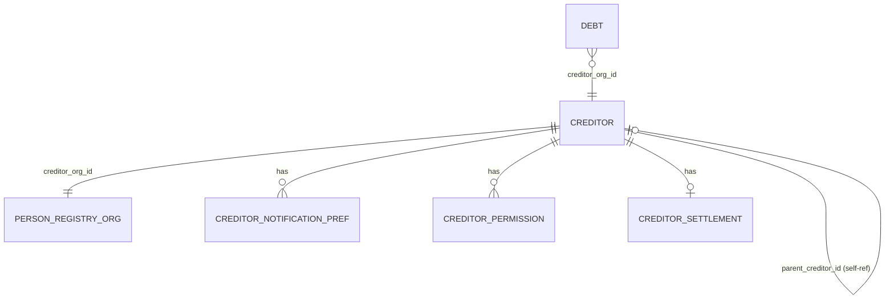

# Petition 008: Fordringshaver logical and physical data model

## Summary

OpenDebt shall maintain a comprehensive data model for fordringshavere (creditors) that captures identity, address, registration, parent-child hierarchy, notification preferences, permitted actions, settlement configuration, classification, and lifecycle status. The model shall comply with GDPR data isolation by storing all PII (name, address, CVR/SE/AKR numbers) in the Person Registry while keeping operational configuration and permissions in the creditor management domain. The model shall support the full breadth of creditor attributes known from the legacy PSRM AutoTool, including the ability to mark creditors as auto-created.

## Context and motivation

The legacy EFI/DMI system manages fordringshavere through an "AutoTool" spreadsheet that defines approximately 50 attributes per creditor, covering everything from identity and address to fine-grained notification toggles and action permissions. OpenDebt must model these attributes faithfully to support migration and day-to-day creditor administration.

Key design drivers:

- **GDPR data isolation**: PII such as name, address, and registration numbers (CVR/SE/AKR) must reside exclusively in the Person Registry. The creditor management domain stores only a `creditor_org_id` (UUID) that references the Person Registry.
- **Parent-child hierarchy**: Some fordringshavere report on behalf of other fordringshavere (umbrella/DK_UMBRE pattern). The model must express this relationship.
- **Notification preferences**: Each fordringshaver configures which notifications it receives. Certain notification types are mutually exclusive (e.g., standard interest notifications vs. detailed interest notifications; equalisation notifications vs. allocation notifications).
- **Action permissions**: Each fordringshaver has a set of boolean flags controlling which operations it may perform (e.g., create recovery claims, perform write-downs, withdraw claims).
- **Settlement configuration**: Each fordringshaver defines how and how often it is settled, including payment method, bank details, and currency.
- **Classification and status**: Each fordringshaver has a type, payment type, business unit, system agreement status, activity status, and connection type.

## Logical data model

### Entity: Fordringshaver (Creditor)

The logical model is split across two bounded contexts per GDPR data isolation (ADR-0014):

#### Person Registry context (PII)

Stores identity and address data for the creditor organization:

| Attribute | Description | Source column |
|-----------|-------------|---------------|
| org_id (UUID) | Technical identifier | Generated |
| name | Fordringshavernavn | 01 |
| address | Adresse | 02 |
| postal_code | Postnummer | 03 |
| city | By | 49 |
| country_code | Landekode (default DK) | 09 |
| registration_type | CVR / SE / AKR | 04 |
| registration_number | The actual CVR/SE/AKR number | 05 |

#### Creditor management context (non-PII, operational configuration)

Stores all operational attributes, referencing Person Registry by UUID only:

**Core identity reference**

| Attribute | Type | Description | Source column |
|-----------|------|-------------|---------------|
| id | UUID | Primary key | Generated |
| creditor_org_id | UUID | FK to Person Registry | - |
| external_creditor_id | VARCHAR(50) | Legacy Fordringshaver ID (unique) | 06 |
| auto_created | BOOLEAN | Created via AutoTool (X-marker) | 50 |
| unique_link_id | VARCHAR(30) | Links creditor to its FT in legacy DB | 42 |
| sorting_id | VARCHAR(8) | SVC_TYPE_CD, uppercase, max 8 chars | 46 |
| captia_id | VARCHAR(15) | 10-digit with hyphen, for new foreign creditors | 53 |

**Parent-child hierarchy**

| Attribute | Type | Description | Source column |
|-----------|------|-------------|---------------|
| parent_creditor_id | UUID | FK to self (parent fordringshaver) | 07/08 |
| system_reporter_id | VARCHAR(50) | Systemindberetter, typically same as certificate number | 33 |

**Notification preferences**

Each is a boolean toggle. Mutual-exclusivity constraints are noted.

| Attribute | Type | Constraint | Legacy code | Source column |
|-----------|------|------------|-------------|---------------|
| interest_notifications | BOOLEAN | Mutually exclusive with detailed_interest_notifications | DK_CTRNI | 14 |
| detailed_interest_notifications | BOOLEAN | Mutually exclusive with interest_notifications | DK_DINTN | 18 |
| equalisation_notifications | BOOLEAN | Mutually exclusive with allocation_notifications | DK_CTEQN | 15 |
| allocation_notifications | BOOLEAN | Mutually exclusive with equalisation_notifications | DK-PYCAN | 44 |
| settlement_notifications | BOOLEAN | | DK_CTSTN | 16 |
| return_notifications | BOOLEAN | | DK-SBRET | 45 |
| write_off_notifications | BOOLEAN | | DK_WROFN | 17 |

**Action permissions**

All boolean flags, default false.

| Attribute | Type | Description | Source column |
|-----------|------|-------------|---------------|
| allow_portal_actions | BOOLEAN | Allowed to send actions through Portal | 20 |
| allow_write_down | BOOLEAN | May perform write-downs (nedskrive) | 21 |
| allow_create_recovery_claims | BOOLEAN | May create inddrivelsesfordringer | 22 |
| allow_create_offset_claims | BOOLEAN | May create modregningsfordringer | 23 |
| allow_create_transports | BOOLEAN | May create transporter | 24 |
| allow_withdraw | BOOLEAN | May withdraw (tilbagekalde) | 25 |
| allow_write_up_reversed_write_down_adjustment | BOOLEAN | Opskrivning omgjort nedskrivning regulering | 26 |
| allow_write_up_cancelled_write_down_payment | BOOLEAN | Opskrivning annulleret nedskrivning indbetaling | 27 |
| allow_write_down_cancelled_write_up_adjustment | BOOLEAN | Nedskrivning annulleret opskrivning regulering | 28 |
| allow_write_down_cancelled_write_up_payment | BOOLEAN | Nedskrivning annulleret opskrivning indbetaling | 29 |
| allow_incorrect_principal_report | BOOLEAN | Fejlagtig hovedstol indberetning | 30 |
| allow_write_up_adjustment | BOOLEAN | Opskrivning regulering | 31 |
| allow_resubmit_claims | BOOLEAN | May resubmit claims (genindsende fordringer) | 32 |
| allow_reject_offset_claims | BOOLEAN | May GAELDST reject offset claims | 55 |
| allow_auto_cancel_hearing | BOOLEAN | Auto-cancel hearing claims | 39 |
| auto_cancel_hearing_days | INTEGER | Days before auto-cancel of hearing claim (nullable) | 40 |

**Settlement configuration**

| Attribute | Type | Description | Source column |
|-----------|------|-------------|---------------|
| currency_code | VARCHAR(3) | DKK, USD, etc. | 19 |
| settlement_frequency | VARCHAR(20) | Must be "Maanedlig" (monthly) | 34 |
| settlement_method | VARCHAR(20) | BANK_TRANSFER / NEM_KONTO / STATSREGNSKAB | 35 |
| iban | VARCHAR(34) | IBAN number (null if NEM_KONTO) | 36 |
| swift_code | VARCHAR(11) | SWIFT/BIC code (null if NEM_KONTO) | 37 |
| danish_account_number | VARCHAR(14) | Alternative Danish account, 14 digits | 38 |

**Classification**

| Attribute | Type | Description | Source column |
|-----------|------|-------------|---------------|
| business_unit | VARCHAR(10) | DK_BSUNT code (1000, 9804-9811) | 41 |
| creditor_type | VARCHAR(30) | Fordringshavertype (MUNICIPAL, STATE, PRIVATE, REGIONAL, SKAT, OTHER_PUBLIC, FOREIGN) | 10 |
| payment_type | VARCHAR(30) | Betalingstype (EXTERNAL, EXTERNAL_WITH_INCOME, INTERNAL, RIM) | 11 |
| adjustment_type_profile | VARCHAR(10) | Betalingstypeprofil (ER, EX, IN, RM, SP, ...) | 12 |
| uses_dmi | BOOLEAN | Whether creditor uses both PSRM and DMI | 43 |

**Status and lifecycle**

| Attribute | Type | Description | Source column |
|-----------|------|-------------|---------------|
| dcs_status | VARCHAR(30) | Status in DCS: SKAL_I_DCS, INDSENDT, OPRETTET, OPSAMLING_SL, SLETTET, INTERN, EJ_UDLAND | 47 |
| system_agreement_active | BOOLEAN | PROD activated (Ja/Nej) | 13 |
| activity_status | VARCHAR(40) | ACTIVE, DELETED, TEMPORARILY_CLOSED, NO_AGREEMENT, DEACTIVATED_CEASED, DEACTIVATED_NO_AGREEMENT, DELETED_CEASED, DELETED_NO_AGREEMENT | 51 |
| connection_type | VARCHAR(20) | SYSTEM, HYBRID, PORTAL, PENDING, NONE | 48 |
| ip_whitelisted | BOOLEAN | Whether creditor is IP-whitelisted | 54 |

**Audit fields**

| Attribute | Type | Description |
|-----------|------|-------------|
| created_at | TIMESTAMPTZ | Row creation timestamp |
| updated_at | TIMESTAMPTZ | Last modification timestamp |
| created_by | VARCHAR(100) | User or system that created the record |
| version | BIGINT | Optimistic locking version |
| sys_period | TSTZRANGE | Temporal versioning period |

### Canonical invariant matrix

The following invariants are part of the executable engineering contract for the
creditor model.

| Invariant | Applies to | Rule |
|-----------|------------|------|
| Technical identity | `id` | Every creditor record has a UUID primary key. |
| Organization reference | `creditor_org_id` | Every operational creditor record references exactly one organization in Person Registry. |
| External identity uniqueness | `external_creditor_id` | Must be present and unique across creditors. |
| PII isolation | Operational creditor store | Name, address, CVR/SE/AKR number, and similar organization identity data are not duplicated outside Person Registry. |
| Parent-child hierarchy | `parent_creditor_id` | May be null; if present it references another creditor record and must not reference the creditor itself. |
| Interest notification exclusivity | `interest_notifications`, `detailed_interest_notifications` | Both values may not be `true` at the same time. |
| Settlement notification exclusivity | `equalisation_notifications`, `allocation_notifications` | Both values may not be `true` at the same time. |
| Permission defaults | All `allow_*` fields | Default value is `false` unless explicitly enabled. |
| NEM_KONTO settlement rule | `settlement_method`, `iban`, `swift_code`, `danish_account_number` | If `settlement_method = NEM_KONTO`, then `iban`, `swift_code`, and `danish_account_number` are all `null`. |
| STATSREGNSKAB settlement rule | `settlement_method`, `iban`, `swift_code`, `danish_account_number` | If `settlement_method = STATSREGNSKAB`, then `iban`, `swift_code`, and `danish_account_number` are all `null`. |
| Hearing auto-cancel rule | `allow_auto_cancel_hearing`, `auto_cancel_hearing_days` | If `allow_auto_cancel_hearing = true`, then `auto_cancel_hearing_days` must be a positive integer. |
| Currency format | `currency_code` | Must be an uppercase 3-character ISO 4217 code. |
| Country format | `country_code` | Must be an uppercase ISO 3166-1 alpha-2 country code. |
| Sorting ID format | `sorting_id` | Must be uppercase alphanumeric and maximum 8 characters. |
| Captia ID format | `captia_id` | If present, must match the 10-digit pattern `NN-NNNNNNN`. |
| Audit and history | `created_at`, `updated_at`, `version`, `sys_period` | Every creditor record is versioned and auditable. |

### Canonical value-set decisions

Unless a later petition introduces dedicated reference-data ownership, the
following value sets are authoritative for W1 implementation.

| Field | Allowed values |
|------|----------------|
| `registration_type` | `CVR`, `SE`, `AKR` |
| `settlement_method` | `BANK_TRANSFER`, `NEM_KONTO`, `STATSREGNSKAB` |
| `settlement_frequency` | `MONTHLY` |
| `creditor_type` | `OTHER_PUBLIC`, `MUNICIPAL`, `PRIVATE`, `REGIONAL`, `SKAT`, `STATE`, `FOREIGN` |
| `payment_type` | `EXTERNAL`, `EXTERNAL_WITH_INCOME`, `INTERNAL`, `RIM` |
| `adjustment_type_profile` | `ER`, `EX`, `IN`, `RM`, `SP` |
| `business_unit` | `1000`, `9804`, `9805`, `9806`, `9808`, `9810`, `9811` |
| `dcs_status` | `SKAL_I_DCS`, `INDSENDT`, `OPRETTET`, `OPSAMLING_SL`, `SLETTET`, `INTERN`, `EJ_UDLAND` |
| `activity_status` | `ACTIVE`, `DELETED`, `TEMPORARILY_CLOSED`, `NO_AGREEMENT`, `DEACTIVATED_CEASED`, `DEACTIVATED_NO_AGREEMENT`, `DELETED_CEASED`, `DELETED_NO_AGREEMENT` |
| `connection_type` | `SYSTEM`, `HYBRID`, `PORTAL`, `PENDING`, `NONE` |

### Relationships

## Functional requirements

1. Each fordringshaver shall have a unique technical identifier (UUID) and a unique legacy external creditor ID.
2. PII attributes (name, address, CVR/SE/AKR number) shall be stored exclusively in the Person Registry service and referenced via a `creditor_org_id` UUID.
3. A fordringshaver may have a parent fordringshaver that is allowed to report on its behalf (umbrella/DK_UMBRE relationship). The parent-child link shall be modeled as a self-referencing foreign key.
4. Each fordringshaver shall have a set of notification preferences expressed as boolean flags. The system shall enforce that standard interest notifications and detailed interest notifications are mutually exclusive. The system shall enforce that equalisation notifications and allocation notifications are mutually exclusive.
5. Each fordringshaver shall have a set of action permission flags that control which operations it may perform. All permission flags shall default to false.
6. Each fordringshaver shall have settlement configuration specifying currency, frequency, method, and bank details. When the settlement method is NEM_KONTO, IBAN, SWIFT, and Danish account number shall be null.
7. Each fordringshaver shall be classified by creditor type, payment type, adjustment type profile, and business unit.
8. Each fordringshaver shall have lifecycle status fields: DCS status, system agreement status, activity status, and connection type.
9. When auto-cancel of hearing claims is enabled, the number of days before auto-cancel shall be stored as a positive integer.
10. The data model shall support temporal versioning (history table) and audit logging, consistent with the existing debt-service patterns (ADR-0013).
11. Auto-created creditors (via AutoTool) shall be distinguishable from manually created ones via a boolean flag.
12. The sorting ID (SVC_TYPE_CD) shall be uppercase and limited to 8 characters.

## Physical model guidance

The physical tables shall follow the conventions established in the debt-service migration (V1__create_debt_tables.sql):

- Table name: `creditors`
- History table: `creditors_history`
- Audit trigger via `audit_trigger_function()`
- Temporal versioning via `versioning_trigger_function()` (adapted for creditors)
- UUID primary key via `gen_random_uuid()`
- CHECK constraints for enum-like status fields
- CHECK constraints for mutual exclusivity of notification flags
- Indexes on `creditor_org_id`, `external_creditor_id`, `parent_creditor_id`, `creditor_type`, `activity_status`, `dcs_status`

**Service ownership**: The creditors table belongs to the creditor management domain. Per ADR-0007, no other service may access this table directly; cross-service access is via API.

## Constraints and assumptions

- The Person Registry already supports storing organization data (name, address, registration numbers). This petition does not define Person Registry schema changes.
- Settlement frequency is currently always "monthly"; the model stores it as a string to allow future extension.
- The set of business unit codes (1000, 9804-9811) is treated as reference data and may evolve.
- The adjustment type profile values (ER, EX, IN, RM, SP) are not exhaustive and may be extended.
- This petition does not define the creditor onboarding workflow or the AutoTool import mechanism.
- This petition does not define the API contract for CRUD operations on the creditor entity.
- The `unique_link_id` and `sorting_id` are legacy migration artifacts and may be deprecated once migration is complete.

## Out of scope

- Person Registry schema changes for organization storage
- Creditor onboarding workflow and approval process
- AutoTool import batch job implementation
- REST API contract for creditor CRUD
- UI design for creditor administration portal
- OCES3 certificate binding to creditors
- IP whitelisting implementation details
- Detailed DCS integration behavior
