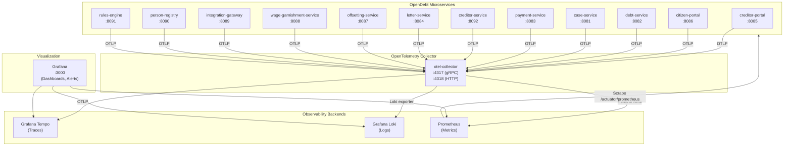
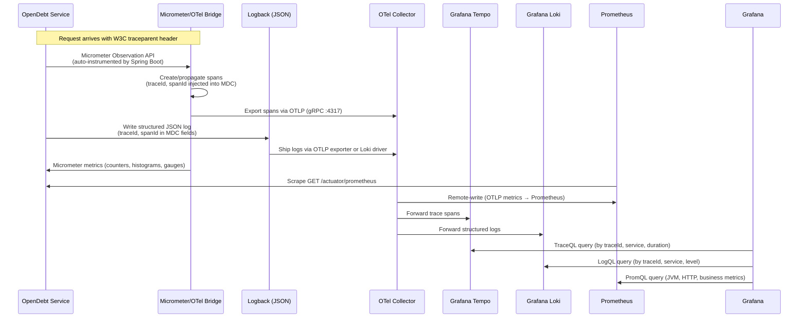
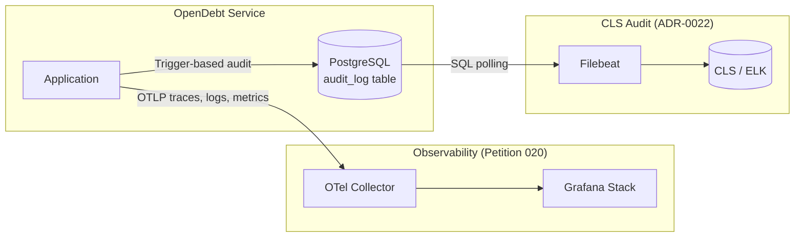
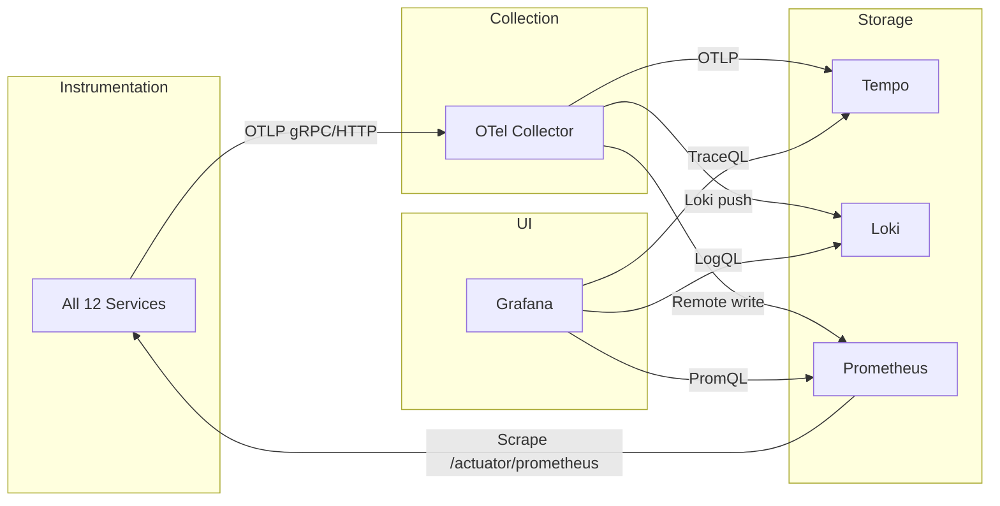
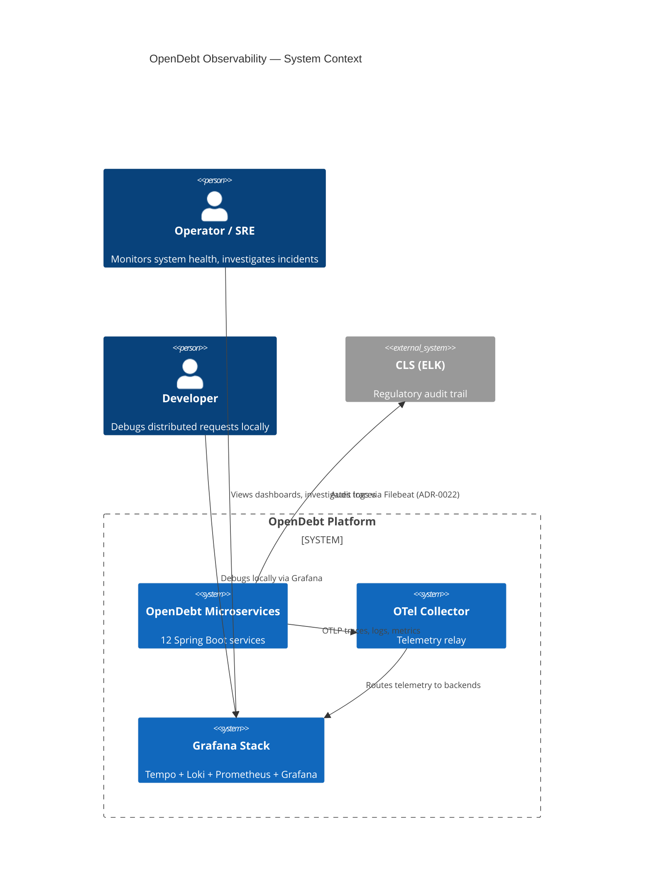
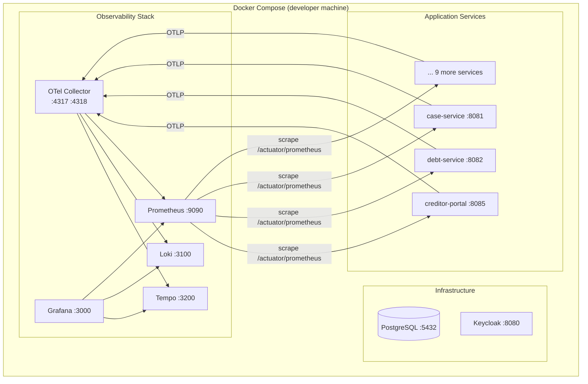

# Petition 020 — Solution Architecture: OpenTelemetry-Based Observability

## 1. Architecture Overview

This document defines the solution architecture for implementing unified observability across all OpenDebt microservices using OpenTelemetry, with a Grafana-based backend stack (ADR-0024).

### High-Level System View



### Telemetry Data Flow



## 2. Component Mapping — Slice Definitions

### Slice 1: Service Instrumentation (all 12 services)

**Responsibility:** Each OpenDebt microservice emits traces, structured JSON logs, and metrics using Spring Boot native instrumentation.

**Affected services:**

| Service | Port | Instrumentation Notes |
|---------|------|-----------------------|
| creditor-portal | 8085 | BFF — traces user-facing requests to backend services |
| citizen-portal | 8086 | BFF — traces citizen-facing requests |
| debt-service | 8082 | Core service — trace fordring lifecycle operations |
| case-service | 8081 | Workflow orchestrator — trace Flowable BPMN delegates and REST calls |
| payment-service | 8083 | Bookkeeping — trace payment matching, ledger operations |
| creditor-service | 8092 | Master data — trace access resolution, channel binding |
| letter-service | 8084 | Scaffold — minimal instrumentation, ready for expansion |
| offsetting-service | 8087 | Scaffold — minimal instrumentation |
| wage-garnishment-service | 8088 | Scaffold — minimal instrumentation |
| integration-gateway | 8089 | External boundary — trace CREMUL parsing, DUPLA calls |
| person-registry | 8090 | GDPR vault — trace lookups (PII never in span attributes) |
| rules-engine | 8091 | Drools evaluation — trace rule evaluation duration |

**Instrumentation approach per service:**

1. **Maven dependencies** (added to each service's `pom.xml` or managed in parent POM):
   ```xml
   <!-- Micrometer Tracing bridge for OpenTelemetry -->
   <dependency>
       <groupId>io.micrometer</groupId>
       <artifactId>micrometer-tracing-bridge-otel</artifactId>
   </dependency>
   <!-- OTel OTLP exporter for traces -->
   <dependency>
       <groupId>io.opentelemetry</groupId>
       <artifactId>opentelemetry-exporter-otlp</artifactId>
   </dependency>
   <!-- Structured JSON logging -->
   <dependency>
       <groupId>net.logstash.logback</groupId>
       <artifactId>logstash-logback-encoder</artifactId>
       <version>8.0</version>
   </dependency>
   ```

2. **Application configuration** (`application.yml` per service):
   ```yaml
   management:
     tracing:
       sampling:
         probability: 1.0  # 100% in dev; tune for production
     otlp:
       tracing:
         endpoint: ${OTEL_EXPORTER_OTLP_ENDPOINT:http://localhost:4318/v1/traces}
       metrics:
         export:
           enabled: true
           endpoint: ${OTEL_EXPORTER_OTLP_ENDPOINT:http://localhost:4318/v1/metrics}
     endpoints:
       web:
         exposure:
           include: health,info,prometheus,metrics
     metrics:
       tags:
         application: ${spring.application.name}

   logging:
     pattern:
       # Fallback console pattern with traceId/spanId (structured JSON preferred)
       console: "%d{ISO8601} [%thread] %-5level [%X{traceId},%X{spanId}] %logger{36} - %msg%n"
   ```

3. **Logback configuration** (`logback-spring.xml` in each service):
   ```xml
   <configuration>
     <appender name="JSON" class="net.logstash.logback.appender.LogstashTcpSocketAppender">
       <!-- Or use ConsoleAppender with LogstashEncoder for stdout -->
     </appender>
     <appender name="CONSOLE" class="ch.qos.logback.core.ConsoleAppender">
       <encoder class="net.logstash.logback.encoder.LogstashEncoder">
         <includeMdcKeyName>traceId</includeMdcKeyName>
         <includeMdcKeyName>spanId</includeMdcKeyName>
       </encoder>
     </appender>
     <root level="INFO">
       <appender-ref ref="CONSOLE"/>
     </root>
   </configuration>
   ```

4. **W3C Trace Context propagation:** Spring Boot 3.3 with `micrometer-tracing-bridge-otel` automatically propagates `traceparent` and `tracestate` headers on outgoing `WebClient` and `RestTemplate` calls. No additional code is needed for inter-service propagation.

5. **PII protection (ADR-0014):** Span attributes and log messages must reference persons by `person_id` (UUID) only. A review checklist will verify no CPR, CVR, names, or addresses appear in telemetry. Custom span attributes are added via Micrometer's `Observation` API:
   ```java
   // CORRECT
   observation.lowCardinalityKeyValue("debtor.person_id", personId.toString());

   // WRONG — NEVER DO THIS
   observation.lowCardinalityKeyValue("debtor.cpr", cprNumber);
   ```

### Slice 2: OpenTelemetry Collector

**Responsibility:** Central telemetry relay. Receives OTLP from all services and routes to the appropriate backends. Also performs attribute processing (e.g., service name enrichment, resource attribute injection).

**Configuration:**

```yaml
# otel-collector-config.yaml
receivers:
  otlp:
    protocols:
      grpc:
        endpoint: 0.0.0.0:4317
      http:
        endpoint: 0.0.0.0:4318

processors:
  batch:
    timeout: 5s
    send_batch_size: 512
  resource:
    attributes:
      - key: deployment.environment
        value: ${DEPLOYMENT_ENV:-local}
        action: upsert
  # Filter out any accidental PII (defense-in-depth)
  filter/pii:
    error_mode: ignore
    traces:
      span:
        - 'attributes["user.cpr"] != nil'
        - 'attributes["user.cvr"] != nil'
        - 'attributes["user.name"] != nil'

exporters:
  otlp/tempo:
    endpoint: tempo:4317
    tls:
      insecure: true  # TLS in production via K8s service mesh or mTLS
  loki:
    endpoint: http://loki:3100/loki/api/v1/push
  prometheusremotewrite:
    endpoint: http://prometheus:9090/api/v1/write

service:
  pipelines:
    traces:
      receivers: [otlp]
      processors: [filter/pii, batch, resource]
      exporters: [otlp/tempo]
    logs:
      receivers: [otlp]
      processors: [filter/pii, batch, resource]
      exporters: [loki]
    metrics:
      receivers: [otlp]
      processors: [batch, resource]
      exporters: [prometheusremotewrite]
```

### Slice 3: Grafana Tempo (Trace Backend)

**Responsibility:** Stores and queries distributed traces. OTLP-native ingestion.

**Key configuration:**
- Storage: local filesystem (dev), S3-compatible object store (production)
- Retention: 7 days (dev), configurable for production
- Query: TraceQL via Grafana data source

### Slice 4: Grafana Loki (Log Backend)

**Responsibility:** Aggregates and indexes structured JSON logs. Label-based indexing for efficient filtering by `traceId`, service name, and log level.

**Key configuration:**
- Labels: `service_name`, `level`, `traceId`
- Storage: local filesystem (dev), S3-compatible object store (production)
- Retention: 7 days (dev), configurable for production

### Slice 5: Prometheus (Metrics Backend)

**Responsibility:** Scrapes `/actuator/prometheus` endpoints from services and receives OTLP metrics via remote-write from the OTel Collector.

**Key configuration:**
- Scrape targets: all 12 services' `/actuator/prometheus` endpoints
- Retention: 15 days (dev), configurable for production
- Exemplar storage enabled for trace-metric correlation

**Prometheus scrape config:**
```yaml
scrape_configs:
  - job_name: 'opendebt-services'
    metrics_path: '/actuator/prometheus'
    static_configs:  # Docker Compose; K8s uses service discovery
      - targets:
          - 'creditor-portal:8085'
          - 'citizen-portal:8086'
          - 'debt-service:8082'
          - 'case-service:8081'
          - 'payment-service:8083'
          - 'creditor-service:8092'
          - 'letter-service:8084'
          - 'offsetting-service:8087'
          - 'wage-garnishment-service:8088'
          - 'integration-gateway:8089'
          - 'person-registry:8090'
          - 'rules-engine:8091'
```

### Slice 6: Grafana (Visualization and Alerting)

**Responsibility:** Unified dashboard for all three pillars. Pre-provisioned data sources and dashboards.

**Pre-provisioned dashboards:**
1. **OpenDebt Overview** — service health, request rates, error rates, latency percentiles
2. **JVM Dashboard** — heap usage, GC count/duration, thread count per service
3. **Distributed Tracing** — trace search by traceId, service, duration; flame graphs
4. **Business Metrics** — fordring submission rate, payment matching success rate, rule evaluation duration

**Data source provisioning** (Grafana provisioning YAML):
```yaml
apiVersion: 1
datasources:
  - name: Prometheus
    type: prometheus
    url: http://prometheus:9090
    isDefault: true
  - name: Tempo
    type: tempo
    url: http://tempo:3200
    jsonData:
      tracesToLogs:
        datasourceUid: loki
        filterByTraceID: true
      tracesToMetrics:
        datasourceUid: prometheus
  - name: Loki
    type: loki
    url: http://loki:3100
    jsonData:
      derivedFields:
        - datasourceUid: tempo
          matcherRegex: '"traceId":"(\w+)"'
          name: TraceID
          url: '$${__value.raw}'
```

## 3. Integration Points with Existing Infrastructure

### 3.1 Actuator Endpoints (Preserved)

Existing Spring Boot Actuator endpoints remain unchanged:
- `GET /actuator/health` — liveness/readiness probes (K8s)
- `GET /actuator/info` — service metadata
- `GET /actuator/prometheus` — Prometheus scrape endpoint (Micrometer)
- `GET /actuator/metrics` — Spring Boot metrics

The observability stack **complements** these by adding OTLP export for traces and metrics. Prometheus scrapes the existing endpoint directly.

### 3.2 CLS Audit Integration (ADR-0022 — Unchanged)

CLS (Common Logging System) audit logging via Filebeat is a **separate concern**:



**Key distinction:**
- **Observability** (this petition): operational monitoring, debugging, performance — uses OTel for traces/logs/metrics
- **CLS Audit** (ADR-0022): regulatory compliance, who-did-what audit trail — uses Filebeat polling `audit_log` tables

These do not interfere with each other. No changes to Filebeat or CLS configuration are required.

### 3.3 Keycloak Observability (Desirable, Not Mandatory)

Keycloak 24 supports OpenTelemetry tracing natively. In a future iteration:
- Keycloak can export traces to the OTel Collector
- Login latency and error rates can be monitored in Grafana
- Token validation spans can be correlated with application traces

This is **out of scope** for the first iteration but the architecture supports it without changes.

### 3.4 PostgreSQL Metrics (Desirable, Not Mandatory)

PostgreSQL connection pool metrics (HikariCP) are already exposed via Micrometer and will appear in Prometheus automatically. Database-level metrics (query duration, connections, replication lag) can be added via a `postgres_exporter` sidecar in a future iteration.

## 4. Deployment Architecture

### 4.1 Local Development — Docker Compose Additions

All observability components run as additional containers in `docker-compose.yml` (or a separate `docker-compose.observability.yml` that is merged via `docker compose -f`).

**New containers:**

| Container | Image | Ports | RAM (approx) |
|-----------|-------|-------|---------------|
| otel-collector | `otel/opentelemetry-collector-contrib` | 4317, 4318 | 50 MB |
| tempo | `grafana/tempo:latest` | 3200, 4317 | 100 MB |
| loki | `grafana/loki:latest` | 3100 | 100 MB |
| prometheus | `prom/prometheus:latest` | 9090 | 200 MB |
| grafana | `grafana/grafana-oss:latest` | 3000 | 100 MB |

**Docker Compose service definitions (illustrative):**

```yaml
  otel-collector:
    image: otel/opentelemetry-collector-contrib:latest
    command: ["--config=/etc/otel-collector-config.yaml"]
    ports:
      - "4317:4317"   # OTLP gRPC
      - "4318:4318"   # OTLP HTTP
    volumes:
      - ./config/otel/otel-collector-config.yaml:/etc/otel-collector-config.yaml
    depends_on:
      - tempo
      - loki

  tempo:
    image: grafana/tempo:latest
    command: ["-config.file=/etc/tempo.yaml"]
    ports:
      - "3200:3200"   # Tempo query frontend
    volumes:
      - ./config/tempo/tempo.yaml:/etc/tempo.yaml

  loki:
    image: grafana/loki:latest
    command: ["-config.file=/etc/loki/local-config.yaml"]
    ports:
      - "3100:3100"
    volumes:
      - ./config/loki/loki-config.yaml:/etc/loki/local-config.yaml

  prometheus:
    image: prom/prometheus:latest
    ports:
      - "9090:9090"
    volumes:
      - ./config/prometheus/prometheus.yml:/etc/prometheus/prometheus.yml
    command:
      - '--config.file=/etc/prometheus/prometheus.yml'
      - '--web.enable-remote-write-receiver'
      - '--enable-feature=exemplar-storage'

  grafana:
    image: grafana/grafana-oss:latest
    ports:
      - "3000:3000"
    environment:
      GF_AUTH_ANONYMOUS_ENABLED: "true"
      GF_AUTH_ANONYMOUS_ORG_ROLE: Admin
    volumes:
      - ./config/grafana/provisioning:/etc/grafana/provisioning
    depends_on:
      - prometheus
      - tempo
      - loki
```

**Service environment additions** (each OpenDebt service gets):
```yaml
  OTEL_EXPORTER_OTLP_ENDPOINT: http://otel-collector:4318
```

### 4.2 Production — Kubernetes with Kustomize

Production deployment follows the existing Kustomize structure under `k8s/`:

```
k8s/
├── base/
│   ├── observability/
│   │   ├── kustomization.yaml
│   │   ├── namespace.yaml            # (uses existing opendebt namespace)
│   │   ├── otel-collector/
│   │   │   ├── deployment.yaml
│   │   │   ├── service.yaml
│   │   │   ├── configmap.yaml        # OTel Collector config
│   │   │   └── kustomization.yaml
│   │   ├── tempo/
│   │   │   ├── deployment.yaml       # (or StatefulSet for persistent storage)
│   │   │   ├── service.yaml
│   │   │   ├── configmap.yaml
│   │   │   └── kustomization.yaml
│   │   ├── loki/
│   │   │   ├── statefulset.yaml
│   │   │   ├── service.yaml
│   │   │   ├── configmap.yaml
│   │   │   └── kustomization.yaml
│   │   ├── prometheus/
│   │   │   ├── statefulset.yaml
│   │   │   ├── service.yaml
│   │   │   ├── configmap.yaml        # Scrape config with K8s SD
│   │   │   ├── clusterrole.yaml      # For K8s service discovery
│   │   │   └── kustomization.yaml
│   │   └── grafana/
│   │       ├── deployment.yaml
│   │       ├── service.yaml
│   │       ├── configmap.yaml        # Datasource and dashboard provisioning
│   │       └── kustomization.yaml
│   └── kustomization.yaml            # Updated to include observability/
├── overlays/
│   ├── staging/
│   │   └── observability-patches.yaml  # Sampling rate, retention, resource limits
│   └── production/
│       └── observability-patches.yaml  # S3 storage, longer retention, alerting rules
```

**Key K8s considerations:**
- The OTel Collector runs as a **Deployment** (gateway mode) receiving OTLP from all services via the internal service DNS (`otel-collector.opendebt.svc.cluster.local:4317`).
- Prometheus uses **Kubernetes service discovery** (`kubernetes_sd_configs`) to auto-discover pods with the `prometheus.io/scrape: "true"` annotation (already present on case-service deployment).
- All existing service deployments gain the `OTEL_EXPORTER_OTLP_ENDPOINT` environment variable via the shared ConfigMap.
- Storage for Tempo, Loki, and Prometheus uses PersistentVolumeClaims in production (S3-compatible object storage for Tempo and Loki if available on UFST Horizontale Driftsplatform).

**ConfigMap update** (`k8s/base/configmap.yaml`):
```yaml
data:
  # ... existing service URLs ...
  OTEL_EXPORTER_OTLP_ENDPOINT: "http://otel-collector.opendebt.svc.cluster.local:4318"
```

## 5. Custom Business Metrics

Services register domain-specific metrics via Micrometer's `MeterRegistry`:

```java
@Component
@RequiredArgsConstructor
public class FordringMetrics {

    private final MeterRegistry meterRegistry;

    private Counter fordringSubmissions;

    @PostConstruct
    void init() {
        fordringSubmissions = Counter.builder("fordring_submissions_total")
            .description("Total number of fordring submissions")
            .tag("service", "debt-service")
            .register(meterRegistry);
    }

    public void recordSubmission() {
        fordringSubmissions.increment();
    }
}
```

**Suggested initial business metrics:**

| Metric | Type | Service | Description |
|--------|------|---------|-------------|
| `fordring_submissions_total` | Counter | debt-service | Fordring submission count |
| `payment_matching_total` | Counter | payment-service | Payment match attempts (tag: result=auto/manual) |
| `rule_evaluation_duration_seconds` | Timer | rules-engine | Drools rule evaluation latency |
| `case_workflow_started_total` | Counter | case-service | Workflow starts (tag: strategy) |
| `creditor_access_resolution_total` | Counter | creditor-service | Access resolution requests (tag: result=allowed/denied) |

## 6. Traceability Matrix

| Petition Requirement | Architecture Slice | Acceptance Criterion |
|---------------------|--------------------|---------------------|
| FR-1: Structured JSON logs with traceId/spanId | Slice 1 (Service Instrumentation) | AC-1 |
| FR-2: W3C Trace Context propagation | Slice 1 (Micrometer Tracing bridge) | AC-2, AC-3 |
| FR-3: OTLP trace export | Slice 1 + Slice 2 (OTel Collector) + Slice 3 (Tempo) | AC-2 |
| FR-4: Metrics via OTLP/Prometheus | Slice 1 + Slice 5 (Prometheus) | AC-4 |
| FR-5: Trace visualization | Slice 3 (Tempo) + Slice 6 (Grafana) | AC-6 |
| FR-6: Log aggregation | Slice 4 (Loki) + Slice 6 (Grafana) | AC-7 |
| FR-7: Metrics visualization and alerting | Slice 5 (Prometheus) + Slice 6 (Grafana) | AC-8 |
| FR-8: OTel Collector as central relay | Slice 2 (OTel Collector) | AC-5 |
| FR-9: Custom business metrics | Slice 1 (Micrometer MeterRegistry) + Slice 5 | AC-9 |
| FR-10: Docker Compose + K8s deployment | Section 4.1 + 4.2 | AC-10, AC-11 |
| FR-11: ADR for backend selection | ADR-0024 | AC-12 |
| NFR-1: ≤5ms p99 overhead | Slice 1 (Micrometer native, no Java agent) | AC-14 |
| NFR-2: Open-source, no vendor lock-in | ADR-0024 (all Apache 2.0 / AGPL-3.0 / open-source) | AC-12 |
| NFR-3: On-premise, no SaaS | Section 4 (self-hosted deployment) | AC-10, AC-11 |
| NFR-4: No PII in telemetry | Slice 1 (review checklist) + Slice 2 (PII filter) | AC-13 |

## 7. Dependency Map



**Key dependency constraints:**
- Services depend on `opendebt-common` for shared configuration (no new dependency introduced)
- Services depend on `micrometer-tracing-bridge-otel` and `opentelemetry-exporter-otlp` (new Maven dependencies)
- The OTel Collector must be reachable from all services (service discovery via Docker network or K8s DNS)
- Grafana depends on all three backends being available for full functionality
- **No service depends on the observability stack for business functionality** — if the stack is down, services continue operating normally (telemetry export fails gracefully)

## 8. Compliance and Resilience Patterns

### GDPR / PII Protection (ADR-0014)

- **Defense-in-depth:** OTel Collector config includes a `filter/pii` processor that drops spans containing known PII attribute keys (`user.cpr`, `user.cvr`, `user.name`).
- **Code review gate:** PR reviews must verify no PII appears in span attributes, log messages, or metric labels.
- **person_id only:** All person references in telemetry use UUID (`person_id`, `debtor_person_id`, `creditor_org_id`).

### Graceful Degradation

- If the OTel Collector is unavailable, services continue processing requests. The OTLP exporter retries with backoff and eventually drops telemetry data without affecting business logic.
- If Prometheus cannot scrape a service, the service is unaffected. Metrics are simply not collected until scraping resumes.
- Grafana can display partial data if one backend is temporarily unavailable.

### Security

- OTel Collector listens only on internal network interfaces (Docker network or K8s ClusterIP).
- Grafana in production should be behind the Keycloak OAuth2 proxy or a similar authentication gateway.
- TLS between components in production (K8s network policies or service mesh).

### Fællesoffentlige Arkitekturprincipper (ADR-0010)

| Principle | Compliance |
|-----------|-----------|
| Openness | All components are open-source (Apache 2.0 / AGPL-3.0) |
| No vendor lock-in | OTel standard allows swapping backends without re-instrumentation |
| Interoperability | OTLP is a CNCF standard protocol |
| Security | No PII in telemetry, internal-only network exposure |
| Privacy | GDPR-compliant telemetry (ADR-0014) |

## 9. Rationale and Assumptions

### Key Assumptions

1. **Developer machines have ≥16 GB RAM.** The full Docker Compose stack (11+ services + PostgreSQL + Keycloak + observability) requires approximately 8-10 GB total.
2. **UFST Horizontale Driftsplatform supports persistent volumes.** Tempo, Loki, and Prometheus require PersistentVolumeClaims for production.
3. **S3-compatible object storage is available** on the target platform for production Tempo and Loki storage. If not, local PV storage is a fallback.
4. **Micrometer Tracing bridge is sufficient** for the current use cases. The OTel Java agent is not needed because Spring Boot 3.3 auto-instruments HTTP server/client, WebClient, and RestTemplate via Micrometer Observations.
5. **Log volume is manageable.** With 12 services at INFO level, estimated log volume is <50 GB/day in production. Loki handles this efficiently with label-indexed storage.

### Key Decisions

| Decision | Rationale |
|----------|-----------|
| Micrometer bridge over OTel Java agent | Petition constraint; avoids JVM agent attachment complexity; Spring Boot 3.3 has first-class support |
| OTel Collector in gateway mode (not sidecar) | Simpler deployment for the initial iteration; sidecars can be added later for scale |
| Prometheus scrape + OTLP remote-write (dual path) | Preserves existing Actuator prometheus endpoint; OTLP remote-write adds OTel Collector → Prometheus path for metrics that don't go through Actuator |
| Separate docker-compose file for observability | Allows developers to run without observability if needed (`docker compose up` vs `docker compose -f docker-compose.yml -f docker-compose.observability.yml up`) |
| Grafana Stack over alternatives | ADR-0024: lowest resource footprint, best Spring Boot integration, true single-pane-of-glass, strongest community |

## 10. Sprint/Work Breakdown Suggestion

### Sprint 1: Foundation (Instrumentation + Backends)

| Task | Estimate | Description |
|------|----------|-------------|
| T1.1 | 2 pts | Add Micrometer tracing + OTLP exporter dependencies to parent POM |
| T1.2 | 3 pts | Configure structured JSON logging (logback-spring.xml) in opendebt-common or as shared config template |
| T1.3 | 2 pts | Add `application.yml` OTLP and tracing configuration to all services |
| T1.4 | 3 pts | Write OTel Collector configuration (otel-collector-config.yaml) |
| T1.5 | 3 pts | Write Docker Compose observability services (docker-compose.observability.yml) |
| T1.6 | 2 pts | Write Tempo, Loki, Prometheus configuration files |
| T1.7 | 2 pts | Provision Grafana data sources and one basic dashboard |
| T1.8 | 3 pts | Verify end-to-end: multi-service trace visible in Grafana via Tempo |

### Sprint 2: Production Readiness + Business Metrics

| Task | Estimate | Description |
|------|----------|-------------|
| T2.1 | 5 pts | Write Kustomize base manifests for all observability components |
| T2.2 | 3 pts | Write staging/production overlay patches (storage, retention, sampling) |
| T2.3 | 3 pts | Implement at least one custom business metric (fordring_submissions_total) |
| T2.4 | 3 pts | Build Grafana dashboards: OpenDebt Overview, JVM, Business Metrics |
| T2.5 | 2 pts | Configure Grafana alerting rules (error rate, latency thresholds) |
| T2.6 | 2 pts | PII audit: verify no PII in traces, logs, or metrics |
| T2.7 | 3 pts | Performance validation: measure p99 latency with/without tracing |
| T2.8 | 2 pts | Update ConfigMap with OTEL_EXPORTER_OTLP_ENDPOINT |
| T2.9 | 1 pt | Update architecture/overview.md with observability section |

### Sprint 3: Polish + Acceptance

| Task | Estimate | Description |
|------|----------|-------------|
| T3.1 | 3 pts | Validate all 12 Gherkin scenarios from petition020.feature |
| T3.2 | 2 pts | Add Prometheus Kubernetes service discovery config |
| T3.3 | 2 pts | Document runbook: how to trace a request, search logs, read dashboards |
| T3.4 | 1 pt | Add prometheus.io annotations to all service K8s deployments |

## 11. Diagrams

### C4 Context Diagram — Observability Scope



### Deployment Diagram — Docker Compose (Local Dev)


