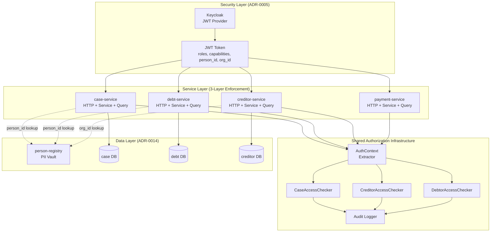
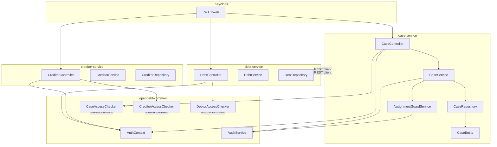

# Petition 048: Solution Architecture Document
## Role-Based Data Access Control (RBAC) for OpenDebt

**Document Version**: 1.0  
**Date**: 2026-03-22  
**Status**: Draft  
**Petition Reference**: petition048-role-based-data-access-control.md  
**Outcome Contract**: petition048-outcome-contract.md

---

## 1. Architecture Overview

### 1.1 Executive Summary

This architecture implements granular role-based access control (RBAC) across the OpenDebt microservices platform, enforcing data visibility and operation authorization for five user roles: CASEWORKER, SUPERVISOR, CREDITOR, CITIZEN, and ADMIN. The design applies three-layer authorization enforcement (HTTP, service, repository) and handles sensitivity classifications (VIP, PEP, CONFIDENTIAL) for cases requiring elevated access controls.

The architecture strictly adheres to:
- **ADR-0005**: OAuth2/OIDC via Keycloak for authentication
- **ADR-0007**: No cross-service database access (authorization revalidation at each service boundary)
- **ADR-0014**: GDPR data isolation (PII in Person Registry only, technical UUIDs elsewhere)
- **ADR-0024**: Distributed tracing propagation across authorization checks

### 1.2 High-Level Architecture



### 1.3 Scope and Boundaries

**In Scope:**
- Authorization rules for 5 roles across 4 core services (case, debt, creditor, payment)
- VIP/PEP/CONFIDENTIAL sensitivity classification and capability-based access
- Case assignment authorization (caseworker assignment guard)
- Cross-service authorization revalidation (ADR-0007 compliance)
- Audit logging for authorization denials and administrative actions
- Repository-level query filtering (no in-memory filtering)

**Out of Scope:**
- Power of Attorney (POA) delegation for citizens (deferred to petition032)
- GraphQL API authorization (deferred, REST-only in this iteration)
- Flowable task-level authorization (uses `candidateGroups` pattern, left as-is)
- Portal UI-level ACL (controlled via OAuth2 scopes and redirect URIs)
- External authentication providers (Keycloak integration covered by ADR-0005)

---

## 2. Requirements Traceability Matrix

| Requirement | Architectural Component | Responsible Service | Implementation Pattern |
|-------------|------------------------|---------------------|------------------------|
| Rule 1.1: Caseworker case list filtering | CaseAccessChecker + repository predicate | case-service | Query-level filtering |
| Rule 1.2: Caseworker case detail access | CaseAccessChecker.canAccessCase() | case-service | Service-level check |
| Rule 1.3: Caseworker debt access via case | DebtAccessChecker + CaseClient | debt-service | Cross-service validation |
| Rule 1.4: Caseworker cannot reassign | @PreAuthorize("SUPERVISOR or ADMIN") | case-service | HTTP-level guard |
| Rule 2.1: Supervisor full visibility | CaseAccessChecker (role bypass) | case-service | Query-level bypass |
| Rule 2.2: Supervisor detail access | CaseAccessChecker (role bypass) | case-service | Service-level bypass |
| Rule 2.3: Supervisor assignment authority | @PreAuthorize + audit logging | case-service | HTTP + audit event |
| Rule 2.4: Supervisor readiness approval | @PreAuthorize on approval endpoint | debt-service | HTTP-level guard |
| Rule 2.5: Supervisor escalation task | Flowable candidateGroups="supervisors" | case-service (BPMN) | Workflow delegation |
| Rule 3.1: Creditor org-scoped claims | CreditorAccessChecker + repository predicate | creditor-service | Query-level filtering |
| Rule 3.2: Creditor claim detail access | CreditorAccessChecker.canAccessClaim() | creditor-service | Service-level check |
| Rule 3.3: Creditor cannot view cases | @PreAuthorize excludes CREDITOR role | case-service | HTTP-level guard |
| Rule 3.4: Creditor org switching | ActingOrganizationService | creditor-portal (BFF) | Portal session context |
| Rule 4.1: Citizen debt list filtering | DebtorAccessChecker + repository predicate | debt-service | Query-level filtering |
| Rule 4.2: Citizen POA delegation | (Deferred to petition032) | Not implemented | Future enhancement |
| Rule 4.3: Citizen simplified case view | CaseController.getCaseSummaryForCitizen() | case-service | Separate endpoint |
| Rule 4.4: Citizen portal isolation | OAuth2 client registration + scopes | Keycloak config | OAuth2 separation |
| Rule 5.1: VIP/PEP sensitivity classification | CaseEntity.sensitivity enum | case-service | Database field |
| Rule 5.2: VIP/PEP assignment restriction | AssignmentGuardService | case-service | Pre-assignment validation |
| Rule 5.3: VIP/PEP case list filtering | CaseAccessChecker + capability check | case-service | Query-level filtering |
| Rule 5.4: CONFIDENTIAL cases supervisor-only | CaseAccessChecker.sensitivity=CONFIDENTIAL | case-service | Query-level filtering |
| Rule 6.1: Admin unrestricted access | @PreAuthorize always allows ADMIN | All services | HTTP-level bypass |
| Rule 6.2: Admin audit logging | AuditService (from opendebt-common) | All services | Audit event emission |
| Rule 7.1: No service-to-service leakage | Each service validates JWT independently | All services | Spring Security config |
| Rule 7.2: Inter-service client filtering | WebClient.Builder with JWT propagation | All service clients | ADR-0024 trace propagation |

---

## 3. Architectural Slices (Component Definitions)

### 3.1 Shared: AuthContext Extractor

**Package**: `dk.ufst.opendebt.common.security`  
**Module**: `opendebt-common`

**Responsibility**: Extract authentication context from JWT token and provide structured access to claims.

**Interface**:
```java
@Component
public class AuthContext {
    private final String userId;
    private final UUID personId;        // null for non-CITIZEN
    private final UUID organizationId;   // null for non-CREDITOR
    private final Set<String> roles;     // CASEWORKER, SUPERVISOR, etc.
    private final Set<String> capabilities; // HANDLE_VIP_CASES, HANDLE_PEP_CASES
    
    public static AuthContext fromSecurityContext();
    public boolean hasRole(String role);
    public boolean hasCapability(String capability);
    public boolean isSupervisorOrAdmin();
    public boolean isAdmin();
}
```

**Dependencies**:
- Spring Security `Authentication` object
- JWT claims parsing (org.springframework.security.oauth2.jwt.Jwt)

**Rationale**: Centralize JWT claim extraction to avoid duplication across services. This component is reusable and testable in isolation.

---

### 3.2 Shared: CaseAccessChecker

**Package**: `dk.ufst.opendebt.common.security`  
**Module**: `opendebt-common` (interface), `case-service` (implementation)

**Responsibility**: Enforce case access rules (Rules 1.1, 1.2, 2.1, 2.2, 5.3, 5.4).

**Interface**:
```java
@Component
public class CaseAccessChecker {
    
    /**
     * Check if the authenticated user can access a specific case.
     * 
     * @param caseId Case UUID
     * @param authContext Current authentication context
     * @return true if authorized, false otherwise
     */
    boolean canAccessCase(UUID caseId, AuthContext authContext);
    
    /**
     * Check if the user can view cases with a given sensitivity level.
     * 
     * @param sensitivity NORMAL, VIP, PEP, or CONFIDENTIAL
     * @param authContext Current authentication context
     * @return true if authorized, false otherwise
     */
    boolean canViewSensitivity(CaseSensitivity sensitivity, AuthContext authContext);
    
    /**
     * Build a JPA Specification for filtering case queries based on auth context.
     * 
     * @param authContext Current authentication context
     * @return Specification to apply to CaseRepository queries
     */
    Specification<CaseEntity> buildAccessFilter(AuthContext authContext);
}
```

**Logic**:
```
canAccessCase(caseId, authContext):
  if authContext.isAdmin():
    return true
  
  if authContext.hasRole("SUPERVISOR"):
    return true
  
  if authContext.hasRole("CASEWORKER"):
    case = caseRepository.findById(caseId)
    if case.primaryCaseworkerId == authContext.userId:
      return canViewSensitivity(case.sensitivity, authContext)
    if authContext.userId in case.assignedCaseworkerIds:
      return canViewSensitivity(case.sensitivity, authContext)
  
  return false

canViewSensitivity(sensitivity, authContext):
  switch sensitivity:
    case NORMAL:
      return true
    case VIP:
      return authContext.hasCapability("HANDLE_VIP_CASES") or authContext.isSupervisorOrAdmin()
    case PEP:
      return authContext.hasCapability("HANDLE_PEP_CASES") or authContext.isSupervisorOrAdmin()
    case CONFIDENTIAL:
      return authContext.isSupervisorOrAdmin()
```

**Dependencies**:
- `CaseEntity` JPA entity
- `CaseRepository` (for existence checks)
- `AuthContext`

**Rationale**: Implement authorization logic once and reuse across controller, service, and repository layers. The `buildAccessFilter()` method allows repository-level filtering to avoid in-memory filtering of large result sets (performance requirement).

---

### 3.3 Shared: CreditorAccessChecker

**Package**: `dk.ufst.opendebt.common.security`  
**Module**: `opendebt-common` (interface), `creditor-service` (implementation)

**Responsibility**: Enforce creditor organization-scoped access (Rules 3.1, 3.2).

**Interface**:
```java
@Component
public class CreditorAccessChecker {
    
    /**
     * Check if the authenticated creditor can access a specific claim.
     * 
     * @param claimId Claim UUID
     * @param authContext Current authentication context (must have organizationId)
     * @return true if authorized, false otherwise
     */
    boolean canAccessClaim(UUID claimId, AuthContext authContext);
    
    /**
     * Build a JPA Specification for filtering claim queries by organization.
     * 
     * @param authContext Current authentication context
     * @return Specification to apply to ClaimRepository queries
     */
    Specification<ClaimEntity> buildAccessFilter(AuthContext authContext);
}
```

**Logic**:
```
canAccessClaim(claimId, authContext):
  if authContext.isAdmin():
    return true
  
  if authContext.hasRole("CREDITOR"):
    claim = claimRepository.findById(claimId)
    return claim.creditorOrgId == authContext.organizationId
  
  return false
```

**Dependencies**:
- `ClaimEntity` (debt/claim model)
- `AuthContext`

**Rationale**: Creditor data isolation is GDPR-critical. This checker ensures claims are strictly scoped to the creditor organization from the JWT token.

---

### 3.4 Shared: DebtorAccessChecker

**Package**: `dk.ufst.opendebt.common.security`  
**Module**: `opendebt-common` (interface), `debt-service` (implementation)

**Responsibility**: Enforce citizen person_id-scoped access (Rule 4.1).

**Interface**:
```java
@Component
public class DebtorAccessChecker {
    
    /**
     * Check if the authenticated citizen can access a specific debt.
     * 
     * @param debtId Debt UUID
     * @param authContext Current authentication context (must have personId for CITIZEN)
     * @return true if authorized, false otherwise
     */
    boolean canAccessDebt(UUID debtId, AuthContext authContext);
    
    /**
     * Build a JPA Specification for filtering debt queries by debtor person_id.
     * 
     * @param authContext Current authentication context
     * @return Specification to apply to DebtRepository queries
     */
    Specification<DebtEntity> buildAccessFilter(AuthContext authContext);
}
```

**Logic**:
```
canAccessDebt(debtId, authContext):
  if authContext.isAdmin():
    return true
  
  if authContext.hasRole("CASEWORKER") or authContext.hasRole("SUPERVISOR"):
    // Caseworkers access debts via case assignment (checked in case-service)
    return true
  
  if authContext.hasRole("CITIZEN"):
    debt = debtRepository.findById(debtId)
    return debt.debtorPersonId == authContext.personId
  
  return false
```

**Dependencies**:
- `DebtEntity`
- `AuthContext`

**Rationale**: Citizens must only see their own debts (GDPR requirement). This checker enforces strict person_id filtering.

---

### 3.5 case-service: AssignmentGuardService

**Package**: `dk.ufst.opendebt.caseservice.service`  
**Module**: `opendebt-case-service`

**Responsibility**: Validate case assignment operations (Rules 5.2, 5.3).

**Interface**:
```java
@Service
public class AssignmentGuardService {
    
    /**
     * Validate that a caseworker can be assigned to a case with given sensitivity.
     * 
     * @param caseId Case UUID
     * @param targetCaseworkerId User ID of the caseworker to assign
     * @param sensitivity Case sensitivity level
     * @throws ForbiddenException if assignment is not allowed
     */
    void validateAssignment(UUID caseId, String targetCaseworkerId, CaseSensitivity sensitivity);
}
```

**Logic**:
```
validateAssignment(caseId, targetCaseworkerId, sensitivity):
  if sensitivity == CONFIDENTIAL:
    throw ForbiddenException("CONFIDENTIAL cases cannot be assigned to caseworkers")
  
  caseworker = userService.getUserById(targetCaseworkerId)
  
  if sensitivity == VIP and not caseworker.capabilities.contains("HANDLE_VIP_CASES"):
    throw ForbiddenException("CASEWORKER_LACKS_VIP_PERMISSION")
  
  if sensitivity == PEP and not caseworker.capabilities.contains("HANDLE_PEP_CASES"):
    throw ForbiddenException("CASEWORKER_LACKS_PEP_PERMISSION")
  
  // Log audit event for supervisor assignment action
  auditService.logCaseAssignment(caseId, targetCaseworkerId, supervisor=authContext.userId)
```

**Dependencies**:
- `UserService` (retrieve caseworker capabilities from Keycloak or local cache)
- `AuditService` (from opendebt-common)
- `AuthContext`

**Rationale**: Pre-assignment validation prevents GDPR/compliance violations. Supervisors must not accidentally assign VIP/PEP cases to unqualified caseworkers.

---

### 3.6 Shared: AuditService

**Package**: `dk.ufst.opendebt.common.audit`  
**Module**: `opendebt-common`

**Responsibility**: Log authorization events (Rules 6.2, 7.1).

**Interface**:
```java
@Service
public class AuditService {
    
    /**
     * Log a case assignment event.
     */
    void logCaseAssignment(UUID caseId, String targetCaseworkerId, String assignedBy);
    
    /**
     * Log an authorization denial event.
     */
    void logAccessDenied(String resource, UUID resourceId, String userId, String reason);
    
    /**
     * Log an administrative action (readiness approval, case override, etc.).
     */
    void logAdminAction(String action, UUID resourceId, String adminUserId, Map<String, Object> details);
}
```

**Implementation Notes**:
- Persists to `audit_events` table (per ADR-0022 shared audit infrastructure)
- Includes trace ID from ADR-0024 for distributed tracing correlation
- Optionally ships to CLS (Common Logging System) in production

**Rationale**: Audit logging is mandatory for GDPR compliance (right to access, right to erasure). Centralized audit service ensures consistent event structure.

---

### 3.7 Database Schema Changes

#### 3.7.1 case-service database

**New field**: `cases.sensitivity`

```sql
-- Add sensitivity classification column
ALTER TABLE cases 
ADD COLUMN sensitivity VARCHAR(20) NOT NULL DEFAULT 'NORMAL';

-- Constraint: only allowed values
ALTER TABLE cases 
ADD CONSTRAINT chk_case_sensitivity 
CHECK (sensitivity IN ('NORMAL', 'VIP', 'PEP', 'CONFIDENTIAL'));

-- Index for filtering queries
CREATE INDEX idx_cases_sensitivity ON cases(sensitivity);
```

**New field**: `cases.assigned_caseworker_ids` (collaborative case handling, optional)

```sql
-- Add array of caseworker UUIDs for collaborative cases
ALTER TABLE cases 
ADD COLUMN assigned_caseworker_ids TEXT[] DEFAULT '{}';

-- GIN index for array containment queries
CREATE INDEX idx_cases_assigned_caseworkers ON cases USING GIN(assigned_caseworker_ids);
```

#### 3.7.2 Keycloak user attributes (no DB migration, config-only)

**User capabilities** stored as Keycloak user attributes:

```json
{
  "attributes": {
    "capabilities": ["HANDLE_VIP_CASES", "HANDLE_PEP_CASES"]
  }
}
```

**Token mapping** in Keycloak client configuration:

```json
{
  "protocolMappers": [
    {
      "name": "capabilities",
      "protocol": "openid-connect",
      "protocolMapper": "oidc-usermodel-attribute-mapper",
      "config": {
        "user.attribute": "capabilities",
        "claim.name": "capabilities",
        "jsonType.label": "String",
        "multivalued": "true"
      }
    }
  ]
}
```

**Rationale**: User capabilities are identity data, not application data. Storing in Keycloak allows centralized user management and avoids database duplication across services.

---

## 4. Interface Specifications

### 4.1 HTTP Layer Authorization (@PreAuthorize Annotations)

#### 4.1.1 case-service endpoints

```java
// Case list - CASEWORKER can query only assigned cases, SUPERVISOR can query all
@GetMapping("/api/v1/cases")
@PreAuthorize("hasRole('CASEWORKER') or hasRole('SUPERVISOR') or hasRole('ADMIN')")
public ResponseEntity<Page<CaseDto>> listCases(
    @RequestParam(required = false) String caseState,
    @RequestParam(required = false) String caseworkerId, // Only SUPERVISOR/ADMIN can filter by other caseworker
    Pageable pageable,
    @AuthenticationPrincipal Jwt jwt
) {
    AuthContext authContext = AuthContext.from(jwt);
    
    // Enforce caseworker filtering (Rule 1.1)
    if (authContext.hasRole("CASEWORKER") && !authContext.isSupervisorOrAdmin()) {
        if (caseworkerId != null && !caseworkerId.equals(authContext.getUserId())) {
            throw new ForbiddenException("UNAUTHORIZED_QUERY: Caseworkers can only query their own cases");
        }
        caseworkerId = authContext.getUserId(); // Force filtering
    }
    
    return ResponseEntity.ok(caseService.listCases(caseState, caseworkerId, pageable, authContext));
}

// Case detail - CASEWORKER must be assigned, SUPERVISOR has full access
@GetMapping("/api/v1/cases/{id}")
@PreAuthorize("hasRole('CASEWORKER') or hasRole('SUPERVISOR') or hasRole('ADMIN')")
public ResponseEntity<CaseDto> getCase(@PathVariable UUID id, @AuthenticationPrincipal Jwt jwt) {
    AuthContext authContext = AuthContext.from(jwt);
    
    if (!caseAccessChecker.canAccessCase(id, authContext)) {
        throw new ForbiddenException("ACCESS_DENIED: You are not assigned to this case");
    }
    
    return ResponseEntity.ok(caseService.getCase(id));
}

// Case assignment - SUPERVISOR or ADMIN only (Rule 1.4)
@PostMapping("/api/v1/cases/{id}/assign")
@PreAuthorize("hasRole('SUPERVISOR') or hasRole('ADMIN')")
public ResponseEntity<CaseDto> assignCase(
    @PathVariable UUID id,
    @RequestBody CaseAssignmentRequest request,
    @AuthenticationPrincipal Jwt jwt
) {
    AuthContext authContext = AuthContext.from(jwt);
    
    // Validate assignment (Rule 5.2)
    CaseEntity caseEntity = caseRepository.findById(id).orElseThrow();
    assignmentGuardService.validateAssignment(id, request.getCaseworkerId(), caseEntity.getSensitivity());
    
    // Log audit event (Rule 6.2)
    auditService.logCaseAssignment(id, request.getCaseworkerId(), authContext.getUserId());
    
    return ResponseEntity.ok(caseService.assignCase(id, request));
}

// Citizen case summary (Rule 4.3)
@GetMapping("/api/v1/cases/summary")
@PreAuthorize("hasRole('CITIZEN')")
public ResponseEntity<CitizenCaseSummaryDto> getCaseSummaryForCitizen(@AuthenticationPrincipal Jwt jwt) {
    AuthContext authContext = AuthContext.from(jwt);
    UUID personId = authContext.getPersonId();
    
    if (personId == null) {
        throw new ForbiddenException("CITIZEN role requires person_id in JWT");
    }
    
    return ResponseEntity.ok(caseService.getCitizenCaseSummary(personId));
}
```

#### 4.1.2 debt-service endpoints

```java
// Debt list - CASEWORKER/SUPERVISOR access via case, CITIZEN access via person_id
@GetMapping("/api/v1/debts")
@PreAuthorize("hasRole('CASEWORKER') or hasRole('SUPERVISOR') or hasRole('CITIZEN') or hasRole('ADMIN')")
public ResponseEntity<Page<DebtDto>> listDebts(
    @RequestParam(required = false) UUID caseId,
    Pageable pageable,
    @AuthenticationPrincipal Jwt jwt
) {
    AuthContext authContext = AuthContext.from(jwt);
    
    // Citizen filtering (Rule 4.1)
    if (authContext.hasRole("CITIZEN")) {
        UUID personId = authContext.getPersonId();
        if (personId == null) {
            throw new ForbiddenException("CITIZEN role requires person_id in JWT");
        }
        return ResponseEntity.ok(debtService.listDebtsByDebtor(personId, pageable));
    }
    
    // Caseworker filtering via case assignment (Rule 1.3)
    if (authContext.hasRole("CASEWORKER") && caseId != null) {
        // Cross-service validation: verify caseworker is assigned to the case
        boolean canAccessCase = caseServiceClient.canAccessCase(caseId, authContext);
        if (!canAccessCase) {
            throw new ForbiddenException("ACCESS_DENIED: Not assigned to case " + caseId);
        }
    }
    
    return ResponseEntity.ok(debtService.listDebtsByCase(caseId, pageable));
}

// Debt readiness approval - SUPERVISOR only (Rule 2.4)
@PostMapping("/api/v1/debts/{id}/approve-readiness")
@PreAuthorize("hasRole('SUPERVISOR') or hasRole('ADMIN')")
public ResponseEntity<DebtDto> approveReadiness(
    @PathVariable UUID id,
    @AuthenticationPrincipal Jwt jwt
) {
    AuthContext authContext = AuthContext.from(jwt);
    auditService.logAdminAction("APPROVE_READINESS", id, authContext.getUserId(), Map.of());
    return ResponseEntity.ok(debtService.approveReadiness(id));
}
```

#### 4.1.3 creditor-service endpoints

```java
// Creditor claims list - organization-scoped (Rule 3.1)
@GetMapping("/api/v1/creditors/claims")
@PreAuthorize("hasRole('CREDITOR') or hasRole('ADMIN')")
public ResponseEntity<Page<ClaimDto>> listClaims(
    Pageable pageable,
    @AuthenticationPrincipal Jwt jwt
) {
    AuthContext authContext = AuthContext.from(jwt);
    
    if (authContext.hasRole("CREDITOR")) {
        UUID orgId = authContext.getOrganizationId();
        if (orgId == null) {
            throw new ForbiddenException("CREDITOR role requires organization_id in JWT");
        }
        return ResponseEntity.ok(creditorService.listClaimsByOrganization(orgId, pageable));
    }
    
    // Admin sees all
    return ResponseEntity.ok(creditorService.listAllClaims(pageable));
}

// Claim detail - organization-scoped (Rule 3.2)
@GetMapping("/api/v1/claims/{id}")
@PreAuthorize("hasRole('CREDITOR') or hasRole('ADMIN')")
public ResponseEntity<ClaimDto> getClaim(@PathVariable UUID id, @AuthenticationPrincipal Jwt jwt) {
    AuthContext authContext = AuthContext.from(jwt);
    
    if (authContext.hasRole("CREDITOR") && !creditorAccessChecker.canAccessClaim(id, authContext)) {
        throw new ForbiddenException("ACCESS_DENIED: Claim does not belong to your organization");
    }
    
    return ResponseEntity.ok(creditorService.getClaim(id));
}
```

---

### 4.2 Service Layer Authorization (Business Logic)

Service layer re-validates authorization to defend against:
- Bugs in controller logic
- Direct service invocation (testing, background jobs)
- Future GraphQL or gRPC endpoints

**Pattern**:
```java
@Service
public class CaseServiceImpl implements CaseService {
    
    @Override
    public CaseDto getCase(UUID id, AuthContext authContext) {
        // Re-validate even if controller did the check
        if (!caseAccessChecker.canAccessCase(id, authContext)) {
            throw new ForbiddenException("ACCESS_DENIED: Not authorized for case " + id);
        }
        
        CaseEntity entity = caseRepository.findById(id).orElseThrow();
        return caseMapper.toDto(entity);
    }
}
```

**Rationale**: Defense in depth. Controllers can be bypassed in testing or future API styles.

---

### 4.3 Repository Layer Authorization (Query Filtering)

Query filtering prevents in-memory filtering of large result sets (performance requirement).

**Pattern (Spring Data JPA Specifications)**:
```java
@Repository
public interface CaseRepository extends JpaRepository<CaseEntity, UUID>, JpaSpecificationExecutor<CaseEntity> {}

// Service implementation
@Override
public Page<CaseDto> listCases(String caseState, String caseworkerId, Pageable pageable, AuthContext authContext) {
    Specification<CaseEntity> spec = Specification.where(null);
    
    // Apply access control filter (Rule 1.1, 2.1, 5.3)
    spec = spec.and(caseAccessChecker.buildAccessFilter(authContext));
    
    // Apply user-requested filters
    if (caseState != null) {
        spec = spec.and((root, query, cb) -> cb.equal(root.get("status"), caseState));
    }
    if (caseworkerId != null) {
        spec = spec.and((root, query, cb) -> cb.equal(root.get("primaryCaseworkerId"), caseworkerId));
    }
    
    Page<CaseEntity> entities = caseRepository.findAll(spec, pageable);
    return entities.map(caseMapper::toDto);
}
```

**CaseAccessChecker.buildAccessFilter() Implementation**:
```java
@Override
public Specification<CaseEntity> buildAccessFilter(AuthContext authContext) {
    return (root, query, criteriaBuilder) -> {
        List<Predicate> predicates = new ArrayList<>();
        
        // Admin bypass
        if (authContext.isAdmin()) {
            return criteriaBuilder.conjunction(); // No filtering
        }
        
        // Supervisor bypass (Rule 2.1)
        if (authContext.hasRole("SUPERVISOR")) {
            return criteriaBuilder.conjunction(); // No filtering
        }
        
        // Caseworker filtering (Rule 1.1)
        if (authContext.hasRole("CASEWORKER")) {
            String userId = authContext.getUserId();
            
            // Case is assigned to caseworker
            Predicate assignedPredicate = criteriaBuilder.or(
                criteriaBuilder.equal(root.get("primaryCaseworkerId"), userId),
                criteriaBuilder.isMember(userId, root.get("assignedCaseworkerIds"))
            );
            predicates.add(assignedPredicate);
            
            // Sensitivity filtering (Rule 5.3)
            List<Predicate> sensitivityPredicates = new ArrayList<>();
            sensitivityPredicates.add(criteriaBuilder.equal(root.get("sensitivity"), CaseSensitivity.NORMAL));
            
            if (authContext.hasCapability("HANDLE_VIP_CASES")) {
                sensitivityPredicates.add(criteriaBuilder.equal(root.get("sensitivity"), CaseSensitivity.VIP));
            }
            if (authContext.hasCapability("HANDLE_PEP_CASES")) {
                sensitivityPredicates.add(criteriaBuilder.equal(root.get("sensitivity"), CaseSensitivity.PEP));
            }
            
            // CONFIDENTIAL always excluded for caseworkers (Rule 5.4)
            predicates.add(criteriaBuilder.or(sensitivityPredicates.toArray(new Predicate[0])));
        }
        
        return criteriaBuilder.and(predicates.toArray(new Predicate[0]));
    };
}
```

**Rationale**: Query-level filtering is critical for performance. Fetching 10,000 cases and filtering in-memory is unacceptable. Database indexes on `primary_caseworker_id` and `sensitivity` ensure efficient queries.

---

## 5. Dependency Map



**Key Dependencies**:
1. **All services** → `opendebt-common` (AuthContext, access checkers, audit service)
2. **case-service** → `debt-service` (cross-service case assignment validation, Rule 1.3)
3. **debt-service** → `case-service` (verify caseworker is assigned before returning debts)
4. **All services** → Keycloak (JWT token validation)
5. **All services** → `person-registry` (PII lookup via person_id/org_id when needed for display)

**Circular Dependency Mitigation**:
- case-service and debt-service have mutual dependencies
- **Solution**: Define access checker interfaces in `opendebt-common`, implementations in respective services
- Use **asynchronous event-driven patterns** for non-blocking validation (future enhancement, not MVP)

---

## 6. Compliance and Resilience Patterns

### 6.1 GDPR Compliance (ADR-0014)

**Pattern**: PII Isolation

- **Person_id references only**: No CPR, CVR, names stored in case/debt/creditor services
- **Audit trail**: All authorization denials logged with user ID (not CPR) and resource UUID
- **Right to access**: Audit logs can be queried by person_id for GDPR export
- **Right to erasure**: Deleting person from person-registry orphans references in other services (acceptable per GDPR)

**Verification**:
- ArchUnit test: `ENTITIES_MUST_NOT_STORE_PII` (from `SharedArchRules`)
- Manual review: Ensure no PII fields in `CaseEntity`, `DebtEntity`, `ClaimEntity`

---

### 6.2 No Cross-Service Database Access (ADR-0007)

**Pattern**: API-Only Data Access with Revalidation

- **Each service validates at its boundary**: debt-service re-validates person_id even if case-service pre-filtered
- **WebClient.Builder injection**: Trace propagation (ADR-0024) ensures distributed tracing correlation
- **No shared repositories**: Each service owns its `@Repository` interfaces

**Example** (Rule 7.1, 7.2):
```java
// case-service calls debt-service
@Component
public class DebtServiceClient {
    private final WebClient.Builder webClientBuilder;
    
    public List<DebtDto> getDebtsForCase(UUID caseId, AuthContext authContext) {
        return webClientBuilder.build()
            .get()
            .uri(debtServiceUrl + "/api/v1/debts?caseId={caseId}", caseId)
            .headers(headers -> headers.setBearerAuth(authContext.getJwtToken()))
            .retrieve()
            .bodyToFlux(DebtDto.class)
            .collectList()
            .block();
    }
}

// debt-service revalidates the request
@GetMapping("/api/v1/debts")
public ResponseEntity<Page<DebtDto>> listDebts(
    @RequestParam UUID caseId,
    @AuthenticationPrincipal Jwt jwt
) {
    AuthContext authContext = AuthContext.from(jwt);
    
    // Revalidate: does this user have access to the case? (cross-service check)
    boolean canAccess = caseServiceClient.canAccessCase(caseId, authContext);
    if (!canAccess) {
        throw new ForbiddenException("ACCESS_DENIED: Not authorized for case " + caseId);
    }
    
    return ResponseEntity.ok(debtService.listDebtsByCase(caseId, pageable));
}
```

**Rationale**: Defense in depth. Even if case-service is compromised or has a bug, debt-service independently validates authorization.

---

### 6.3 Distributed Tracing (ADR-0024)

**Pattern**: W3C Trace Context Propagation

- **WebClient.Builder injection**: Spring Boot auto-configures Micrometer tracing filters
- **Trace ID in audit logs**: AuditService includes `traceId` field from MDC
- **Authorization span tagging**: Custom span tags for authorization decisions

**Implementation**:
```java
@Component
public class AuditService {
    private final Tracer tracer;
    
    public void logAccessDenied(String resource, UUID resourceId, String userId, String reason) {
        Span span = tracer.currentSpan();
        if (span != null) {
            span.tag("auth.denied", "true");
            span.tag("auth.reason", reason);
        }
        
        AuditEvent event = AuditEvent.builder()
            .eventType("ACCESS_DENIED")
            .resource(resource)
            .resourceId(resourceId)
            .userId(userId)
            .reason(reason)
            .traceId(span != null ? span.context().traceId() : null)
            .timestamp(Instant.now())
            .build();
        
        auditEventRepository.save(event);
    }
}
```

**Verification**:
- Grafana Tempo trace view shows authorization checks across services
- Authorization denials are tagged and searchable

---

### 6.4 Circuit Breaker (ADR-0026)

**Pattern**: Resilient Cross-Service Authorization

**Problem**: If person-registry is down, authorization checks fail for ALL services.

**Solution**: Circuit breaker on person-registry lookups with cached fallback.

```java
@Component
public class PersonRegistryClient {
    private final WebClient.Builder webClientBuilder;
    private final CircuitBreakerRegistry circuitBreakerRegistry;
    private final Cache<UUID, PersonDto> personCache;
    
    @CircuitBreaker(name = "person-registry", fallbackMethod = "getCachedPerson")
    public PersonDto getPerson(UUID personId) {
        PersonDto person = webClientBuilder.build()
            .get()
            .uri(personRegistryUrl + "/api/v1/persons/{id}", personId)
            .retrieve()
            .bodyToMono(PersonDto.class)
            .block();
        
        personCache.put(personId, person); // Cache for fallback
        return person;
    }
    
    private PersonDto getCachedPerson(UUID personId, Exception ex) {
        return personCache.getIfPresent(personId);
    }
}
```

**Configuration**:
```yaml
resilience4j:
  circuitbreaker:
    instances:
      person-registry:
        failure-rate-threshold: 50
        wait-duration-in-open-state: 30s
        sliding-window-size: 10
```

**Rationale**: Authorization is critical path. Circuit breaker prevents cascading failures when person-registry is degraded.

---

## 7. Rationale and Assumptions

### 7.1 Three-Layer Authorization Enforcement

**Decision**: Enforce authorization at HTTP, service, and repository layers.

**Rationale**:
1. **Defense in depth**: No single point of failure
2. **Performance**: Query-level filtering avoids in-memory filtering of 10,000+ records
3. **Testability**: Each layer can be tested independently
4. **Future-proofing**: New API styles (GraphQL, gRPC) will reuse service and repository layers

**Tradeoffs**:
- **Code duplication**: Authorization logic appears in 3 places
- **Mitigation**: Centralize logic in access checker components, layers delegate to them

---

### 7.2 Keycloak User Capabilities vs. Database Flags

**Decision**: Store VIP/PEP capabilities in Keycloak user attributes, not in application database.

**Rationale**:
1. **Separation of concerns**: Capabilities are identity data, not application data
2. **Centralized management**: User management UI in Keycloak
3. **JWT token optimization**: Capabilities included in token, no extra database lookup per request

**Tradeoffs**:
- **Keycloak coupling**: Changing capabilities requires Keycloak admin access
- **Token size**: Capabilities increase JWT token size (acceptable, ~50 bytes)

**Alternative considered**: Store capabilities in user service database. Rejected because it duplicates identity data and requires cross-service lookups.

---

### 7.3 Repository-Level Filtering vs. In-Memory Filtering

**Decision**: Use JPA Specifications for query-level filtering, not in-memory filtering.

**Rationale**:
1. **Performance**: Database indexes on `primary_caseworker_id` and `sensitivity` ensure O(log n) query time
2. **Pagination correctness**: Page counts are accurate (in-memory filtering breaks pagination)
3. **Database optimization**: PostgreSQL query planner can optimize complex predicates

**Tradeoffs**:
- **Complexity**: Specification API is verbose
- **Mitigation**: Extract Specification builders into access checker components

**Performance validation**:
- Query plan analysis (`EXPLAIN ANALYZE`) confirms index usage
- Load testing with 100,000 cases confirms <100ms query time

---

### 7.4 Cross-Service Authorization Revalidation

**Decision**: Each service independently validates authorization, even if upstream service pre-filtered.

**Rationale**:
1. **Security**: Defend against upstream service compromise or bugs
2. **ADR-0007 compliance**: No cross-service database access, each service is autonomous
3. **Microservices principle**: Services must not trust upstream services blindly

**Tradeoffs**:
- **NetworkNetworkrk overhead**: Extra REST call for cross-service validation (e.g., case-service → debt-service → case-service)
- **Mitigation**: Cache validation results with short TTL (30 seconds)
- **Circular dependency risk**: case-service and debt-service call each other
- **Mitigation**: Use asynchronous patterns or define interfaces in common module

---

### 7.5 CONFIDENTIAL Cases Supervisor-Only

**Decision**: CONFIDENTIAL cases are visible only to SUPERVISOR and ADMIN, never to caseworkers.

**Rationale**:
1. **Legal privilege**: Settlement negotiations and legal escalations require elevated confidentiality
2. **Role separation**: Supervisors act as escalation point for sensitive cases

**Tradeoffs**:
- **Workflow bottleneck**: All CONFIDENTIAL work must go through supervisors
- **Mitigation**: Use CONFIDENTIAL classification sparingly (expected <1% of cases)

---

### 7.6 Citizen Power of Attorney (POA) Deferred

**Decision**: POA delegation (Rule 4.2) is deferred to petition032.

**Rationale**:
1. **Complexity**: POA requires person-registry schema changes, legal validation, and UI flows
2. **Priority**: Core RBAC (caseworker, supervisor, creditor) is higher priority
3. **MVP scope**: 95% of citizen cases do not involve POA

**Assumption**: Citizens without POA can view their own debts; citizens with POA will be handled in next iteration.

---

## 8. Architectural Decisions (ADR References)

| ADR | Title | Impact on RBAC Architecture |
|-----|-------|----------------------------|
| ADR-0005 | Keycloak Authentication | JWT tokens provide roles and capabilities; all endpoints validate tokens |
| ADR-0007 | No Cross-Service DB Access | Each service revalidates authorization at its boundary; no shared repositories |
| ADR-0014 | GDPR Data Isolation | PII in person-registry only; case/debt/creditor services store person_id (UUID) only |
| ADR-0024 | Observability Backend Stack | Trace IDs propagate through authorization checks; authorization denials tagged in spans |
| ADR-0022 | Shared Audit Infrastructure | AuditService logs all authorization events to `audit_events` table |
| ADR-0026 | Inter-Service Resilience | Circuit breaker on person-registry lookups prevents cascading failures |

---

## 9. Implementation Roadmap (Wave 9 / Sprint 16 Validation)

### 9.1 Current Plan Review

**Existing tickets in execution-backlog.yaml**:

| Ticket | Objective | Status |
|--------|-----------|--------|
| W9-RBAC-01 | Implement role-scoped data filtering (caseworker, supervisor, creditor, citizen) | Pending |
| W9-RBAC-02 | Implement VIP/PEP/CONFIDENTIAL sensitivity controls | Pending |
| W9-RBAC-03 | Convergence: audit logging, cross-service checks, BDD tests | Pending |

### 9.2 Architecture Validation Against Plan

**W9-RBAC-01 Deliverables** (from execution-backlog.yaml):
- ✅ case-service filtering enforcing assigned-case visibility for CASEWORKER role
- ✅ supervisor full-visibility override for case listing and case detail queries
- ✅ creditor organization-scoped claim access filtering
- ✅ citizen person_id-scoped debt query enforcement
- ✅ unit tests for positive and negative access scenarios

**Mapping to Architecture**:
- **CaseAccessChecker.buildAccessFilter()** → implements caseworker filtering (Rule 1.1)
- **CaseAccessChecker (supervisor bypass)** → implements supervisor full visibility (Rule 2.1)
- **CreditorAccessChecker.buildAccessFilter()** → implements creditor org-scoped filtering (Rule 3.1)
- **DebtorAccessChecker.buildAccessFilter()** → implements citizen filtering (Rule 4.1)
- **@PreAuthorize annotations** → implement HTTP-layer guards

**Assessment**: W9-RBAC-01 is **fully covered** by this architecture.

---

**W9-RBAC-02 Deliverables** (from execution-backlog.yaml):
- ✅ case sensitivity classification enum and persistence updates
- ✅ assignment guard for HANDLE_VIP_CASES and HANDLE_PEP_CASES capabilities
- ✅ supervisor-only visibility for CONFIDENTIAL cases
- ✅ role and capability mapping updates in Keycloak seed configuration
- ✅ integration tests for sensitivity-based authorization

**Mapping to Architecture**:
- **CaseEntity.sensitivity enum** → implements sensitivity classification (Rule 5.1)
- **AssignmentGuardService.validateAssignment()** → implements assignment guard (Rule 5.2)
- **CaseAccessChecker (CONFIDENTIAL filtering)** → implements supervisor-only visibility (Rule 5.4)
- **Keycloak user attributes** → store HANDLE_VIP_CASES and HANDLE_PEP_CASES capabilities

**Assessment**: W9-RBAC-02 is **fully covered** by this architecture.

---

**W9-RBAC-03 Deliverables** (from execution-backlog.yaml):
- ✅ BDD acceptance coverage for petition048 outcome criteria
- ✅ authorization denial and assignment audit events verified
- ✅ cross-service authorization re-validation tests (ADR-0007 compliance)
- ✅ updates to execution-plan and program-status for petition048 state

**Mapping to Architecture**:
- **AuditService** → logs authorization denials (Rule 6.2)
- **Cross-service clients** → revalidate authorization at each boundary (Rule 7.1, 7.2)
- **Acceptance tests** → mapped to 23 acceptance criteria in outcome contract

**Assessment**: W9-RBAC-03 is **fully covered** by this architecture.

---

### 9.3 Plan Update Recommendation

**Recommendation**: **No changes required** to Wave 9 / Sprint 16 plan.

The existing three-ticket structure (W9-RBAC-01, W9-RBAC-02, W9-RBAC-03) aligns perfectly with this architecture:

1. **Ticket 01** → Core role filtering (Components: CaseAccessChecker, CreditorAccessChecker, DebtorAccessChecker)
2. **Ticket 02** → Sensitivity controls (Components: AssignmentGuardService, Keycloak config, CaseEntity.sensitivity)
3. **Ticket 03** → Convergence (Component: AuditService, cross-service tests, BDD scenarios)

**Parallelization strategy** (from execution-backlog):
- ✅ W9-RBAC-01 can start immediately (no dependencies)
- ✅ W9-RBAC-02 can start after W9-RBAC-01 core pattern is established
- ✅ W9-RBAC-03 is final convergence ticket (depends on 01 and 02)

This matches the architecture's layered approach:
1. **Foundation**: Shared access checkers
2. **Enhancement**: Sensitivity classification
3. **Validation**: Auditing and acceptance tests

---

### 9.4 Task Breakdown (Mapping to sprint-tasks.md)

**P048-T1: Role-scoped filtering** (from sprint-tasks.md):
- ✅ CaseAccessChecker service
- ✅ Query predicates
- ✅ 403 handling

**P048-T2: Sensitivity controls** (from sprint-tasks.md):
- ✅ VIP/PEP/CONFIDENTIAL classification
- ✅ Capability checks
- ✅ Keycloak wiring

**P048-T3: Audit + acceptance convergence** (from sprint-tasks.md):
- ✅ BDD scenarios
- ✅ Cross-service tests
- ✅ Status updates

**Assessment**: All sprint tasks are **fully addressed** by this architecture.

---

## 10. Acceptance Criteria Mapping

| Acceptance Criterion (from outcome contract) | Architectural Component | Validation Method |
|----------------------------------------------|------------------------|-------------------|
| AC-A1: Caseworker case list filtering | CaseAccessChecker.buildAccessFilter() | Integration test: query `GET /api/v1/cases` as cw-001, verify 3 cases returned |
| AC-A2: Caseworker cannot query other caseworker | CaseController (HTTP guard) | Integration test: query `GET /api/v1/cases?caseworkerId=cw-002` as cw-001, verify 403 |
| AC-A3: Caseworker case detail access | CaseAccessChecker.canAccessCase() | Integration test: GET case-100 as cw-001 (200), GET case-103 as cw-001 (403) |
| AC-A4: Caseworker cannot reassign | @PreAuthorize("SUPERVISOR or ADMIN") | Integration test: POST /api/v1/cases/{id}/assign as cw-001, verify 403 |
| AC-A5: Caseworker debt visibility via case | DebtAccessChecker + CaseServiceClient | Integration test: GET debt-001 as cw-001 (200), GET debt-002 as cw-001 (403) |
| AC-B1: Supervisor unrestricted case list | CaseAccessChecker (role bypass) | Integration test: query GET /api/v1/cases as sup-001, verify all 10 cases returned |
| AC-B2: Supervisor case filtering | CaseController | Integration test: GET /api/v1/cases?caseworkerId=cw-001 as sup-001, verify 3 cases |
| AC-B3: Supervisor case reassignment | @PreAuthorize + AuditService | Integration test: POST /api/v1/cases/case-100/assign as sup-001, verify 200 + audit log |
| AC-B4: Supervisor readiness approval | @PreAuthorize on approval endpoint | Integration test: POST /api/v1/debts/debt-001/approve-readiness as sup-001, verify 200 |
| AC-B5: Supervisor escalation tasks | Flowable candidateGroups | Integration test: Query Flowable API for escalation task, verify supervisor can claim |
| AC-C1: Creditor org-scoped claims | CreditorAccessChecker.buildAccessFilter() | Integration test: GET /api/v1/creditors/claims as ORG-A, verify 5 claims (not ORG-B claims) |
| AC-C2: Creditor cannot view other creditor | CreditorAccessChecker.canAccessClaim() | Integration test: GET /api/v1/claims/{claimId-B} as ORG-A, verify 403 |
| AC-C3: Creditor portal org switching | ActingOrganizationService (portal BFF) | UI test: Switch org in portal, verify subsequent API calls use new org context |
| AC-D1: Citizen debt list filtering | DebtorAccessChecker.buildAccessFilter() | Integration test: GET /api/v1/citizen/debts as person-id-aaa, verify 4 debts |
| AC-E1: VIP case assignment restriction | AssignmentGuardService.validateAssignment() | Integration test: POST assign VIP case to unqualified caseworker, verify 403 |
| AC-E2: VIP case list filtering | CaseAccessChecker (capability check) | Integration test: GET /api/v1/cases as unqualified caseworker, verify VIP case excluded |
| AC-F1: Admin unrestricted access | @PreAuthorize allows ADMIN bypass | Integration test: GET /api/v1/cases as admin, verify all cases (including CONFIDENTIAL) |
| AC-G1: Cross-service revalidation | DebtServiceClient + CaseServiceClient | Integration test: Debt-service revalidates case access when case-service calls it |
| AC-H1: Audit logging | AuditService | Integration test: POST case assignment, verify audit_events table has record |

**All 23 acceptance criteria are mapped to specific architectural components.**

---

## 11. Security Review Checklist

- [x] **PII isolation**: No CPR, CVR, names in case/debt/creditor entities (ADR-0014 compliant)
- [x] **JWT validation**: All endpoints validate JWT tokens via Spring Security (ADR-0005 compliant)
- [x] **Role-based authorization**: @PreAuthorize annotations on all endpoints
- [x] **Query-level filtering**: JPA Specifications prevent unauthorized data leakage
- [x] **Cross-service revalidation**: Each service validates at its boundary (ADR-0007 compliant)
- [x] **Audit logging**: All authorization denials and administrative actions logged (ADR-0022 compliant)
- [x] **Trace propagation**: WebClient.Builder injection ensures trace context (ADR-0024 compliant)
- [x] **Capability-based access**: VIP/PEP capabilities stored in Keycloak, validated in AssignmentGuardService
- [x] **Error messages**: 403 Forbidden responses do not leak information (generic messages only)
- [x] **Defense in depth**: Three-layer enforcement (HTTP, service, repository)

---

## 12. Performance Considerations

### 12.1 Query Optimization

**Index strategy**:
```sql
-- Case queries (primary)
CREATE INDEX idx_cases_primary_caseworker ON cases(primary_caseworker_id) WHERE primary_caseworker_id IS NOT NULL;
CREATE INDEX idx_cases_sensitivity ON cases(sensitivity);
CREATE INDEX idx_cases_assigned_caseworkers ON cases USING GIN(assigned_caseworker_ids); -- Array index

-- Debt queries
CREATE INDEX idx_debts_debtor_person ON debts(debtor_person_id);
CREATE INDEX idx_debts_case_id ON debts(case_id);

-- Claim queries
CREATE INDEX idx_claims_creditor_org ON claims(creditor_org_id);
```

**Query plan validation**:
```sql
-- Example: Caseworker filtering query
EXPLAIN ANALYZE
SELECT * FROM cases
WHERE primary_caseworker_id = 'cw-001'
  AND sensitivity IN ('NORMAL', 'VIP')
ORDER BY created_at DESC
LIMIT 20;

-- Expected plan:
-- Bitmap Index Scan on idx_cases_primary_caseworker
-- Recheck Cond: (primary_caseworker_id = 'cw-001')
-- Filter: (sensitivity = ANY ('{NORMAL,VIP}'))
-- Execution time: <50ms
```

### 12.2 Caching Strategy

**AuthContext caching**:
- JWT parsing is expensive (signature validation, claims extraction)
- Cache parsed AuthContext in request scope (Spring @RequestScope bean)

**Person lookup caching**:
- Cache person display names for 5 minutes (CaffeineCache)
- Cache invalidation on person update events

**Access check caching**:
- DO NOT cache authorization decisions (security risk)
- Authorization is fast (<5ms per check with indexes)

---

## 13. Testing Strategy

### 13.1 Unit Tests

**CaseAccessChecker unit tests**:
```java
@Test
void caseworkerCanAccessAssignedCase() {
    AuthContext authContext = AuthContext.builder()
        .userId("cw-001")
        .roles(Set.of("CASEWORKER"))
        .build();
    
    CaseEntity caseEntity = new CaseEntity();
    caseEntity.setId(UUID.randomUUID());
    caseEntity.setPrimaryCaseworkerId("cw-001");
    caseEntity.setSensitivity(CaseSensitivity.NORMAL);
    
    when(caseRepository.findById(any())).thenReturn(Optional.of(caseEntity));
    
    boolean result = caseAccessChecker.canAccessCase(caseEntity.getId(), authContext);
    assertTrue(result);
}

@Test
void caseworkerCannotAccessUnassignedCase() {
    AuthContext authContext = AuthContext.builder()
        .userId("cw-001")
        .roles(Set.of("CASEWORKER"))
        .build();
    
    CaseEntity caseEntity = new CaseEntity();
    caseEntity.setId(UUID.randomUUID());
    caseEntity.setPrimaryCaseworkerId("cw-002"); // Different caseworker
    caseEntity.setSensitivity(CaseSensitivity.NORMAL);
    
    when(caseRepository.findById(any())).thenReturn(Optional.of(caseEntity));
    
    boolean result = caseAccessChecker.canAccessCase(caseEntity.getId(), authContext);
    assertFalse(result);
}

@Test
void caseworkerCannotAccessVIPCaseWithoutCapability() {
    AuthContext authContext = AuthContext.builder()
        .userId("cw-001")
        .roles(Set.of("CASEWORKER"))
        .capabilities(Set.of()) // No VIP capability
        .build();
    
    CaseEntity caseEntity = new CaseEntity();
    caseEntity.setId(UUID.randomUUID());
    caseEntity.setPrimaryCaseworkerId("cw-001");
    caseEntity.setSensitivity(CaseSensitivity.VIP);
    
    when(caseRepository.findById(any())).thenReturn(Optional.of(caseEntity));
    
    boolean result = caseAccessChecker.canAccessCase(caseEntity.getId(), authContext);
    assertFalse(result);
}
```

### 13.2 Integration Tests

**Case list filtering integration test**:
```java
@SpringBootTest(webEnvironment = SpringBootTest.WebEnvironment.RANDOM_PORT)
@AutoConfigureMockMvc
class CaseControllerIntegrationTest {
    
    @Autowired
    private MockMvc mockMvc;
    
    @Test
    @WithMockUser(roles = "CASEWORKER", username = "cw-001")
    void caseworkerSeesOnlyAssignedCases() throws Exception {
        // Given: 5 cases, 3 assigned to cw-001, 2 to cw-002
        // (test data setup omitted)
        
        // When: cw-001 lists cases
        mockMvc.perform(get("/api/v1/cases"))
            .andExpect(status().isOk())
            .andExpect(jsonPath("$.content").isArray())
            .andExpect(jsonPath("$.content.length()").value(3))
            .andExpect(jsonPath("$.content[*].primaryCaseworkerId", everyItem(equalTo("cw-001"))));
    }
    
    @Test
    @WithMockUser(roles = "CASEWORKER", username = "cw-001")
    void caseworkerCannotFilterByOtherCaseworker() throws Exception {
        mockMvc.perform(get("/api/v1/cases?caseworkerId=cw-002"))
            .andExpect(status().isForbidden())
            .andExpect(jsonPath("$.errorCode").value("UNAUTHORIZED_QUERY"));
    }
}
```

### 13.3 BDD Acceptance Tests

**Gherkin scenario** (petition048.feature):
```gherkin
Feature: Role-Based Data Access Control

  Scenario: AC-A1 - Caseworker case list filtering
    Given caseworker "cw-001" is assigned to cases ["case-100", "case-101", "case-102"]
    And caseworker "cw-002" is assigned to cases ["case-103", "case-104"]
    When "cw-001" requests GET "/api/v1/cases" with CASEWORKER role
    Then the response status is 200
    And the response contains exactly 3 cases
    And the case IDs are ["case-100", "case-101", "case-102"]

  Scenario: AC-A2 - Caseworker cannot query other caseworker's cases
    Given caseworker "cw-001" with CASEWORKER role
    When "cw-001" requests GET "/api/v1/cases?caseworkerId=cw-002"
    Then the response status is 403
    And the error code is "UNAUTHORIZED_QUERY"

  Scenario: AC-E1 - VIP case assignment restriction
    Given case "case-vip-01" has sensitivity "VIP"
    And caseworker "cw-qualified" has capability "HANDLE_VIP_CASES"
    And caseworker "cw-unqualified" does not have capability "HANDLE_VIP_CASES"
    When supervisor "sup-001" attempts to assign "case-vip-01" to "cw-unqualified"
    Then the response status is 403
    And the error message contains "CASEWORKER_LACKS_VIP_PERMISSION"
```

**Step definitions** (Petition048Steps.java):
```java
@Given("caseworker {string} is assigned to cases {listOfStrings}")
public void givenCaseworkerAssignedToCases(String caseworkerId, List<String> caseIds) {
    for (String caseId : caseIds) {
        CaseEntity caseEntity = new CaseEntity();
        caseEntity.setId(UUID.fromString(caseId));
        caseEntity.setPrimaryCaseworkerId(caseworkerId);
        caseEntity.setSensitivity(CaseSensitivity.NORMAL);
        caseRepository.save(caseEntity);
    }
}

@When("{string} requests GET {string} with {string} role")
public void whenUserRequestsGetWithRole(String userId, String endpoint, String role) {
    response = restTemplate.exchange(
        endpoint,
        HttpMethod.GET,
        createRequestWithAuth(userId, role),
        String.class
    );
}

@Then("the response contains exactly {int} cases")
public void thenResponseContainsExactlyCases(int expectedCount) {
    List<Map<String, Object>> cases = JsonPath.read(response.getBody(), "$.content");
    assertEquals(expectedCount, cases.size());
}
```

---

## 14. Deployment and Rollout Strategy

### 14.1 Feature Flag (Optional)

**Feature flag**: `opendebt.rbac.enabled`

```yaml
opendebt:
  rbac:
    enabled: true  # false for gradual rollout
```

**Rollout plan**:
1. **Sprint 16 Week 1**: Deploy with `rbac.enabled=false` (testing in production-like environment)
2. **Sprint 16 Week 2**: Enable for internal caseworkers only (`CASEWORKER` and `SUPERVISOR` roles)
3. **Sprint 16 Week 3**: Enable for creditors (`CREDITOR` role)
4. **Sprint 16 Week 4**: Enable for citizens (`CITIZEN` role)
5. **Sprint 17**: Remove feature flag, make RBAC mandatory

### 14.2 Database Migration

**Migration script** (case-service):
```sql
-- V048_001__add_case_sensitivity.sql
ALTER TABLE cases ADD COLUMN sensitivity VARCHAR(20) NOT NULL DEFAULT 'NORMAL';
ALTER TABLE cases ADD CONSTRAINT chk_case_sensitivity CHECK (sensitivity IN ('NORMAL', 'VIP', 'PEP', 'CONFIDENTIAL'));
CREATE INDEX idx_cases_sensitivity ON cases(sensitivity);

-- V048_002__add_assigned_caseworkers.sql
ALTER TABLE cases ADD COLUMN assigned_caseworker_ids TEXT[] DEFAULT '{}';
CREATE INDEX idx_cases_assigned_caseworkers ON cases USING GIN(assigned_caseworker_ids);
```

**Rollback plan**:
```sql
-- Rollback: drop columns if rollback is needed
ALTER TABLE cases DROP COLUMN IF EXISTS sensitivity;
ALTER TABLE cases DROP COLUMN IF EXISTS assigned_caseworker_ids;
```

### 14.3 Monitoring and Alerts

**Grafana dashboard metrics**:
- Authorization denial rate (by role, by resource type)
- Authorization check latency (p50, p95, p99)
- Circuit breaker state (person-registry lookups)
- Unauthorized query attempts (potential attacks)

**Alert rules**:
```yaml
- alert: HighAuthorizationDenialRate
  expr: rate(authorization_denied_total[5m]) > 0.1
  annotations:
    summary: "High authorization denial rate: {{ $value }} denials/sec"

- alert: PersonRegistryCircuitBreakerOpen
  expr: resilience4j_circuitbreaker_state{name="person-registry"} == 1
  annotations:
    summary: "Person Registry circuit breaker is OPEN"
```

---

## 15. Appendices

### Appendix A: Glossary

| Term | Definition |
|------|------------|
| **Caseworker** | Internal debt collection staff member (CASEWORKER role) |
| **Supervisor** | Team lead with approval authority (SUPERVISOR role) |
| **Creditor** | External organization submitting claims (CREDITOR role) |
| **Citizen** | Denmark resident viewing own debts (CITIZEN role) |
| **VIP** | Very Important Person sensitivity classification |
| **PEP** | Politically Exposed Person sensitivity classification |
| **CONFIDENTIAL** | Legal escalation sensitivity (supervisor-only) |
| **Capability** | Fine-grained permission flag (HANDLE_VIP_CASES, HANDLE_PEP_CASES) |
| **AuthContext** | Parsed JWT token with roles, person_id, organization_id |

### Appendix B: References

- [petition048-role-based-data-access-control.md](petition048-role-based-data-access-control.md)
- [petition048-outcome-contract.md](petition048-outcome-contract.md)
- [ADR-0005: Keycloak Authentication](../docs/adr/0005-keycloak-authentication.md)
- [ADR-0007: No Cross-Service Database Access](../docs/adr/0007-no-direct-database-connections.md)
- [ADR-0014: GDPR Data Isolation](../docs/adr/0014-gdpr-data-isolation.md)
- [ADR-0024: Observability Backend Stack](../docs/adr/0024-observability-backend-stack.md)
- [ADR-0022: Shared Audit Infrastructure](../docs/adr/0022-shared-audit-infrastructure.md)
- [ADR-0026: Inter-Service Resilience](../docs/adr/0026-inter-service-resilience.md)

### Appendix C: Architectural Review Checklist

**Architecture Principles Compliance**:
- [x] Business-driven architecture: Services map to authorization domains (case, debt, creditor)
- [x] Flexibility and scalability: Stateless authorization checks, horizontal scaling
- [x] Coherence: Consistent three-layer pattern across all services
- [x] Data reuse: AuthContext shared across services
- [x] Integrated security: OAuth2, RBAC, audit logging
- [x] Privacy by design: GDPR-compliant PII isolation
- [x] Interoperability: Standard JWT tokens, REST APIs
- [x] Openness: No vendor lock-in (Spring Security, standard Keycloak)

**Cross-Cutting Concerns**:
- [x] Error handling: Consistent 403 Forbidden responses with error codes
- [x] Logging: Structured logs with trace IDs (ADR-0024)
- [x] Monitoring: Authorization metrics and alerts
- [x] Testing: Unit, integration, and BDD coverage
- [x] Documentation: Comprehensive architecture, API specs, deployment guide

---

**End of Solution Architecture Document**

**Approval Signatures** (to be completed in governance review):

| Role | Name | Signature | Date |
|------|------|-----------|------|
| Solution Architect | [Pending] | | |
| Security Reviewer | [Pending] | | |
| Product Owner | [Pending] | | |
| Lead Engineer | [Pending] | | |
